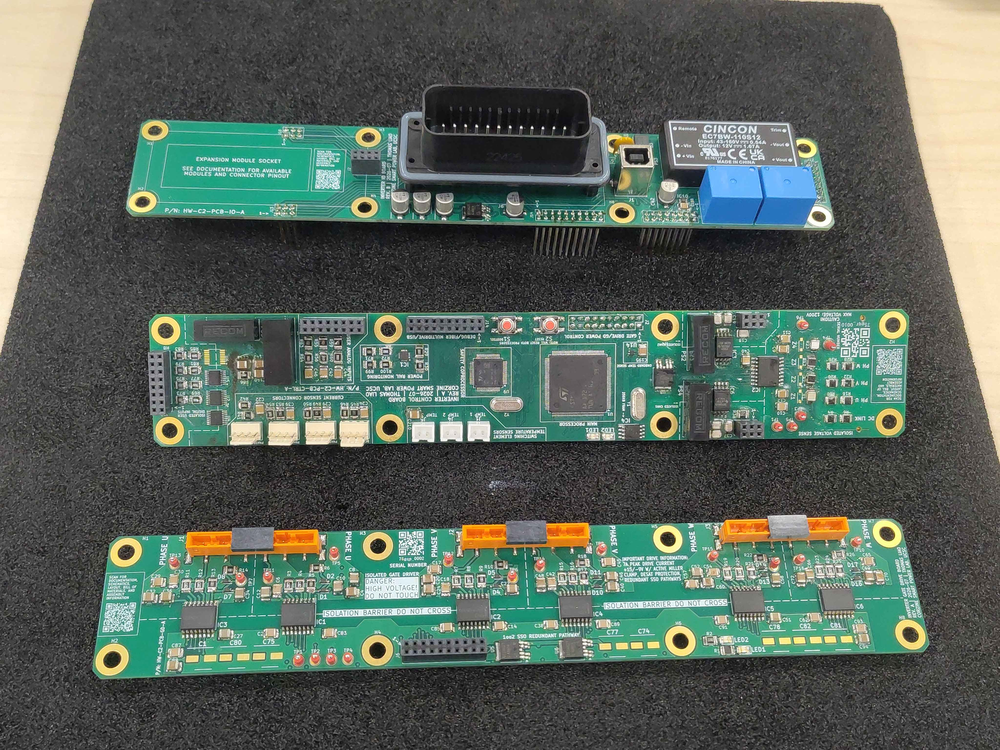
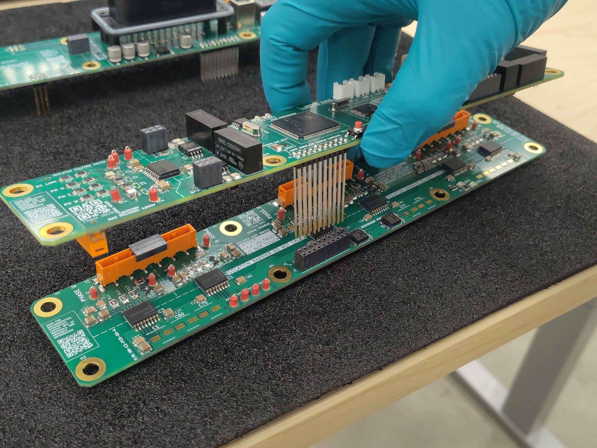
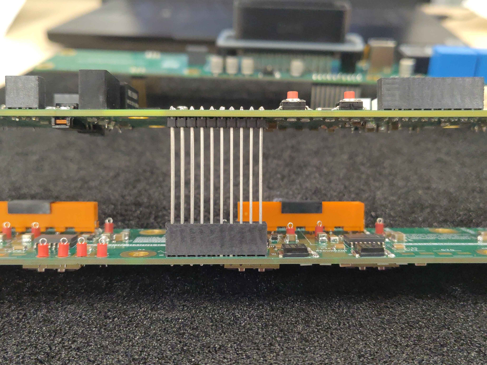
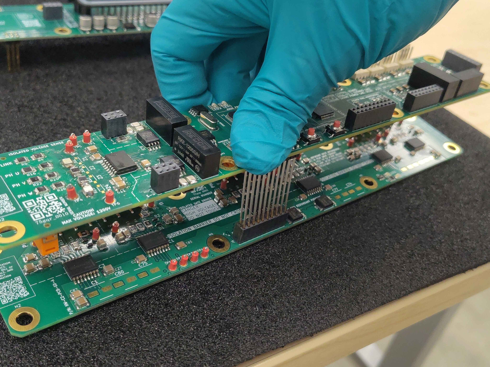
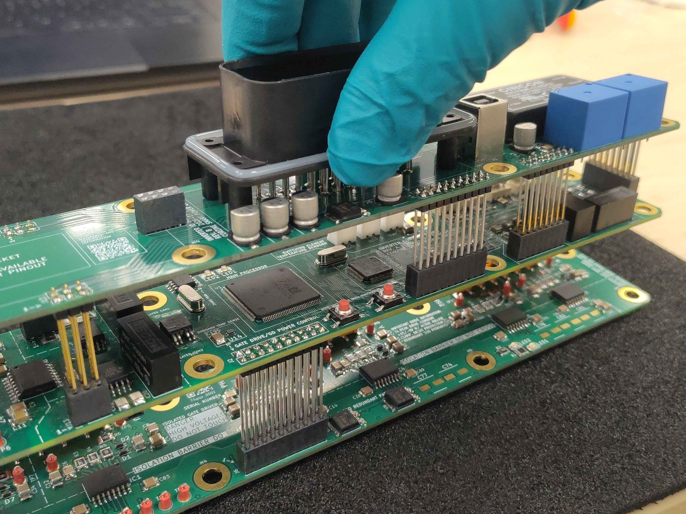
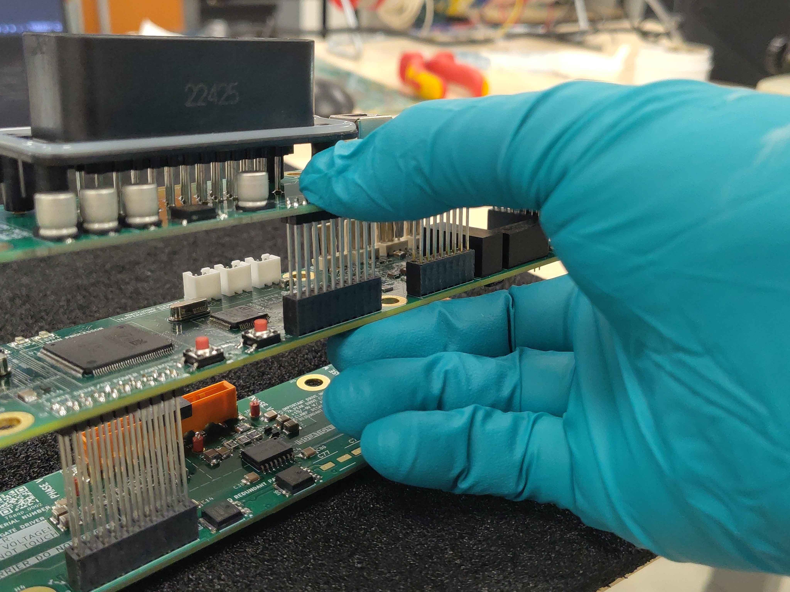
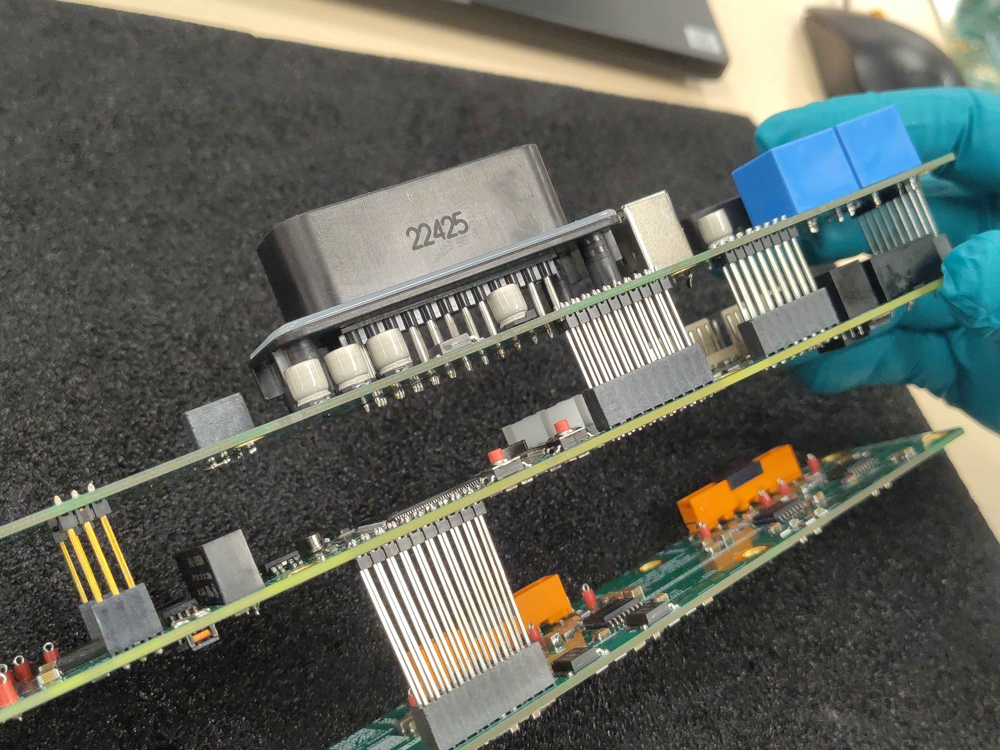
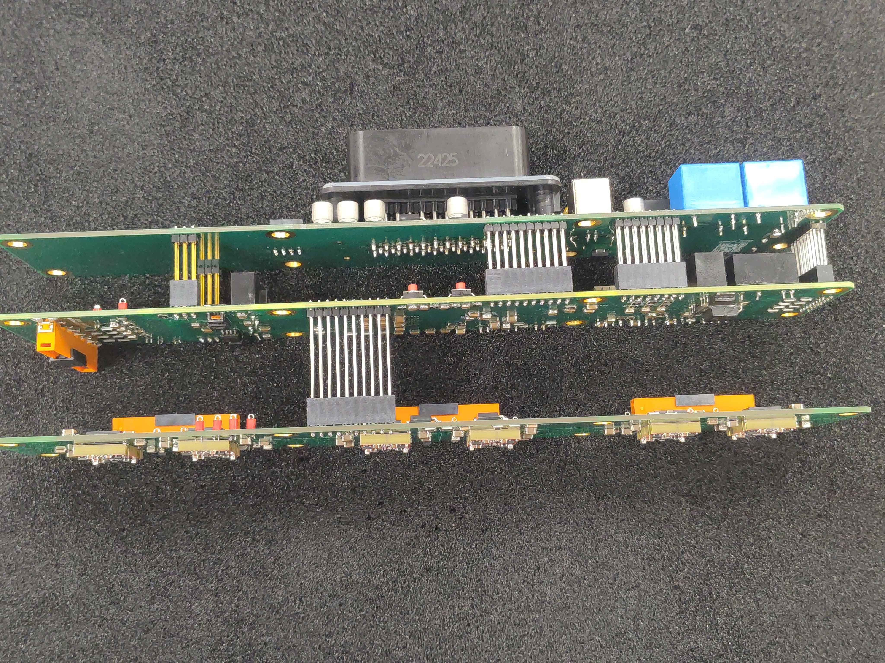
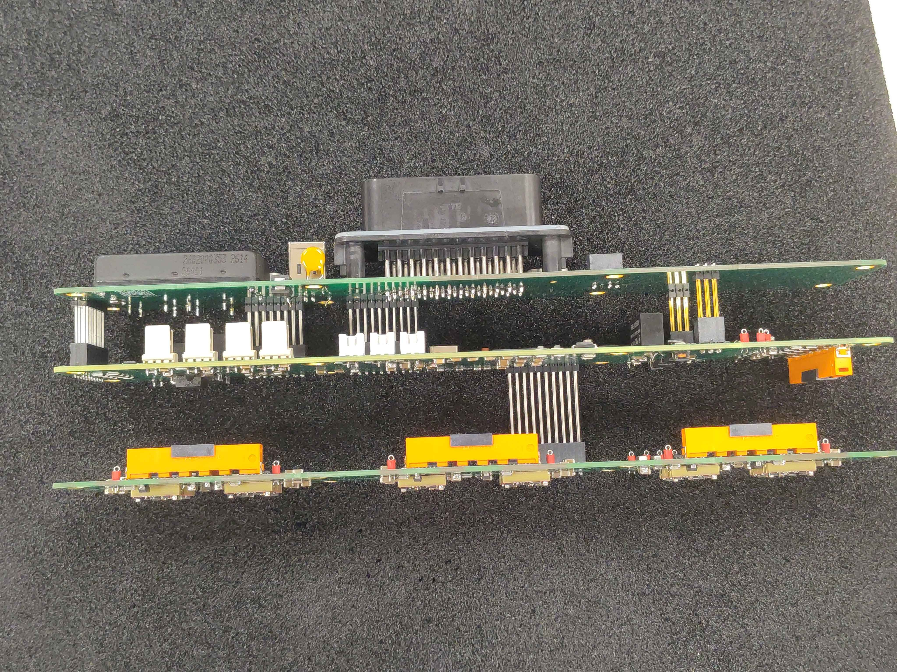

# Control Module Test Fit

After populating the IO board, gate driver board, and control board, do a test fit of the three-board stack. This catches crooked headers, reversed connectors, and mechanical interference before the module is fully committed.

> **Important:** This is a mechanical fit check only. Do not apply power.

> **Safety**
> - Work in an ESD-safe area and use a grounded wrist strap or ESD mat while handling populated boards.
> - Keep the boards on a soft, clean surface to avoid scratching components or shorting against metal tools.

## Required materials

| Item | Qty | Notes |
|------|-----|-------|
| Populated IO board | 1 | `OV-CA-AG-01-IO` |
| Populated gate driver board | 1 | `OV-CA-AG-02-GD` |
| Populated control board | 1 | `OV-CA-AG-03-CB` |

## Step 1 - Lay out the three boards

Start with the populated IO board, gate driver board, and control board on the bench. Check each one for any obviously loose parts, solder bridges, or connectors that did not get fully seated during population.

## Step 2 - Seat the control board onto the gate driver board

Pick up the control board and align its headers with the matching sockets on the gate driver board. Lower the control board straight down; the headers should slide in without forcing.

Make sure the long header rows are straight and fully engaged before pressing the boards together.

Press the connector fully home with your thumb. The boards should sit parallel with no gaps at the connector.

## Step 3 - Seat the IO board onto the control board

Take the IO board and align its headers with the sockets on the control board. Again, lower it straight down and verify the headers are not crooked before applying pressure.

Press the IO-board connector into the control board until it is fully seated.

## Step 4 - Check the assembly

With all three boards connected, look at the stack from the sides and ends:

- The boards should be parallel and evenly spaced.
- No header should look tilted or only partially inserted.
- All mating connectors should be fully seated with no visible gap.

If anything looks off, pull the boards apart and recheck header orientation and straightness before trying again.

## Step 5 - Disassemble

Once you have confirmed everything seats cleanly, separate the boards and set them aside in ESD-safe containers or on a mat. Keep them ready for the final control-module assembly step.

## Next steps

With the control module boards verified to fit together, proceed to the remaining control-module assembly steps described in the control assembly index (`OV-CA-INDEX`).
