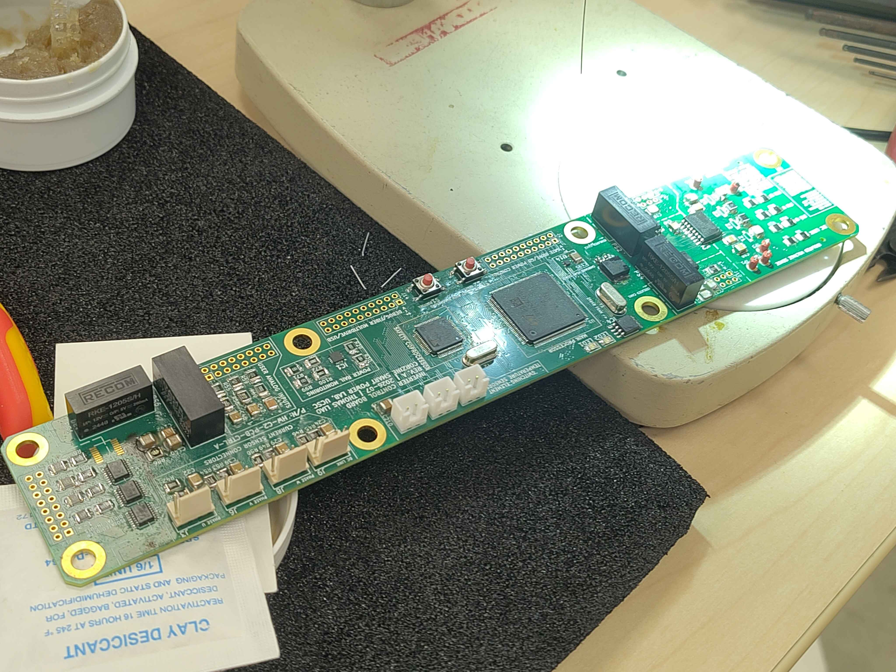
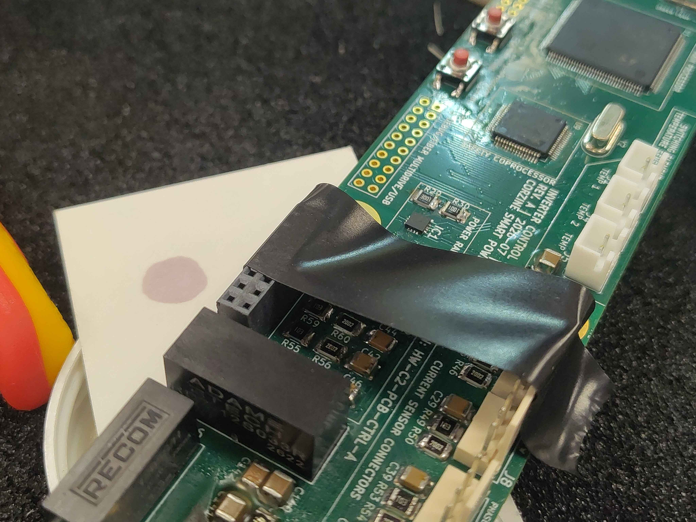
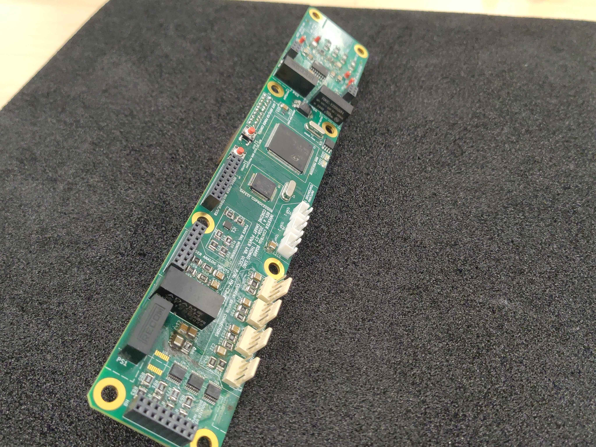
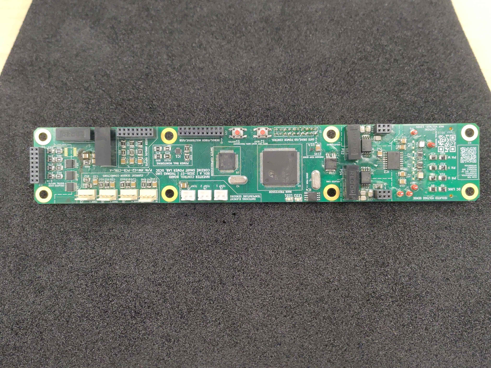
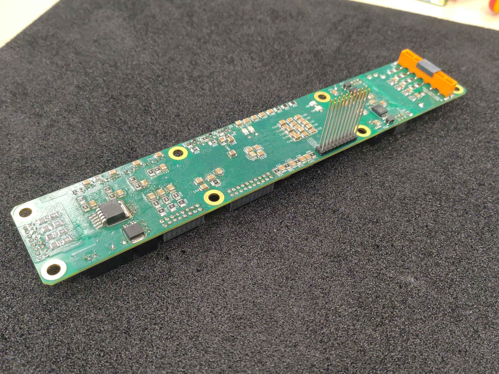
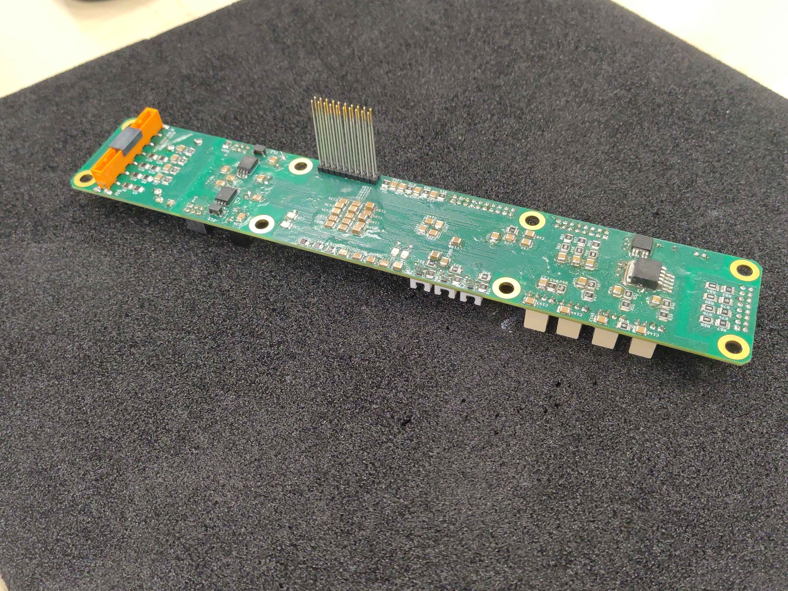

# Control Board Assembly

This guide covers populating and soldering the main control board (`HW-C2-PCB-CTRL-A`) for the OpenVVVF control module. It is written as general guidance for experienced assemblers; it does not describe every individual component placement.

> **Important:** Use the PCB Tool for this board. Open the [PCB Tool](../../../../Tools/PCB-Tool/pcb-tool.html) (`OV-TOOLS-PCB-TOOL`), select `HW-C2-PCB-CTRL-A`, and use the embedded interactive assembly view. It shows the exact placement and orientation of every part and is the authoritative reference for the build. The steps below highlight key techniques and gotchas, but the tool should be followed for the full bill of materials and placement sequence.

> **Errata:** Some parts may appear missing from the photographs in this guide. They were not available when the photos were taken; the parts list in the interactive BOM is the authoritative source.

> **Safety**
> - Work in an ESD-safe area and use a grounded wrist strap or ESD mat. This board contains ESD-sensitive MCUs, crystals, and interface ICs.
> - Use adequate ventilation or fume extraction while soldering.
> - Confirm correct polarity on diodes, capacitors, and ICs before soldering; reversed parts can damage the board when powered.
> - Do not power the assembled board until it has been inspected and the control-module integration procedure is followed.

## Required materials and tools

| Item | Qty | Notes |
|------|-----|-------|
| Control board PCB | 1 | `HW-C2-PCB-CTRL-A` |
| Components per interactive BOM | as listed | See the PCB Tool for the full bill of materials |
| Solder | as needed | Leaded or lead-free, flux-core |
| Flux | as needed | No-clean or water-washable |
| Temperature-controlled soldering iron | 1 | With tips suitable for fine-pitch SMD and through-hole work |
| Hot air gun or rework station | 1 | Useful for larger packages and connector rework |
| Soldering microscope or magnifier | 1 | Strongly recommended for fine-pitch MCU and crystal work |
| ESD-safe tweezers | 1 | For placing small parts |
| Flush cutters | 1 | For trimming leads |
| Kapton tape | as needed | To hold headers and connectors flat before soldering |
| Lint-free wipes and isopropyl alcohol | as needed | For flux cleanup |
| ESD wrist strap / mat | 1 | Mandatory for handling this board |

## Step 1 - Open the board in the PCB Tool

Before placing any parts, open the board in the PCB Tool. Keep the interactive assembly view visible throughout the build; it is the primary reference for part values, placements, and orientations. Use **Fullscreen** for a larger view or **Open Interactive Assembly** to launch it in a new tab.

<a class="tool-button" href="../../../../Tools/PCB-Tool/pcb-tool.html#HW-C2-PCB-CTRL-A">Open HW-C2-PCB-CTRL-A in the PCB Tool</a>

## Step 2 - Start with the smallest components

Populate the board from smallest to largest. Solder all of the small surface-mount passives first, then work up to the larger ICs, crystals, and connectors, and do the through-hole headers last. If the headers and shrouded connectors are soldered first, they physically block access to nearby SMD pads and make rework much harder.

## Step 3 - Use a microscope for fine-pitch work

A microscope or good bench magnifier is essential when placing the two large MCUs, the coprocessor, crystals, and the small resistors and capacitors around them. It helps verify alignment, check solder bridges, and inspect joint quality. Use plenty of flux and a fine-tip iron for the QFP and QFN packages.

## Step 4 - Align polarized parts to the silkscreen

Pay close attention to polarity marks on the PCB silkscreen.

- For diodes, align the cathode bar on the package with the longer line on the diode symbol.
- For ICs, align the pin-1 dot or notch on the package with the dot/bar marked on the board. Reversed MCUs or interface ICs will be destroyed on first power-up.
- For polarized capacitors, align the positive lead with the `+` mark and the long-bar pad on the silkscreen.

## Step 5 - Place the large MCUs and crystals carefully

The control board carries two large MCUs and several crystals. These are the most mechanically and thermally sensitive parts of the build:

- Verify pin-1 orientation against the PCB Tool before touching the iron to the board.
- Tack two opposite corners first, then check that the part is flat and correctly rotated before soldering the remaining pins.
- Do not overheat the crystals or the MCU packages; use a moderate temperature and work quickly.

## Step 6 - Use tape to hold headers flat before soldering

Many of the board-to-board and wire-to-board connectors on this board are tall and can tilt while being soldered. A strip of Kapton tape across the top of the connector holds it firmly against the board while you tack and solder the pins.

## Step 7 - Solder connectors fully seated

When soldering headers and shrouded connectors, make sure each one is fully seated against the board before soldering any pins. Tack one pin, check that the connector is flat and perpendicular, then solder the remaining pins. Confirm orientation against the CAD model in the PCB Tool if there is any doubt — some connectors mount on the side opposite from what you might expect.

> **Warning:** A connector that is not fully seated or is soldered at an angle can cause mating problems or shorting later. Double-check the CAD model for every connector.

## Step 8 - Mark progress in the interactive tool

As each part or group of parts is placed and soldered, mark it off in the interactive assembly view. This keeps track of what is done and prevents parts from being skipped.

## Step 9 - Clean and inspect

After all soldering is complete, clean flux residue from the board with isopropyl alcohol and lint-free wipes. Inspect each joint under magnification for bridges, cold joints, and insufficient solder. Verify that all polarized parts are correctly oriented and that all connectors are fully seated and correctly oriented.

Pay extra attention to the fine-pitch MCU pins and the isolation areas around the high-voltage interface regions: look for solder bridges, stray balls of solder, and flux residue that could cause leakage or shorts.

## Final assembly

The finished control board should have all parts placed and soldered according to the interactive BOM, no solder bridges, clean flux residue, and all connectors fully seated and correctly oriented.

## Next steps

With the control board populated, proceed to the control-module test-fit chapter to confirm the populated boards, standoffs, and connectors line up before final assembly.

- [Control Module Test Fit](../Control-Module-Test-Fit/Index.md)
