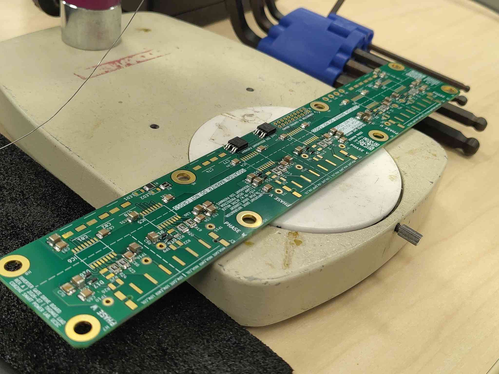
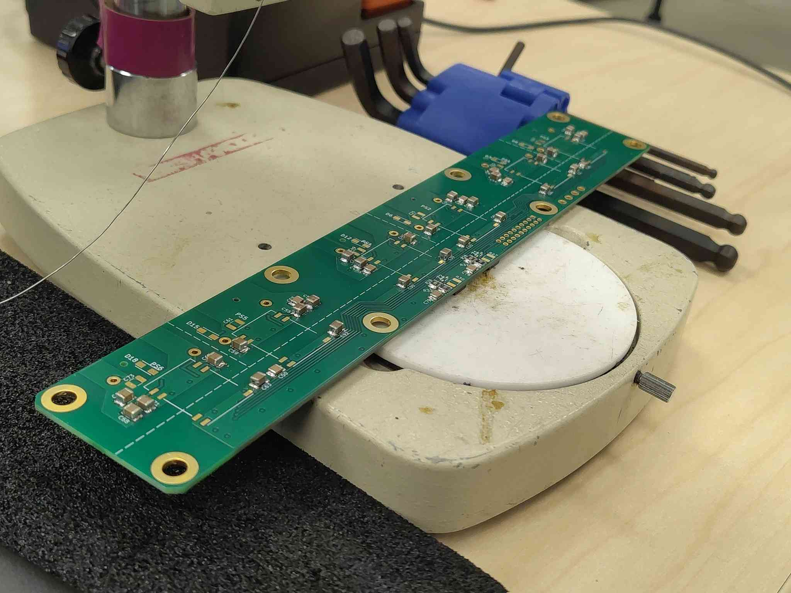
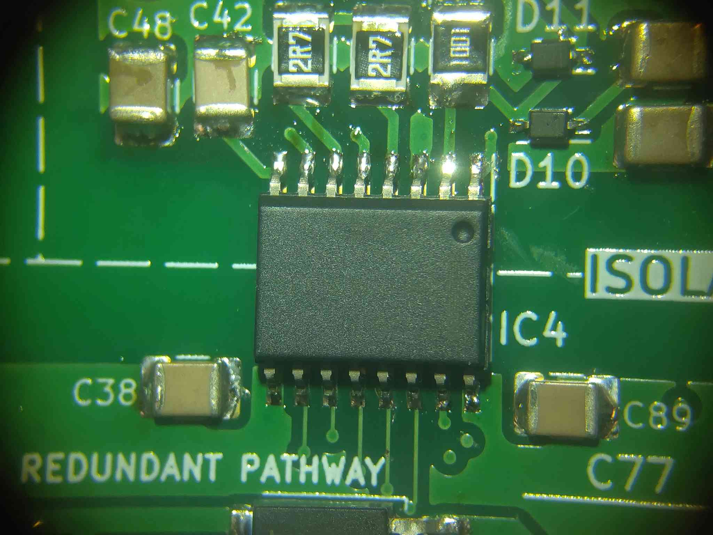
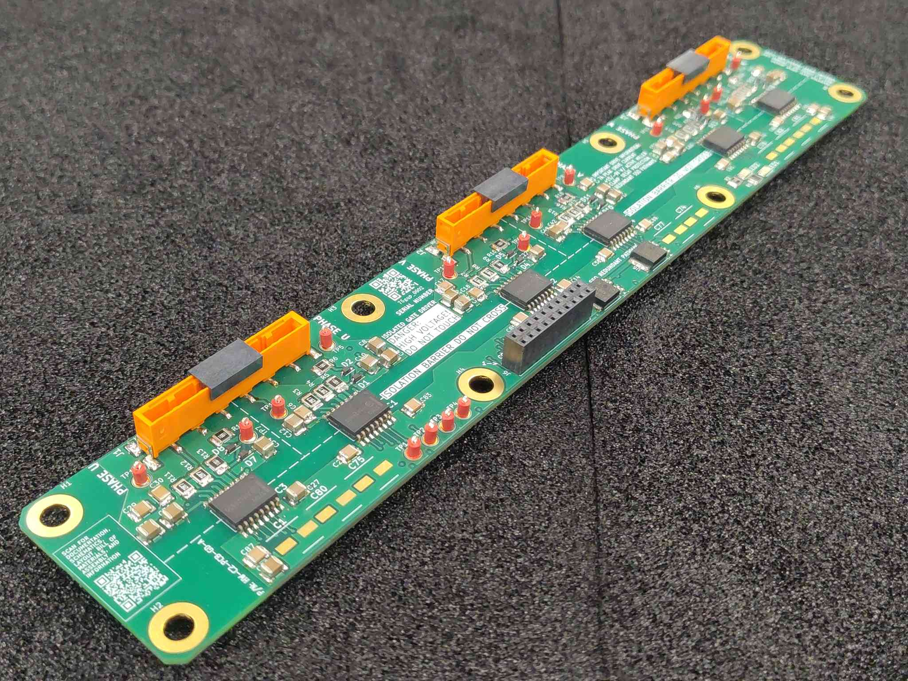
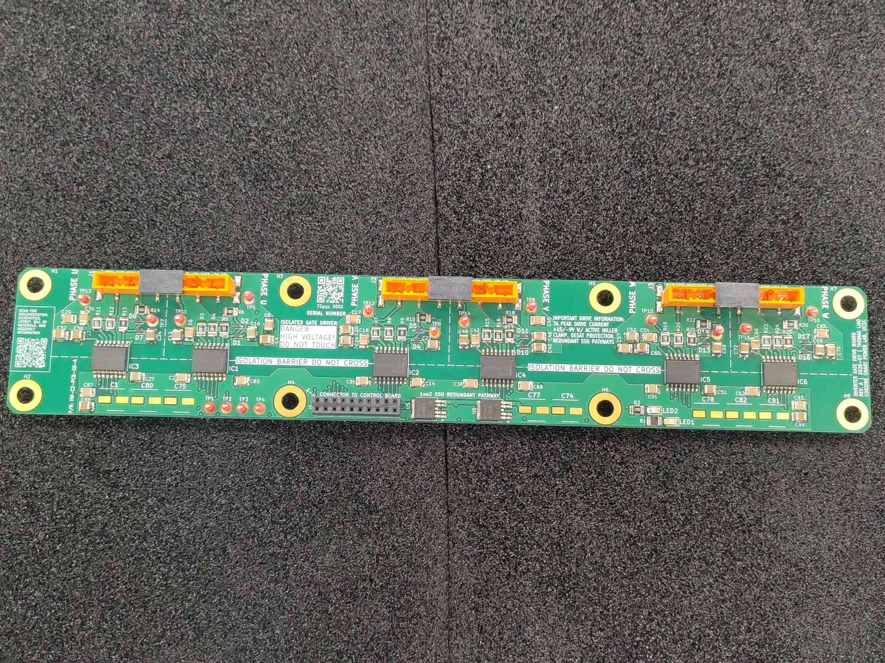
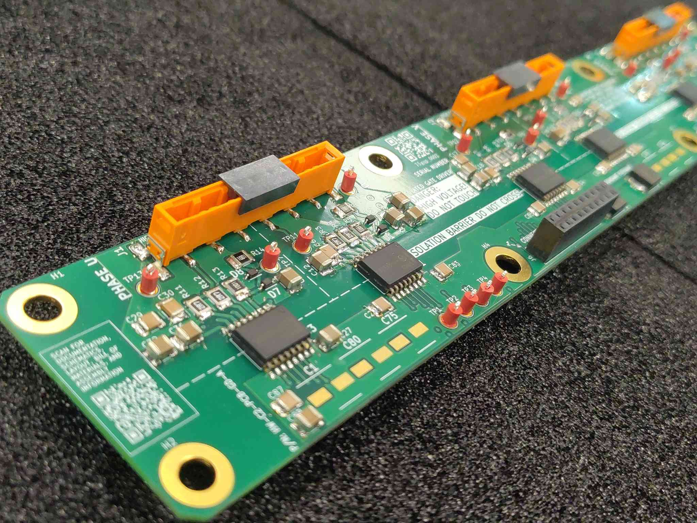
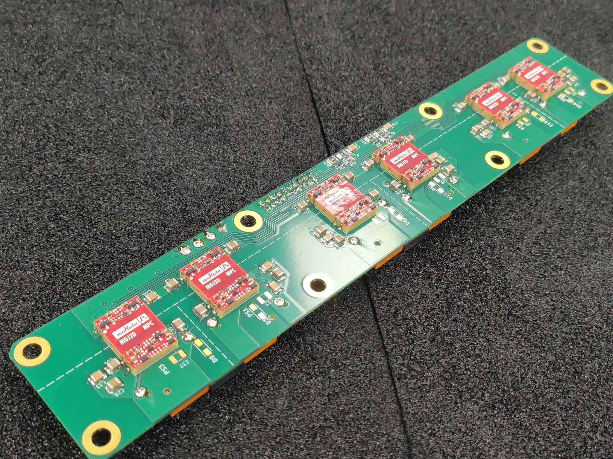
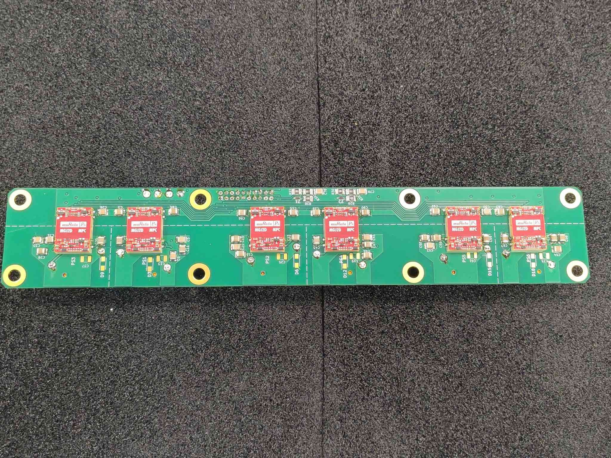

# Gate Driver Assembly

This guide covers populating and soldering the gate driver board (`HW-C2-PCB-GD-A`) for the OpenVVVF control module. It is written as general guidance for experienced assemblers; it does not describe every individual component placement.

> **Important:** Use the PCB Tool for this board. Open the [PCB Tool](../../../../Tools/PCB-Tool/pcb-tool.html) (`OV-TOOLS-PCB-TOOL`), select `HW-C2-PCB-GD-A`, and use the embedded interactive assembly view. It shows the exact placement and orientation of every part and is the authoritative reference for the build. The steps below highlight key techniques and gotchas, but the tool should be followed for the full bill of materials and placement sequence.

> **Errata:** Some parts may appear missing from the photographs in this guide. They were not available when the photos were taken; the parts list in the interactive BOM is the authoritative source.

> **Safety**
> - Work in an ESD-safe area and use a grounded wrist strap or ESD mat. This board contains ESD-sensitive isolated gate driver ICs.
> - Use adequate ventilation or fume extraction while soldering.
> - Confirm correct polarity on diodes, capacitors, and ICs before soldering; reversed parts can damage the board and the power stage when powered.
> - The gate driver interfaces directly to the high-voltage power stage. Do not power the assembled board until it has been inspected and the power-stage integration procedure is followed.

## Required materials and tools

| Item | Qty | Notes |
|------|-----|-------|
| Gate driver PCB | 1 | `HW-C2-PCB-GD-A` |
| Components per interactive BOM | as listed | See the PCB Tool for the full bill of materials |
| Solder | as needed | Leaded or lead-free, flux-core |
| Flux | as needed | No-clean or water-washable |
| Temperature-controlled soldering iron | 1 | With tips suitable for SMD and through-hole work |
| Soldering microscope or magnifier | 1 | Strongly recommended for fine-pitch parts |
| ESD-safe tweezers | 1 | For placing small parts |
| Flush cutters | 1 | For trimming leads |
| Lint-free wipes and isopropyl alcohol | as needed | For flux cleanup |
| ESD wrist strap / mat | 1 | Mandatory for handling this board |

## Step 1 - Open the board in the PCB Tool

Before placing any parts, open the board in the PCB Tool. Keep the interactive assembly view visible throughout the build; it is the primary reference for part values, placements, and orientations. Use **Fullscreen** for a larger view or **Open Interactive Assembly** to launch it in a new tab.

<a class="tool-button" href="../../../../Tools/PCB-Tool/pcb-tool.html#HW-C2-PCB-GD-A">Open HW-C2-PCB-GD-A in the PCB Tool</a>

## Step 2 - Start with the smallest components

Populate the board from smallest to largest. The gate driver board is dominated by small surface-mount decoupling capacitors and resistors. Solder all of these first, then work up to the ICs and diodes, and do the through-hole connectors last. If the connectors are soldered first, they physically block access to the SMD pads and make rework much harder.

## Step 3 - Use a microscope for fine-pitch work

A microscope or good bench magnifier makes a large difference when placing the isolated driver ICs and the small resistors and capacitors around them. It helps verify alignment, check solder bridges, and inspect joint quality.

## Step 4 - Align polarized parts to the silkscreen

Pay close attention to polarity marks on the PCB silkscreen.

- For diodes, align the cathode bar on the package with the longer line on the diode symbol. This board carries many small signal diodes and high-voltage rectifier diodes, so check every one.
- For ICs, align the pin-1 dot or notch on the package with the dot/bar marked on the board. Reversed driver ICs will be destroyed on first power-up.
- For polarized capacitors, align the positive lead with the `+` mark and the long-bar pad on the silkscreen.

## Step 5 - Respect the isolation barrier

The board has a marked isolation barrier between the control side and the high-voltage gate side (silkscreened "isolation barrier, do not cross"). When soldering near it:

- Keep solder joints, flux residue, and trimmed leads away from the barrier region.
- Do not place any part or wire across the barrier that is not called out in the BOM.
- After cleaning, inspect the barrier region under magnification for solder splashes or debris that could reduce creepage.

> **Warning:** Contamination across the isolation barrier compromises the isolation between the control electronics and the high-voltage power stage. Keep it clean.

## Step 6 - Solder connectors fully seated

When soldering the board-to-board and gate-output connectors, make sure each one is fully seated against the board before soldering any pins. Tack one pin, check that the connector is flat and perpendicular, then solder the remaining pins. Confirm orientation against the CAD model in the PCB Tool if there is any doubt: some connectors mount on the side opposite from what you might expect.

## Step 7 - Mark progress in the interactive tool

As each part or group of parts is placed and soldered, mark it off in the interactive assembly view. This keeps track of what is done and prevents parts from being skipped.

## Step 8 - Clean and inspect

After all soldering is complete, clean flux residue from the board with isopropyl alcohol and lint-free wipes. Inspect each joint under magnification for bridges, cold joints, and insufficient solder. Verify that all polarized parts are correctly oriented, that all connectors are fully seated, and that the isolation barrier region is free of contamination.

## Final assembly

The finished gate driver board should have all parts placed and soldered according to the interactive BOM, no solder bridges, clean flux residue, a clean isolation barrier, and all connectors fully seated and correctly oriented.

## Next steps

With the gate driver board populated, proceed to the remaining control-module assembly steps described in the control assembly index (`OV-CA-INDEX`).
