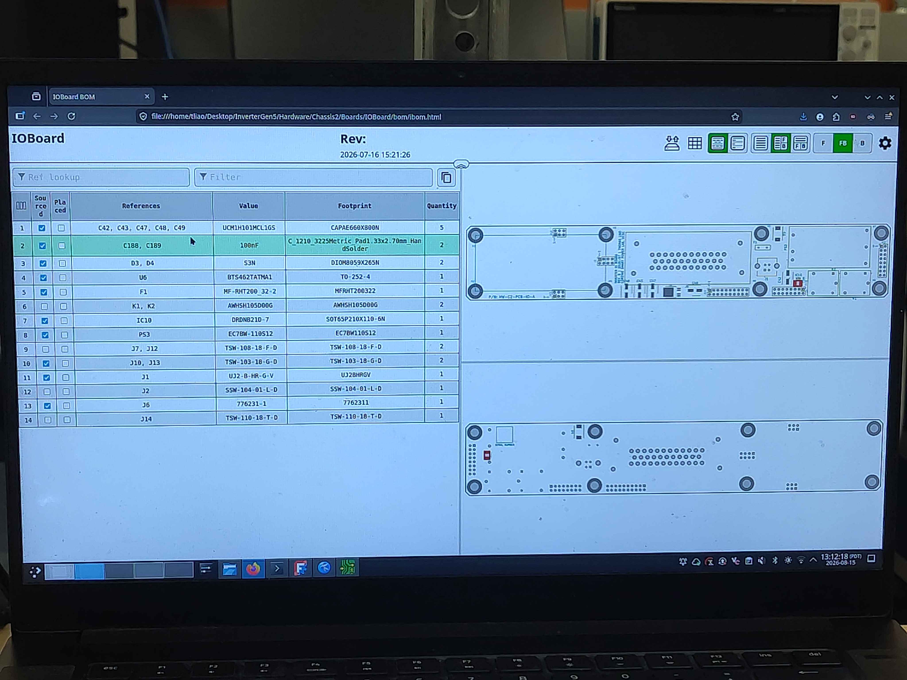
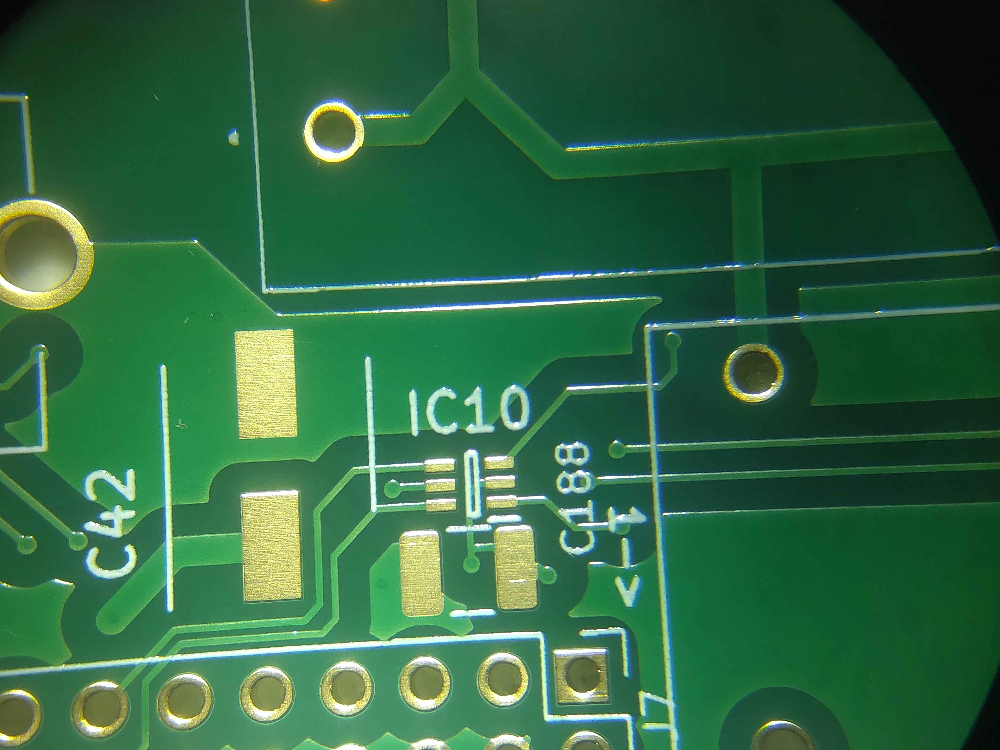
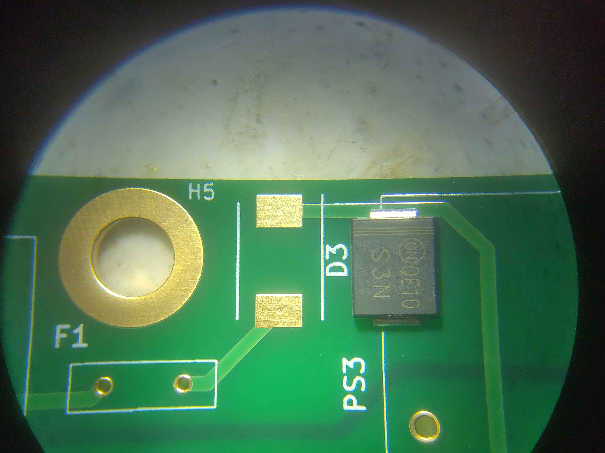
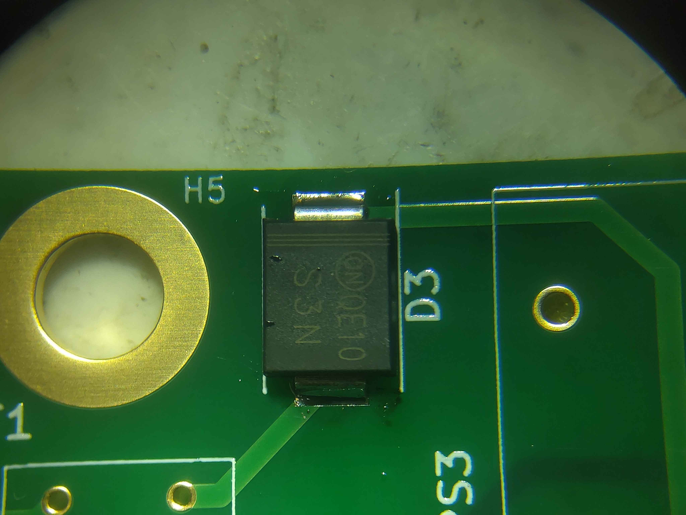
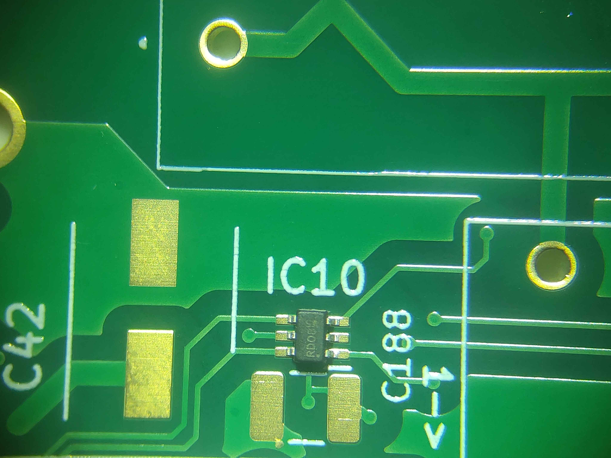
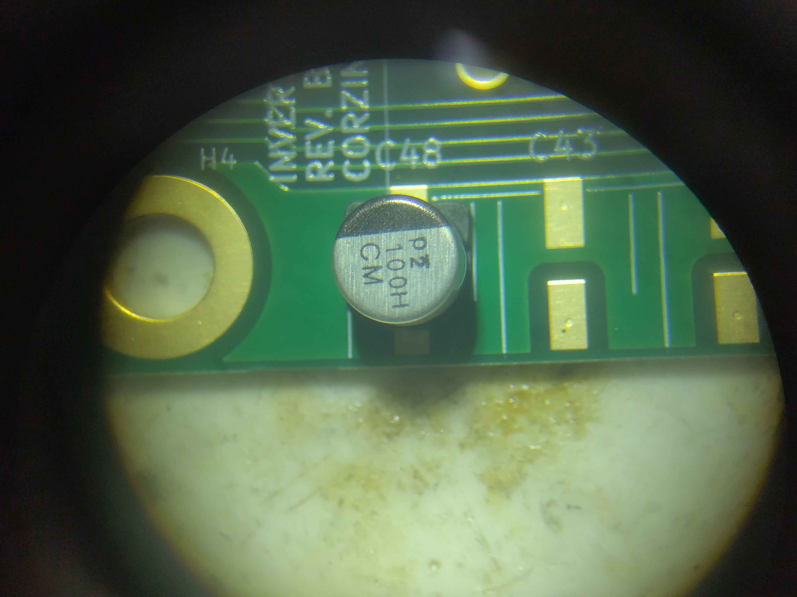
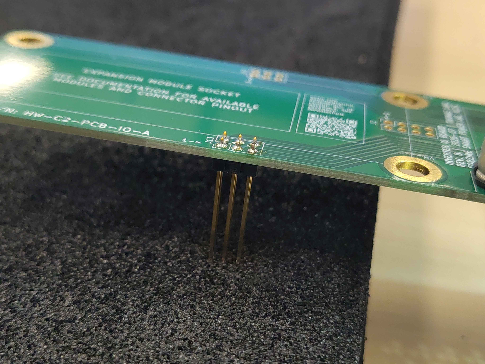
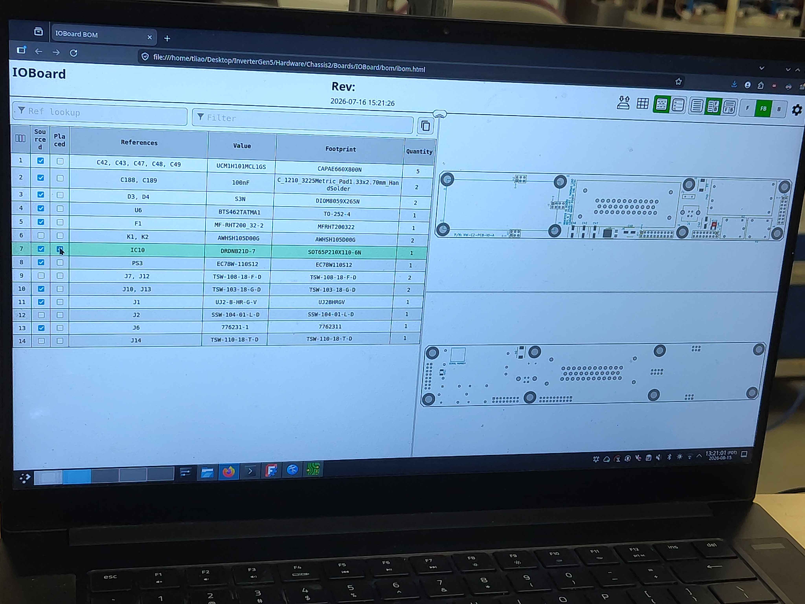
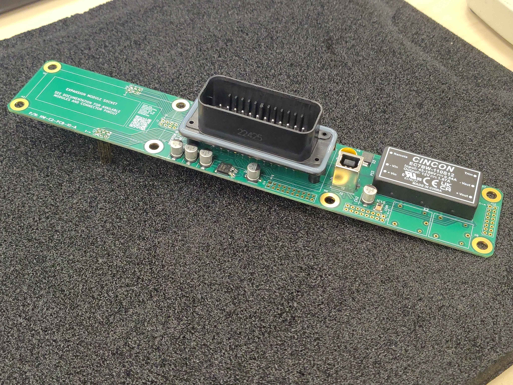

# IO Board Assembly

This guide covers populating and soldering the IO board for the OpenVVVF control module. It is written as general guidance for experienced assemblers; it does not describe every individual component placement.

> **Important:** Use the interactive HTML assembly tool for this board. It shows the exact placement and orientation of every part and is the authoritative reference for the build. The steps below highlight key techniques and gotchas, but the tool should be followed for the full bill of materials and placement sequence.

> **Errata:** Some parts may appear missing from the photographs in this guide. They were not available when the photos were taken; the parts list in the interactive BOM is the authoritative source.

> **Safety**
> - Work in an ESD-safe area and use a grounded wrist strap or ESD mat. This board contains ESD-sensitive ICs and connectors.
> - Use adequate ventilation or fume extraction while soldering.
> - Confirm correct polarity on diodes, electrolytic capacitors, and connectors before soldering; reversed parts can damage the board when powered.

## Required materials and tools

| Item | Qty | Notes |
|------|-----|-------|
| IO board PCB | 1 | Control module IO board |
| Components per interactive BOM | as listed | See the HTML assembly tool for the full bill of materials |
| Solder | as needed | Leaded or lead-free, flux-core |
| Flux | as needed | No-clean or water-washable |
| Temperature-controlled soldering iron | 1 | With tips suitable for SMD and through-hole work |
| Soldering microscope or magnifier | 1 | Strongly recommended for fine-pitch parts |
| ESD-safe tweezers | 1 | For placing small parts |
| Flush cutters | 1 | For trimming leads |
| Heat gun | 1 | For heat-shrink, if used |
| Lint-free wipes and isopropyl alcohol | as needed | For flux cleanup |
| ESD wrist strap / mat | 1 | Mandatory for handling this board |

## Step 1 - Open the interactive assembly tool

Before placing any parts, open the interactive HTML assembly tool for the IO board. Keep it visible throughout the build; it is the primary reference for part values, placements, and orientations.

## Step 2 - Start with the smallest components

Populate the board from smallest to largest. Solder all of the small surface-mount parts first, then work up to larger SMD components, and do through-hole parts last. If the through-hole connectors and headers are soldered first, they physically block access to the SMD pads and make rework much harder.

## Step 3 - Use a microscope for fine-pitch work

A microscope or good bench magnifier makes a large difference when placing small ICs, resistors, and connectors. It helps verify alignment, check solder bridges, and inspect joint quality.

## Step 4 - Align polarized parts to the silkscreen

Pay close attention to polarity marks on the PCB silkscreen.

- For diodes, align the cathode bar on the package with the longer line on the diode symbol.
- For ICs, align the pin-1 dot or notch on the package with the dot/bar marked on the board.
- For polarized capacitors, align the positive lead with the `+` mark and the long-bar pad on the silkscreen.

## Step 5 - Check connector orientation against the CAD model

Pin headers and connectors must be installed in the correct direction. The silkscreen is not always obvious, and some connectors may end up on the opposite side of the board from where you expect. Open the CAD model and confirm the orientation and mounting side of every header and connector before soldering.

> **Warning:** Soldering a pin header or shrouded connector in upside-down is difficult to fix and can ruin the board. Double-check the CAD model for every connector.

## Step 6 - Solder connectors fully seated

When soldering headers and connectors, make sure each one is fully seated against the board before soldering any pins. Tack one pin, check that the connector is flat and perpendicular, then solder the remaining pins. A connector that is not fully seated can cause mating problems or shorting later.

## Step 7 - Mark progress in the interactive tool

As each part or group of parts is placed and soldered, mark it off in the interactive assembly tool. This keeps track of what is done and prevents parts from being skipped.

## Step 8 - Clean and inspect

After all soldering is complete, clean flux residue from the board with isopropyl alcohol and lint-free wipes. Inspect each joint under magnification for bridges, cold joints, and insufficient solder. Verify that all polarized parts are correctly oriented and that all connectors are fully seated.

## Final assembly

The finished IO board should have all parts placed and soldered according to the interactive BOM, no solder bridges, clean flux residue, and all connectors fully seated and correctly oriented.

## Next steps

With the IO board populated, proceed to the remaining control-module assembly steps described in the control assembly index (`OV-CA-INDEX`).
