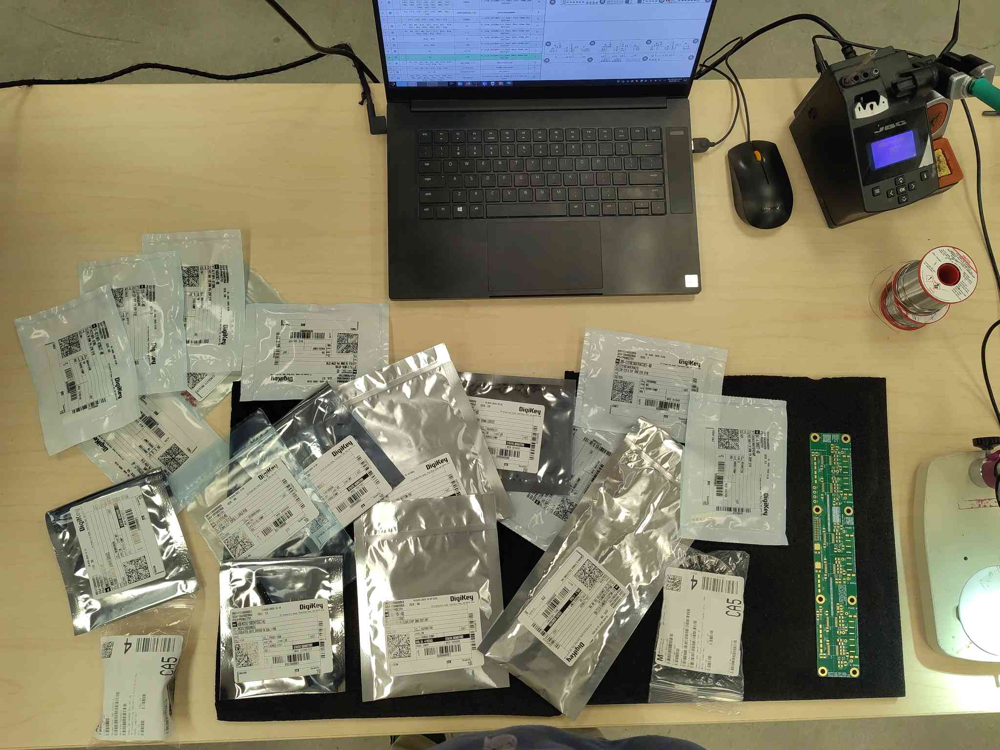
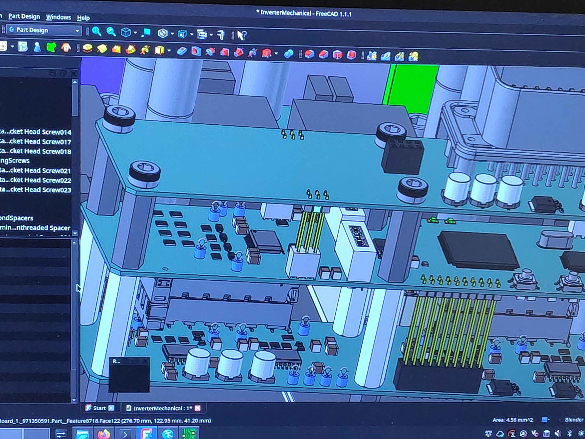
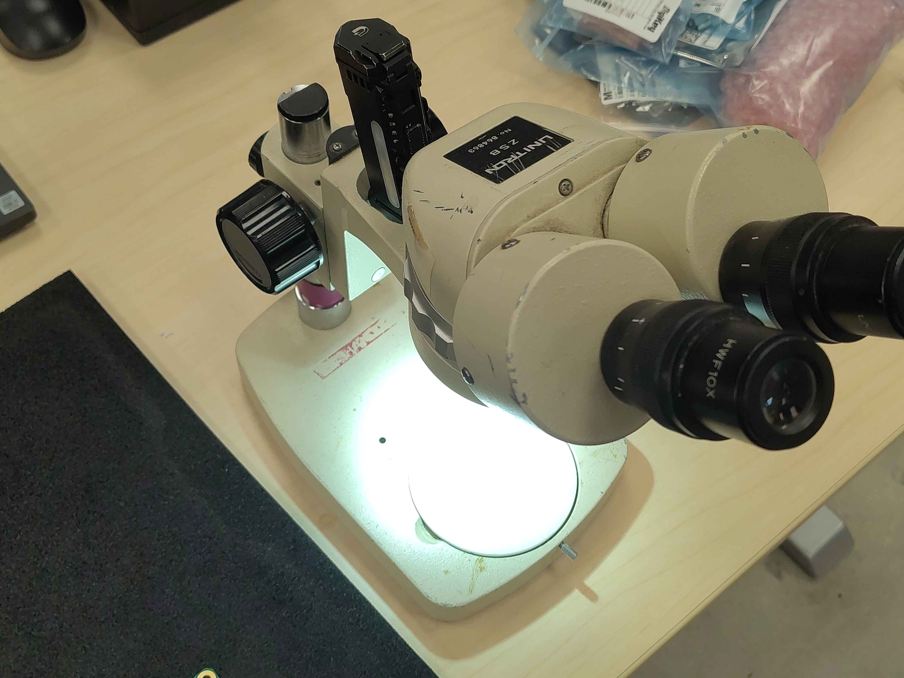
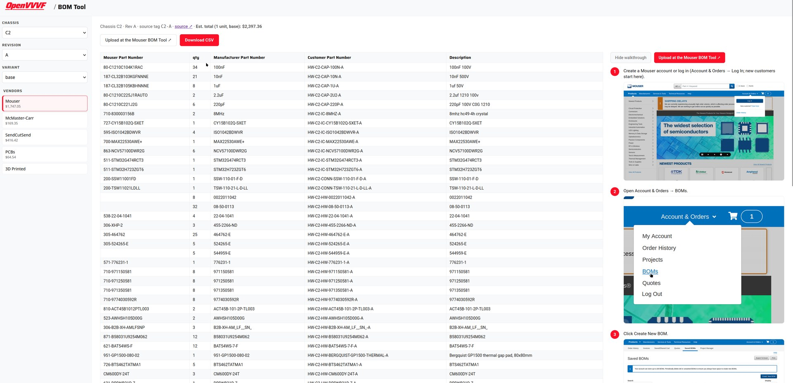
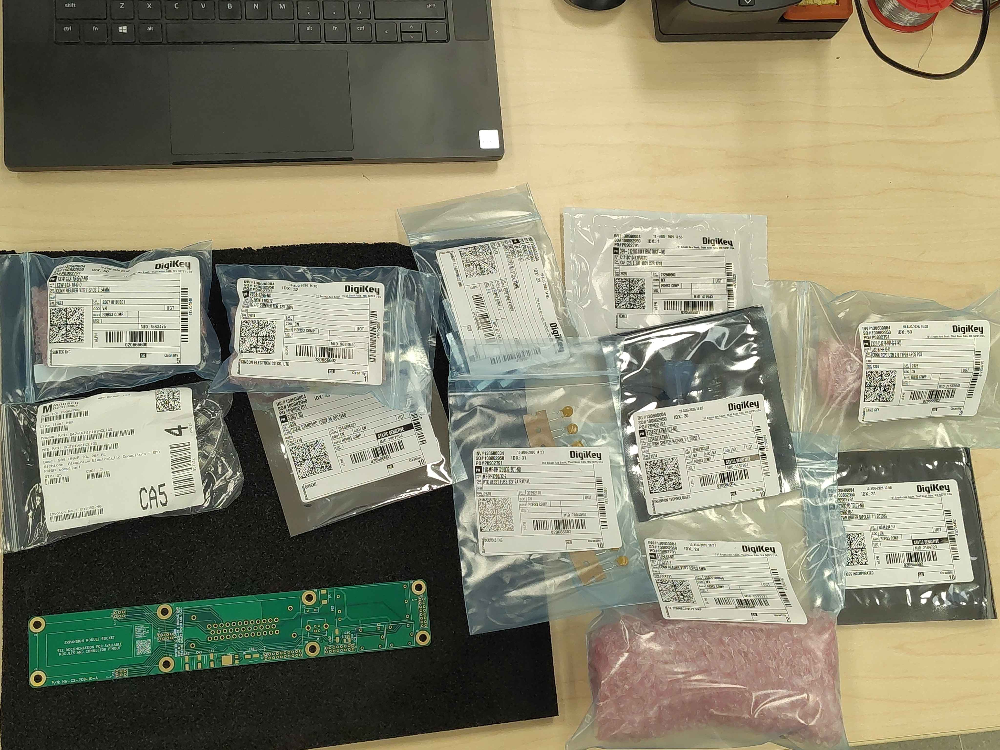

# Preparation

Before populating any control module board, set up the workspace and confirm you have every part and the correct PCBs. Doing this once, up front, prevents the most common assembly mistakes: missing parts, wrong board revisions, and damaged ESD-sensitive components.

> **Safety**
> - Work in an ESD-safe area and use a grounded wrist strap or ESD mat whenever handling boards or components. All control module boards contain ESD-sensitive ICs.
> - Use adequate ventilation or fume extraction while soldering.

## Equipment

| Item | Notes |
|------|-------|
| Computer with CAD viewer | For checking connector orientation and mechanical fit against the board models |
| Temperature-controlled soldering iron | Fine tip for SMD work; a larger tip helps for connectors |
| Soldering microscope or bench magnifier | Strongly recommended; most parts are small SMD |
| Good bench lighting | Bright, shadow-free light makes inspection far easier |
| ESD wrist strap / mat | Mandatory |
| ESD-safe tweezers | For placing small parts |
| Flush cutters | For trimming leads |
| Solder and flux | Leaded or lead-free flux-core solder; no-clean or water-washable flux |
| Lint-free wipes and isopropyl alcohol | For flux cleanup |
| Clean, uncluttered bench | Enough room to lay out the board, parts, and tools without crowding |

Set up a clean, well-lit workspace before opening any part packaging. Keep only the board you are working on and its parts on the bench.

## Computer and CAD access

Keep a computer at the bench with the PCB Tool open and a CAD/STEP viewer available. Connector orientation and mounting side are not always obvious from the silkscreen, and the CAD model is the authority: checking it before soldering saves painful rework.

## Microscope and fine soldering equipment

A microscope or good magnifier and a fine-tip temperature-controlled iron are essential for the small SMD parts on these boards. Set the iron up and let it reach temperature before you need it.

## Verify parts against the BOM

Before starting, confirm you have every part for the board you are about to build:

1. Open the [BOM Tool](../../../../Tools/BOM-Tool/bom-tool.html) and select the chassis, revision, and variant you are building. Check your stock against the vendor BOMs: if anything is missing, order it now rather than mid-build.
2. Open the [PCB Tool](../../../../Tools/PCB-Tool/pcb-tool.html) and confirm the interactive BOM for each board matches what you have on hand. The interactive BOM is the authoritative parts list for each board.

> **Important:** Part substitutions are common. If a part differs from the BOM, confirm it is an approved equivalent before soldering it in.

## Verify you have the correct PCBs

Check each bare PCB against the [PCB Tool](../../../../Tools/PCB-Tool/pcb-tool.html): confirm the part number and revision printed on the board match the release you intend to build (e.g. `HW-C2-PCB-IO-A`, `HW-C2-PCB-GD-A`). Boards from different revisions are not necessarily interchangeable.

## Next steps

With the workspace ready and parts verified, proceed in build order:

1. [IO Board Assembly](../IOBoard/Index.md)
2. [Gate Driver Assembly](../GateDriver/Index.md)
3. [Control Board Assembly](../ControlBoard/Index.md)
