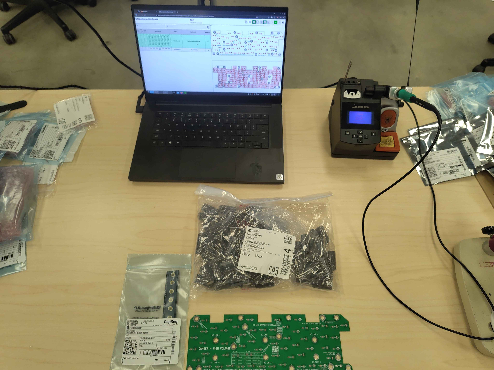
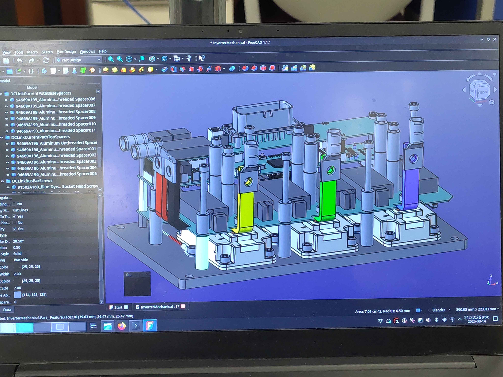
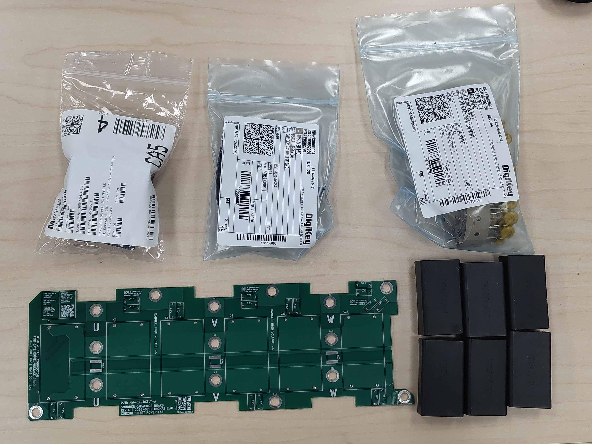

# Preparation

Everything to have done, have on hand, and have checked before starting the C2 power-stage build. Doing this once, up front, prevents the most common assembly mistakes: missing parts, wrong board revisions, and rework caused by poor access or lighting.

> **Safety**
> - Do not power the inverter until all assembly, torque, and inspection steps are complete.
> - Review the hazard analysis (`OV-SAF-HARA-CORE`) before starting; it identifies the hazards each assembly control mitigates.
> - Wear clean, lint-free gloves whenever handling bus bars, screws, or any high-current contact surface - skin oils increase contact resistance at joints.
> - Work in an ESD-safe area and use a grounded wrist strap or ESD mat for the PCB population chapters and whenever handling the control module.

## Prerequisites

These items must be complete before power-stage assembly begins:

- **Control assembly completed and tested** - the control module must be fully assembled and verified before it is needed for the later chapters. See the Control Assembly assembly guide (`OV-CA-AG-INDEX`).
- **Firmware flashed** - main MCU and safety coprocessor firmware flashed and confirmed booting. See the Control Assembly software manual (`OV-CA-SWM-INDEX`).
- **Prior build chapters complete** - each chapter in this guide assumes the chapters before it are done; do not skip ahead, as later steps rely on hardware installed earlier.

## Workspace

Set up a clean, well-lit bench with enough room to lay out the heatspreader and all sub-assemblies. Bright, shadow-free lighting makes torque witness marks, solder joints, and small parts far easier to inspect. Keep the work area free of stray metal debris at all times; metal swarf or loose hardware can short high-voltage bus bars. Use an ESD mat and wrist strap for the PCB chapters.

## Computer and CAD access

Keep a computer at the bench with the PCB Tool open and a CAD/STEP viewer available. Spacer, bus bar, and board orientation is not always obvious from the parts alone, and the CAD model is the authority: checking it before tightening anything saves painful rework.

## Equipment

| Item | Notes |
|------|-------|
| Computer with CAD viewer | For checking orientation and fit against the models |
| Torque wrench covering the M5/M6 range | 8 N·m capability required |
| Hex key / driver set | |
| Temperature-controlled soldering iron | Fine tip for SMD; large chisel tip for the DC-link capacitor board's copper planes and standoff pads |
| Soldering microscope or bench magnifier | Recommended for the filter board's small parts |
| Multimeter | |
| Permanent marker | For torque witness marks and variant marks |
| ESD-safe tweezers and small hand tools | |
| Long-nose pliers | For forming Class-Y capacitor leads on the filter board |
| Lead cutters / flush cutters | For trimming capacitor leads |
| Solder and flux | Leaded or lead-free flux-core solder; no-clean or water-washable flux |
| Clean, lint-free gloves | Mandatory when handling bus bars or high-current contact surfaces |

## Consumables

- Thermal interface compound
- Thread-locking compound, medium strength
- Isopropyl alcohol and lint-free wipes
- ESD bags for populated PCBs

## Verify parts against the BOM

Before starting, confirm you have every part for the build:

1. Open the [BOM Tool](../../../../../Tools/BOM-Tool/bom-tool.html), select chassis C2, the revision, and the variant you are building, and check your stock against the vendor BOMs, including the fabricated parts (bus bars, heatspreader, spacers). If anything is missing, order it now rather than mid-build.
2. Open the [PCB Tool](../../../../../Tools/PCB-Tool/pcb-tool.html) and confirm the interactive BOM for each PCB matches what you have on hand. The interactive BOM is the authoritative parts list for each board.

> **Important:** Part substitutions are common. If a part differs from the BOM, confirm it is an approved equivalent before installing it.

## Verify you have the correct PCBs and fabricated parts

Check each bare PCB against the [PCB Tool](../../../../../Tools/PCB-Tool/pcb-tool.html): confirm the part number and revision printed on the board match the release you intend to build. Check fabricated parts (bus bars, spacers, heatspreader) against the CAD model. Parts from different revisions are not necessarily interchangeable.

## Required documents

- This assembly guide (`OV-C2-AG-INDEX`), printed or on a shop tablet.
- Relevant design documents (`OV-C2-DD-INDEX`) for background on torque and thermal decisions.

## Next steps

With the workspace ready and parts verified, proceed in build order:

1. [DC-Link Filter Board](../2_DC-Link-Filter-Board/Index.md)
2. [DC-Link Capacitor Board](../3_DC-Link-Capacitor-Board/Index.md)
3. [IGBT Mounting](../4_IGBT-Mounting/Index.md)
