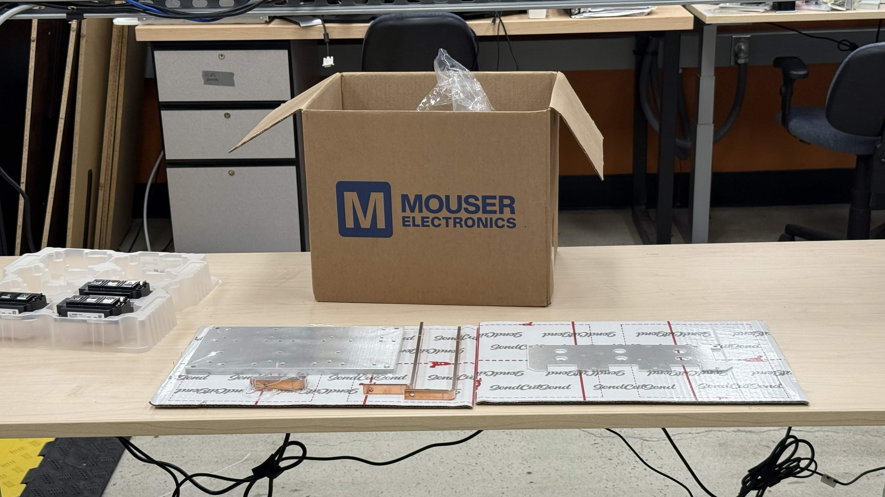
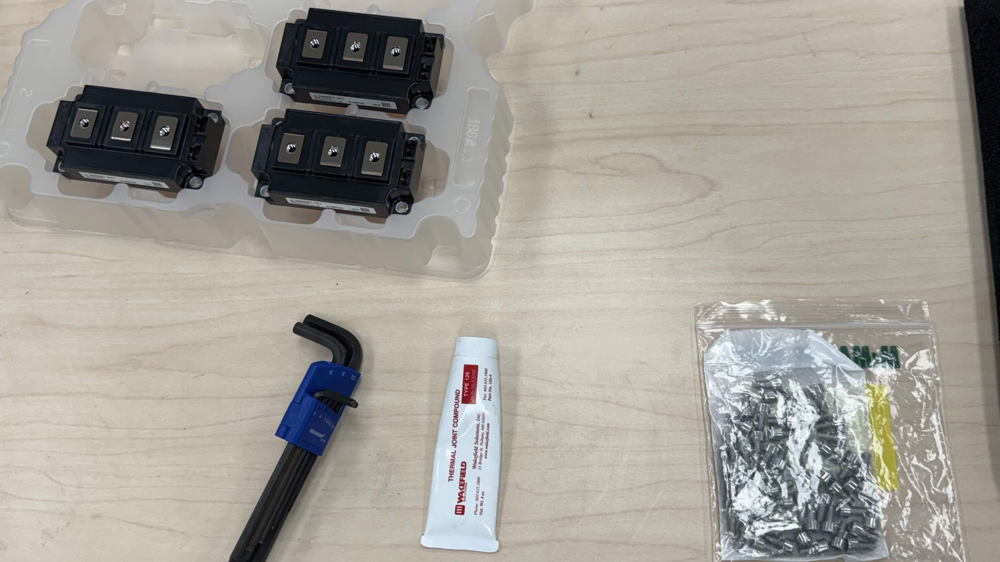
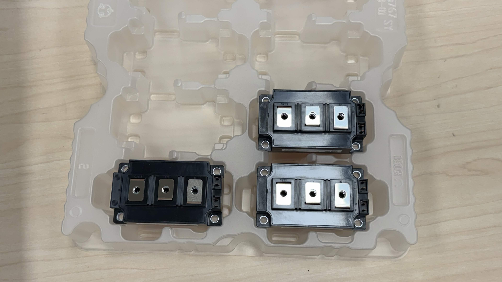
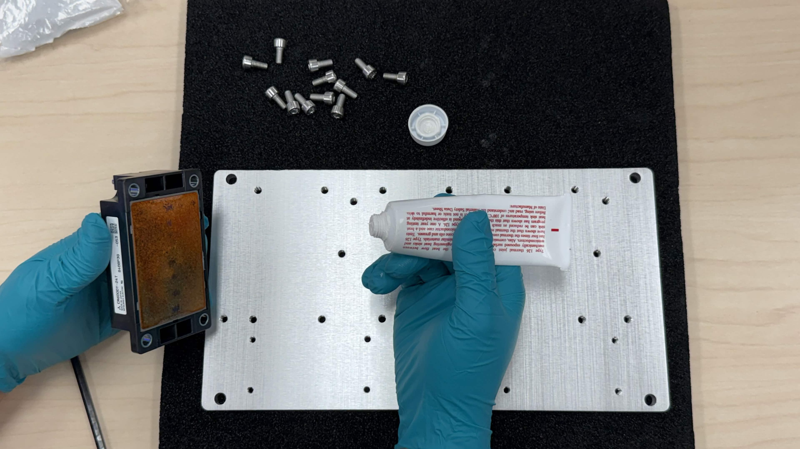
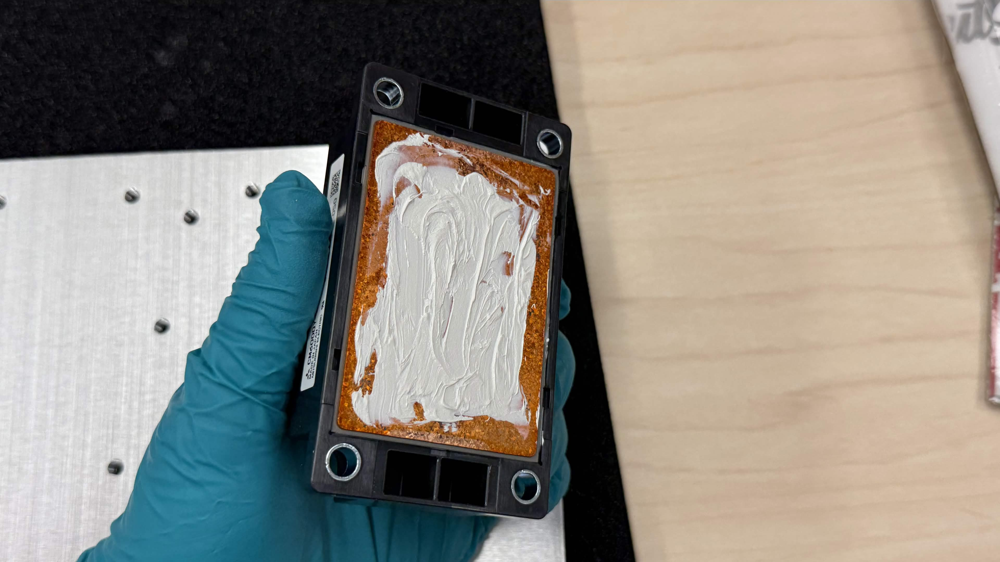
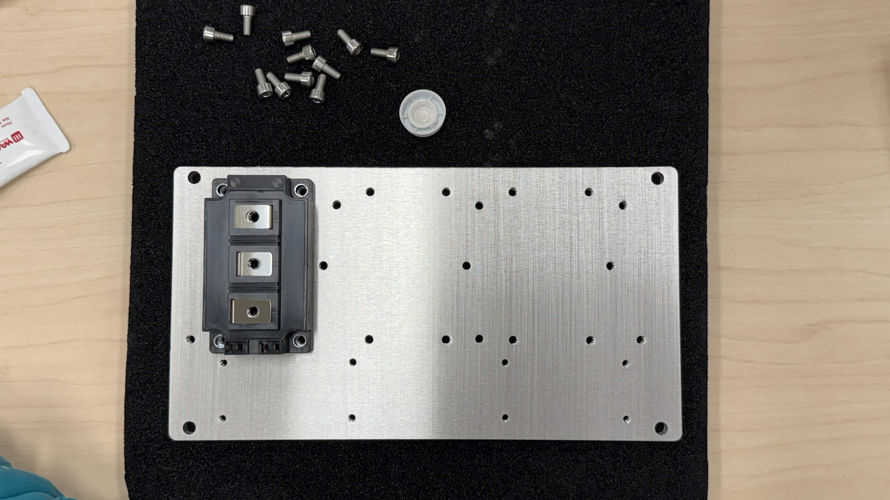
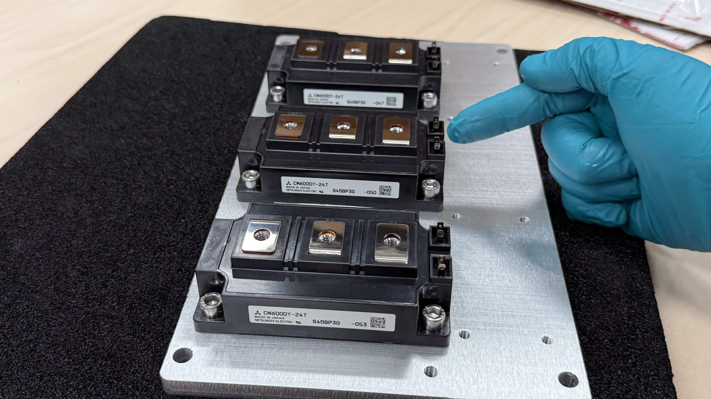
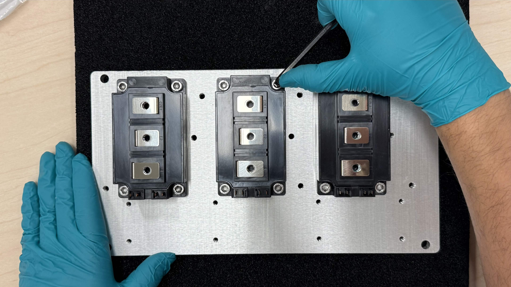
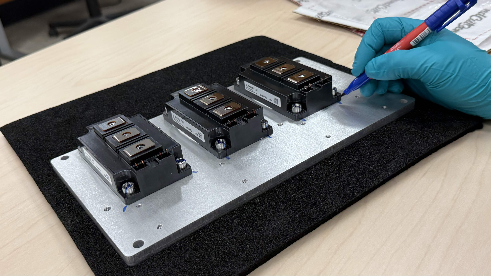
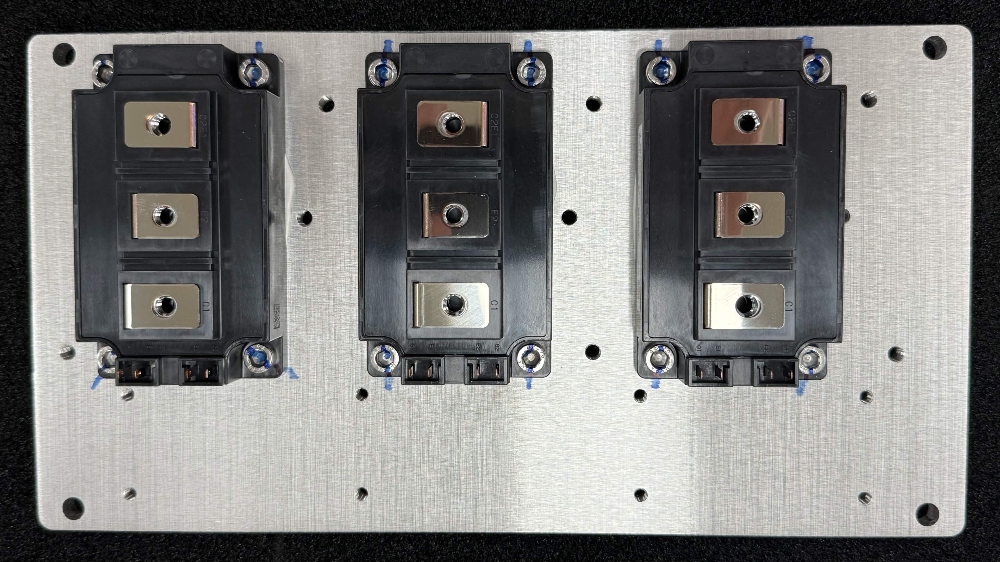

# IGBT Module Mounting

This guide covers mounting the three Mitsubishi CM600DY-24T IGBT modules onto the Chassis Size 2 aluminium baseplate/heatspreader.

> **Safety**
> - IGBT modules are static-sensitive. Handle them on a grounded ESD mat and wear a wrist strap.
> - Do not power the inverter until all assembly, torque, and inspection steps are complete.
> - Keep the work area clean; metal swarf or paste residue on the gate terminals can cause shorts or weak gate-drive signals.

## Required materials and tools

| Item | Qty | Notes |
|------|-----|-------|
| Aluminium baseplate/heatspreader | 1 | Chassis Size 2 |
| Mitsubishi CM600DY-24T IGBT module | 3 | Half-bridge modules |
| M6×12 mm socket-head cap screw | 12 | Per module (4×) |
| Thermal interface compound | as needed | Even, thin coverage |
| Thread-locking compound (medium strength) | as needed | Applied to screw threads |
| M6 Belleville washer (optional) | 12 | Under each screw head to maintain clamp force through thermal cycling |
| 4 mm hex key / Allen key | 1 | For M6 socket heads |
| Torque wrench with 4 N·m capability | 1 | Calibrated, if possible |
| Permanent marker | 1 | For torque-strip marks |

## Step 1 - Orient the IGBT module

Remove one IGBT module from its tray.

Identify the gate-drive terminal side of the module. This side must face the control-board/gate-driver mounting area (the side of the baseplate where the control assembly will later be installed).

Take care to mount every module in the same orientation; reversing a module will make the phase wiring and gate-drive harnesses incorrect.

## Step 2 - Apply thermal interface compound

Apply a thin, even layer of thermal interface compound to the entire flat mounting base of the IGBT module. The goal is full coverage with no bare metal showing and no excess paste squeezing out when compressed.

## Step 3 - Place the module on the baseplate

Align the module with the four M6 mounting holes in the baseplate and lower it into place. Confirm that the gate-drive terminals face away from the close edge of the baseplate and toward the control-board area.

## Step 4 - Install the mounting screws

1. Apply thread-locking compound to the threads of all four M6×12 mm screws.
2. Place a Belleville washer under each screw head, if available. The convex side should face the screw head so the washer flattens as it is tightened.
3. Insert the screws into the four corners of the module.
4. Tighten diagonally (opposite corners) until the screws are just hand-tight.

> **Note:** The unit shown in the photos was assembled before Belleville washers were available. Future builds should use them; they help maintain clamp force as the aluminium baseplate and module package expand and contract through thermal cycles.

Repeat Step 1 through Step 4 for the remaining two IGBT modules.

## Step 5 - Verify orientation and torque

Before final tightening, verify that the gate terminals on all three modules face the same direction, toward the control-board area, as shown below.

Tighten each module's screws in a diagonal pattern to **4 N·m**. Wait approximately **2 minutes** to allow the thermal interface compound to settle and squeeze out, then retorque all screws to **4 N·m** again. Some clamp force loss is normal as the paste compresses; the retorque step restores it.

## Step 6 - Mark the screws

Use the permanent marker to draw a straight line from each screw head onto the baseplate. This torque-strip mark makes it easy to spot loosening during later inspection or vibration testing.

## Final assembly

The completed assembly should look like the image below: three IGBT modules mounted in the same orientation, all screws torqued and marked.

## Next steps

Continue with the remaining Chassis Size 2 assembly steps in the integration guide (`OV-C2-IG-INDEX`) before applying power.
