# DC-Link Filter Board Assembly

This guide covers populating the DC-link filter PCB used in the Chassis Size 2 power stage. The board carries ceramic decoupling capacitors, film capacitors, Class-Y safety capacitors, and a connector.

> **Safety**
> - This board operates at high DC voltage. Treat it as energized until proven discharged, even when disconnected from the inverter.
> - Wear safety glasses when cutting leads; clipped capacitor legs can fly off at high speed.
> - Use a temperature-controlled soldering iron and adequate ventilation or fume extraction.

## Required materials and tools

| Item | Qty | Notes |
|------|-----|-------|
| DC-link filter PCB | 1 | Chassis Size 2 |
| Ceramic decoupling capacitors | as per BOM | Soldered on both top and bottom |
| Film capacitors | as per BOM | Larger through-hole parts |
| Class-Y safety capacitors | as per BOM | Must be bent/formed to fit |
| PCB connector | 1 | Soldered last |
| Solder | as needed | Leaded or lead-free, flux-core |
| Flux | as needed | No-clean or water-washable |
| Temperature-controlled soldering iron | 1 | With appropriate tip for the pad sizes |
| Lead cutters / flush cutters | 1 | For trimming capacitor leads |
| Long-nose pliers | 1 | For bending Class-Y leads |
| Lint-free wipes | as needed | For flux and paste cleanup |
| Isopropyl alcohol (IPA) | as needed | For cleaning flux residue |
| Permanent marker | 1 | For polarity and orientation checks |

> **Errata:** The film capacitors shown in the preparation photo and later steps have no packaging because they were re-used from a previous prototype. New builds will use fresh parts, but the soldering procedure is the same.

## Step 1 - Solder the top ceramic capacitors

Start by soldering all of the small ceramic decoupling capacitors on the top side of the board. We recommend doing the top ceramics first because it is easier to access and inspect them before the larger film capacitors are installed.

> **Errata:** Some of the photos below show the larger film capacitors already soldered in place. For future builds, solder the top ceramics first, then the bottom ceramics, and install the film capacitors afterward.

> **Note:** The ceramic capacitors used here are J-lead packages. The flexible J-lead absorbs most of the thermal expansion mismatch during hand soldering, so the ceramic body sees far less mechanical stress than a rigid leadless MLCC would.

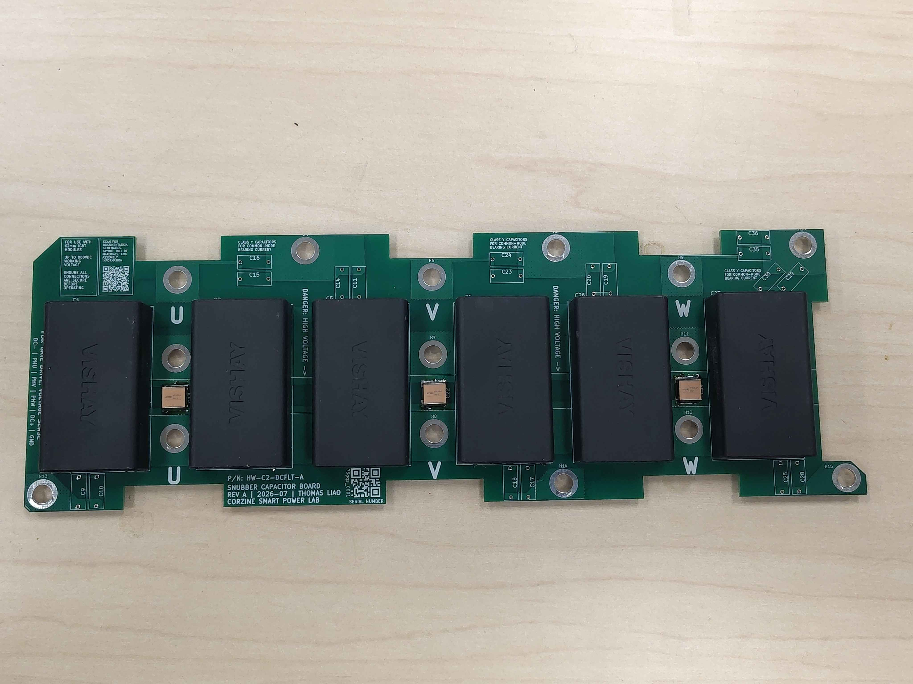

## Step 2 - Solder the bottom ceramic capacitors

Flip the board and solder the ceramic decoupling capacitors on the bottom side. Keep the board supported so the freshly soldered top-side parts are not damaged.

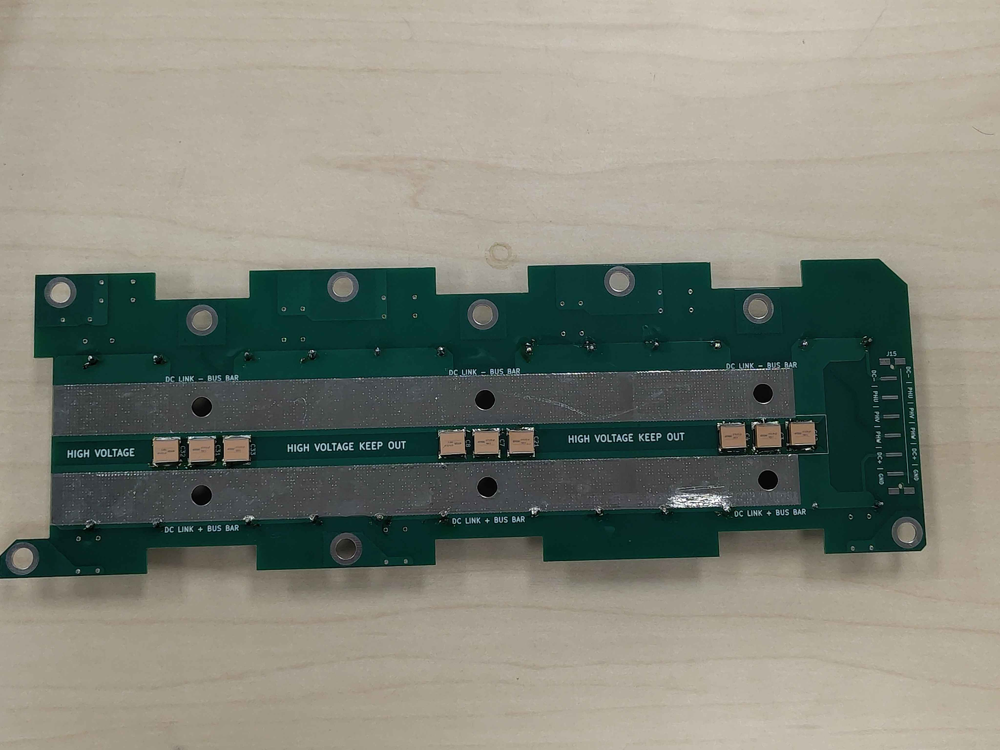

## Step 3 - Solder the film capacitors

Install the film capacitors on the top side. Take care to keep the solder joints neat and to avoid excess solder on the underside of the board — the bottom of the board has flat bus-bar contact patches that must remain smooth. Any raised solder bumps or flux residue in these areas will reduce contact pressure and degrade electrical/thermal performance when the board is clamped into the module.

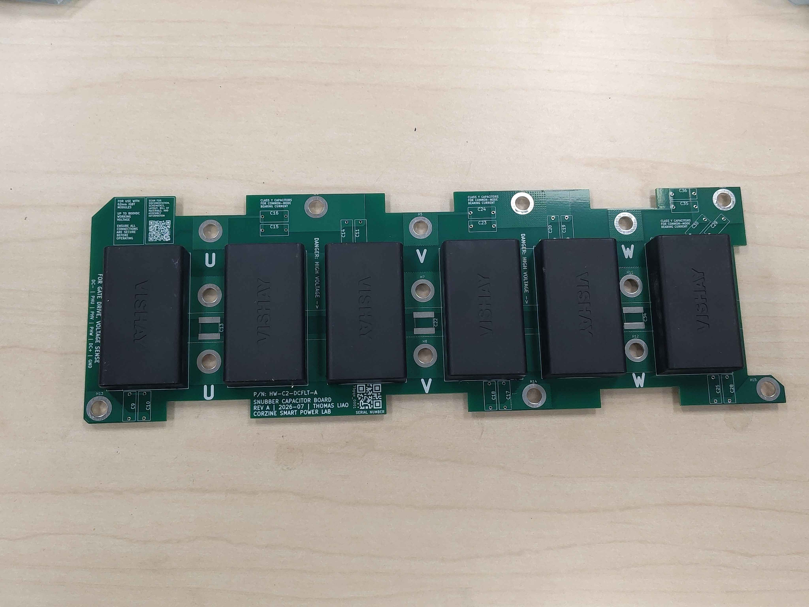

## Step 4 - Install the Class-Y capacitors

Class-Y capacitors are usually supplied with straight leads. Spread the leads slightly wider than the PCB hole spacing, insert all of the capacitors on the top side, then flip the board and solder them from the bottom. Spreading the legs makes it much faster to load all of the parts at once rather than bending and inserting each one individually.

After soldering, trim each lead to leave roughly 1–2 mm of leg protruding from the solder joint. This leaves ample solder contact area while keeping the lead short enough to avoid shorts. Immediately reflow the solder for a moment to heal any micro-fractures caused by the mechanical shock of cutting. Do not trim the leads before soldering — it is too easy to cut them too short.

> **Tip:** Reflow one leg at a time so the capacitor body stays seated and does not fall out when the joint is reheated.

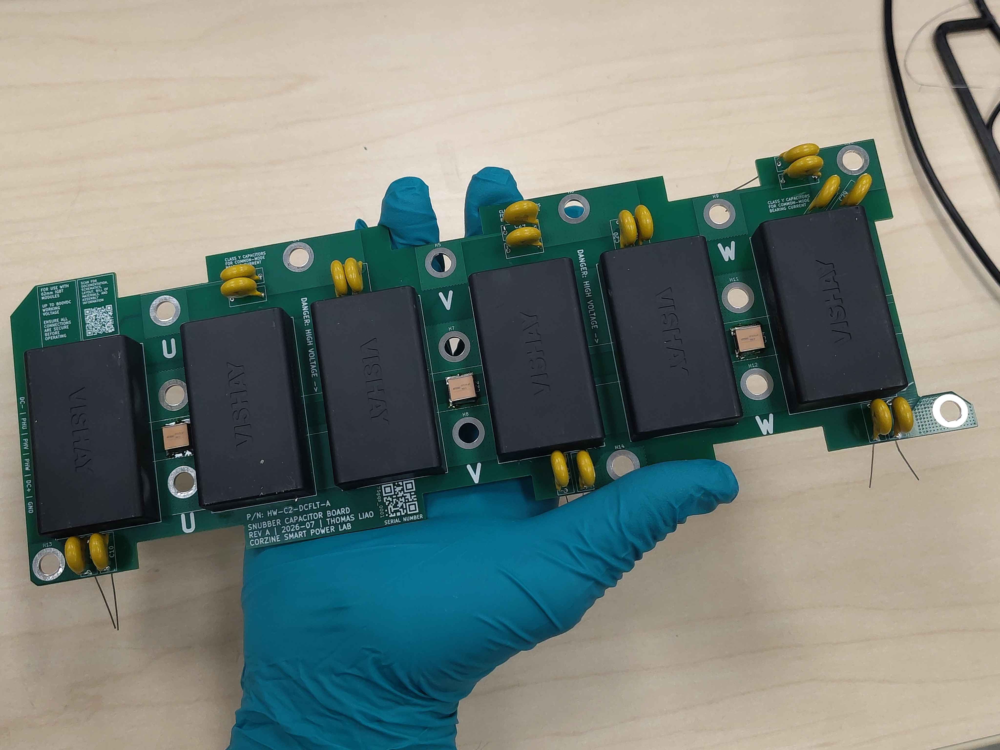

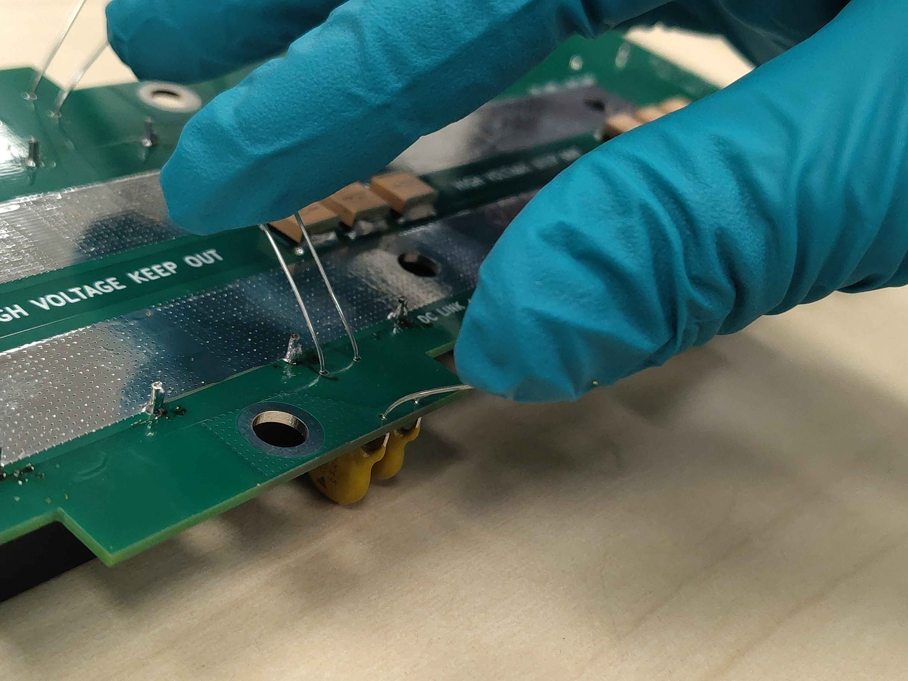

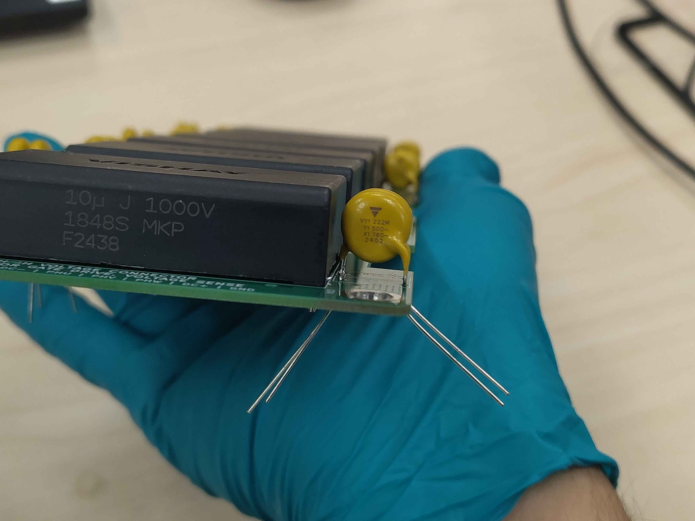

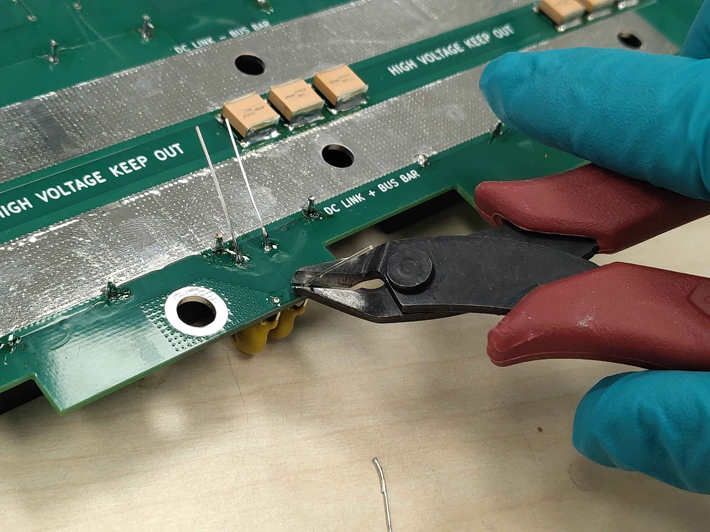

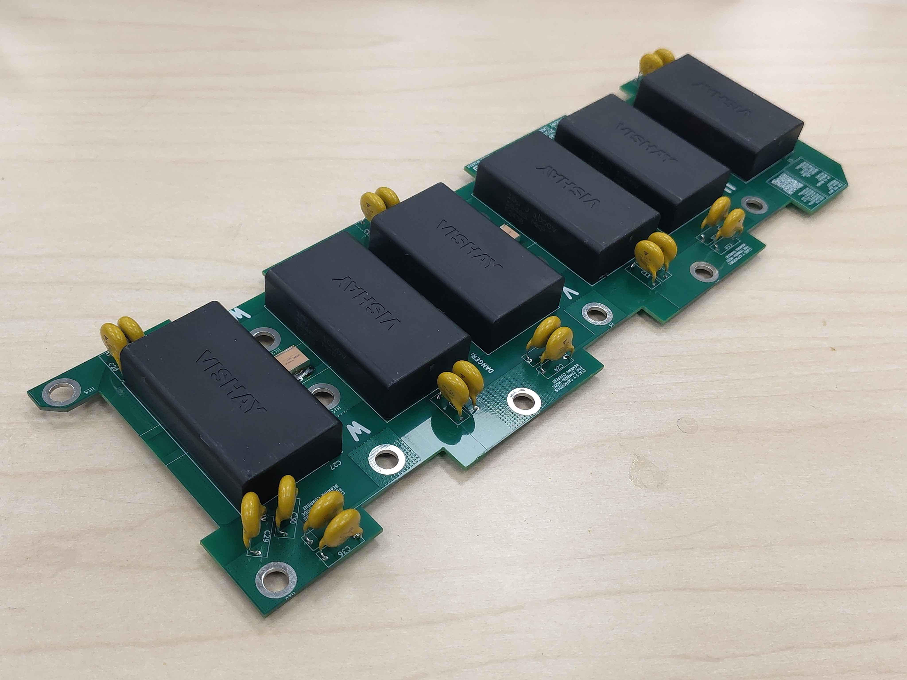

## Step 5 - Solder the connector

Solder the PCB connector last. Make sure it is fully seated against the board before soldering all pins; a tilted connector will make final harness mating difficult.

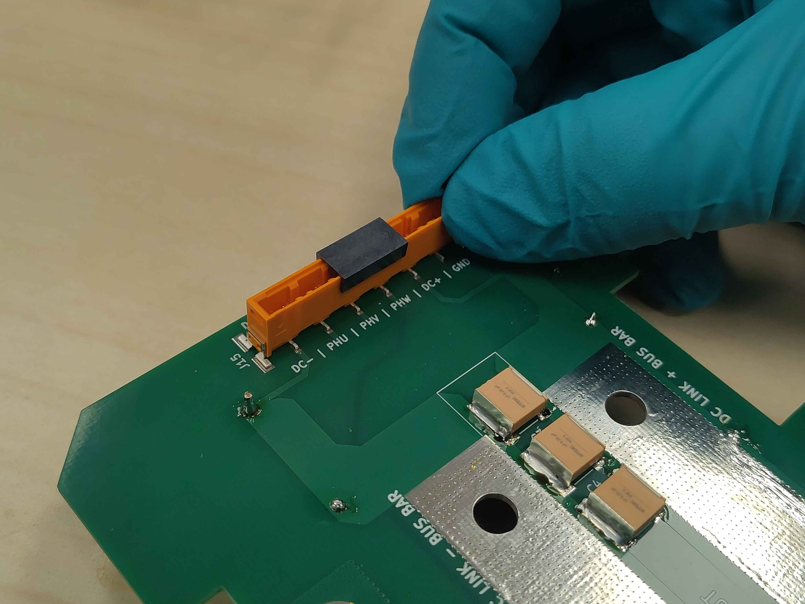

## Step 6 - Clean flux residue

Clean the board thoroughly with isopropyl alcohol and lint-free wipes, paying special attention to the bottom-side bus-bar contact patches. Any flux residue left on these pads can reduce contact pressure and degrade electrical/thermal performance when the board is clamped into the module. Check the pads visually and by touch — they should be flat and clean.

## Final assembly

The completed board should have:

- All ceramic capacitors soldered on both top and bottom sides.
- Film capacitors installed with no excess solder on the bottom bus-bar contact patches.
- Class-Y capacitors formed, soldered, trimmed flush, and reflowed after trimming.
- The connector fully seated and soldered.
- All flux residue cleaned from the board, especially the bottom bus-bar contact pads.

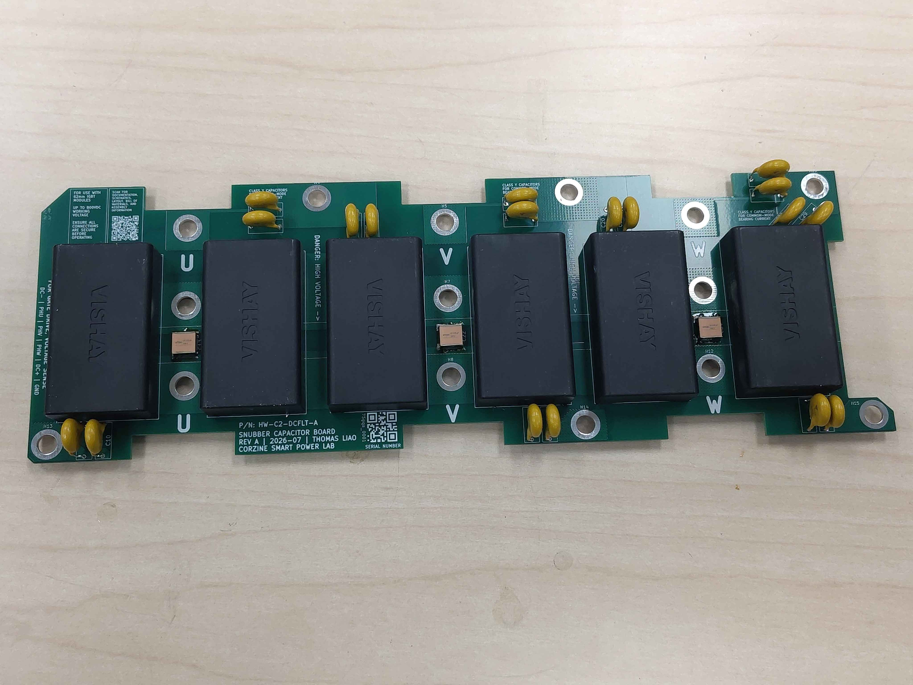

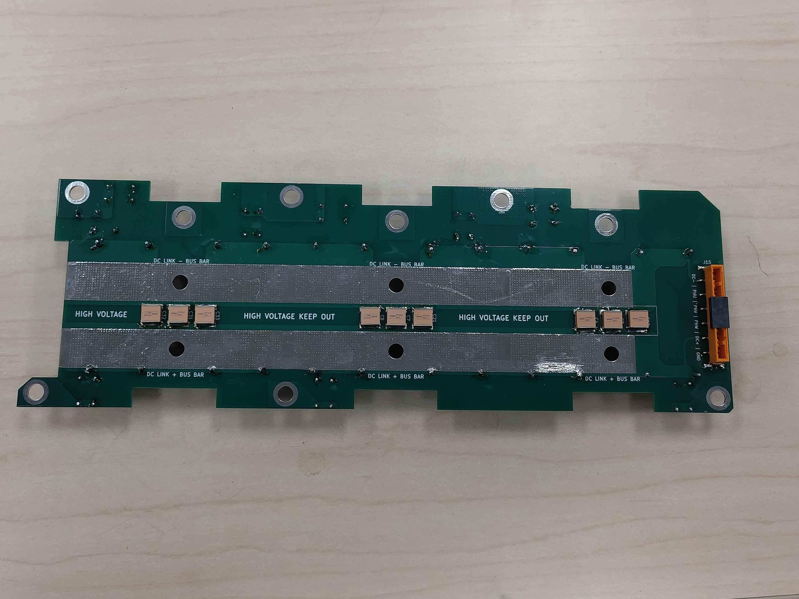

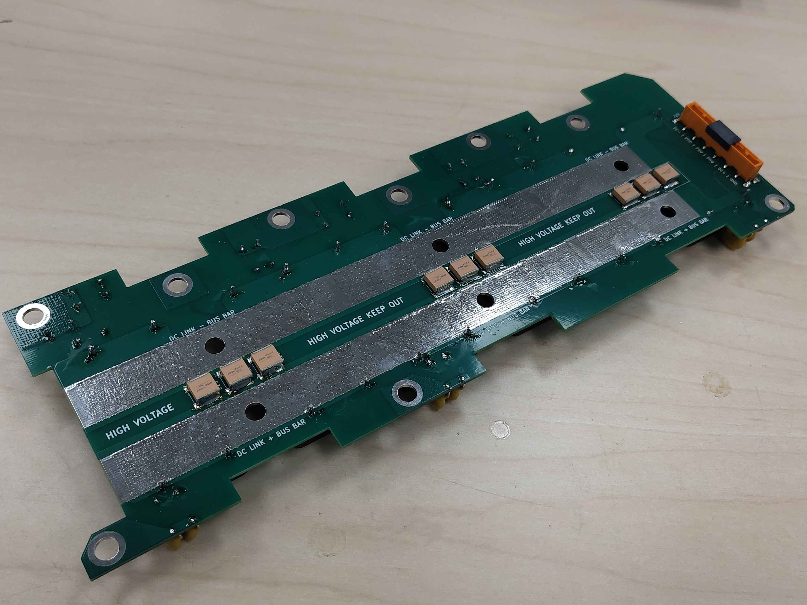

## Next steps

Continue with the remaining Chassis Size 2 assembly steps in the assembly guide index (`OV-C2-AG-INDEX`).
