# IGBT Temperature Sensor Mounting

This guide covers mounting the ring-lug temperature sensors onto the Chassis Size 2 aluminium heatspreader/baseplate. Each sensor is clamped under a screw so the lug is in direct thermal contact with the baseplate, to the right of the IGBT module it monitors when the module's gate terminals face toward you.

> **Safety**
> - Do not power the inverter until all assembly, torque, and inspection steps are complete.
> - Keep the work area clean; stray metal debris or excess thermal paste can contaminate gate-drive terminals or high-voltage bus bars.

## Required materials and tools

| Item | Qty | Notes |
|------|-----|-------|
| IGBT temperature sensor with ring lug | 1 | Per sensor location |
| Mounting screw and washer | 1 | Per sensor, sized for the heatspreader mounting hole |
| Thermal interface compound | as needed | Thin, even coverage between lug and baseplate |
| Thread-locking compound (medium strength) | as needed | Applied to screw threads |
| Torque wrench | 1 | Capable of 8 N·m |
| Hex key or driver | 1 | Sized for the mounting screw head |
| Permanent marker | 1 | For torque-strip marks |

> **Errata:** The photos in this guide were taken without thread-locking compound and without a torque wrench on hand. Apply thread-locking compound and torque the screws as specified below even though the photos do not show these steps.

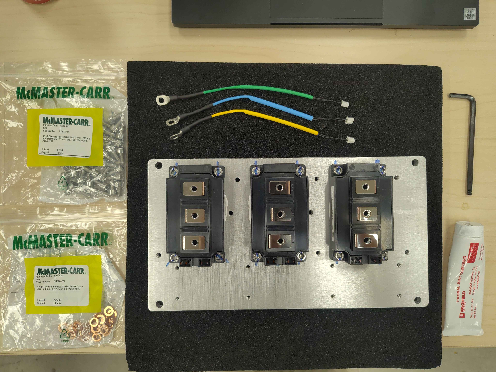

## Step 1 - Identify the mounting location

Each temperature sensor mounts on the heatspreader to the right of its corresponding IGBT module, with the module's gate terminals facing toward you. Confirm which sensor belongs to which phase (U, V, W) before applying paste, so the harness routing matches the later wiring steps.

> **Tip:** It can be helpful to have the CAD model open during assembly so you can confirm the exact sensor location for each phase.
>
> 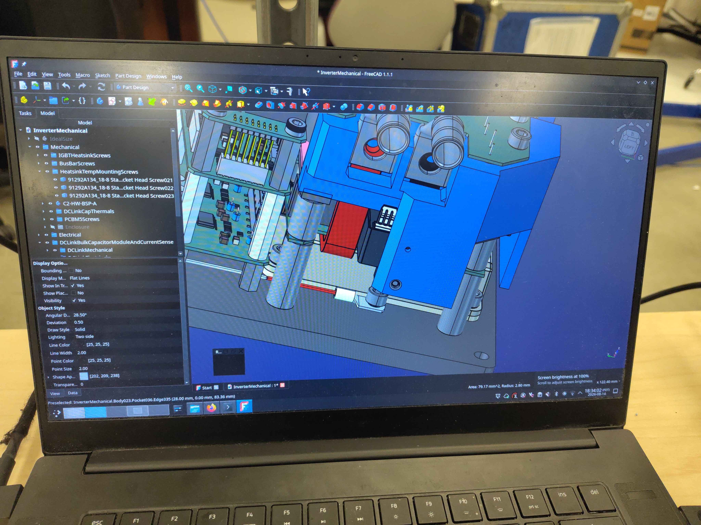

## Step 2 - Prepare the screw and washer

Apply thread-locking compound to the threads of the mounting screw. Place the washer on the screw under the head so it will sit between the screw head and the sensor lug when tightened.

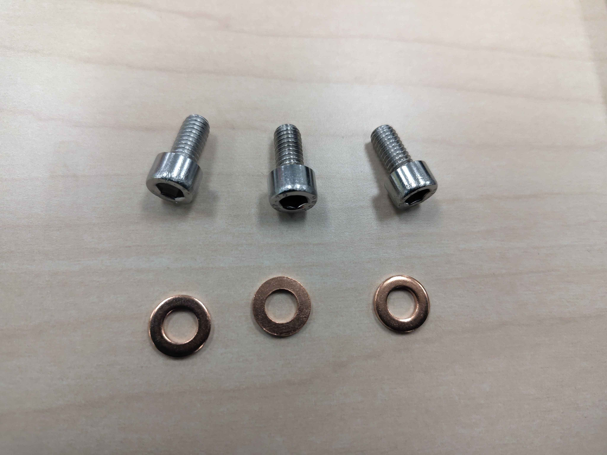

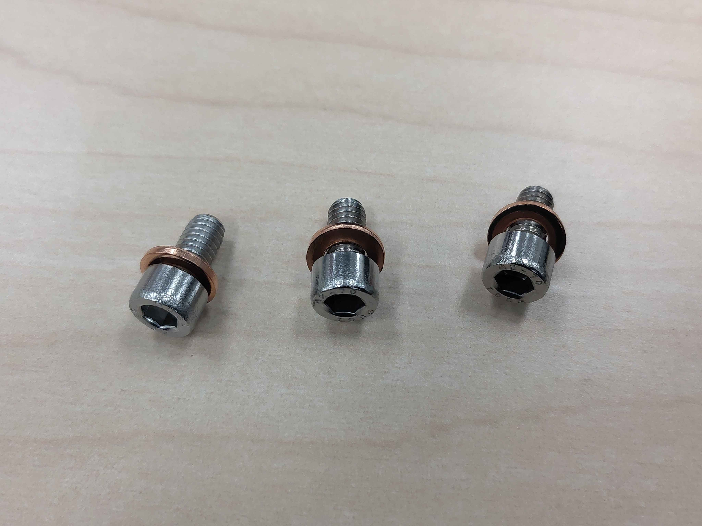

## Step 3 - Apply thermal interface compound

Apply a thin, even layer of thermal interface compound to the flat underside of the ring lug. The goal is full coverage with no bare metal showing and only a small amount of excess paste visible when compressed.

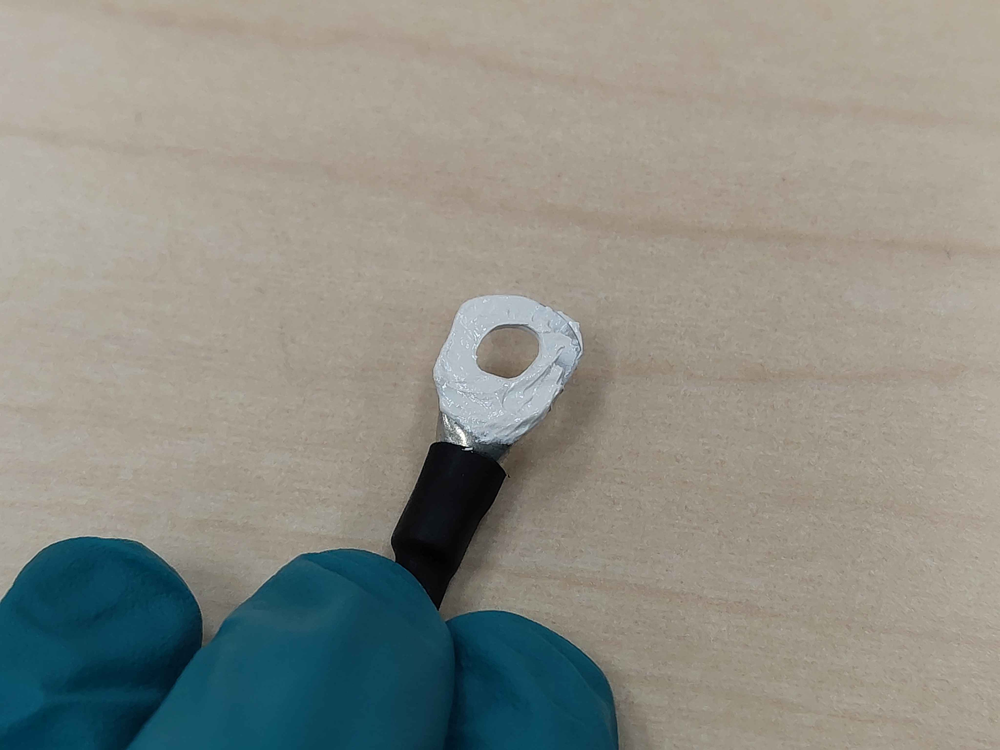

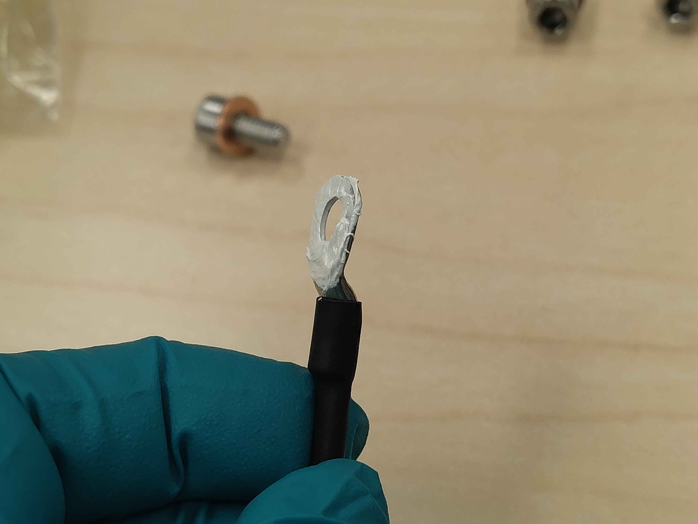

## Step 4 - Place the sensor on the baseplate

Align the ring lug with the mounting hole in the heatspreader and lower it into place. Keep the sensor lead oriented so it can route cleanly toward the control-board area without tension or sharp bends.

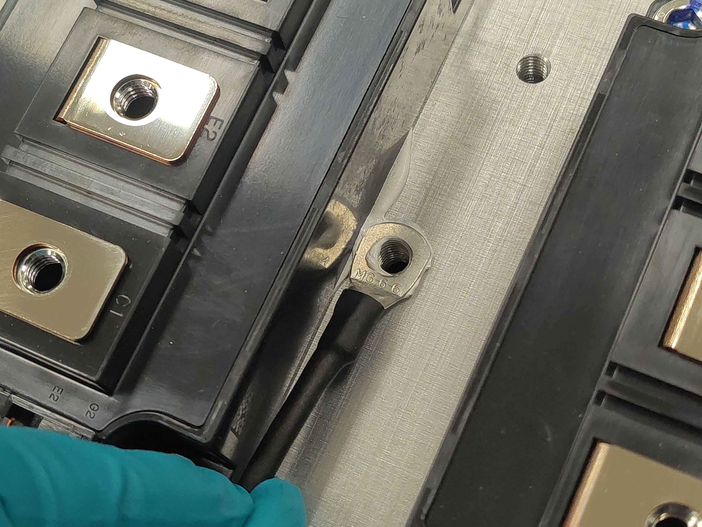

## Step 5 - Install and tighten the screw

Insert the prepared screw through the washer and ring lug and into the heatspreader. Tighten it to **8 N·m**. Wait approximately **2 minutes** to allow the thermal interface compound to settle and squeeze out, then retighten to **8 N·m** again. Some clamp force loss is normal as the paste compresses; the retighten step restores it.

> **Tip:** Tighten the screw before the thermal paste has time to skin over. If you wait too long, the paste will not compress evenly and thermal contact will be poor.

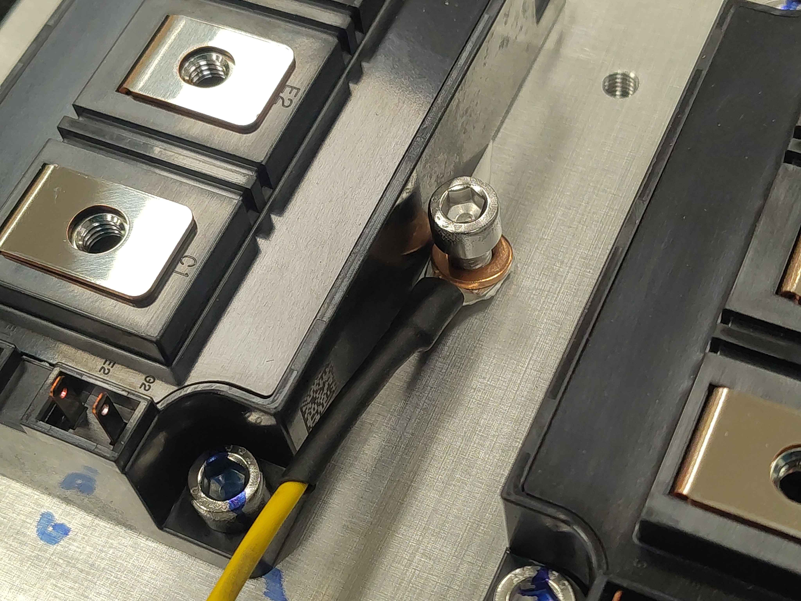

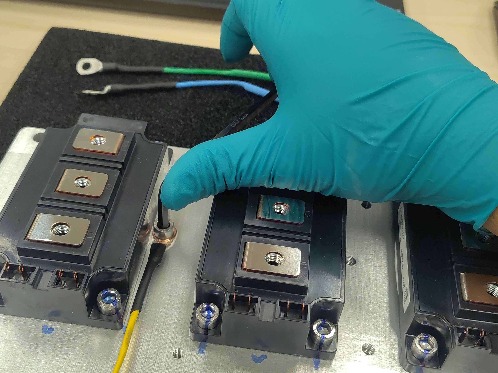

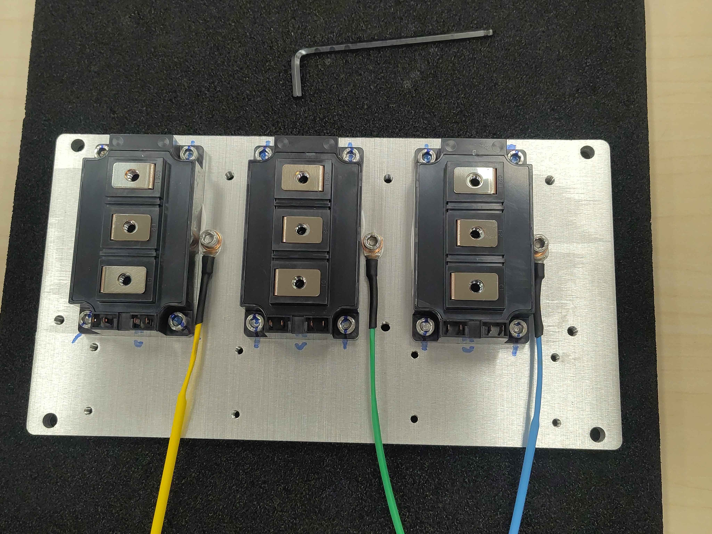

## Step 6 - Mark the screw

Use the permanent marker to draw a straight line from the screw head onto the baseplate. This torque-strip mark makes it easy to spot loosening during later inspection or vibration testing.

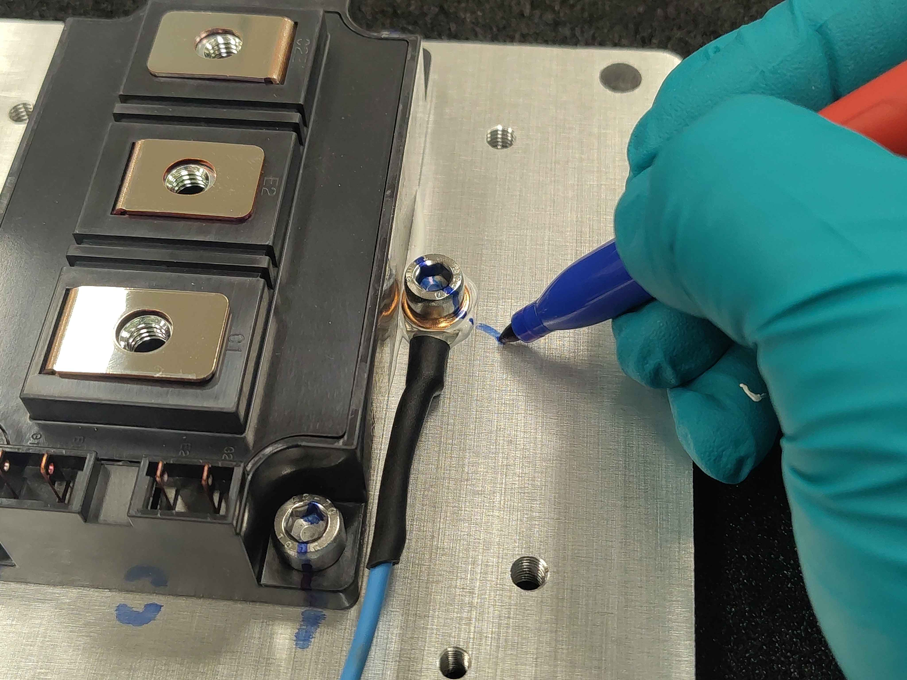

## Final assembly

The completed assembly should have:

- All temperature sensors mounted in their correct phase locations.
- Each screw torqued to 8 N·m and retorqued after the thermal paste settling period.
- A torque-strip mark on each screw.

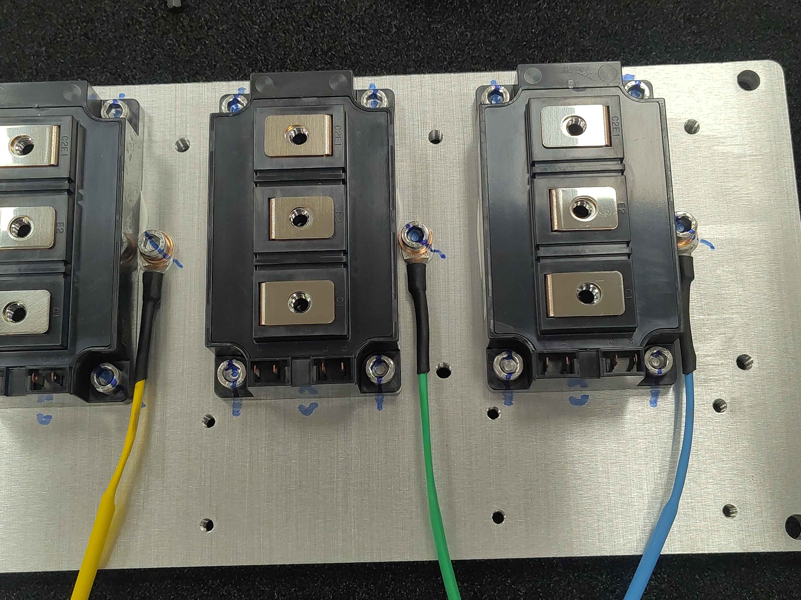

## Next steps

Continue with the remaining Chassis Size 2 assembly steps in the assembly guide index (`OV-C2-AG-INDEX`).
