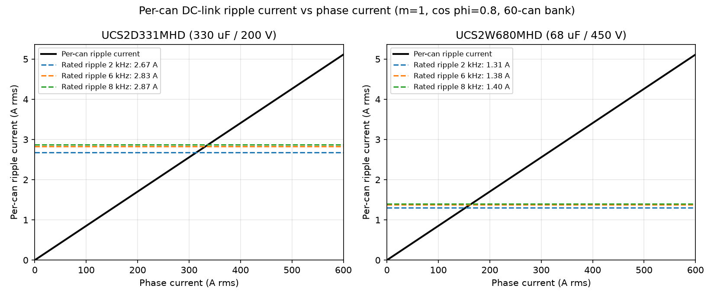
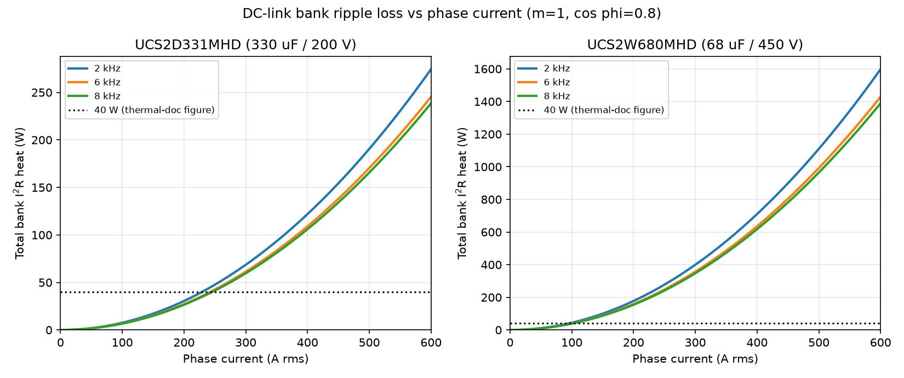
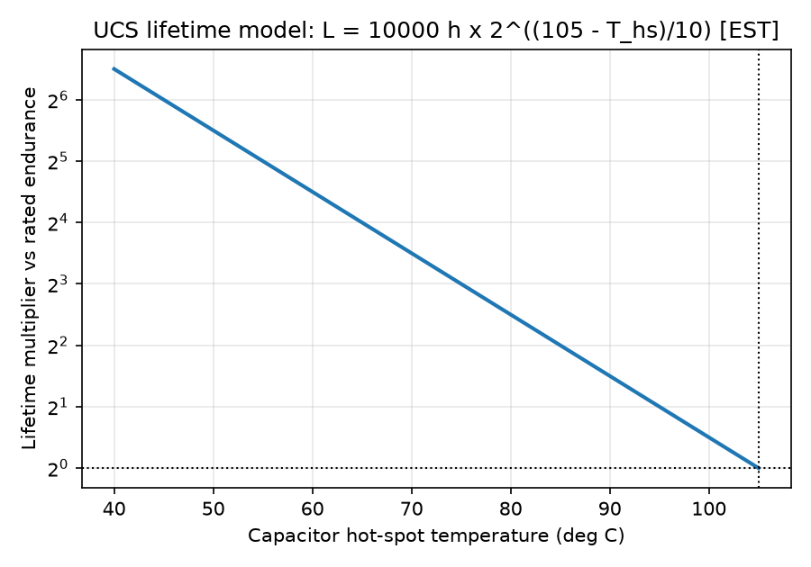

# DC Link Capacitor Ripple Current and Thermal Load

This document derives the RMS ripple current in the C2 DC-link capacitor bank from first principles (closed-form 2-level inverter result), computes the per-can ripple current and $I^2 \cdot ESR$ heating for the two capacitor bank variants across the operating envelope of `OV-C2-DD-THERMAL` v1.1, and checks the result against the Nichicon UCS datasheet ripple ratings. It closes the open item raised in `OV-C2-DD-DCLINK-THERMAL` v1.1 on the origin of the 40 W heat-load figure.

**Value marking convention used throughout:**

- **[DS]** - value taken directly from the Nichicon UCS series catalog (CAT.8100N, `e-ucs.pdf`, <https://www.nichicon.co.jp/english/series_items/catalog_pdf/e-ucs.pdf>); table cited.
- **[EST]** - engineering estimate derived from datasheet data or standard scaling laws; not explicitly guaranteed by the datasheet.
- **[ASM]** - modeling assumption about the operating point or a parameter not available from the datasheet.

All numbers in this document are reproduced by `plots.py` in this folder (run with the repo venv: `.venv/bin/python plots.py`), which also generates the three figures below.

## System inputs

From `OV-C2-DD-THERMAL` v1.1 and `OV-C2-DD-DCLINK-THERMAL` v1.1:

| Input | Value | Mark |
|---|---|---|
| DC-link voltage $V_{DC}$ | 102 - 320 V (140 V / 320 V operating points; 400 V class covered by the 450 V variant) | [ASM] |
| Phase current $I_{phase,rms}$ | up to 600 A RMS | [ASM] |
| Modulation index $m$ | 1.0 ($V_{ph,pk} = m \cdot V_{DC}/2$) | [ASM] |
| Load power factor $\cos \varphi$ | 0.8 | [ASM] |
| PWM switching frequency $f_{sw}$ | 2 kHz (reference), 6 kHz (max continuous), 8 kHz (upper bound) | [ASM] |
| Bank A (200 V) | 60x Nichicon UCS2D331MHD, 330 µF / 200 V each, 19.8 mF total, all parallel | [DS] part |
| Bank B (450 V upgrade) | 60x Nichicon UCS2W680MHD, 68 µF / 450 V each, 4.08 mF total, all parallel | [DS] part |

## Ripple current derivation

For a 2-level three-phase voltage-source inverter with sinusoidal output current $i(\theta) = \hat{I}\sin\theta$, duty cycle $d(\theta) = \tfrac{1}{2}(1 + m\sin(\theta - \varphi))$, and center-aligned (SVPWM-equivalent) PWM, the DC-link capacitor supplies the AC component of the switched bridge input current. Integrating the squared ripple component over one fundamental period gives the canonical closed-form RMS current stress on the DC-link capacitor (phase-current-referred):

$$I_{cap,rms} = I_{phase,rms} \cdot \sqrt{2m\left[\frac{\sqrt{3}}{4\pi} + \cos^2\varphi\left(\frac{\sqrt{3}}{\pi} - \frac{9m}{16}\right)\right]}$$

Reference: J. W. Kolar and S. D. Round, "Analytical calculation of the RMS current stress on the DC-link capacitor of voltage-PWM converter systems," *IEE Proceedings - Electric Power Applications*, vol. 153, no. 4, pp. 535-543, July 2006 (doi: 10.1049/ip-epa:20050458). This is the standard textbook result (also in Kolar's ETH power-electronics lecture notes); it is treated here with the same standing as a [DS] citation.

At the C2 rated operating point ($m = 1.0$, $\cos\varphi = 0.8$):

$$\frac{I_{cap,rms}}{I_{phase,rms}} = \sqrt{2\left[\frac{\sqrt{3}}{4\pi} + 0.64\left(\frac{\sqrt{3}}{\pi} - \frac{9}{16}\right)\right]} = \sqrt{0.2614} = 0.511$$

So the bank carries **0.511 A RMS of ripple per amp of phase current**, essentially independent of switching frequency and bus voltage (see caveats). At 600 A RMS the bank ripple is **307 A RMS**, split evenly across 60 identical parallel cans:

$$I_{can,rms} = \frac{0.511 \cdot I_{phase,rms}}{60}$$

### What this ignores (honest caveats)

- **Source impedance share.** The formula assumes a stiff DC source that delivers only the DC component. A real battery pack or rectifier has finite impedance and absorbs part of the switching-frequency ripple; the capacitor bank then sees less than the formula predicts. The split depends on source impedance vs bank impedance at each harmonic and is unmeasured here. The formula is conservative (upper bound on the capacitor share). [ASM]
- **Switching-frequency independence.** The RMS value is set by the switched-current waveform duty, not by $f_{sw}$; to first order $I_{cap,rms}$ does not change between 2 and 8 kHz. Frequency enters the *heating* and the *rating* through the ESR/impedance vs frequency behavior, handled below.
- **Modulation-index dependence.** At fixed bus voltage and reduced output voltage ($m < 1$) the ripple factor per amp of phase current is *higher* (the $-9m/16$ term shrinks): at $m = 0.5$, $\cos\varphi = 0.8$ the factor is 0.557. The envelope here is evaluated at the worst-case rated point $m = 1.0$ per `OV-C2-DD-THERMAL`; a constant-volts-per-hertz traction drive at partial speed sees similar or slightly higher ripple per amp.
- **Dead time and device non-idealities** shift the ripple by a few percent and are neglected.
- **Third-harmonic injection / discontinuous PWM.** The Kolar & Round result is for continuous center-aligned modulation. DPWM schemes reduce the capacitor RMS current by roughly 10 - 20 % at high $m$; SPWM without third-harmonic injection increases it slightly at $m > 0.9$. SVPWM is assumed per the firmware design. [EST]

## Capacitor datasheet data

From the Nichicon UCS catalog (CAT.8100N, `e-ucs.pdf`, official Nichicon URL above):

| Parameter | UCS2D331MHD (Bank A) | UCS2W680MHD (Bank B) | Mark |
|---|---|---|---|
| Rated capacitance / voltage | 330 µF / 200 V | 68 µF / 450 V | [DS] |
| Case size | 18 x 35.5 mm | 18 x 30.5 mm | [DS] |
| Rated ripple current, 105 °C / 100 kHz | **3.22 A rms** | **1.575 A rms** | [DS] |
| tan δ (max, 120 Hz, 20 °C) | 0.20 | 0.24 | [DS] |
| Endurance | 10000 h at 105 °C with rated ripple | 10000 h at 105 °C with rated ripple | [DS] |
| Impedance ratio $Z(-25°C)/Z(20°C)$ / $Z(-40°C)/Z(20°C)$ | 3 / 6 | 6 / - | [DS] |
| Frequency coefficient of rated ripple | 50 Hz 0.40 / 120 Hz 0.50 / 1 kHz 0.80 / 10 kHz 0.90 / >=100 kHz 1.00 | same | [DS] |

The catalog does **not** publish an ESR/impedance-vs-frequency curve or a temperature coefficient of rated ripple for UCS. The ripple-rating check below is therefore done at the 105 °C rating (conservative for cans running cooler), and the ESR model in the next section carries an explicit [ASM].

## ESR model

Anchor and frequency shaping, per capacitor:

1. **120 Hz ceiling from tan δ** (directly derivable from [DS]): $ESR_{120Hz,max} = \tan\delta / (2\pi \cdot 120 \cdot C)$, giving 0.80 Ω (Bank A) and 4.68 Ω (Bank B). These are *maxima*; typical parts are well below.
2. **100 kHz ESR**: $ESR_{100k} = 0.15 \times ESR_{120Hz,max}$ - 0.121 Ω (Bank A), 0.703 Ω (Bank B). **[ASM]** - the 0.15 ratio is a typical high-frequency/120 Hz ESR ratio for low-impedance radial electrolytics of this construction; the UCS catalog gives no high-frequency impedance, so this is the single softest number in this document. *Replace with measured ESR at 10 - 100 kHz (LCR meter or impedance analyzer) on a sample can when available; all loss and temperature numbers scale linearly with it.*
3. **Frequency shaping** using the datasheet's own frequency coefficient $k(f)$: since the rated ripple scales as $k(f)$ at constant allowable heating, $I_{rated}(f)^2 \cdot ESR(f) = \text{const}$, hence $ESR(f) = ESR_{100k} / k(f)^2$. Log-linear interpolation of $k(f)$ between the 1 kHz and 10 kHz anchors gives $k = 0.830 / 0.878 / 0.890$ at 2 / 6 / 8 kHz. [EST]

Self-consistency check: the model predicts $ESR_{120Hz} = ESR_{100k}/0.5^2 = 4 \times ESR_{100k}$ = 0.48 Ω (Bank A) and 2.81 Ω (Bank B), both below the tan δ maxima of 0.80 / 4.68 Ω, i.e. the [ASM] ratio is consistent with the datasheet ceiling with typical margin. [EST]

Per-can and bank heating:

$$P_{can} = I_{can,rms}^2 \cdot ESR(f_{sw}) \qquad P_{bank} = 60 \cdot P_{can}$$

## Results

Per-can ripple current is the same for both banks (same 60-way split of the same 0.511 A/A bank ripple). The ripple spectrum sits at the switching frequency and its sidebands, so each $f_{sw}$ row uses the corresponding $k(f)$ and $ESR(f)$.

| $I_{phase}$ (A rms) | $f_{sw}$ | $I_{can}$ (A rms) | Bank A rated ripple (A) | Bank A x rating | Bank A $P_{bank}$ (W) | Bank B rated ripple (A) | Bank B x rating | Bank B $P_{bank}$ (W) |
|---|---|---|---|---|---|---|---|---|
| 100 | 2 kHz | 0.85 | 2.67 | 0.32 | 7.6 | 1.31 | 0.65 | 44 |
| 100 | 6 kHz | 0.85 | 2.83 | 0.30 | 6.8 | 1.38 | 0.62 | 40 |
| 100 | 8 kHz | 0.85 | 2.87 | 0.30 | 6.6 | 1.40 | 0.61 | 39 |
| 200 | 2 kHz | 1.70 | 2.67 | 0.64 | 30 | 1.31 | 1.30 | 178 |
| 200 | 6 kHz | 1.70 | 2.83 | 0.60 | 27 | 1.38 | 1.23 | 159 |
| 200 | 8 kHz | 1.70 | 2.87 | 0.59 | 26 | 1.40 | 1.22 | 154 |
| 300 | 2 kHz | 2.56 | 2.67 | 0.96 | 69 | 1.31 | 1.96 | 400 |
| 300 | 6 kHz | 2.56 | 2.83 | 0.90 | 61 | 1.38 | 1.85 | 357 |
| 300 | 8 kHz | 2.56 | 2.87 | 0.89 | 60 | 1.40 | 1.82 | 347 |
| 400 | 2 kHz | 3.41 | 2.67 | 1.28 | 122 | 1.31 | 2.61 | 710 |
| 400 | 6 kHz | 3.41 | 2.83 | 1.21 | 109 | 1.38 | 2.47 | 635 |
| 400 | 8 kHz | 3.41 | 2.87 | 1.19 | 106 | 1.40 | 2.43 | 617 |
| 500 | 2 kHz | 4.26 | 2.67 | 1.59 | 191 | 1.31 | 3.26 | 1110 |
| 500 | 6 kHz | 4.26 | 2.83 | 1.51 | 170 | 1.38 | 3.08 | 992 |
| 500 | 8 kHz | 4.26 | 2.87 | 1.49 | 166 | 1.40 | 3.04 | 965 |
| 600 | 2 kHz | 5.11 | 2.67 | **1.91** | **274** | 1.31 | **3.91** | **1598** |
| 600 | 6 kHz | 5.11 | 2.83 | **1.81** | **245** | 1.38 | **3.70** | **1429** |
| 600 | 8 kHz | 5.11 | 2.87 | **1.78** | **239** | 1.40 | **3.65** | **1389** |

Bus voltage (140 / 320 / 400 V class) does not appear in the table because at the rated point $m = 1.0$ the ripple current is voltage-independent; only the capacitor *variant* (voltage class) and the switching frequency (through $k(f)$) matter.

## Ripple-rating check

**Bank A (200 V, 19.8 mF) is ripple-limited above approximately 320 A RMS phase current.** The per-can ripple crosses the frequency-corrected datasheet rating at:

- 314 A RMS phase current at 2 kHz
- 332 A RMS at 6 kHz
- 336 A RMS at 8 kHz

At the 600 A RMS design point the per-can ripple is 5.11 A against a rated 2.67 - 2.87 A, i.e. **1.8 - 1.9x the datasheet rating** at all three switching frequencies. A prior review estimated ~3x at 600 A / 2 kHz; the derived value is lower (1.91x) mainly because the review did not credit the datasheet frequency coefficient. The conclusion stands: **continuous 600 A RMS exceeds the capacitor ripple rating of the 200 V bank.** At 300 A the bank is at 0.89 - 0.96x rating, just inside the envelope. Note the check is performed at the 105 °C rating; cans running cooler have additional thermal headroom that Nichicon does not quantify for UCS (no temperature coefficient published), so no credit is taken for it. [EST]

**Bank B (450 V, 4.08 mF) is not ripple-viable at traction currents.** The 68 µF / 450 V can is rated 1.575 A at 100 kHz (1.31 - 1.40 A at 2 - 8 kHz); the same 60-way split puts 1.3x rating on it already at 200 A phase current, 2.6x at 400 A, and 3.7 - 3.9x at 600 A, with computed bank losses of 1.4 - 1.6 kW at 600 A. The 450 V single-part-number swap described in `OV-C2-DD-DCLINK-THERMAL` fixes the voltage rating but not the ripple rating; a 400 V-class bus at high current needs a different capacitor selection (more cans, larger cans, or film capacitors). [EST]

## Comparison with the 40 W figure in the thermal documents

For Bank A, the 40 W load used throughout `OV-C2-DD-DCLINK-THERMAL` and `OV-C2-DD-THERMAL` corresponds to a phase current of approximately **230 - 250 A RMS** (229 / 242 / 246 A at 2 / 6 / 8 kHz). Verdict:

- **Below ~240 A: about right.** The 40 W figure is a fair "rated ripple" order of magnitude for part-load operation (the full bank at its 100 kHz ripple rating would dissipate ~75 W with this ESR model, so 40 W is even slightly conservative there).
- **At 400 A: optimistic by ~3x** (106 - 122 W).
- **At 600 A: optimistic by ~6 - 7x** (239 - 274 W computed vs 40 W used).

Because the plate $\Delta T$ values in `OV-C2-DD-DCLINK-THERMAL` scale linearly with heat load, the +40.1 K paste-path rise becomes approximately +96 K at 600 A / 6 kHz if all ripple heat flowed through the standoff path - which reinforces that document's conclusion that the DC-link plate is the binding thermal constraint at 600 A, and strengthens the case for the dyno plate-thermocouple validation (thermal test plan T-05). [EST]

## Interpretation: can hot-spot vs plate temperature

Two things temper the alarming plate numbers, and both are consistent with the designer's field experience that the cans run much cooler than the conduction-only model predicts:

1. **The ripple loss is generated in the capacitor winding (hot-spot), not in the plate.** The can rejects heat over its whole cylindrical surface by convection and radiation to the chassis air volume; only part of it conducts through the terminals/board and the mounting interface into the spreader plate and standoffs. The `OV-C2-DD-DCLINK-THERMAL` model routes 100 % of the bank loss through the standoff path and neglects convection/radiation entirely, so it overestimates the plate rise and underestimates nothing on the can side. The +40.1 K (or scaled) plate rise should be read as an upper bound. [EST]
2. **The ripple-rating limit applies to the can hot-spot temperature** (105 °C category temperature, endurance 10000 h at rated ripple). The correct check at high current is therefore two-part: (a) per-can ripple vs rating, which fails above ~320 A regardless of cooling, and (b) can hot-spot temperature vs 105 °C, which depends on the real can-to-air and can-to-plate thermal resistances and must be measured (capacitor NTC correlation on the dyno, per the open [ASM] in `OV-C2-DD-DCLINK-THERMAL`).

The lifetime model below uses the industry-standard Arrhenius 10 K doubling rule on the 10000 h / 105 °C UCS endurance figure: $L = 10000 \cdot 2^{(105 - T_{hs})/10}$ hours. Nichicon does not publish a lifetime equation for UCS, so this is [EST]; it is the standard model for aluminum electrolytics and should be used for relative comparisons only.

## Assumptions and limitations

- Ripple current formula: Kolar & Round closed form, stiff DC source, continuous center-aligned SVPWM, sinusoidal current; see the caveat list in the derivation section.
- Equal current sharing between 60 parallel cans (matched parts, symmetric layout). Layout asymmetry raises the ripple on the best-coupled cans above the average. [ASM]
- $ESR_{100k} = 0.15 \times ESR_{120Hz,max}$ is the dominant uncertainty (±50 % would not be surprising); **replace with measured ESR at the switching frequency** and re-run `plots.py`. Loss and lifetime numbers scale linearly with it; the ripple-*current* numbers and the x-rating factors do not depend on it.
- Ripple is assumed concentrated at $f_{sw}$ sidebands for the frequency-coefficient lookup; spreading the spectrum (e.g. interleaving) moves effective ESR down modestly. [EST]
- Temperature coefficient of rated ripple is not published for UCS; all rating checks use the 105 °C rating with no credit for cooler operation.
- The 0.511 ripple factor at $m = 1.0$, $\cos\varphi = 0.8$ rises to ~0.557 at $m = 0.5$; a constant-V/Hz partial-speed point at the same phase current is slightly worse than tabulated.

## Open items

1. Measure ESR vs frequency (10 Hz - 100 kHz) on sample UCS2D331MHD and UCS2W680MHD cans; replace the [ASM] 0.15 ratio. 
2. Measure the source-impedance share of switching ripple on the battery/dyno setup to quantify how conservative the stiff-source formula is.
3. Dyno: correlate capacitor NTC reading with can case and plate temperature at the 300 A and 600 A operating points (thermal test plan T-05); use it to calibrate the can hot-spot estimate.
4. Decide the ripple-limited operating envelope: per this analysis Bank A supports ~320 A RMS continuous at full ripple rating; 600 A RMS requires either source-ripple sharing measured in item 2 to be large, a capacitor bank change, or acceptance of reduced capacitor life at elevated hot-spot temperature.
5. Bank B (450 V): re-select capacitors for the 400 V-class bus; the UCS2W680MHD swap is not ripple-viable above ~150 A RMS phase current.

## Revision History

| Version | Date | Changes |
|---------|------|---------|
| 0.1 | 2026-08-20 | Initial release. Derives the DC-link ripple current (Kolar & Round closed form, factor 0.511 at $m=1$, $\cos\varphi=0.8$), computes per-can ripple and $I^2 \cdot ESR$ heating for the 60x UCS2D331MHD (200 V) and 60x UCS2W680MHD (450 V) banks against the Nichicon UCS catalog (CAT.8100N) ratings, and closes the 40 W open item from `OV-C2-DD-DCLINK-THERMAL` v1.1: 40 W matches ~240 A operation; computed bank loss at 600 A is 239 - 274 W (Bank A). Bank A is ripple-limited above ~320 A RMS; Bank B is not ripple-viable at traction currents. |

---

*Prepared for DC-link capacitor bank design review. All figures reproducible with `plots.py` in this folder.*
