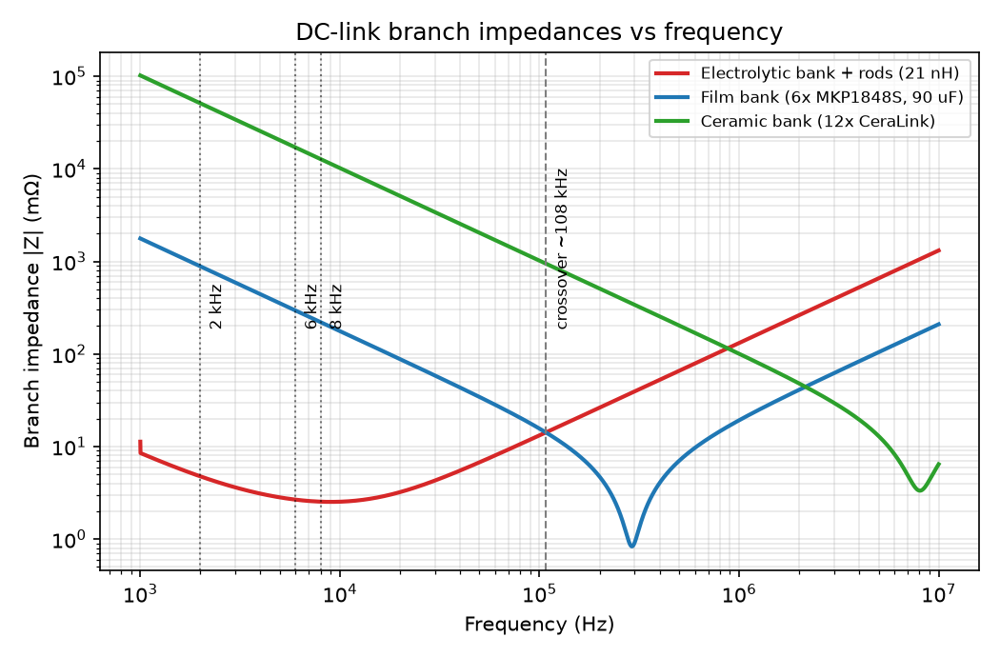
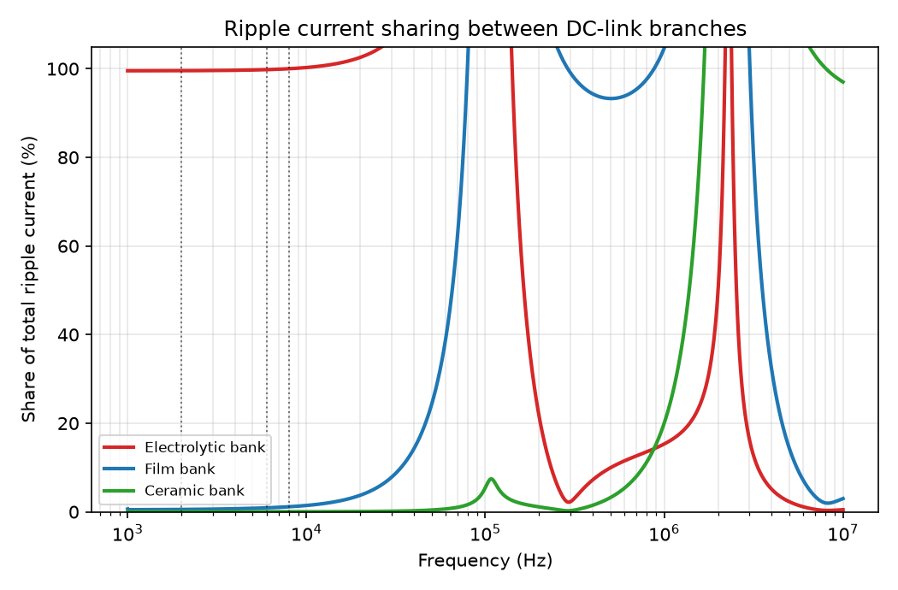
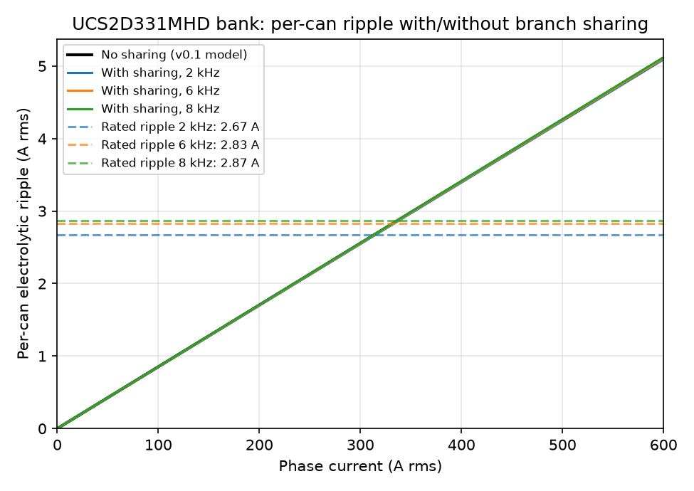

# DC Link Capacitor Ripple Current and Thermal Load

This document derives the RMS ripple current in the C2 DC-link capacitor bank from first principles (closed-form 2-level inverter result), computes the per-can ripple current and $I^2 \cdot ESR$ heating for the two capacitor bank variants across the operating envelope of `OV-C2-DD-THERMAL` v1.1, and checks the result against the Nichicon UCS datasheet ripple ratings. It closes the open item raised in `OV-C2-DD-DCLINK-THERMAL` v1.1 on the origin of the 40 W heat-load figure.

**Value marking convention used throughout:**

- **[DS]** - value taken directly from the Nichicon UCS series catalog (CAT.8100N, `e-ucs.pdf`, <https://www.nichicon.co.jp/english/series_items/catalog_pdf/e-ucs.pdf>); table cited.
- **[EST]** - engineering estimate derived from datasheet data or standard scaling laws; not explicitly guaranteed by the datasheet.
- **[ASM]** - modeling assumption about the operating point or a parameter not available from the datasheet.

All numbers in this document are reproduced by `plots.py` in this folder (run with the repo venv: `.venv/bin/python plots.py`), which also generates the three figures below.

## System inputs

From `OV-C2-DD-THERMAL` v1.1 and `OV-C2-DD-DCLINK-THERMAL` v1.1:

| Input | Value | Mark |
|---|---|---|
| DC-link voltage $V_{DC}$ | 102 - 320 V (140 V / 320 V operating points; 400 V class covered by the 450 V variant) | [ASM] |
| Phase current $I_{phase,rms}$ | up to 600 A RMS | [ASM] |
| Modulation index $m$ | 1.0 ($V_{ph,pk} = m \cdot V_{DC}/2$) | [ASM] |
| Load power factor $\cos \varphi$ | 0.8 | [ASM] |
| PWM switching frequency $f_{sw}$ | 2 kHz (reference), 6 kHz (clamped maximum per v1.2 designer decision), 8 kHz (reference only, outside the clamped envelope; adjacent to the ~7.8 kHz can-branch series resonance derived below) | [ASM] |
| Bank A (200 V) | 60x Nichicon UCS2D331MHD, 330 µF / 200 V each, 19.8 mF total, all parallel | [DS] part |
| Bank B (450 V upgrade) | 60x Nichicon UCS2W680MHD, 68 µF / 450 V each, 4.08 mF total, all parallel | [DS] part |

## Ripple current derivation

For a 2-level three-phase voltage-source inverter with sinusoidal output current $i(\theta) = \hat{I}\sin\theta$, duty cycle $d(\theta) = \tfrac{1}{2}(1 + m\sin(\theta - \varphi))$, and center-aligned (SVPWM-equivalent) PWM, the DC-link capacitor supplies the AC component of the switched bridge input current. Integrating the squared ripple component over one fundamental period gives the canonical closed-form RMS current stress on the DC-link capacitor (phase-current-referred):

$$I_{cap,rms} = I_{phase,rms} \cdot \sqrt{2m\left[\frac{\sqrt{3}}{4\pi} + \cos^2\varphi\left(\frac{\sqrt{3}}{\pi} - \frac{9m}{16}\right)\right]}$$

Reference: J. W. Kolar and S. D. Round, "Analytical calculation of the RMS current stress on the DC-link capacitor of voltage-PWM converter systems," *IEE Proceedings - Electric Power Applications*, vol. 153, no. 4, pp. 535-543, July 2006 (doi: 10.1049/ip-epa:20050458). This is the standard textbook result (also in Kolar's ETH power-electronics lecture notes); it is treated here with the same standing as a [DS] citation.

At the C2 rated operating point ($m = 1.0$, $\cos\varphi = 0.8$):

$$\frac{I_{cap,rms}}{I_{phase,rms}} = \sqrt{2\left[\frac{\sqrt{3}}{4\pi} + 0.64\left(\frac{\sqrt{3}}{\pi} - \frac{9}{16}\right)\right]} = \sqrt{0.2614} = 0.511$$

So the bank carries **0.511 A RMS of ripple per amp of phase current**, essentially independent of switching frequency and bus voltage (see caveats). At 600 A RMS the bank ripple is **307 A RMS**, split evenly across 60 identical parallel cans:

$$I_{can,rms} = \frac{0.511 \cdot I_{phase,rms}}{60}$$

### What this ignores (honest caveats)

- **Source impedance share.** The formula assumes a stiff DC source that delivers only the DC component. A real battery pack or rectifier has finite impedance and absorbs part of the switching-frequency ripple; the capacitor bank then sees less than the formula predicts. The split depends on source impedance vs bank impedance at each harmonic and is unmeasured here. The formula is conservative (upper bound on the capacitor share). [ASM]
- **Switching-frequency independence.** The RMS value is set by the switched-current waveform duty, not by $f_{sw}$; to first order $I_{cap,rms}$ does not change between 2 and 8 kHz. Frequency enters the *heating* and the *rating* through the ESR/impedance vs frequency behavior, handled below.
- **Modulation-index dependence.** At fixed bus voltage and reduced output voltage ($m < 1$) the ripple factor per amp of phase current is *higher* (the $-9m/16$ term shrinks): at $m = 0.5$, $\cos\varphi = 0.8$ the factor is 0.557. The envelope here is evaluated at the worst-case rated point $m = 1.0$ per `OV-C2-DD-THERMAL`; a constant-volts-per-hertz traction drive at partial speed sees similar or slightly higher ripple per amp.
- **Dead time and device non-idealities** shift the ripple by a few percent and are neglected.
- **Third-harmonic injection / discontinuous PWM.** The Kolar & Round result is for continuous center-aligned modulation. DPWM schemes reduce the capacitor RMS current by roughly 10 - 20 % at high $m$; SPWM without third-harmonic injection increases it slightly at $m > 0.9$. SVPWM is assumed per the firmware design. [EST]
- **Single-bank assumption.** The formula gives the ripple current injected into the whole DC-link capacitor network. v0.1 assigned all of it to the electrolytic bank; the real DC link has three parallel branches (ceramics, film, electrolytics behind the rod standoffs), and the split between them is derived in the "Ripple current sharing" section below. The injected total is unchanged.

## DC-link structure and ripple current sharing

### Real structure (hardware designer input, 2026-08)

The DC link is three capacitor branches in parallel at the IGBT terminals:

1. **Ceramics:** 12x TDK/EPCOS CeraLink B58031U9254M062 (4 per half-bridge), sandwiched directly between the IGBT module terminals. These own the commutation edge and the highest-frequency content.
2. **Film:** 6x Vishay MKP1848S DC-Link (2 per half-bridge), ~80 - 90 µF total, on a film-cap board mounted upside-down directly on the busbars, right at the IGBT terminals.
3. **Electrolytics:** the 60-can Nichicon UCS bank on the DC-link capacitor board *above* the film board, connected through the aluminium rod standoffs (~40 mm rods, go-return path). These rods are also the thermal standoffs of `OV-C2-DD-DCLINK-THERMAL`.

Stack geometry: see the DCBusFilter renders in `Data/Releases/C2/A/DCBusFilter/` (snubber/film board with the ceramic capacitors wedged between the busbars and the film caps, U/V/W module interface).

### Branch component data

| Parameter | Ceramic branch | Film branch | Mark |
|---|---|---|---|
| Part | TDK CeraLink B58031U9254M062 (LP, 900 V) | Vishay MKP1848S DC-Link, 500 V class | [DS] |
| Count | 12 (4 per half-bridge) | 6 (2 per half-bridge) | [ASM] layout |
| Capacitance | 250 nF nom / **130 nF effective** each (1.56 µF total) | **15 µF each (90 µF total)** assumed | ceramic [DS]; film [DS] series table, fitted value [ASM] |
| Rated ripple | 5 A rms each @ 100 kHz, 85 °C | 7 A rms each @ 10 kHz, 85 °C (4-pin) | [DS] |
| ESR | ~40 mΩ each (CeraLink class typical) | 5 mΩ typ each @ 10 kHz (4-pin) | ceramic [ASM]; film [DS] |
| ESL | 3 nH each | < 1 nH per mm lead spacing (pitch 37.5 mm); 20 nH mounted assumed | ceramic [DS]; film ESL [ASM] |

Sources: [TDK product page B58031U9254M062](https://product.tdk.com/en/search/capacitor/ceramic/ceralink/info?part_no=B58031U9254M062) (250 nF nominal / 130 nF effective, 900 V rated, ESL 3 nH, 5 A rms @ 100 kHz); [Vishay MKP1848S DC-Link catalog 26010, rev. 26-Mar-2024](https://www.vishay.com/docs/26010/mkp1848sdclink.pdf) (electrical data table: 500 V / 15 µF / h = 15 mm 4-pin `MKP1848S61550JP*B`: $I_{RMS}$ 7 A @ 10 kHz / 85 °C, ESR 5 mΩ typ @ 10 kHz, tan δ ≤ 110e-4, $I_{peak}$ 225 A, dV/dt 15 V/µs; quick reference: self-inductance < 1 nH per mm of lead spacing; $U_{OPDC}$ at 105 °C = 350 V for the 500 V class, which covers the 320 V bus). The fitted film capacitance is [ASM]: 6 x 15 µF = 90 µF matches the designer's "~80 µF total" within the series' standard values (a 13 µF intermediate value would give 78 µF; the branch-impedance results below shift by < 10 % either way).

### Electrolytic branch inductance (rod standoffs)

The electrolytic bank sits behind the aluminium rods, so its branch carries the rod loop inductance in series. Go-return pair of parallel round conductors:

$$L_{pair} = \frac{\mu_0}{\pi} \cdot l \cdot \ln\frac{s}{r}$$

with $l = 40$ mm one-way rod length, $r = 6.5$ mm rod radius (13 mm OD standoff, `OV-C2-DD-DCLINK-THERMAL` geometry), and $s$ the go-return rod spacing, estimated at 50 mm nominal from the thermal-doc spreading-cell radius and the renders (rods distributed across the module footprint): $L_{pair} = 4\times10^{-7} \cdot 0.04 \cdot \ln(50/6.5) = \mathbf{32.6\ nH}$ nominal, 24.5 - 43.7 nH for $s$ = 30 - 100 mm. With 6 rods arranged as 3 go-return pairs in parallel (one per phase module [ASM]) and ~10 nH of electrolytic-board/can-bank ESL [ASM]:

$$L_{branch} \approx \frac{32.6}{3} + 10 \approx \mathbf{21\ nH\ nominal,\ sweep\ 10 - 100\ nH\ [ASM]}$$

*Replace with a measured branch inductance (impedance analyzer at the electrolytic-board terminals, or a VNA/ringdown measurement on the assembled stack) when hardware is available.*

### Branch impedances and the current split

Each branch is modeled as its series R-L-C (bank-level, paralleled parts):

- **Electrolytic:** $Z_{ely} = ESR(f)/60 + j(\omega L_{branch} - 1/\omega C_{bank})$, $C_{bank} = 19.8$ mF
- **Film:** $Z_{film} = 5\text{ m}\Omega/6 + j(\omega \cdot 20\text{ nH}/6 - 1/\omega \cdot 90\ \mu\text{F})$
- **Ceramic:** $Z_{cer} = 40\text{ m}\Omega/12 + j(\omega \cdot 3\text{ nH}/12 - 1/\omega \cdot 1.56\ \mu\text{F})$

The injected ripple current divides between the three parallel branches in proportion to admittance. At 6 kHz the magnitudes are approximately $|Z_{ely}| \approx 2.7\ \text{m}\Omega$, $|Z_{film}| \approx 295\ \text{m}\Omega$, $|Z_{cer}| \approx 17\ \Omega$: the 90 µF film bank, sized for commutation support rather than bulk RMS, presents ~100x the electrolytic branch impedance at switching frequency. Note also that the electrolytic branch series-resonates ($L_{branch}$ vs 19.8 mF) at ~7.8 kHz nominal, right in the PWM band, so the rod inductance does not decouple the cans at 2 - 8 kHz.

**Resulting split at 600 A RMS phase current (307 A RMS injected):**

| $f_{sw}$ | Electrolytic (A) | share | per-can (A) | x UCS rating | Film (A) | share | x film rating | Ceramic (A) | share |
|---|---|---|---|---|---|---|---|---|---|
| 2 kHz | 305.4 | 99.6 % | 5.09 | 1.90 | 1.6 | 0.5 % | 0.04 | 0.03 | < 0.1 % |
| 6 kHz | 306.1 | 99.8 % | 5.10 | 1.81 | 2.8 | 0.9 % | 0.07 | 0.05 | < 0.1 % |
| 8 kHz | 306.8 | ~100 % | 5.11 | 1.78 | 3.5 | 1.2 % | 0.08 | 0.06 | < 0.1 % |

(Shares can locally reach ~100 % for one branch because branches exchange reactive current near resonances; the electrolytic share at 8 kHz is 100.0 % within rounding. The film/electrolytic impedance crossover sits at ~108 kHz nominal, 53 - 168 kHz over the $L_{branch}$ sweep - the LC resonance of the film capacitance with the rod inductance; above it the film and then the ceramics own the spectrum. A caveat follows from that resonance: switching harmonics landing near the crossover see a parallel LC between the film bank and the rod inductance, which can locally amplify ripple current circulating between those two branches; none of the 2/6/8 kHz fundamental sidebands are near it.)

### Consequence of sharing for the electrolytic bank

**Verified, and the expected rescue does not materialize:** at 2 - 8 kHz the film + ceramic branches divert only ~0.5 - 1.2 % of the ripple, so the per-can electrolytic ripple is 5.09 - 5.11 A at 600 A, still **1.78 - 1.90x the UCS rating**, essentially identical to the v0.1 single-bank model. The film and ceramic branches are doing their real job - the commutation edge and the > ~100 kHz content - but they cannot relieve the cans of the switching-frequency RMS because their capacitance is 220x / 12700x smaller. The per-can comparison with and without sharing is plotted below; the curves are indistinguishable except near 300 A where they cross the rating line.

The film caps themselves are comfortably within rating (3.5 A vs 42 A bank rating at 8 kHz, < 10 %), consistent with MKP1848S being built for exactly this DC-link role; the ceramics carry < 0.1 A at switching frequency and their 5 A @ 100 kHz rating addresses the commutation-edge content, which this RMS model does not resolve. The ceramic branch is therefore kept qualitative: it owns the nH-loop commutation edge at the module terminals.

**On the designer's field observation (cans run cooler than the conduction-only model predicts):** branch sharing is *not* the explanation - the cans genuinely carry ~99 % of the switching ripple. The explanation stands where v0.1 put it: (a) the [ASM] ESR ratio may overstate the loss (all loss numbers scale linearly with it), (b) the source/battery impedance absorbs a real share of the ripple before it reaches the capacitor network at all (the Kolar & Round formula is a stiff-source upper bound), and (c) the cans reject a large fraction of their heat by convection and radiation from the can surface, which the conduction-only plate model neglects. Items 1 - 3 in Open items cover the measurements needed to quantify (a) and (b).

## Capacitor datasheet data

From the Nichicon UCS catalog (CAT.8100N, `e-ucs.pdf`, official Nichicon URL above):

| Parameter | UCS2D331MHD (Bank A) | UCS2W680MHD (Bank B) | Mark |
|---|---|---|---|
| Rated capacitance / voltage | 330 µF / 200 V | 68 µF / 450 V | [DS] |
| Case size | 18 x 35.5 mm | 18 x 30.5 mm | [DS] |
| Rated ripple current, 105 °C / 100 kHz | **3.22 A rms** | **1.575 A rms** | [DS] |
| tan δ (max, 120 Hz, 20 °C) | 0.20 | 0.24 | [DS] |
| Endurance | 10000 h at 105 °C with rated ripple | 10000 h at 105 °C with rated ripple | [DS] |
| Impedance ratio $Z(-25°C)/Z(20°C)$ / $Z(-40°C)/Z(20°C)$ | 3 / 6 | 6 / - | [DS] |
| Frequency coefficient of rated ripple | 50 Hz 0.40 / 120 Hz 0.50 / 1 kHz 0.80 / 10 kHz 0.90 / >=100 kHz 1.00 | same | [DS] |

The catalog does **not** publish an ESR/impedance-vs-frequency curve or a temperature coefficient of rated ripple for UCS. The ripple-rating check below is therefore done at the 105 °C rating (conservative for cans running cooler), and the ESR model in the next section carries an explicit [ASM].

## ESR model

Anchor and frequency shaping, per capacitor:

1. **120 Hz ceiling from tan δ** (directly derivable from [DS]): $ESR_{120Hz,max} = \tan\delta / (2\pi \cdot 120 \cdot C)$, giving 0.80 Ω (Bank A) and 4.68 Ω (Bank B). These are *maxima*; typical parts are well below.
2. **100 kHz ESR**: $ESR_{100k} = 0.15 \times ESR_{120Hz,max}$ - 0.121 Ω (Bank A), 0.703 Ω (Bank B). **[ASM]** - the 0.15 ratio is a typical high-frequency/120 Hz ESR ratio for low-impedance radial electrolytics of this construction; the UCS catalog gives no high-frequency impedance, so this is the single softest number in this document. *Replace with measured ESR at 10 - 100 kHz (LCR meter or impedance analyzer) on a sample can when available; all loss and temperature numbers scale linearly with it.*
3. **Frequency shaping** using the datasheet's own frequency coefficient $k(f)$: since the rated ripple scales as $k(f)$ at constant allowable heating, $I_{rated}(f)^2 \cdot ESR(f) = \text{const}$, hence $ESR(f) = ESR_{100k} / k(f)^2$. Log-linear interpolation of $k(f)$ between the 1 kHz and 10 kHz anchors gives $k = 0.830 / 0.878 / 0.890$ at 2 / 6 / 8 kHz. [EST]

Self-consistency check: the model predicts $ESR_{120Hz} = ESR_{100k}/0.5^2 = 4 \times ESR_{100k}$ = 0.48 Ω (Bank A) and 2.81 Ω (Bank B), both below the tan δ maxima of 0.80 / 4.68 Ω, i.e. the [ASM] ratio is consistent with the datasheet ceiling with typical margin. [EST]

Per-can and bank heating:

$$P_{can} = I_{can,rms}^2 \cdot ESR(f_{sw}) \qquad P_{bank} = 60 \cdot P_{can}$$

## Results

Per-can ripple current is the same for both banks (same 60-way split of the same 0.511 A/A bank ripple). The ripple spectrum sits at the switching frequency and its sidebands, so each $f_{sw}$ row uses the corresponding $k(f)$ and $ESR(f)$. The table below uses the full injected ripple (no branch sharing); per the sharing analysis above, the film and ceramic branches divert only ~0.5 - 1.2 % at 2 - 8 kHz, so these numbers are also the after-sharing values within 1 % (see the sharing table for the exact split).

| $I_{phase}$ (A rms) | $f_{sw}$ | $I_{can}$ (A rms) | Bank A rated ripple (A) | Bank A x rating | Bank A $P_{bank}$ (W) | Bank B rated ripple (A) | Bank B x rating | Bank B $P_{bank}$ (W) |
|---|---|---|---|---|---|---|---|---|
| 100 | 2 kHz | 0.85 | 2.67 | 0.32 | 7.6 | 1.31 | 0.65 | 44 |
| 100 | 6 kHz | 0.85 | 2.83 | 0.30 | 6.8 | 1.38 | 0.62 | 40 |
| 100 | 8 kHz | 0.85 | 2.87 | 0.30 | 6.6 | 1.40 | 0.61 | 39 |
| 200 | 2 kHz | 1.70 | 2.67 | 0.64 | 30 | 1.31 | 1.30 | 178 |
| 200 | 6 kHz | 1.70 | 2.83 | 0.60 | 27 | 1.38 | 1.23 | 159 |
| 200 | 8 kHz | 1.70 | 2.87 | 0.59 | 26 | 1.40 | 1.22 | 154 |
| 300 | 2 kHz | 2.56 | 2.67 | 0.96 | 69 | 1.31 | 1.96 | 400 |
| 300 | 6 kHz | 2.56 | 2.83 | 0.90 | 61 | 1.38 | 1.85 | 357 |
| 300 | 8 kHz | 2.56 | 2.87 | 0.89 | 60 | 1.40 | 1.82 | 347 |
| 400 | 2 kHz | 3.41 | 2.67 | 1.28 | 122 | 1.31 | 2.61 | 710 |
| 400 | 6 kHz | 3.41 | 2.83 | 1.21 | 109 | 1.38 | 2.47 | 635 |
| 400 | 8 kHz | 3.41 | 2.87 | 1.19 | 106 | 1.40 | 2.43 | 617 |
| 500 | 2 kHz | 4.26 | 2.67 | 1.59 | 191 | 1.31 | 3.26 | 1110 |
| 500 | 6 kHz | 4.26 | 2.83 | 1.51 | 170 | 1.38 | 3.08 | 992 |
| 500 | 8 kHz | 4.26 | 2.87 | 1.49 | 166 | 1.40 | 3.04 | 965 |
| 600 | 2 kHz | 5.11 | 2.67 | **1.91** | **274** | 1.31 | **3.91** | **1598** |
| 600 | 6 kHz | 5.11 | 2.83 | **1.81** | **245** | 1.38 | **3.70** | **1429** |
| 600 | 8 kHz | 5.11 | 2.87 | **1.78** | **239** | 1.40 | **3.65** | **1389** |

Bus voltage (140 / 320 / 400 V class) does not appear in the table because at the rated point $m = 1.0$ the ripple current is voltage-independent; only the capacitor *variant* (voltage class) and the switching frequency (through $k(f)$) matter.

## Ripple-rating check

**Bank A (200 V, 19.8 mF) is ripple-limited above approximately 320 A RMS phase current.** The per-can ripple crosses the frequency-corrected datasheet rating at:

- 314 A RMS phase current at 2 kHz
- 332 A RMS at 6 kHz
- 336 A RMS at 8 kHz

At the 600 A RMS design point the per-can ripple is 5.11 A against a rated 2.67 - 2.87 A, i.e. **1.8 - 1.9x the datasheet rating** at all three switching frequencies (5.09 - 5.11 A and 1.78 - 1.90x after the v0.2 three-branch sharing - the film and ceramic branches divert ~1 % at switching frequency, so the verdict is unchanged by sharing). A prior review estimated ~3x at 600 A / 2 kHz; the derived value is lower (1.91x) mainly because the review did not credit the datasheet frequency coefficient. The conclusion stands: **continuous 600 A RMS exceeds the capacitor ripple rating of the 200 V bank.** At 300 A the bank is at 0.89 - 0.96x rating, just inside the envelope. Note the check is performed at the 105 °C rating; cans running cooler have additional thermal headroom that Nichicon does not quantify for UCS (no temperature coefficient published), so no credit is taken for it. [EST]

**Bank B (450 V, 4.08 mF) is not ripple-viable at traction currents.** The 68 µF / 450 V can is rated 1.575 A at 100 kHz (1.31 - 1.40 A at 2 - 8 kHz); the same 60-way split puts 1.3x rating on it already at 200 A phase current, 2.6x at 400 A, and 3.7 - 3.9x at 600 A, with computed bank losses of 1.4 - 1.6 kW at 600 A. The 450 V single-part-number swap described in `OV-C2-DD-DCLINK-THERMAL` fixes the voltage rating but not the ripple rating; a 400 V-class bus at high current needs a different capacitor selection (more cans, larger cans, or film capacitors). [EST]

## Continuous and peak rating (v0.4)

The inverter rating is stated as **465 A peak (330 A RMS) continuous / 600 A peak (424 A RMS) for 60 s** (IEC 61800-2 style overload convention; the full derivation and duty requirement are in `OV-C2-DD-THERMAL` v1.3 §6.4). What this ripple analysis contributes:

- **At the 330 A RMS (465 A pk) continuous rating:** per-can ripple is $0.511 \cdot 330 / 60 = 2.81$ A RMS, i.e. **0.99x the 6 kHz frequency-corrected rating** (2.83 A). The bank sits exactly at its datasheet endurance at the continuous point - **ripple is the binding constraint on the continuous rating** (the DC-link plate moved to an informational upper bound after the rev-B 6.35 mm plate and the `OV-C2-DD-THERMAL` v1.3 reframing; its bound at this point is ≈ 87 °C, below the 90 °C derate onset).
- **At the 600 A peak (424 A RMS) / 60 s:** per-can ripple is 3.61 A RMS, **1.28x the 6 kHz rating** (≈1.6x rated $I^2 \cdot ESR$ loss). This exceeds the continuous rating but is time-limited: the can winding hot-spot responds with a minutes-class thermal time constant [EST], so a 60 s event starting from the continuous operating point captures only a fraction of the incremental hot-spot rise; the per-event excursion is small and the Arrhenius lifetime cost is bounded by the windowed duty requirement (rolling 10-min RMS ≤ 330 A RMS). [EST] - pin with the can NTC correlation on the dyno (open item 3); repeated-peak endurance is otherwise unquantified.
- **If a higher continuous rating is ever wanted, the levers are:** more parallel cans (per-can ripple scales as 60/N; holding the 6 kHz rating at 424 A RMS needs ≈77 cans, at 600 A RMS ≈110 cans), higher-ripple cans (larger case / higher ripple series, subject to voltage class and footprint), a genuinely bulk-rated film bank instead of electrolytics, or measured credit for source-ripple sharing and real ESR (below). The plate thermal path has margin after rev B and no longer needs work first (`OV-C2-DD-DCLINK-THERMAL`).

### Raising the continuous rating by measurement

The 330 A RMS continuous figure is a **conservative analytical bound**, and two measurements would pin it to reality (both are already tracked in Open items; measured data supersedes the analytical bound when available):

1. **Actual ripple share / ESR:** clamp a wideband current probe (or Rogowski coil) on one can-bank busbar branch and record the branch ripple current at several load points (e.g. 100 / 200 / 300 A phase current, 6 kHz) on the dyno. This measures the real source-impedance share of the injected ripple (the Kolar & Round formula is a stiff-source upper bound) and, combined with can temperature rise, bounds the real ESR at switching frequency. Every amp the source absorbs, and every percent the real ESR is below the [ASM] 0.15 ratio, moves the ripple limit up directly.
2. **Can NTC vs plate model at load:** correlate the DC-link capacitor NTC (and a plate thermocouple, thermal test plan T-05) against phase current at the same load points. The plate model routes 100 % of bank loss through the standoffs with no convection/radiation credit; the measured plate rise per watt of computed bank loss calibrates the real path and re-sets the (now informational) 90 °C plate bound, and the can correlation calibrates the hot-spot estimate that governs peak endurance.

Field experience is consistent with this being conservative: at 100 - 200 A phase current the cans run cool, matching the model's computed bank loss of 27 - 109 W at those currents.

## Comparison with the 40 W figure in the thermal documents

For Bank A, the 40 W load used throughout `OV-C2-DD-DCLINK-THERMAL` and `OV-C2-DD-THERMAL` corresponds to a phase current of approximately **230 - 250 A RMS** (229 / 242 / 246 A at 2 / 6 / 8 kHz). Verdict:

- **Below ~240 A: about right.** The 40 W figure is a fair "rated ripple" order of magnitude for part-load operation (the full bank at its 100 kHz ripple rating would dissipate ~75 W with this ESR model, so 40 W is even slightly conservative there).
- **At 400 A: optimistic by ~3x** (106 - 122 W).
- **At 600 A: optimistic by ~6 - 7x** (239 - 274 W computed vs 40 W used).

Because the plate $\Delta T$ values in `OV-C2-DD-DCLINK-THERMAL` scale linearly with heat load, the +40.1 K paste-path rise becomes approximately +96 K at 600 A / 6 kHz if all ripple heat flowed through the standoff path - which reinforces that document's conclusion that the DC-link plate is the binding thermal constraint at 600 A, and strengthens the case for the dyno plate-thermocouple validation (thermal test plan T-05). [EST]

## Interpretation: can hot-spot vs plate temperature

Two things temper the alarming plate numbers, and both are consistent with the designer's field experience that the cans run much cooler than the conduction-only model predicts:

1. **The ripple loss is generated in the capacitor winding (hot-spot), not in the plate.** The can rejects heat over its whole cylindrical surface by convection and radiation to the chassis air volume; only part of it conducts through the terminals/board and the mounting interface into the spreader plate and standoffs. The `OV-C2-DD-DCLINK-THERMAL` model routes 100 % of the bank loss through the standoff path and neglects convection/radiation entirely, so it overestimates the plate rise and underestimates nothing on the can side. The +40.1 K (or scaled) plate rise should be read as an upper bound. [EST]
2. **The ripple-rating limit applies to the can hot-spot temperature** (105 °C category temperature, endurance 10000 h at rated ripple). The correct check at high current is therefore two-part: (a) per-can ripple vs rating, which fails above ~320 A regardless of cooling, and (b) can hot-spot temperature vs 105 °C, which depends on the real can-to-air and can-to-plate thermal resistances and must be measured (capacitor NTC correlation on the dyno, per the open [ASM] in `OV-C2-DD-DCLINK-THERMAL`).

The lifetime model below uses the industry-standard Arrhenius 10 K doubling rule on the 10000 h / 105 °C UCS endurance figure: $L = 10000 \cdot 2^{(105 - T_{hs})/10}$ hours. Nichicon does not publish a lifetime equation for UCS, so this is [EST]; it is the standard model for aluminum electrolytics and should be used for relative comparisons only.

## Assumptions and limitations

- Ripple current formula: Kolar & Round closed form, stiff DC source, continuous center-aligned SVPWM, sinusoidal current; see the caveat list in the derivation section.
- Equal current sharing between 60 parallel cans (matched parts, symmetric layout). Layout asymmetry raises the ripple on the best-coupled cans above the average. [ASM]
- Branch sharing model: each branch is a lumped series R-L-C; mutual coupling between the film board and the electrolytic board, the busbar inductance between them (small - the boards are stacked directly), and the exact fitted film capacitance (15 µF assumed of the "~80 µF total") are [ASM]. The branch split is insensitive to these at the 1 % level at 2 - 8 kHz because the impedance ratio is ~100x; the crossover frequency (~108 kHz nominal) is more sensitive and carries the full 10 - 100 nH sweep uncertainty.
- Electrolytic branch inductance 21 nH nominal (rod pair formula + parallel pairs + board ESL), sweep 10 - 100 nH [ASM]; replace with a measured value. Even at 1 µH (50x nominal) the film share at 6 kHz would only rise to ~12 %, so the sharing conclusion is robust to this uncertainty.
- $ESR_{100k} = 0.15 \times ESR_{120Hz,max}$ is the dominant uncertainty (±50 % would not be surprising); **replace with measured ESR at the switching frequency** and re-run `plots.py`. Loss and lifetime numbers scale linearly with it; the ripple-*current* numbers and the x-rating factors do not depend on it.
- Ripple is assumed concentrated at $f_{sw}$ sidebands for the frequency-coefficient lookup; spreading the spectrum (e.g. interleaving) moves effective ESR down modestly. [EST]
- Temperature coefficient of rated ripple is not published for UCS; all rating checks use the 105 °C rating with no credit for cooler operation.
- The 0.511 ripple factor at $m = 1.0$, $\cos\varphi = 0.8$ rises to ~0.557 at $m = 0.5$; a constant-V/Hz partial-speed point at the same phase current is slightly worse than tabulated.

## Open items

1. Measure ESR vs frequency (10 Hz - 100 kHz) on sample UCS2D331MHD and UCS2W680MHD cans; replace the [ASM] 0.15 ratio. 
2. Measure the source-impedance share of switching ripple on the battery/dyno setup to quantify how conservative the stiff-source formula is.
3. Dyno: correlate capacitor NTC reading with can case and plate temperature at the 300 A and 600 A operating points (thermal test plan T-05); use it to calibrate the can hot-spot estimate.
4. ~~Decide the ripple-limited operating envelope~~ **Decided (v0.3), updated (v0.4):** 465 A peak (330 A RMS) continuous / 600 A peak (424 A RMS) for 60 s (`OV-C2-DD-THERMAL` v1.3 §6.4). Ripple **is** the binding constraint at the continuous point (0.99x rating at 330 A RMS); the DC-link plate is an informational bound after the rev-B plate. Raising the continuous rating further needs the measurements in items 1 - 3 or a bank change (see "Continuous and peak rating").
5. Bank B (450 V): re-select capacitors for the 400 V-class bus; the UCS2W680MHD swap is not ripple-viable above ~150 A RMS phase current.
6. Measure the electrolytic branch inductance at the rod-standoff interface (impedance analyzer or ringdown on the assembled stack) and confirm the fitted MKP1848S part value; replace the 21 nH / 90 µF [ASM] values. Also confirm the parallel-LC peaking near the film/electrolytic crossover (~53 - 168 kHz) does not coincide with a strong switching harmonic cluster.
7. If the commutation-edge behavior is ever in question (overshoot, ringing), extend the sharing model into the 100 kHz - 10 MHz range with measured busbar/ceramic loop inductances; the CeraLink parts' 5 A @ 100 kHz rating is the relevant limit there.

## Revision History

| Version | Date | Changes |
|---------|------|---------|
| 0.1 | 2026-08-20 | Initial release. Derives the DC-link ripple current (Kolar & Round closed form, factor 0.511 at $m=1$, $\cos\varphi=0.8$), computes per-can ripple and $I^2 \cdot ESR$ heating for the 60x UCS2D331MHD (200 V) and 60x UCS2W680MHD (450 V) banks against the Nichicon UCS catalog (CAT.8100N) ratings, and closes the 40 W open item from `OV-C2-DD-DCLINK-THERMAL` v1.1: 40 W matches ~240 A operation; computed bank loss at 600 A is 239 - 274 W (Bank A). Bank A is ripple-limited above ~320 A RMS; Bank B is not ripple-viable at traction currents. |
| 0.2 | 2026-08-20 | Three-branch ripple current sharing added per the designer's real DC-link structure (12x CeraLink B58031U9254M062 at the IGBT terminals, 6x Vishay MKP1848S ~90 µF film on the busbar board, 60-can UCS bank behind the ~40 mm aluminium rod standoffs). Rod go-return inductance derived (32.6 nH per pair nominal; ~21 nH branch with 3 parallel pairs + board ESL, sweep 10 - 100 nH [ASM]). Result: at 2 - 8 kHz the film/ceramic branches divert only ~0.5 - 1.2 % of the 307 A RMS ripple (film/electrolytic impedance crossover ~108 kHz; above that the film and ceramics own the spectrum), so the per-can electrolytic ripple is 5.09 - 5.11 A at 600 A, still 1.78 - 1.90x the UCS rating - the v0.1 ripple-limited conclusion is unchanged. Film bank is at < 10 % of its own ripple rating. New figures: branch impedance vs frequency, branch share vs frequency, per-can ripple with/without sharing. The "cans run cool" field observation is attributed to ESR uncertainty, source ripple share, and convective cooling, not to branch sharing. |
| 0.4 | 2026-08-23 | Re-rating per `OV-C2-DD-THERMAL` v1.3: the 600 A design figure is peak (424 A RMS), and the continuous rating is raised from 220 A RMS to 330 A RMS (465 A pk) - ripple is now the binding constraint (2.81 A per can, 0.99x the 6 kHz rating at 330 A RMS), the rev-B plate path having moved to an informational bound. Peak per-can ripple at 424 A RMS is 3.61 A (1.28x rating, ~1.6x loss); duty window raised to rolling 10-min RMS <= 330 A RMS. Can-count lever updated (77 cans for 424 A RMS). Open item 4 updated accordingly. |
| 0.3 | 2026-08-20 | Ratings revision. New section "Continuous and peak rating": per-can ripple at the adopted 220 A RMS continuous rating (1.87 A, 0.66x the 6 kHz rating - ripple is not the binding constraint; the DC-link plate is) and at the 600 A / 60 s peak (5.11 A, 1.81x), with the 60 s thermal-time-constant argument and the design levers for a higher continuous rating (~110 cans, higher-ripple cans, film bank, or measured credit). Added "Raising the continuous rating by measurement": the two pinning measurements (can-branch ripple probe at several load points; can NTC / plate thermocouple vs the +40.1 K plate model at load), with measured data superseding the analytical bound. PWM frequency input updated to the 6 kHz clamp (8 kHz reference only, adjacent to the ~7.8 kHz can-branch resonance). Open item 4 closed as decided. |

---

*Prepared for DC-link capacitor bank design review. All figures reproducible with `plots.py` in this folder.*
