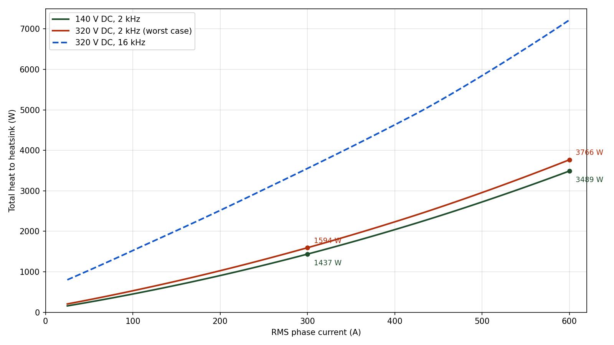
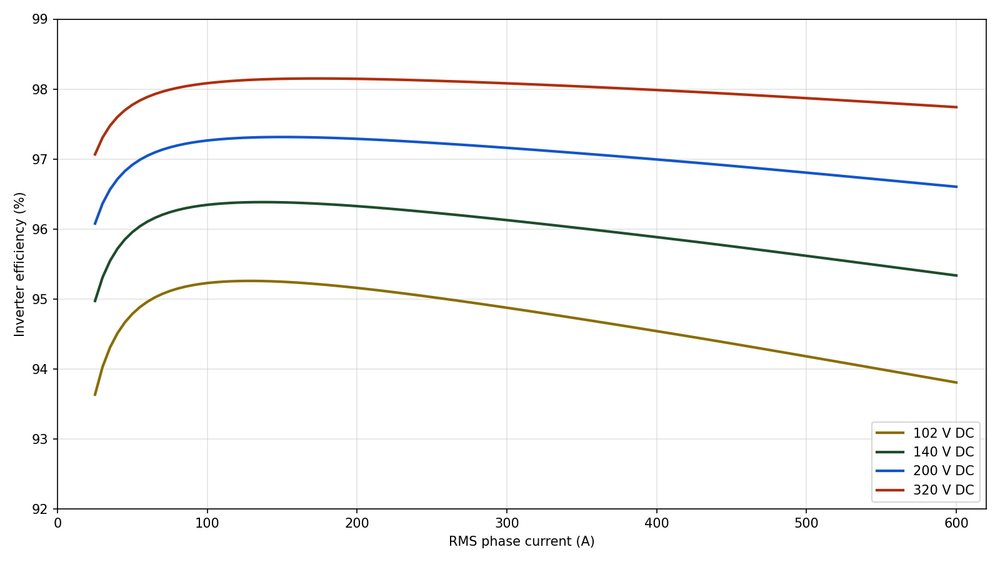

# System Thermal Analysis

This document estimates the total heat dissipated into the heatsink by the 3-phase traction inverter power stage (3× Mitsubishi CM600DY-24T half-bridge IGBT modules plus the DC-link capacitor bank) and derives the heatsink thermal resistance required for continuous operation. It is the sizing input for the custom heatsink design.

**Value marking convention used throughout:**

- **[DS]** - value taken directly from the CM600DY-24T datasheet (Mitsubishi Electric, publication date December 2020); page/figure cited.
- **[EST]** - engineering estimate derived from datasheet curves (digitized) or standard scaling laws; not explicitly guaranteed by the datasheet.
- **[ASM]** - modeling assumption about the operating point.

## Nomenclature

| Symbol | Meaning | Units |
|---|---|---|
| $A$ | Cross-sectional area (generic) | m² |
| $\cos \varphi$ | Load power factor | - |
| $d(\theta)$ | High-side switch duty cycle as a function of electrical angle | - |
| $E_{on}$ | IGBT turn-on switching energy per pulse | J |
| $E_{off}$ | IGBT turn-off switching energy per pulse | J |
| $E_{rr}$ | Free-wheeling diode reverse-recovery energy per pulse | J |
| $f_{sw}$ | PWM switching frequency | Hz |
| $i(\theta)$ | Instantaneous phase current as a function of electrical angle | A |
| $\hat{I}$ | Peak sinusoidal phase current ($\sqrt{2} \cdot I_{rms}$) | A |
| $I_C$ | IGBT collector DC current | A |
| $I_{CRM}$ | IGBT repetitive peak collector current | A |
| $I_E$ | Free-wheeling diode forward current | A |
| $I_{rms}$ | RMS phase current | A |
| $k$ | Thermal conductivity | W/(m·K) |
| $L$ | Length (thermal conduction path) | m |
| $m$ | Modulation index ($V_{ph,pk} / (V_{DC}/2)$) | - |
| $P_{cap}$ | DC-link capacitor bank heat load | W |
| $P_D$ | Free-wheeling diode conduction loss (per diode) | W |
| $P_{heat}$ | Total heat rejected to the heatsink | W |
| $P_{mod}$ | Heat dissipated per IGBT module | W |
| $P_{out}$ | Inverter output power | W |
| $P_Q$ | IGBT conduction loss (per IGBT) | W |
| $P_{semi}$ | Total semiconductor (IGBT + FWD) loss | W |
| $P_{sw,D}$ | Free-wheeling diode switching loss (per diode) | W |
| $P_{sw,Q}$ | IGBT switching loss (per IGBT) | W |
| $Q$ | Heat flow / power | W |
| $Q_G$ | IGBT gate charge | C |
| $Q_{rr}$ | Free-wheeling diode reverse-recovery charge | C |
| $r_{CE}$ | IGBT on-state resistance (chip + lead) | Ω |
| $r_D$ | Free-wheeling diode on-state resistance (chip + lead) | Ω |
| $R_G$ | External gate resistance | Ω |
| $R_{CC'+EE'}$ | Module internal lead resistance | Ω |
| $R_{th}$ | Thermal resistance | K/W |
| $R_{th(c-s)}$ | Module case-to-sink (baseplate-to-heatsink) thermal resistance | K/W |
| $R_{th(j-c)D}$ | Free-wheeling diode junction-to-case thermal resistance | K/W |
| $R_{th(j-c)Q}$ | IGBT junction-to-case thermal resistance | K/W |
| $R_{th(s-a)}$ | Heatsink surface-to-ambient thermal resistance | K/W |
| $t_{dt}$ | PWM dead time | s |
| $t_{rr}$ | Free-wheeling diode reverse-recovery time | s |
| $T_c$ | Module baseplate (case) temperature | °C |
| $T_j$ | Semiconductor junction temperature | °C |
| $T_{j,D}$ | Free-wheeling diode junction temperature | °C |
| $T_{j,Q}$ | IGBT junction temperature | °C |
| $T_{jmax}$ / $T_{jop}$ | Maximum / continuous operating junction temperature | °C |
| $T_s$ | Heatsink surface temperature under the module | °C |
| $T_{amb}$ | Ambient temperature | °C |
| $T_C$ | Module case temperature (datasheet reference) | °C |
| $T_{vj}$ | Virtual junction temperature | °C |
| $V_{CC}$ | DC-link voltage during switching-test conditions | V |
| $V_{CE(sat)}$ | IGBT collector-emitter saturation voltage | V |
| $V_{CES}$ | IGBT collector-emitter breakdown voltage | V |
| $V_{DC}$ | DC-link voltage | V |
| $V_{EC}$ | Free-wheeling diode forward voltage | V |
| $V_{EC0}$ | Free-wheeling diode threshold voltage (model fit) | V |
| $V_{CE0}$ | IGBT threshold voltage (model fit) | V |
| $V_{GE}$ | Gate-emitter drive voltage | V |
| $V_{ph,pk}$ | Peak phase voltage | V |
| $V_{ph,rms}$ | RMS phase voltage | V |
| $\Delta T$ | Temperature rise / difference | K or °C |
| $\eta$ | Inverter efficiency | - |
| $\lambda$ | Thermal conductivity (e.g., grease) | W/(m·K) |
| $\varphi$ | Current phase lag behind voltage (power-factor angle) | rad |
| $\theta$ | Electrical angle | rad |

## References and system inputs

- CM600DY-24T datasheet, Mitsubishi Electric, December 2020 (600 A / 1200 V dual (half-bridge) IGBT module, 62 mm package).
- `OV-C2-DD-DCLINK-THERMAL` - DC-link capacitor bank heat load of ≈40 W at rated ripple, rejected to the heatsink through the standoff/spreader-plate path.
- Project README - power stage: 3× CM600DY-24T half-bridge modules (one per phase), SVPWM, DC link 102–320 V (140 V nominal), 600 A class output. Gate drive +15 V / −9 V via onsemi NCV57100 (7 A peak gate current class).
- Hardware designer input (2026-08, v1.1/v1.2): populated external gate resistance $R_G = 2.7 \ \Omega$ (not the 1.0 Ω datasheet test condition); PWM is clamped at 6 kHz maximum (v1.2). 2 kHz is not the operating intent, 16 kHz will not be used, and the 8 kHz point is dropped: it sits next to the ~7.8 kHz series resonance of the electrolytic can branch (`OV-C2-DD-DCLINK-RIPPLE`) and is unattractive anyway; 8 kHz rows are kept in the tables for reference only, outside the clamped envelope.
- `OV-C2-DD-DCLINK-RIPPLE` - DC-link ripple derivation: bank ripple is 0.511 A RMS per amp of phase current; the 60-can electrolytic bank is ripple-limited above ~320 A RMS continuous. Basis for the continuous/peak rating in §6.4.

## Datasheet parameters used (CM600DY-24T)

### Ratings and electrical characteristics

| Parameter | Value | Conditions | Source | Mark |
|---|---|---|---|---|
| $V_{CES}$ | 1200 V | G–E shorted | Datasheet p.2, Maximum Ratings | [DS] |
| $I_C$ (DC) | 600 A | $T_C = 144 \ ^\circ\text{C}$ | Datasheet p.2 | [DS] |
| $I_{CRM}$ | 1200 A | repetitive pulse | Datasheet p.2 | [DS] |
| $V_{CE(sat)}$, chip | 1.55 V typ / 1.80 V max | $I_C = 600$ A, $V_{GE} = 15$ V, $T_{vj} = 25 \ ^\circ\text{C}$ | Datasheet p.2, Electrical Characteristics | [DS] |
| $V_{CE(sat)}$, chip | 1.75 V typ | $I_C = 600$ A, $V_{GE} = 15$ V, $T_{vj} = 125 \ ^\circ\text{C}$ | Datasheet p.2 | [DS] |
| $V_{CE(sat)}$, chip | 1.80 V typ | $I_C = 600$ A, $V_{GE} = 15$ V, $T_{vj} = 150 \ ^\circ\text{C}$ | Datasheet p.2 | [DS] |
| $V_{CE(sat)}$, terminal | 1.75 / 2.00 / 2.10 V typ (2.05 V max at 25 °C) | $I_C = 600$ A, 25 / 125 / 150 °C | Datasheet p.2 | [DS] |
| $V_{EC}$, chip (FWD) | 1.65 V typ (2.00 V max at 25 °C) | $I_E = 600$ A, 25 / 125 / 150 °C | Datasheet p.2 | [DS] |
| $V_{EC}$, terminal (FWD) | 1.85 / 2.00 / 2.00 V typ | $I_E = 600$ A, 25 / 125 / 150 °C | Datasheet p.2 | [DS] |
| $E_{on}$ | 56.6 mJ typ | $V_{CC} = 600$ V, $I_C = 600$ A, $V_{GE} = \pm 15$ V, $R_G = 1.0 \ \Omega$, $T_{vj} = 150 \ ^\circ\text{C}$, inductive load | Datasheet p.2 | [DS] |
| $E_{off}$ | 64.3 mJ typ | same conditions | Datasheet p.2 | [DS] |
| $E_{rr}$ | 38.2 mJ typ | same conditions, $I_E = 600$ A | Datasheet p.2 | [DS] |
| $Q_{rr}$ / $t_{rr}$ | 60 µC typ / 400 ns max | $V_{CC} = 600$ V, $I_E = 600$ A, $R_G = 1.0 \ \Omega$ | Datasheet p.2 | [DS] |
| $Q_G$ | 3.7 µC typ | $V_{CC} = 600$ V, $I_C = 600$ A, $V_{GE} = 15$ V | Datasheet p.2 | [DS] |
| $R_{CC'+EE'}$ (internal lead R) | 0.3 mΩ typ | per switch, $T_C = 25 \ ^\circ\text{C}$ | Datasheet p.2 | [DS] |
| Switching times | $t_{d(on)} \le 500$ ns, $t_r \le 200$ ns, $t_{d(off)} \le 600$ ns, $t_f \le 300$ ns | $V_{CC} = 600$ V, $I_C = 600$ A, $R_G = 1.0 \ \Omega$ | Datasheet p.2 | [DS] |
| $T_{jop}$ / $T_{jmax}$ | $-40 \dots +150 \ ^\circ\text{C}$ continuous / $175 \ ^\circ\text{C}$ instantaneous | - | Datasheet p.2 | [DS] |
| Recommended operating point | $V_{CC} = 600$ V typ (850 V max), $V_{GE(on)} = 15$ V, $R_G = 1.0$–$10 \ \Omega$ | - | Datasheet p.4 | [DS] |
| Populated gate drive | $R_G = 2.7 \ \Omega$ external, $V_{GE} = +15 \ \text{V} / -9 \ \text{V}$, NCV57100 7 A driver | - | Hardware designer input, 2026-08 | [ASM] |

### Thermal resistances

| Parameter | Value | Per | Source | Mark |
|---|---|---|---|---|
| $R_{th(j-c)Q}$ | 24 K/kW max (= 0.024 K/W) | one inverter IGBT | Datasheet p.3, Thermal Resistance | [DS] |
| $R_{th(j-c)D}$ | 42 K/kW max (= 0.042 K/W) | one inverter FWD | Datasheet p.3 | [DS] |
| $R_{th(c-s)}$ | 13.3 K/kW typ (= 0.0133 K/W) | one module (grease $\lambda = 3.0$ W/(m·K), 50 µm) | Datasheet p.3, note 6 | [DS] |

Note: $R_{th(c-s)}$ is a typical value; no maximum is given. Grease ageing/pump-out (datasheet note 8) can raise it over life - covered by the heatsink margin policy in §6.

### Device model parameters digitized from datasheet curves

Conduction models use the standard $V_0 + r \cdot I$ straight-line fit to the datasheet output/saturation curves at $T_{vj} = 125 \ ^\circ\text{C}$ (chip values), with the internal lead resistance $R_{CC'+EE'} = 0.3 \ \text{m}\Omega$ added because it dissipates heat inside the module:

| Model parameter | Value | Basis | Mark |
|---|---|---|---|
| $V_{CE0}$ | 1.15 V | Fit to $V_{CE(sat)}$ vs $I_C$ curve, chip, 125 °C (datasheet p.6, "Collector-Emitter Saturation Voltage Characteristics"); fit passes through (300 A, 1.45 V), (600 A, 1.75 V), (900 A, 2.05 V) | [EST] |
| $r_{CE}$ | 1.0 mΩ (+ 0.3 mΩ lead = 1.3 mΩ used) | same figure + p.2 lead resistance | [EST] |
| $V_{EC0}$ | 1.15 V | Fit to FWD forward curve, chip, 125 °C (datasheet p.6, "Free Wheeling Diode Forward Characteristics"); through (300 A, 1.38 V), (600 A, 1.65 V), (1200 A, 2.10 V) | [EST] |
| $r_D$ | 0.8 mΩ (+ 0.3 mΩ lead = 1.1 mΩ used) | same figure + p.2 lead resistance | [EST] |

Switching energy models (datasheet p.7, "Half-Bridge Switching Characteristics - switching energy vs collector/emitter current", $V_{CC} = 600$ V, $V_{GE} = \pm 15$ V, $R_G = 1.0 \ \Omega$; the solid $T_{vj} = 150 \ ^\circ\text{C}$ curves were used, anchored exactly at the p.2 table values at 600 A; the dashed 125 °C curves lie ≈5–10 % lower, so the 150 °C curves are conservative at the 125 °C operating point):

| $I_C$ / $I_E$ | $E_{on}$ | $E_{off}$ | $E_{rr}$ | Mark |
|---|---|---|---|---|
| 300 A | ≈ 30 mJ (fit 28 mJ) | ≈ 37 mJ | ≈ 31 mJ | [EST] |
| 600 A | 56.6 mJ | 64.3 mJ | 38.2 mJ | [DS] anchor |
| 850 A | ≈ 106 mJ | ≈ 94 mJ | ≈ 39 mJ | [EST] |
| 1200 A | ≈ 180 mJ | ≈ 130 mJ | ≈ 39 mJ | [EST] |

Piecewise-linear interpolation of these anchor points is used in the model. Digitization uncertainty is about ±5 % (line thickness / anti-aliasing). Note $E_{on}$ is markedly superlinear above 600 A, and $E_{rr}$ saturates above ≈700 A.

Scaling laws applied (not given in the datasheet):

- **Voltage scaling:** $E(V_{DC}) = E_{600\text{V}} \cdot (V_{DC} / 600 \ \text{V})$. Standard first-order scaling of switching energy with bus voltage. [EST]
- **Temperature:** 150 °C energy curves used at the 125 °C operating point (conservative). Conduction parameters at 125 °C. [EST]
- **Gate conditions:** datasheet energies are at $V_{GE} = \pm 15$ V and $R_G = 1.0 \ \Omega$; the inverter drives +15 V / −9 V with a populated $R_G = 2.7 \ \Omega$. The $V_{GE(off)} = -9$ V vs −15 V difference is assumed negligible for the energies. The $R_G$ increase is corrected as follows: the datasheet p.7 $E$ vs $R_G$ figure shows $E_{on}$ roughly tripling at $R_G = 10 \ \Omega$; interpolating **linearly in $R_G$** between the 1.0 Ω table value and 3× at 10 Ω gives an $E_{on}$ multiplier of $1 + 2 \cdot (2.7 - 1)/9 \approx 1.38$ at 2.7 Ω. $E_{off}$ and $E_{rr}$ are held at their 1.0 Ω values because no $R_G$-dependent curve for them has been digitized into this model; their $R_G$ dependence is typically much weaker than $E_{on}$'s, but this is unverified here. This is a datasheet-curve interpolation, not a measurement. [ASM] - pin all three energies with a double-pulse test at the populated $R_G = 2.7 \ \Omega$ and +15 V / −9 V gate supplies.

## Loss model and assumptions

### Assumptions [ASM]

- 3 half-bridge modules, one per phase, symmetrical sharing.
- Modulation index $m = 1.0$, defined as $V_{ph,pk} = m \cdot V_{DC}/2$ (within the linear SVPWM range, which extends to $m = 1.15$ in this convention).
- Sinusoidal phase current $i(\theta) = \hat{I} \cdot \sin \theta$ with $\hat{I} = \sqrt{2} \cdot I_{rms}$.
- Load power factor $\cos \varphi = 0.8$ (traction motor at rated point).
- Junction operating point $T_j = 125 \ ^\circ\text{C}$ (continuous rating is 150 °C; 125 °C leaves margin).
- Switching frequency: per designer intent the PWM is clamped at 6 kHz maximum (v1.2); 2 kHz is retained as a reference point only, 8 kHz is outside the clamped envelope (kept in tables for reference), and 16 kHz is out of scope (will not be used).
- Switching energies include the $R_G = 2.7 \ \Omega$ correction of §2.3: $E_{on}$ multiplied by ≈1.38, $E_{off}$ and $E_{rr}$ unchanged. [ASM]
- Dead time (0.5–4 µs configurable): the extra FWD conduction during dead time adds ≈ $V_{EC} \cdot \langle i \rangle \cdot 2 \cdot t_{dt} \cdot f_{sw} \approx 7$ W per leg (~20 W total) at 600 A / 2 kHz / 2 µs - under 1 % of total heat, neglected.
- Gate-drive power ($Q_G \cdot \Delta V_{GE} \cdot f_{sw} \approx 0.2$ W per switch, ≈1 W total) is dissipated in the gate resistors/driver, not the module - excluded.
- $E_{on}$ as measured in the datasheet half-bridge circuit already contains the turn-on impact of the opposing diode's reverse recovery; $E_{rr}$ is counted once, in the diode (standard datasheet convention).

### Formulas

High-side fundamental duty cycle of one leg (identical for SPWM and SVPWM to first order; third-harmonic injection does not change the fundamental average that sets the IGBT/FWD conduction split):

$$i(\theta) = \hat{I} \cdot \sin \theta \qquad \hat{I} = \sqrt{2} \cdot I_{rms}$$

$$d(\theta) = \frac{1}{2} \cdot \left(1 + m \cdot \sin(\theta - \varphi)\right)$$

Conduction loss per IGBT and per FWD (standard 2-level bridge result, integrating $v(i) \cdot i \cdot d(\theta)$ over the positive current half-wave):

$$P_Q = V_{CE0} \cdot \hat{I} \cdot \left(\frac{1}{2\pi} + \frac{m \cos \varphi}{8}\right) + r_{CE} \cdot \hat{I}^2 \cdot \left(\frac{1}{8} + \frac{m \cos \varphi}{3\pi}\right) \qquad \text{[per IGBT]}$$

$$P_D = V_{EC0} \cdot \hat{I} \cdot \left(\frac{1}{2\pi} - \frac{m \cos \varphi}{8}\right) + r_D \cdot \hat{I}^2 \cdot \left(\frac{1}{8} - \frac{m \cos \varphi}{3\pi}\right) \qquad \text{[per FWD]}$$

Switching loss, averaging the digitized energy curves over the sine half-wave and scaling with bus voltage:

$$P_{sw,Q} = f_{sw} \cdot \frac{V_{DC}}{600 \ \text{V}} \cdot \frac{1}{2\pi} \int_{0}^{\pi} \left[ E_{on}(i(\theta)) + E_{off}(i(\theta)) \right] d\theta \qquad \text{[per IGBT]}$$

$$P_{sw,D} = f_{sw} \cdot \frac{V_{DC}}{600 \ \text{V}} \cdot \frac{1}{2\pi} \int_{0}^{\pi} E_{rr}(i(\theta)) \, d\theta \qquad \text{[per FWD]}$$

Totals for the bridge (6 IGBTs + 6 FWDs) and the heatsink:

$$P_{semi} = 6 \cdot (P_Q + P_D + P_{sw,Q} + P_{sw,D})$$

$$P_{heat} = P_{semi} + P_{cap} \qquad P_{cap} = 40 \ \text{W}$$

$$P_{out} = 3 \cdot V_{ph,rms} \cdot I_{rms} \cdot \cos \varphi = \frac{3 \cdot m \cdot V_{DC} \cdot I_{rms} \cdot \cos \varphi}{2\sqrt{2}}$$

$$\eta = \frac{P_{out}}{P_{out} + P_{heat}}$$

Per-module dissipation (for the thermal chain):

$$P_{mod} = \frac{P_{semi}}{3}$$

## Heat vs phase current

Total heat rejected to the heatsink (IGBT + FWD conduction and switching, plus 40 W capacitor heat), $m = 1.0$, $\cos \varphi = 0.8$, $R_G = 2.7 \ \Omega$ ($E_{on} \times 1.38$):

| $I_{phase}$ (A rms) | IGBT cond., 6× (W) | FWD cond., 6× (W) | Switching, 6× @140 V / 2 kHz (W) | Caps (W) | Total @140 V / 2 kHz (W) | Total @320 V / 2 kHz (W) | Total @320 V / 6 kHz (W) | Total @320 V / 8 kHz (W) |
|---|---|---|---|---|---|---|---|---|
| 50 | 135 | 30 | 47 | 40 | 252 | 312 | 527 | 635 |
| 100 | 286 | 63 | 65 | 40 | 454 | 537 | 835 | 983 |
| 150 | 453 | 99 | 83 | 40 | 675 | 781 | 1161 | 1351 |
| 200 | 637 | 137 | 101 | 40 | 915 | 1045 | 1507 | 1738 |
| 250 | 837 | 177 | 118 | 40 | 1173 | 1325 | 1867 | 2137 |
| 300 | 1053 | 221 | 135 | 40 | 1449 | 1623 | 2239 | 2548 |
| 350 | 1286 | 267 | 151 | 40 | 1744 | 1938 | 2629 | 2974 |
| 400 | 1535 | 316 | 167 | 40 | 2058 | 2273 | 3036 | 3418 |
| 450 | 1801 | 367 | 184 | 40 | 2392 | 2629 | 3470 | 3890 |
| 500 | 2083 | 421 | 204 | 40 | 2748 | 3010 | 3942 | 4408 |
| 550 | 2381 | 478 | 225 | 40 | 3124 | 3414 | 4443 | 4957 |
| 600 | 2696 | 537 | 247 | 40 | 3520 | 3838 | 4967 | 5532 |

Conduction dominates at 2 kHz (switching is only ≈7 % of semiconductor loss at 140 V / 600 A because the energies scale with $V_{DC}/600 \ \text{V}$). At 320 V / 6 kHz switching is ≈34 % of the 4.9 kW semiconductor loss at 600 A, and at 8 kHz ≈41 % of 5.5 kW. The 40 W capacitor heat is unchanged from v1.0; its derivation and the bank ripple-rating check remain an open item (`OV-C2-DD-DCLINK-THERMAL`).

Loss breakdown at the two design currents (140 V, 2 kHz, $R_G = 2.7 \ \Omega$):

| Quantity | 300 A rms | 600 A rms |
|---|---|---|
| Per-IGBT conduction | 176 W | 449 W |
| Per-FWD conduction | 37 W | 89 W |
| Per-IGBT switching | 16 W | 33 W |
| Per-FWD switching ($E_{rr}$) | 6 W | 8 W |
| Per module ($P_{semi}/3$) | 470 W | 1160 W |
| Semiconductor total | 1409 W | 3480 W |
| **Total to heatsink (incl. 40 W caps)** | **1449 W** | **3520 W** |

*(The plotted curves are from the v1.0 model at $R_G = 1.0 \ \Omega$; regenerating them against the v1.1 numbers is an open item. The table above is authoritative.)*

## Inverter efficiency vs phase current

$$\eta = \frac{P_{out}}{P_{out} + P_{heat}} \quad \text{at } m = 1.0, \ \cos \varphi = 0.8, \ 2 \ \text{kHz}, \ R_G = 2.7 \ \Omega$$

including the 40 W capacitor heat.

$$P_{out} = \frac{3 \cdot m \cdot V_{DC} \cdot I_{rms} \cdot \cos \varphi}{2\sqrt{2}}$$

i.e., each bus voltage runs at its rated fundamental output voltage ($P_{out}$ at 600 A: 52 kW @102 V, 71 kW @140 V, 102 kW @200 V, 163 kW @320 V).

| $I_{phase}$ (A rms) | $\eta$ @102 V (%) | $\eta$ @140 V (%) | $\eta$ @200 V (%) | $\eta$ @320 V (%) |
|---|---|---|---|---|
| 50 | 94.8 | 95.9 | 96.9 | 97.8 |
| 100 | 95.2 | 96.3 | 97.2 | 98.1 |
| 150 | 95.2 | 96.4 | 97.3 | 98.1 |
| 200 | 95.1 | 96.3 | 97.3 | 98.1 |
| 250 | 95.0 | 96.2 | 97.2 | 98.1 |
| 300 | 94.8 | 96.1 | 97.1 | 98.0 |
| 350 | 94.7 | 96.0 | 97.0 | 98.0 |
| 400 | 94.5 | 95.8 | 97.0 | 98.0 |
| 450 | 94.3 | 95.7 | 96.9 | 97.9 |
| 500 | 94.1 | 95.6 | 96.8 | 97.8 |
| 550 | 94.0 | 95.4 | 96.7 | 97.8 |
| 600 | 93.8 | 95.3 | 96.6 | 97.7 |

At the 140 V nominal bus the efficiency peaks at ≈96.4 % around 150–200 A and falls to 95.3 % at 600 A, because conduction loss grows faster than output power (the $r \cdot I^2$ term). Higher bus voltages are more efficient at the same current because conduction loss is unchanged while output power scales with $V_{DC}$.

*(Plotted curves are v1.0 / $R_G = 1.0 \ \Omega$; see the note in §4. Efficiency at 6–8 kHz is lower than tabulated here, by roughly 0.5–1 percentage point at 320 V / 600 A.)*

## Heatsink sizing

### Thermal chain

Steady-state 1-D chain from junction to ambient for the hottest IGBT of a module:

$$T_s = T_{amb} + P_{heat} \cdot R_{th(s-a)}$$

$$T_c = T_s + P_{mod} \cdot R_{th(c-s)}$$

$$T_{j,Q} = T_c + (P_Q + P_{sw,Q}) \cdot R_{th(j-c)Q}$$

$$T_{j,D} = T_c + (P_D + P_{sw,D}) \cdot R_{th(j-c)D}$$

- $R_{th(c-s)} = 13.3$ K/kW typ per module (thermal grease) [DS p.3]
- $R_{th(j-c)Q} = 24$ K/kW max, $R_{th(j-c)D} = 42$ K/kW max [DS p.3]
- Design limits: module baseplate $T_c \le 85 \ ^\circ\text{C}$ at $T_{amb} = 40 \ ^\circ\text{C}$; junction target $T_j \le 125 \ ^\circ\text{C}$ with margin (continuous rating 150 °C [DS]). The 85 °C baseplate limit is also consistent with the firmware NTC monitor (100 °C hard cap on the module-sited NTC). Note the DC-link spreader plate no longer has margin to this limit at the design point: it reaches the FSR-08 derate/SSO band at full load - see §6.3.

### Required heatsink thermal resistance

Worst case is 320 V bus (highest switching loss); 140 V nominal shown for reference. All points at $R_G = 2.7 \ \Omega$. 16 kHz is out of scope per designer intent and is no longer evaluated; 8 kHz is shown for reference only (outside the 6 kHz clamped envelope). The 600 A rows are steady-state evaluations at the 60 s peak current; the continuous rating is defined in §6.4.

| Operating point | $P_{heat}$ (W) | $P_{mod}$ (W) | $\Delta T_{(c-s)}$ (K) | Max $T_s$ (°C) | **Required $R_{th(s-a)}$** | $T_{j,Q}$ check | $T_{j,D}$ check |
|---|---|---|---|---|---|---|---|
| 300 A / 320 V / 2 kHz | 1623 | 528 | 7.0 | 78.0 | **≤ 0.0234 K/W** | 90 °C ✓ | 87 °C ✓ |
| 600 A / 320 V / 2 kHz (reference) | 3838 | 1266 | 16.8 | 68.2 | ≤ 0.0073 K/W | 98 °C ✓ | 90 °C ✓ |
| 600 A / 320 V / 6 kHz (peak duty) | 4967 | 1642 | 21.8 | 63.2 | **≤ 0.0047 K/W** | 101 °C ✓ | 91 °C ✓ |
| 600 A / 320 V / 8 kHz (beyond envelope) | 5532 | 1831 | 24.3 | 60.7 | ≤ 0.0037 K/W | 103 °C ✓ | 92 °C ✓ |
| 600 A / 140 V / 2 kHz (reference) | 3520 | 1160 | 15.4 | 69.6 | ≤ 0.0084 K/W | 97 °C ✓ | 89 °C ✓ |
| 600 A / 140 V / 6 kHz (reference) | 4014 | 1325 | 17.6 | 67.4 | ≤ 0.0068 K/W | 98 °C ✓ | 90 °C ✓ |

### DC-link plate temperature at the design point (FSR-08 integration)

The DC-link spreader plate sits on the same heatsink and rises +40.1 K over the local heatsink surface under its 40 W load (thermal paste path, `OV-C2-DD-DCLINK-THERMAL`; the rise scales 1:1 with sink temperature). Taking the maximum $T_s$ for each operating point above (heatsink sized exactly to the 85 °C baseplate limit) and adding the 40.1 K standoff rise:

| Operating point | Max $T_s$ (°C) | Plate $T_s + 40.1$ K (°C) | vs FSR-08 90 °C derate | vs FSR-08 105 °C SSO / cap rating |
|---|---|---|---|---|
| 600 A / 320 V / 2 kHz | 68.2 | **108.3** | exceeds | **exceeds** |
| 600 A / 320 V / 6 kHz | 63.2 | **103.3** | exceeds | marginal (within) |
| 600 A / 320 V / 8 kHz (beyond envelope) | 60.7 | **100.8** | exceeds | within |
| 600 A / 140 V / 2 kHz | 69.6 | **109.7** | exceeds | **exceeds** |
| 600 A / 140 V / 6 kHz | 67.4 | **107.5** | exceeds | **exceeds** |
| 300 A / 320 V / 2 kHz | 78.0 | **118.1** | exceeds | **exceeds** |
| 300 A / 320 V / 6 kHz | 75.2 | **115.3** | exceeds | **exceeds** |

The apparent improvement at 6–8 kHz is an artifact of the sizing method, not a real cooling benefit: higher switching loss forces a proportionally stronger heatsink (4.7 / 3.7 mK/W instead of 7.3 mK/W), which lowers $T_s$ for the same 85 °C baseplate limit. Against a **fixed** heatsink the trend reverses: with the 0.006 K/W margin-target heatsink from the Guidance section, 600 A / 320 V continuous gives $T_s \approx 63 / 70 / 73$ °C at 2 / 6 / 8 kHz, i.e. plate ≈ **103 / 110 / 113 °C**. At 300 A / 320 V the plate is worst of all (114–118 °C) because a heatsink sized only for 300 A is allowed to run hotter; this case only applies if the heatsink is not sized for 600 A. [ASM] - the plate numbers inherit the ±20 % spreading uncertainty of the DC-link model and assume the capacitor NTC reads plate temperature; plate-to-can thermal coupling is unmodeled.

**Consequence for the 600 A continuous claim and FSR-08:** at every full-load operating point the DC-link plate model sits at or above the 90 °C FSR-08 derate threshold, and at several points (all 140 V points, 320 V / 2 kHz, and 320 V / 6–8 kHz against the fixed 0.006 K/W heatsink) it exceeds the 105 °C SSO threshold, which is also the capacitor temperature rating. Continuous 600 A RMS is therefore **not supported by this thermal model** unless at least one of the following closes the gap: (a) a plate thermocouple measurement during the full-load dyno run shows the real rise is materially below +40.1 K (the model neglects convection/radiation, so the real value should be lower; the thermal test plan T-05 bounds this); (b) the DC-link thermal path is improved (more standoffs, thicker spreader plate, or direct capacitor-to-heatsink coupling); or (c) the continuous current / frequency envelope is derated so the plate stays under 90 °C. The semiconductor chain itself has margin ($T_{j,Q} \approx 98$–103 °C vs the 125 °C target); **the DC-link plate, not the IGBTs, is the binding thermal constraint at 600 A.** The resolution adopted in v1.2 is option (c), formalized as the continuous/peak rating in §6.4.

### Continuous and peak current rating (v1.2)

Ratings are stated per the IEC 61800-2 style overload convention: a continuous rating plus a time-limited peak, where **peak = 600 A RMS for 60 s**. The designer's reservation about peak differing from continuous is addressed by making the peak verifiable: it carries an explicit time limit and a windowed RMS duty requirement (below), so it is a testable envelope, not a marketing number.

**Continuous rating: 220 A RMS** at 6 kHz PWM, 40 °C ambient, with the 0.006 K/W margin-target heatsink. The two constraints at 6 kHz:

| Constraint | Limit at 6 kHz | Source |
|---|---|---|
| Electrolytic bank ripple (per-can vs frequency-corrected UCS rating) | ~330 A RMS (332 A crossing) | `OV-C2-DD-DCLINK-RIPPLE` |
| DC-link plate < 90 °C (FSR-08 derate onset), plate = $T_s$ + 40.1 K, $T_s = 40 + 0.006 \cdot P_{heat}$ | **220 A RMS at 320 V** (289 A at 140 V) | this document, §6.3 model |

The rating is the lower of the two: **the DC-link plate binds (220 < 330), not the capacitor ripple.** At 220 A / 320 V / 6 kHz the model gives $P_{heat} = 1650$ W, $T_s = 49.9$ °C, plate = 90.0 °C, $T_{j,Q} \approx 90$ °C (far inside the 125 °C target). The rating is stated at the worst-case bus (320 V); a 140 V bus would allow ~290 A from the plate constraint, still under the ripple limit.

This is a **conservative analytical bound**, not a measured rating. The conservatisms, itemized:

1. The plate model routes 100 % of capacitor heat through the standoff path and credits no convection/radiation; the real rise is below +40.1 K (`OV-C2-DD-DCLINK-THERMAL`, `OV-C2-DD-DCLINK-RIPPLE` §"Interpretation").
2. The ripple/ESR model uses an assumed ESR ratio (0.15 × tan δ ceiling) with no published UCS impedance curve; ±50 % would not be surprising (`OV-C2-DD-DCLINK-RIPPLE` [ASM]).
3. The ripple current formula is a stiff-source upper bound; a real battery/dyno source absorbs part of the ripple.
4. Worst-case continuous duty at $m = 1.0$, $\cos \varphi = 0.8$, 40 °C ambient; no credit for part-load, cooler ambients, or cans running below their 105 °C category temperature.
5. Field experience at 100 - 200 A phase current shows the cans running cool, which is consistent with the model at those currents (bank loss 27 - 109 W) and suggests the bound has real margin at rated current too.

Measured data supersedes this bound when available; the two pinning measurements are listed in `OV-C2-DD-DCLINK-RIPPLE` §"Continuous and peak rating" (can-branch ripple measurement and can/plate NTC correlation at load).

**Peak rating: 600 A RMS for 60 s** at ≤ 6 kHz, validated by thermal time constants:

- **Junction (fast, seconds class):** the IGBT junction reaches essentially its steady-state rise well within 60 s; $T_{j,Q} = 101$ °C and $T_{j,D} = 91$ °C at 600 A / 320 V / 6 kHz vs the 125 °C design target. Not binding.
- **Heatsink and plate (slow, minutes class [EST]):** the steady-state plate difference between the 220 A continuous point and the 600 A point is ~20 K (90.0 vs 109.9 °C on the 0.006 K/W heatsink). With a plate+heatsink thermal time constant in the 3 - 10 min class (multi-kg aluminium plus coolant loop) [EST], a 60 s excursion captures only 10 - 33 % of that delta: end-of-peak plate ≈ **92 - 97 °C**, above the 90 °C derate onset but ≥8 K below the 105 °C SSO / capacitor rating.
- **Capacitor cans (slow, minutes class [EST]):** at 600 A the per-can ripple is 1.81× the 6 kHz rating (≈3.3× rated loss), but the winding hot-spot responds with a minutes-class time constant, so a 60 s peak captures only a fraction of the incremental rise from the continuous point; the per-event hot-spot excursion is single-digit K class [EST]. The accumulated lifetime cost is bounded by the duty requirement below. Pin with the can NTC during dyno (thermal test plan T-05/T-06).
- **Duty requirement (makes the peak verifiable):** RMS phase current over any rolling 10-minute window shall not exceed the 220 A continuous rating. Worked example: after a full 60 s / 600 A peak, the following 9 minutes must stay at ≲ 117 A RMS; shorter or lower peaks relax this proportionally. Firmware shall enforce the windowed RMS limit, and the FSR-08 90 °C derate response shall ride through the bounded transient excursion of a compliant peak rather than SSO.

**Why peak ≠ continuous, honestly:** continuous 600 A fails two independent constraints - the electrolytic ripple rating (1.8× at 600 A) and the DC-link plate temperature (>105 °C steady-state) - and fixing either one costs hardware this chassis does not have (roughly double the can count, or a redesigned plate/cooling path). The 60 s peak covers real traction duty (acceleration, gradeability, obstacle starts) where high current is inherently transient, while the continuous rating keeps the capacitors inside their datasheet endurance and the plate under the FSR-08 derate onset. If a future revision needs higher continuous current, the levers are in `OV-C2-DD-DCLINK-RIPPLE` (bank changes) and `OV-C2-DD-DCLINK-THERMAL` (plate path), plus the measurement campaign that may raise the analytical bound without any hardware change.

### Guidance

- **Peak 600 A / 320 V (60 s): $R_{th(s-a)} \le 0.0047$ K/W (4.7 mK/W) at the 6 kHz clamp for the whole three-module heatsink assembly, 40 °C ambient** (3.7 mK/W at the out-of-envelope 8 kHz point). With ≥25 % engineering margin (grease ageing, digitization/typ-value uncertainty, module-to-module variation, fouling), the design target is **≈ 0.0035 K/W or better**; the margin-target value used for the rating analysis in §6.4 is 0.006 K/W, i.e. the ≥25 % margin policy against the 2 kHz reference requirement (7.3 mK/W). All of these are outside natural-convection territory (a very large natural-convection sink is ≈0.1–0.5 K/W); 6 kHz at high current requires a liquid cold plate.
- **Continuous 220 A / 320 V / 6 kHz (rated point): $R_{th(s-a)} \le 0.006$ K/W keeps the DC-link plate at the 90 °C FSR-08 derate onset** - see §6.4. Continuous 300 A / 320 V requires ≤0.023 K/W at 2 kHz (≈0.016 K/W at 6 kHz) for the baseplate constraint, but is outside the 220 A continuous rating at 6 kHz because of the plate.
- The junction rise is small at the design point ($T_{j,Q} \approx 98 \ ^\circ\text{C}$ at $T_c = 85 \ ^\circ\text{C}$, ≈27 °C margin to the 125 °C target) because $R_{th(j-c)}$ is only 24 K/kW; the **baseplate ≤ 85 °C constraint, not the junction, sizes the heatsink.** Per-switch dissipation of ≈630 W at 600 A / 320 V / 2 kHz (≈820 W at 6 kHz) is also well inside the module's 6250 W total dissipation rating (datasheet p.2).
- **The DC-link plate, not the semiconductors, sets the real full-load limit** - see §6.3. Any heatsink decision shall be checked against the plate temperature, not only the baseplate limit.
- Mounting: thermal grease per datasheet note 6 ($\lambda = 3.0$ W/(m·K), 50 µm), M6 mounting torque 3.5–4.5 N·m (datasheet p.3), baseplate flatness ≤ 200 µm on the centerlines. Verify the three modules are placed so each sees comparable sink temperature.

## Sensitivity and notes

- **6 kHz clamp:** switching loss scales linearly with $f_{sw}$. At 600 A / 320 V total heat rises from 3.8 kW (2 kHz) to 5.0 kW (6 kHz) and 5.5 kW (8 kHz), and the heatsink requirement tightens from 7.3 to 4.7 / 3.7 mK/W. Per designer decision (v1.2) the PWM is clamped at 6 kHz; 8 kHz is dropped (it also sits next to the ~7.8 kHz electrolytic-branch series resonance, `OV-C2-DD-DCLINK-RIPPLE`) and 16 kHz is out of scope. 6 kHz at high current means liquid cooling.
- **Lower power factor:** total heat is nearly unchanged (the IGBT $V_0$ term falls while the FWD share rises; at $\cos \varphi = 0.5$, 600 A / 140 V / 2 kHz, $P_{heat} \approx 3.46$ kW vs 3.49 kW at $\cos \varphi = 0.8$), but output power falls proportionally with $\cos \varphi$, so efficiency drops (≈92.8 % at $\cos \varphi = 0.5$, 600 A / 140 V) and heat per kW delivered rises. Regenerative braking ($\cos \varphi < 0$) shifts loss toward the FWDs - $R_{th(j-c)D} = 42$ K/kW keeps the diode junction ≈5 °C cooler than the IGBT at rated point, so this is not binding.
- **Typical vs maximum device values:** conduction uses typical chip $V_{CE(sat)}/V_{EC}$; the max terminal values are ≈10–15 % higher, and $R_{th(c-s)}$ is a typical (not max) value. The ≥25 % heatsink margin policy covers this.
- **600 A RMS operation:** at 600 A RMS the sine peak is 848 A, above the module's 600 A DC rating (at $T_C = 144 \ ^\circ\text{C}$) but within the 1200 A repetitive pulse rating. As of v1.2, 600 A is rated as a **60 s peak**, not continuous; the continuous rating is 220 A RMS (§6.4), set by the DC-link plate, with the electrolytic ripple limit (~330 A) above it. Full-load dyno/thermal validation of both ratings is still pending - treat the 600 A tables as the peak-duty sizing bound, not a validated rating.
- **Gate resistance:** all switching energies now include the populated $R_G = 2.7 \ \Omega$ correction ($E_{on} \times 1.38$, linear interpolation of the datasheet p.7 $E$ vs $R_G$ curve between 1 Ω and the ≈3× point at 10 Ω; $E_{off}$/$E_{rr}$ unscaled). This is a datasheet-curve interpolation, not a measurement, and the $E_{off}$/$E_{rr}$ $R_G$-dependence is unmodeled [ASM]. Pin $E_{on}$, $E_{off}$, and $E_{rr}$ with a double-pulse test at $R_G = 2.7 \ \Omega$, +15 V / −9 V, representative bus voltage and current; re-run this analysis with the measured energies.
- **Low-current extrapolation:** below ≈100 A the $E_{rr}/E_{off}$ curve extrapolation carries the constant offsets ($E_{off} \approx 8.7$ mJ, $E_{rr} \approx 12$ mJ); the resulting low-current, high-frequency numbers (e.g., 50 A / 8 kHz) are the least accurate in this document, ±15 %.
- **Not modeled:** stray-inductance overshoot losses, module NTC self-heating, busbar/terminal ohmic heating into the heatsink (small vs 3.5 kW), and heatsink thermal spreading between modules (left to the heatsink detailed design). Ambient 40 °C is assumed at the heatsink inlet; inside a sealed chassis, derate accordingly.
- **Firmware tie-in:** the real-time loss estimator uses the same model structure ($V_{ce0}/R_{ce}$ conduction + $E_{on}/E_{off}$ curves + $R_{th}$ chain); the parameters in §2.3 are the recommended calibration set for it.

---

## Revision History

| Version | Date | Changes |
|---------|------|---------|
| 1.0 | 2026-07-17 | Initial release. |
| 1.1 | 2026-08-20 | Engineering revision from hardware-designer input: populated gate drive is $R_G = 2.7 \ \Omega$, +15 V / −9 V, NCV57100 7 A class (was: datasheet $R_G = 1.0 \ \Omega$ assumption). $E_{on}$ scaled ×1.38 by linear interpolation of the datasheet $E$ vs $R_G$ curve; $E_{off}$/$E_{rr}$ held (unmodeled $R_G$ dependence, [ASM], double-pulse test open). Operating points updated to designer intent: 6 kHz max continuous, 8 kHz upper bound; 2 kHz demoted to reference; 16 kHz removed as out of scope. All loss, efficiency, and heatsink tables recomputed (600 A / 320 V: 3.8 / 5.0 / 5.5 kW and 7.3 / 4.7 / 3.7 mK/W at 2 / 6 / 8 kHz). New §6.3 integrates the DC-link plate temperature (+40.1 K standoff rise from OV-C2-DD-THERMAL) against FSR-08 thresholds: plate exceeds the 90 °C derate at all full-load points and the 105 °C SSO / capacitor rating at several; the plate, not the IGBTs, is now the binding constraint on the 600 A continuous claim. Plots (PNGs) still show the v1.0 curves; regeneration is an open item. |
| 1.2 | 2026-08-20 | Ratings revision. PWM clamped at 6 kHz max per designer decision; 8 kHz dropped (also adjacent to the ~7.8 kHz electrolytic-branch series resonance per OV-C2-DD-DCLINK-RIPPLE) and retained in tables for reference only. New §6.4 states the IEC 61800-2 style rating: **220 A RMS continuous / 600 A RMS peak for 60 s**. The continuous rating is the lower of the electrolytic ripple limit (~330 A, OV-C2-DD-DCLINK-RIPPLE) and the DC-link plate 90 °C FSR-08 constraint (220 A at 320 V / 6 kHz on the 0.006 K/W heatsink), and is documented as a conservative analytical bound with itemized assumptions. The 60 s peak is validated by thermal time constants (junction ~101 °C steady, plate/can excursions bounded to ~92 - 97 °C end-of-peak) and carries a verifiable duty requirement (rolling 10-min RMS ≤ 220 A). Guidance, sensitivity notes, and the 600 A operation note aligned. |

---

*This is a design estimate for heatsink sizing, to be validated by test on the assembled inverter.*
