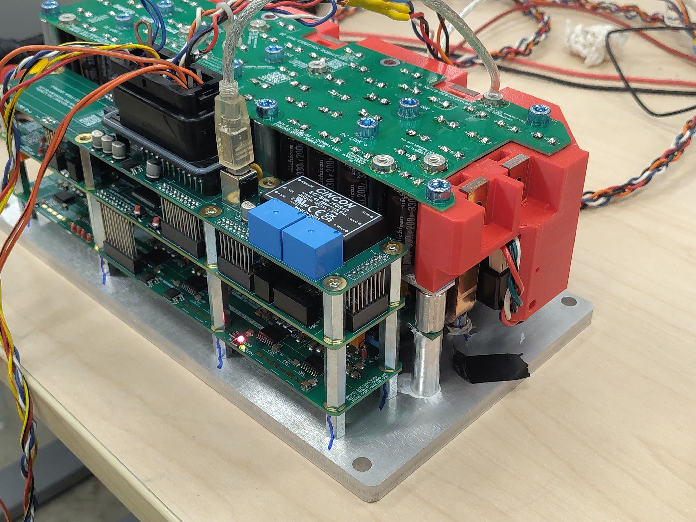
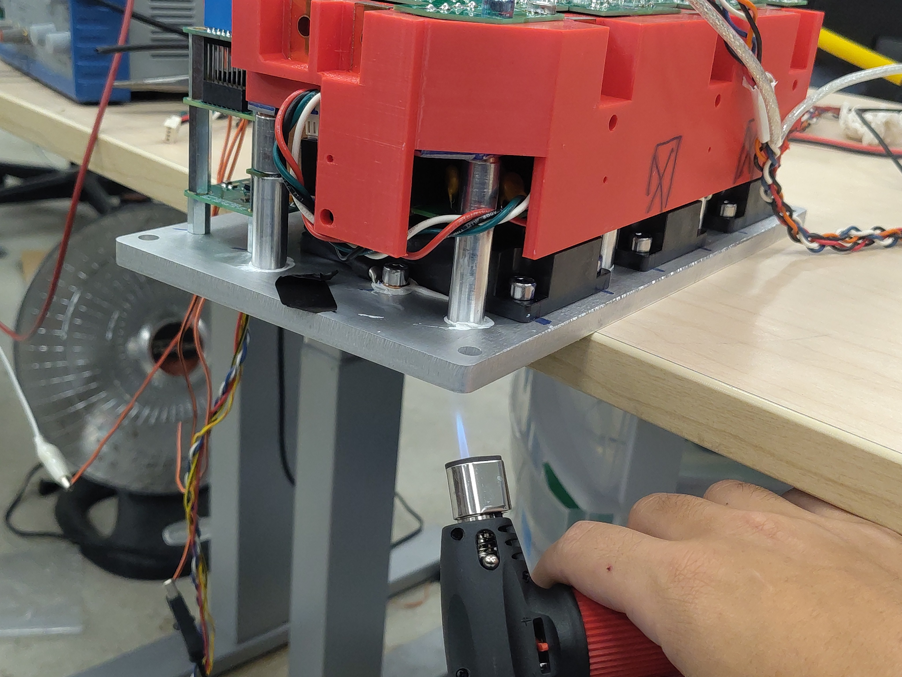
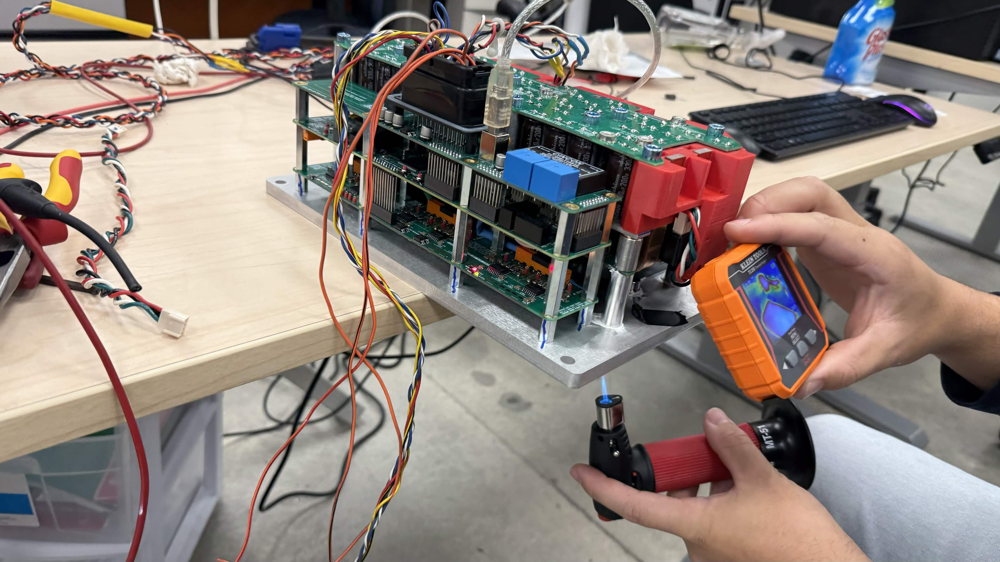
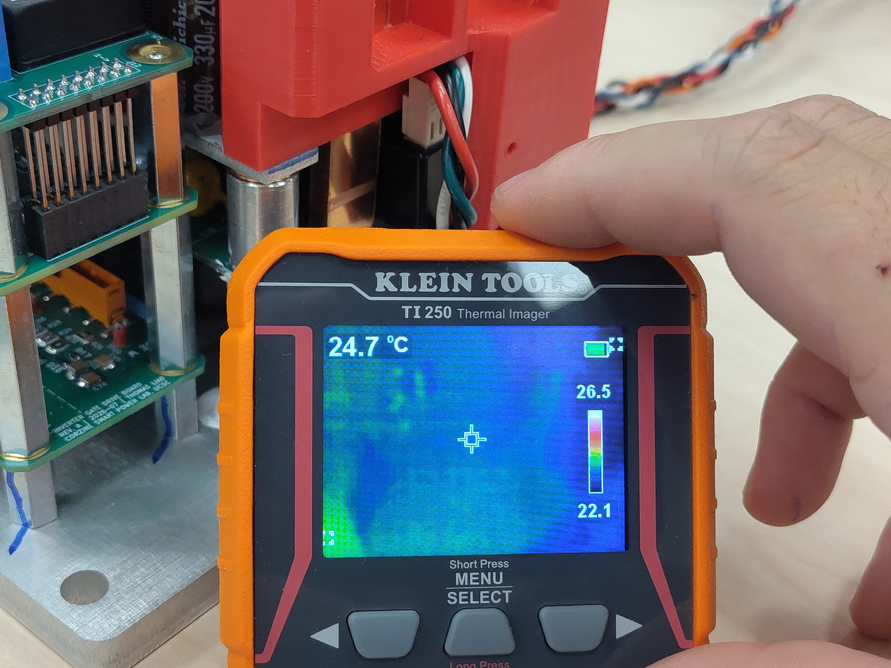
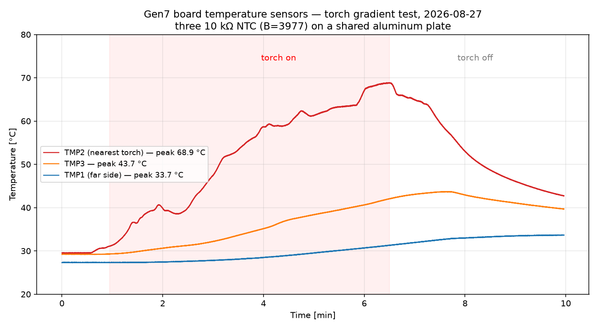
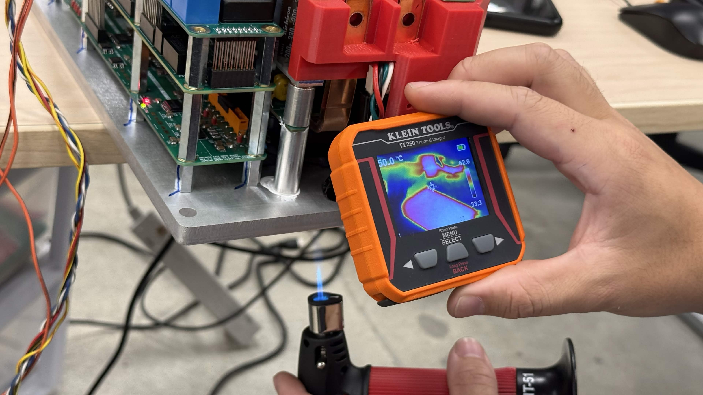

# Gen7 Board Temperature Sensor Validation

This report records the first thermal validation run on **Gen7 hardware** (earlier reports in this section are Gen6/C2). The Gen7 control assembly has three analog board-temperature inputs, `TMP_SENSE_1..3`, each an Amphenol ring-lug NTC thermistor bolted to the shared aluminum base plate. The objective is to validate the complete measurement chain — divider, RC filter, ADC, and firmware conversion — by showing that the three channels agree with each other at uniform plate temperature, agree with a thermal-imager reference, and correctly track an applied thermal gradient.

This run also closes out the firmware repair that made the channels readable at all: `TMP_SENSE_1` was remapped to its actual pin (PF8 / ADC3_INP7, was PA5), and the ADC1 scan channels were connected to the sampling mux by setting the H7 `PCSEL` pre-channel-selection bits (OpenVVVF/RTE commit `abe246a`, branch `coproc-flash-fixes`). Before those fixes every ADC1-scanned channel converted a floating internal mux node and returned wandering garbage.

## Test setup

- **Hardware:** Gen7 control board + gate-driver / DC-link stack on the shared aluminum base plate, bench powered, no motor, gate driver idle
- **Sensors:** 3× Amphenol Advanced Sensors RTS103C1R2M6L201 — 10 kΩ ±2 % NTC @ 25 °C, Beta 3977 K, M6 ring lug, 200 mm leads, bolted to the plate at three locations
- **Divider (per channel):** 10 kΩ pull-up to 3.3 V, NTC to GND, 3 V zener clamp, 1 kΩ + 10 µF RC filter at the MCU pin (fc ≈ 16 Hz)
- **Firmware config:** `Hw.Temp.Bx`: type NTC-beta, R25 = 10000, Beta = 3977, RSer = 10000, Orient = 0
- **Instrumentation:** Klein Tools TI250 thermal imager; 100 Hz telemetry session over USB CDC (`temp_inv1_c`, `temp_inv2_c`, `temp_inv3_c`)

![Live telemetry of the three temperature channels during bring-up, with the [TMP] channel configuration in the boot log](Live-Telemetry.jpg)

## Test conditions

| Parameter | Value |
|-----------|-------|
| Duration | 10 minutes (t = 0..600 s) |
| Baseline | First ~60 s, plate at room temperature |
| Heat input | Butane micro-torch applied to the underside of the plate edge nearest TMP2/TMP3, t ≈ 60..390 s |
| Cooldown | Free convection, t ≈ 390..600 s |
| Ambient | ~22–25 °C (imager scale 22.1–26.5 °C at start) |

## Results

### Baseline agreement (uniform plate, t < 60 s)

| Channel | Baseline | Peak | Final (t = 598 s) |
|---------|----------|------|-------------------|
| TMP1 (far side) | 27.3 °C | 33.7 °C | 33.7 °C |
| TMP2 (nearest torch) | 29.5 °C | 68.9 °C @ t = 389 s | 42.7 °C |
| TMP3 | 29.2 °C | 43.7 °C @ t = 460 s | 39.7 °C |

Baseline spread across the three channels is **2.3 °C** (TMP1 sits ~2 °C below TMP2/3; expected contributors are the plate's idle gradient from the DC/DC converter and gate-driver side, plus the ±2 % resistance tolerance of the thermistors, ≈ ±0.5 °C each). The TI250 baseline cross-hair read **24.7 °C** on the plate surface (scale 22.1–26.5 °C) — within ~3 °C of the NTC readings, with the imager expected to read low on bare low-emissivity aluminum.

### Gradient response and re-convergence

With the torch on the TMP2/TMP3 edge, the channels separated exactly as their physical placement predicts: TMP2 climbed to a 68.9 °C peak, TMP3 followed at reduced amplitude (43.7 °C), and TMP1 on the far side saw only a slow ~6 °C rise. Peak channel-to-channel spread reached 37.5 °C at torch-off. Once the heat was removed all three channels re-converged monotonically (spread 9 °C and still falling at the end of the log) — no channel stuck, jumped, or dropped out at any point.

> **Open telemetry log:** [View the run in the Telemetry Viewer](../../../../Tools/OpenVVVF-Telemetry-Viewer/telemetry-viewer.html?file=../../Safety-and-Compliance/Testing/Hardware/Gen7-Temp-Sensor-Validation/gen7-temp-validation-decimated.jsonl#s=temp_inv1_c:left)

### Cross-check with the thermal imager

At the heated edge the TI250 showed a cross-hair reading of **50.0 °C** with a frame maximum of **62.6 °C** — bracketing the telemetry from the same region at the same time (TMP2 ≈ 60–69 °C, TMP3 ≈ 40–44 °C). Given cross-hair placement uncertainty and the low emissivity of bare aluminum, sensor and imager agree within a few °C.

## Conclusion

All three Gen7 board temperature channels measure within ~2.3 °C of each other at uniform plate temperature and within a few °C of the TI250 reference, both at baseline and under an applied thermal gradient; the gradient response matches the physical sensor placement and re-converges cleanly after heat removal. The channels are validated as within a few degrees of reality and are fit for use in the over-temperature protection path (default limit `Hw.Temp.Bx.CritC` = 90 °C).

## Artifacts

- [Decimated telemetry log (JSONL, 1 s)](gen7-temp-validation-decimated.jsonl) - [open in Telemetry Viewer](../../../../Tools/OpenVVVF-Telemetry-Viewer/telemetry-viewer.html?file=../../Safety-and-Compliance/Testing/Hardware/Gen7-Temp-Sensor-Validation/gen7-temp-validation-decimated.jsonl#s=temp_inv1_c:left)
- [Telemetry overview plot (PNG)](Telemetry-Overview.png)
- Photos: [test setup](Test-Setup.jpg), [live telemetry](Live-Telemetry.jpg), [torch under plate](Torch-Under-Plate.jpg), [torch + imager](Torch-And-Imager.jpg), [baseline thermal](Baseline-Thermal.jpg), [heated thermal](Heated-Thermal.jpg)

## Notes

- The full-rate session log (~30 MB, 100 Hz) is decimated to 1 sample/s for the repository.
- Motor temperature and throttle channels were disconnected during this test.
- TMP1 is sampled on ADC3 (12-bit) and TMP2/3 on ADC1 (16-bit); no systematic difference beyond the baseline offset was observed.
- The DC-link current reference (~1.64 V = half-scaled 2.5 V) was also confirmed sane during this run; the earlier spurious `CurrentSensorRef` fault was a symptom of the same ADC1 mux (PCSEL) bug, not a sensor problem.
