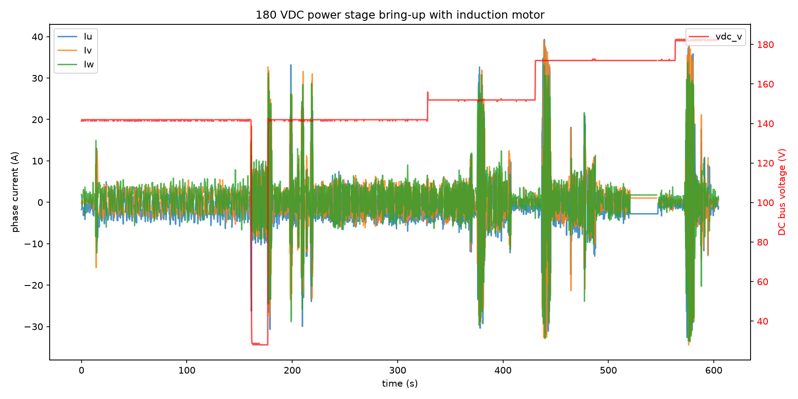

# Induction Motor 180 V Power Stage Bring-up

This report records the first time the C2 power stage was operated with 200 V DC-link capacitors at elevated bus voltage. The TECO MAX-IE3 induction motor was used as a load while the DC bus was stepped from ~140 V up to ~180 V to validate capacitor hold-off, gate-drive operation, and current regulation at the higher rail.

## Test setup

- **Motor:** TECO Westinghouse MAX-IE3 3-phase induction motor, 10 HP / 7.5 kW, 208 V, 60 Hz
- **Inverter:** OpenVVVF C2 chassis with 200 V DC-link capacitors
- **Control:** V/Hz open-loop excitation, no mechanical load
- **Instrumentation:** Tektronix 5 Series MSO oscilloscope, controller telemetry

## Test conditions

| Parameter | Value |
|-----------|-------|
| DC bus voltage | stepped 140 V -> 150 V -> 170 V -> 180 V |
| Commanded frequency | ~60 Hz |
| Mechanical load | None (free spinning shaft) |
| Duration | ~10 min (604 s) |
| Ambient temperature | ~23 °C |

## Electrical observations

The telemetry plot below shows the entire bring-up sequence. The DC bus was increased in discrete steps while the motor remained under V/Hz excitation. Phase current magnitude grew with bus voltage as expected for a no-load magnetizing characteristic, reaching brief peaks above 35 A during transients.

Key events from the log:

| Time (s) | Bus voltage | Observation |
|----------|-------------|-------------|
| 0 - 160 | ~142 V | Stable no-load excitation, small currents |
| ~160 - 180 | dip to ~30 V then back to ~142 V | Supply dropout/reconnect; controller recovered |
| 180 - 320 | ~142 V | Continued stable operation |
| 320 - 420 | ~152 V | First voltage step; currents remain moderate |
| 420 - 560 | ~172 V | Second voltage step; current ripple increases |
| 560 - 604 | ~181 V | Final step to ~180 V; peak phase current ~38 A |

> **Open telemetry log:** [View the 180 V bring-up in the Telemetry Viewer](../../../../Tools/OpenVVVF-Telemetry-Viewer/telemetry-viewer.html?file=../../Safety-and-Compliance/Testing/Hardware/Induction-Motor-180V-Bringup/180v-bringup-decimated.jsonl#s=Iu:left,Iv:left,Iw:left,vdc_v:right)

## Results

- The 200 V capacitor bank held the ~180 V rail without issue.
- Gate-drive and current sensing operated correctly across all voltage steps.
- The controller recovered cleanly from the ~160 s supply dropout.
- Maximum observed DC bus voltage: **182.5 V**.
- Maximum observed phase current (transient): **~38 A**.

## Conclusion

The C2 power stage with 200 V DC-link capacitors successfully ran at 180 VDC while driving the induction motor. This confirms the hardware is usable for nominal 200 V-class DC buses and provides confidence for future higher-voltage loaded tests.

## Artifacts

- [Decimated telemetry log (JSONL, 0.2 s)](180v-bringup-decimated.jsonl) - [open in Telemetry Viewer](../../../../Tools/OpenVVVF-Telemetry-Viewer/telemetry-viewer.html?file=../../Safety-and-Compliance/Testing/Hardware/Induction-Motor-180V-Bringup/180v-bringup-decimated.jsonl#s=Iu:left,Iv:left,Iw:left,vdc_v:right)
- [Telemetry overview plot (PNG)](Telemetry-Overview.png)

## Notes

- The full-rate telemetry log is ~157 MB; the linked file is decimated to 0.2 samples per second for the repository.
- This was an unloaded motor test; loaded current levels at 180 V will be higher and require additional validation.
