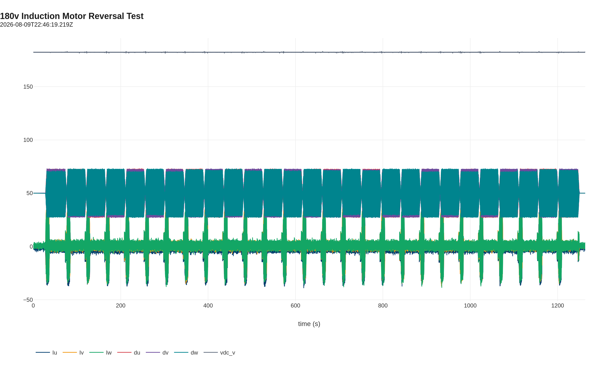

# Induction Motor 180 V 20-Minute Reversal Test

This report records a 20-minute reversal endurance run of the TECO MAX-IE3 induction motor on the C2 power stage at 180 VDC. The motor was commanded to alternate between +60 Hz and −60 Hz every ~45 s to exercise direction-change sequencing, DC-link regulation, and current control under repeated inrush conditions.

## Test setup

- **Motor:** TECO Westinghouse MAX-IE3 3-phase induction motor, 10 HP / 7.5 kW, 208 V, 60 Hz
- **Inverter:** OpenVVVF C2 chassis with 200 V DC-link capacitors
- **Control:** V/Hz open-loop excitation, commanded ±60 Hz, reversing every ~45 s
- **Instrumentation:** Controller telemetry

## Test conditions

| Parameter | Value |
|-----------|-------|
| DC bus voltage | ~182 VDC |
| Commanded frequency | +60 Hz / −60 Hz, alternating |
| Reversal interval | ~45 s |
| Mechanical load | None (free spinning shaft) |
| Duration | ~21 min (1263 s) |
| Ambient temperature | ~23 °C |

## Electrical observations

The plot below shows the full 20-minute run. The bus voltage remained stable near 182 V throughout. Phase-current spikes appear at each reversal as the inverter re-magnetizes the motor in the opposite direction while the rotor is still spinning the other way.

Key metrics from the log:

| Quantity | Value |
|----------|-------|
| Reversals completed | 26 |
| Average reversal interval | 45.0 s |
| Average peak phase current at reversal | ~35.6 A |
| Maximum observed phase current | ~40.9 A |
| Maximum observed DC bus voltage | ~183.2 V |
| Average DC bus voltage | ~182.3 V |

> **Open telemetry log:** [View the reversal test in the Telemetry Viewer](../../../../Tools/OpenVVVF-Telemetry-Viewer/telemetry-viewer.html?file=../../Safety-and-Compliance/Testing/Hardware/Induction-Motor-180V-Reversal/180v-reversal-decimated.jsonl#s=Iu:left,Iv:left,Iw:left,vdc_v:right,ind_hz:right)

## Results

- The C2 power stage completed 26 consecutive reversals at 180 VDC without fault.
- DC bus regulation remained stable; voltage sagged only slightly during reversal current spikes.
- Peak reversal currents averaged ~35.6 A and stayed below ~41 A.
- Direction-change sequencing behaved consistently across all 26 cycles.

## Conclusion

The power stage and V/Hz control tolerate repeated full-speed reversals at 180 VDC on an unloaded induction motor. This validates direction-change robustness for 200 V-class operation and provides a baseline before adding mechanical load.

## Artifacts

- [Decimated telemetry log (JSONL, 0.2 s)](180v-reversal-decimated.jsonl) - [open in Telemetry Viewer](../../../../Tools/OpenVVVF-Telemetry-Viewer/telemetry-viewer.html?file=../../Safety-and-Compliance/Testing/Hardware/Induction-Motor-180V-Reversal/180v-reversal-decimated.jsonl#s=Iu:left,Iv:left,Iw:left,vdc_v:right,ind_hz:right)
- [Telemetry overview plot (PNG)](Telemetry-Overview.png)

## Notes

- The full-rate telemetry log is ~62 MB; the linked file is decimated to 0.2 samples per second for the repository.
- This test used an unloaded motor; loaded reversals will produce higher inrush currents and should be validated separately.
