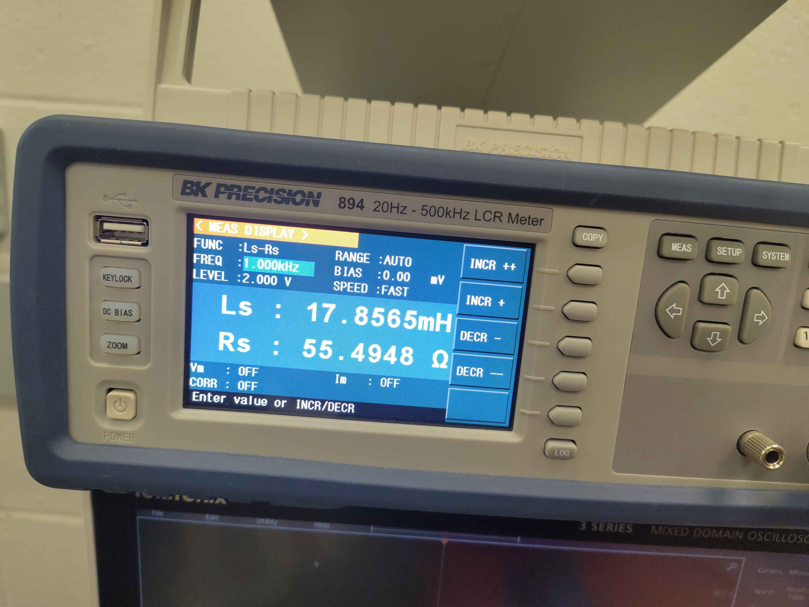
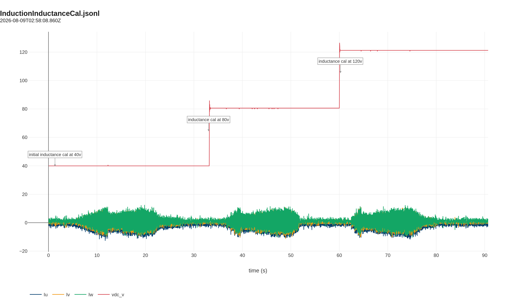

# Inductance Calibration Validation

This report validates the inverter's `cal Motor.Induction.VHz` routine on a TECO MAX-IE3 7.5 kW induction motor. The test is run on the C2 chassis test fixture; the routine itself is shared across all OpenVVVF chassis.

## Test setup

The motor is the same TECO Westinghouse MAX-IE3 3-phase induction motor used for the resistance calibration. Phase leads are accessed at the conduit box for direct LCR measurement.

## Reference measurement

| Parameter | Value | Instrument settings |
|-----------|-------|---------------------|
| Ls | 17.8565 mH | FUNC: Ls-Rs, FREQ: 1.000 kHz, LEVEL: 2.000 V, RANGE: AUTO, SPEED: FAST |
| Rs | 55.4948 Ω | FUNC: Ls-Rs, FREQ: 1.000 kHz, LEVEL: 2.000 V, RANGE: AUTO, SPEED: FAST |

## Inverter calibration result

Command: `cal Motor.Induction.VHz`

The routine applies a 10 Hz V/Hz excitation and hunts for a modulation index that produces roughly 5 A of phase current. It then sweeps several modulation points around that operating point and reports the calculated series inductance `Ls` at each point. The test was repeated at three DC bus voltages to check consistency.

### 40 V bus run

| Point | Modulation | Current | Phase | Ls |
|-------|-----------|---------|-------|-----|
| 1 | 0.182 | 3.28 A | 136.9° | 20.86 mH |
| 2 | 0.221 | 4.28 A | 139.0° | 18.68 mH |
| 3 | 0.260 | 4.68 A | 142.1° | 18.78 mH |

### 80 V bus run

| Point | Modulation | Current | Phase | Ls |
|-------|-----------|---------|-------|-----|
| 1 | 0.084 | 2.98 A | 136.0° | 21.71 mH |
| 2 | 0.102 | 3.98 A | 137.7° | 19.19 mH |
| 3 | 0.120 | 4.71 A | 140.1° | 18.14 mH |

Points 4 and 5 were rejected because the current dropped below the slip threshold.

### 120 V bus run

| Point | Modulation | Current | Phase | Ls |
|-------|-----------|---------|-------|-----|
| 1 | 0.056 | 3.01 A | 135.9° | 21.62 mH |
| 2 | 0.068 | 4.00 A | 137.7° | 19.15 mH |
| 3 | 0.080 | 4.74 A | 140.2° | 18.06 mH |
| 4 | 0.092 | 4.04 A | 145.0° | 21.80 mH |

Point 5 was rejected because the current dropped too low.

> **Open telemetry log:** [View this calibration in the Telemetry Viewer](../../../../Tools/OpenVVVF-Telemetry-Viewer/telemetry-viewer.html?file=../../Safety-and-Compliance/Testing/Hardware/Induction-Motor-Calibration/induction-inductance-cal.jsonl#s=cg_iu_a:left)

## Comparison and conclusion

The highest-current point in each sweep is the most reliable because the phase voltage across the inductance dominates the IGBT knee and dead-time offsets. Averaging those points:

| Quantity | LCR reference | Inverter estimate | Difference |
|----------|---------------|-------------------|------------|
| Ls at ~4.7 A | 17.86 mH | ~18.3 mH | +2.4 % |

The inverter estimate is within a few percent of the LCR reference. The small positive offset is expected: the inverter measurement is taken at a few amperes of excitation current, where slight saturation can raise the apparent inductance compared with the 2 V LCR reading, and the V/Hz estimate includes a small resistive drop correction.

For motor-control purposes, this level of agreement is acceptable. The calibration gives a consistent inductance value across 40 V, 80 V, and 120 V bus levels.

## Artifacts

- [Telemetry log (JSONL)](induction-inductance-cal.jsonl) - [open in Telemetry Viewer](../../../../Tools/OpenVVVF-Telemetry-Viewer/telemetry-viewer.html?file=../../Safety-and-Compliance/Testing/Hardware/Induction-Motor-Calibration/induction-inductance-cal.jsonl#s=cg_iu_a:left)
- [Static inductance plot (PNG)](induction-inductance-cal.png)
- [Static inductance reference photo (JPG)](Motor-LCR-Inductance.jpg)

## Notes

- The Ls-Rs reading is the series inductance and resistance at 1 kHz from the LCR meter.
- The `Rs` value at 1 kHz is the AC series resistance; it is not the same as the DC resistance recorded in the resistance calibration report.
- This motor is an induction machine, not a PMSM, so it is tracked separately from the PMSM calibration report.
