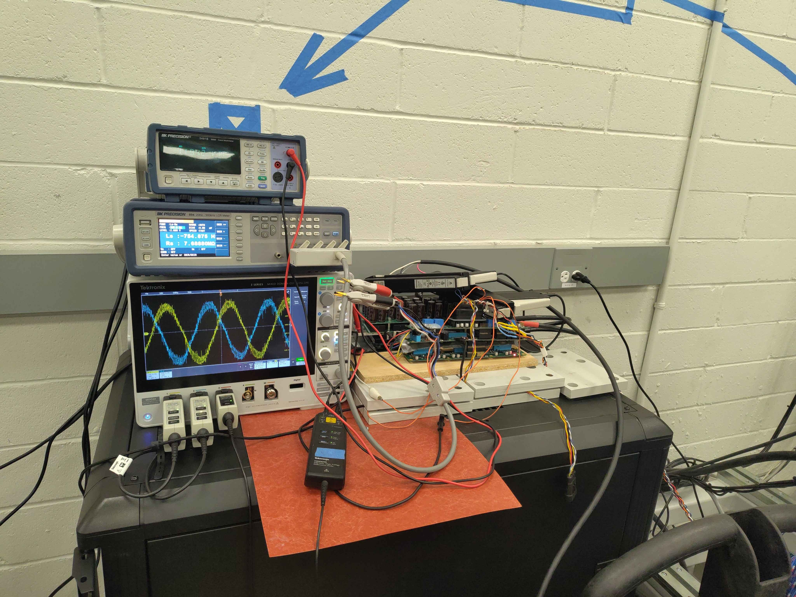
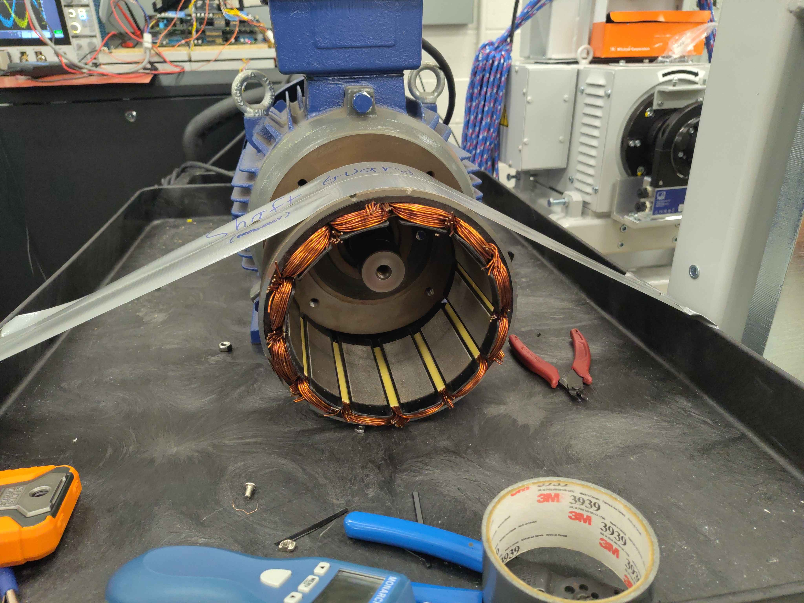
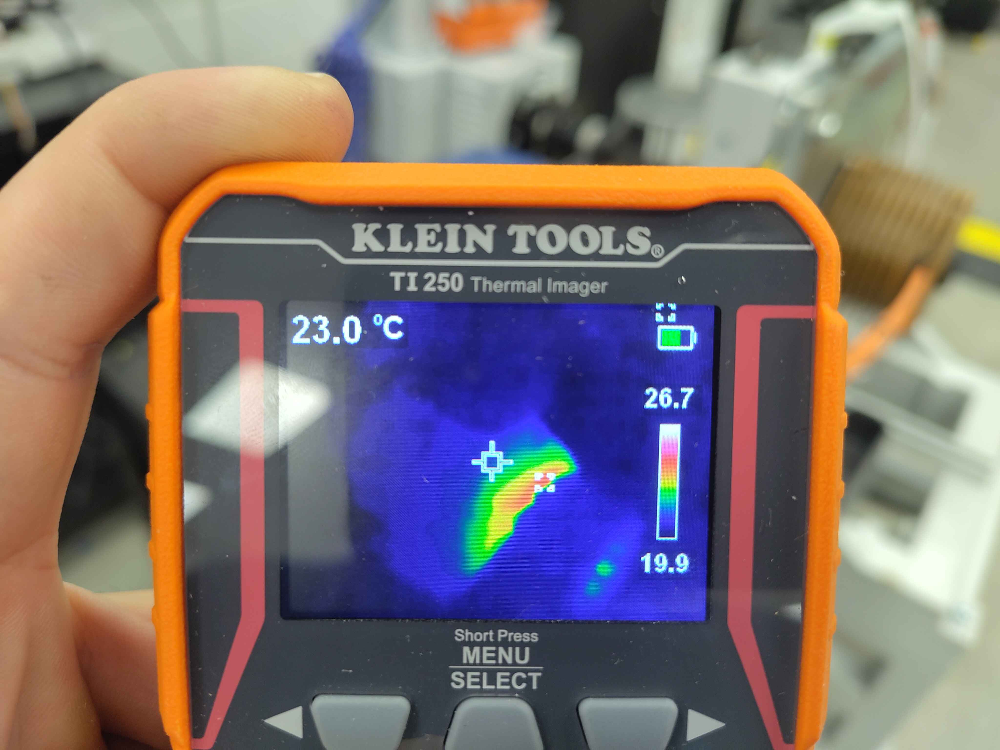
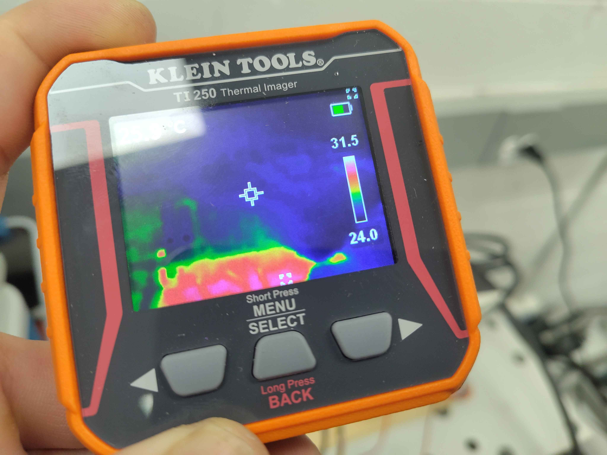
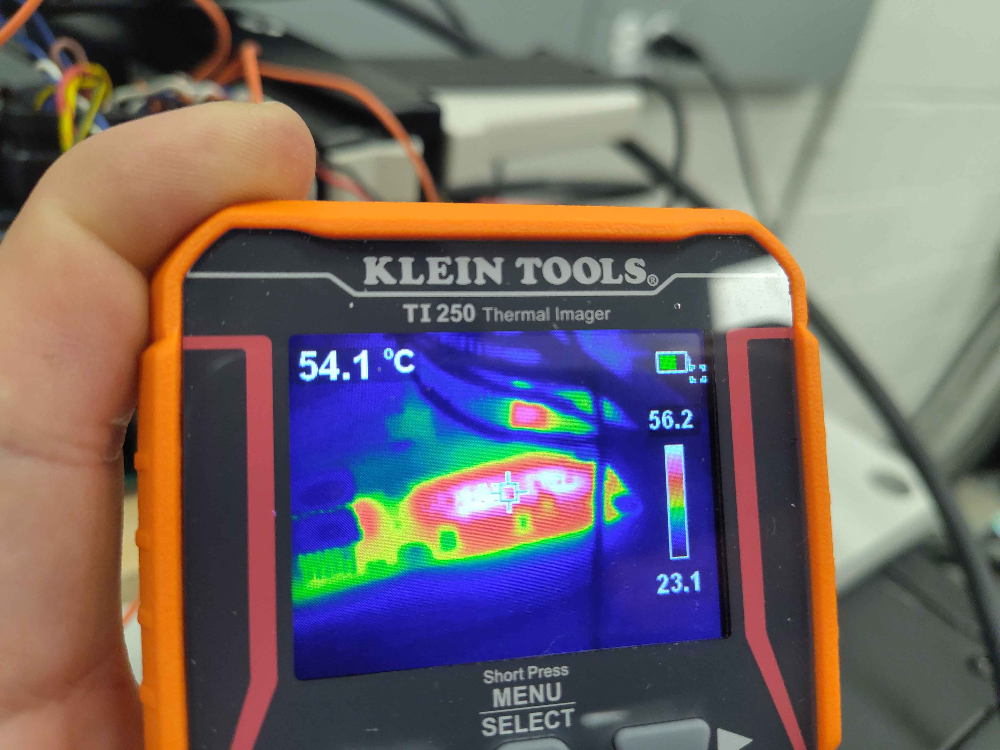
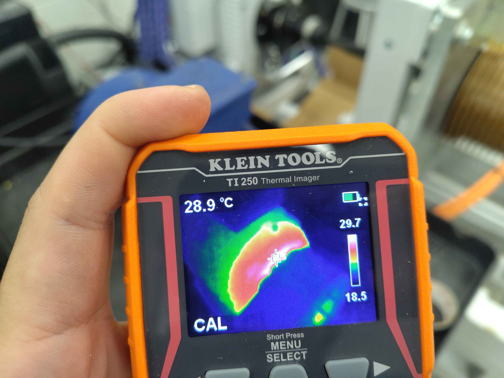
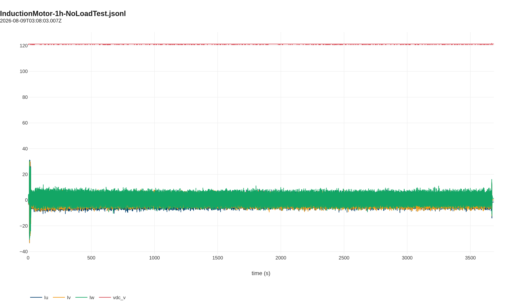

# Induction Motor 1-Hour No-Load Test

This report records a one-hour no-load run of the TECO MAX-IE3 7.5 kW induction motor powered by the C2 chassis inverter at 120 VDC. The objective is to validate gate-driver switching, confirm stable V/Hz operation, and capture a thermal baseline for the power stage and motor under light load.

## Test setup

- **Motor:** TECO Westinghouse MAX-IE3 3-phase induction motor, 10 HP / 7.5 kW, 208 V, 60 Hz
- **Inverter:** OpenVVVF C2 chassis, 120 VDC bus
- **Control:** V/Hz open-loop excitation, ~60 Hz, no mechanical load
- **Instrumentation:** Tektronix 5 Series MSO oscilloscope, BK Precision 894 LCR meter, Klein Tools TI250 thermal imager

## Test conditions

| Parameter | Value |
|-----------|-------|
| DC bus voltage | 120 VDC |
| Commanded frequency | ~60 Hz |
| Mechanical load | None (free spinning shaft) |
| Duration | 1 hour |
| Ambient temperature | ~23 °C |

## Thermal results

Thermal images were taken at several points during the run.

### Motor temperature at start

- **Elapsed:** ~7 min
- **Approximate hotspot:** ~27 °C
- **Notes:** Frame barely above ambient.

### Inverter temperature near end

- **Elapsed:** ~21 min
- **Approximate hotspot:** ~29 °C
- **Notes:** Slow, steady rise on the inverter enclosure.

### Hottest component: gate driver

- **Elapsed:** ~51 min
- **Approximate hotspot:** ~56 °C
- **Notes:** Motor shell clearly warm; this shot captures the warmest region on the gate-driver board.

### Motor temperature near end

- **Elapsed:** ~57 min
- **Approximate hotspot:** ~30 °C
- **Notes:** Different spot on the frame / terminal box area.

## Electrical observations

The inverter maintained stable V/Hz excitation for the full hour. Telemetry shows the DC bus held at ~121 V and the phase currents remained small, consistent with a no-load magnetizing current. The plot below is a decimated view of the entire run; the full interactive log is linked underneath.

> **Open telemetry log:** [View the 1-hour run in the Telemetry Viewer](../../../../Tools/OpenVVVF-Telemetry-Viewer/telemetry-viewer.html?file=../../Safety-and-Compliance/Testing/Hardware/Induction-Motor-No-Load-Test/no-load-1h-decimated.jsonl#s=cg_iu_a:left)

## Conclusion

The C2 inverter and gate-drive subsystem ran continuously for one hour at 120 VDC with no load without fault. The motor temperature rise was modest and consistent with no-load losses. This run establishes a baseline for future loaded thermal tests and confirms the V/Hz drive is functional on the induction machine.

## Artifacts

- [Decimated telemetry log (JSONL, 1 s)](no-load-1h-decimated.jsonl) - [open in Telemetry Viewer](../../../../Tools/OpenVVVF-Telemetry-Viewer/telemetry-viewer.html?file=../../Safety-and-Compliance/Testing/Hardware/Induction-Motor-No-Load-Test/no-load-1h-decimated.jsonl#s=cg_iu_a:left)
- [Test setup photo (JPG)](Test-Setup.jpg)
- [Motor stator photo (JPG)](Motor-Stator.jpg)
- Thermal images: [7 min](Thermal-007min.jpg), [21 min](Thermal-021min.jpg), [51 min](Thermal-051min.jpg), [57 min](Thermal-057min.jpg)

## Notes

- The full-rate telemetry log is ~164 MB; the linked file is decimated to 1 sample per second for the repository.
- Hotspot readings are from the Klein TI250 cross-hair; exact measurement location varied slightly between shots.
