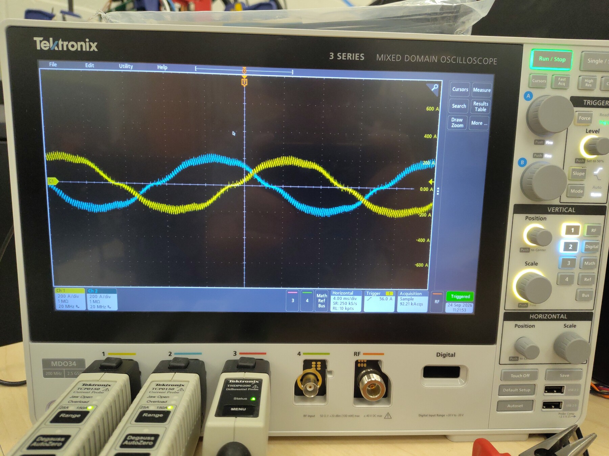
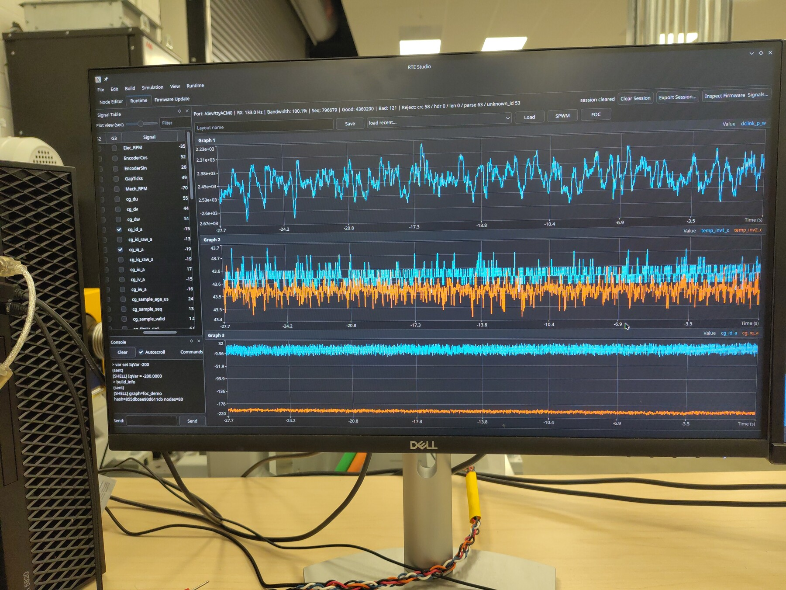
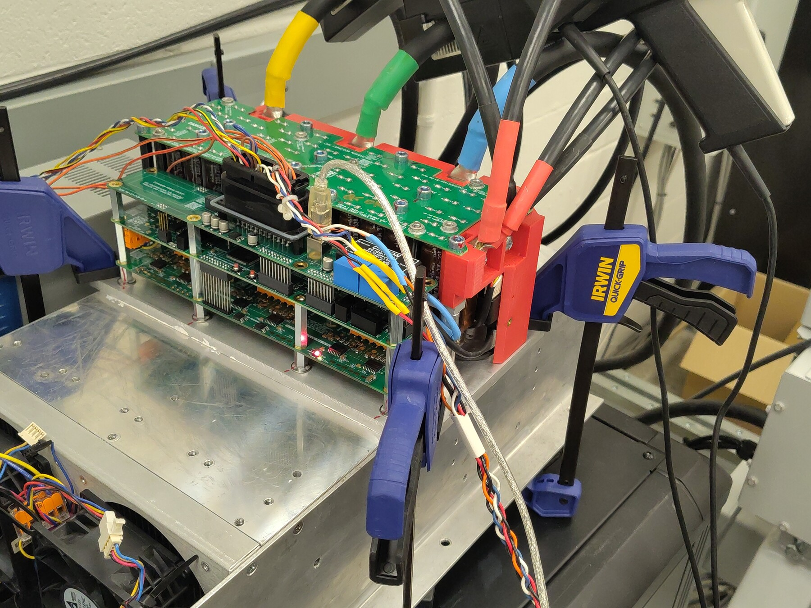
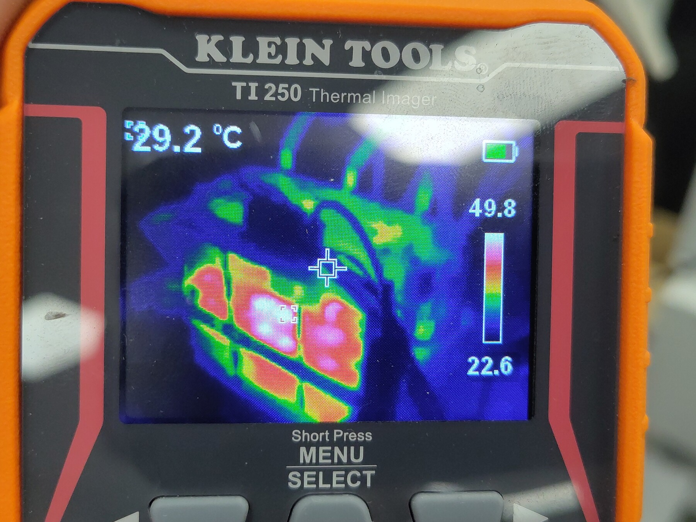
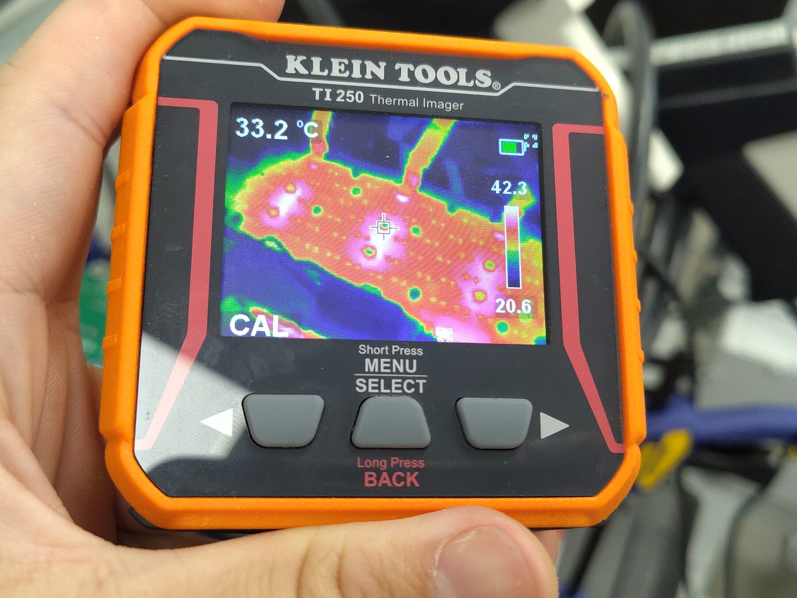
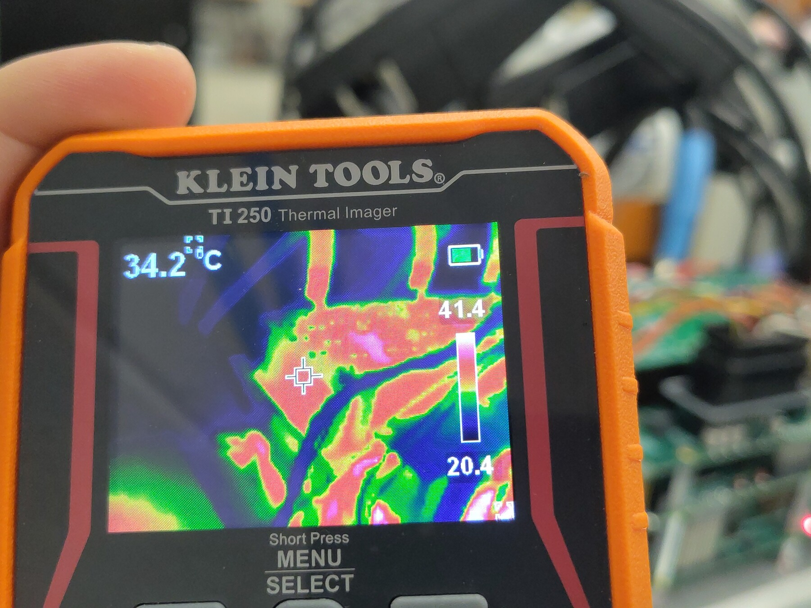
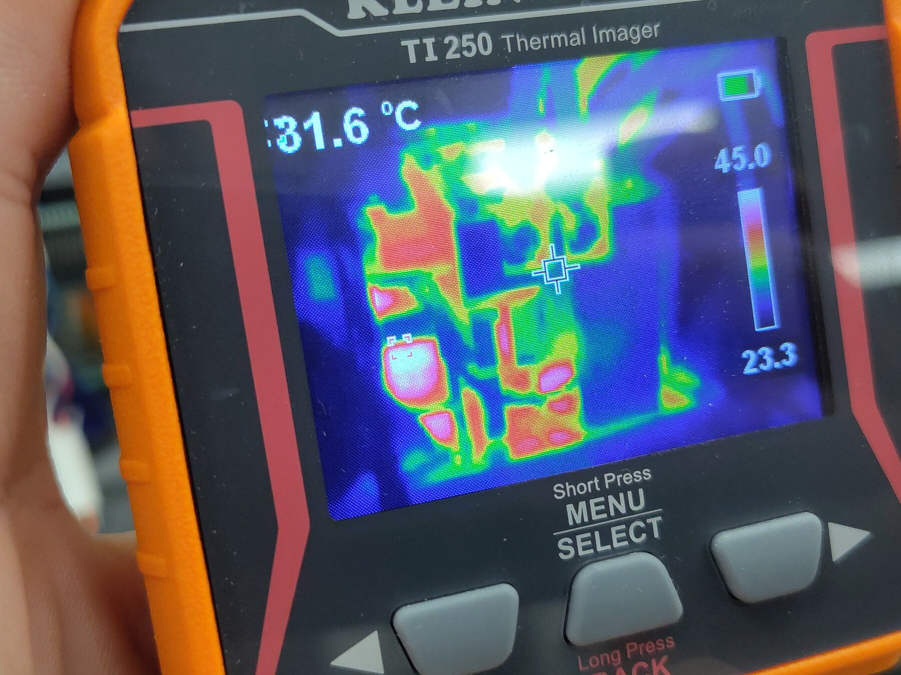
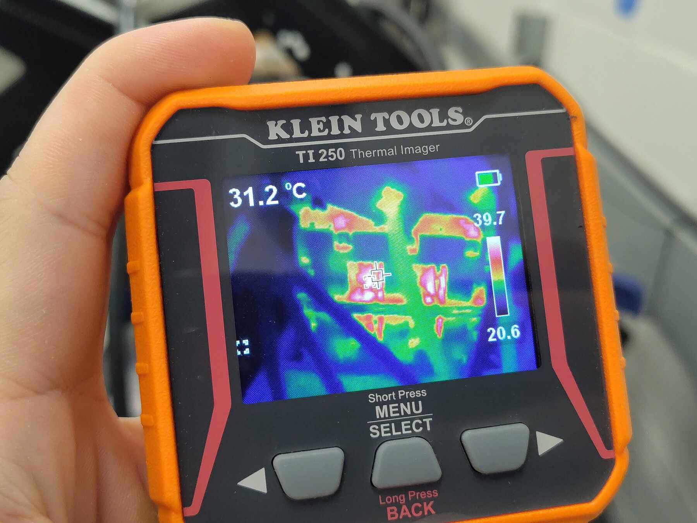
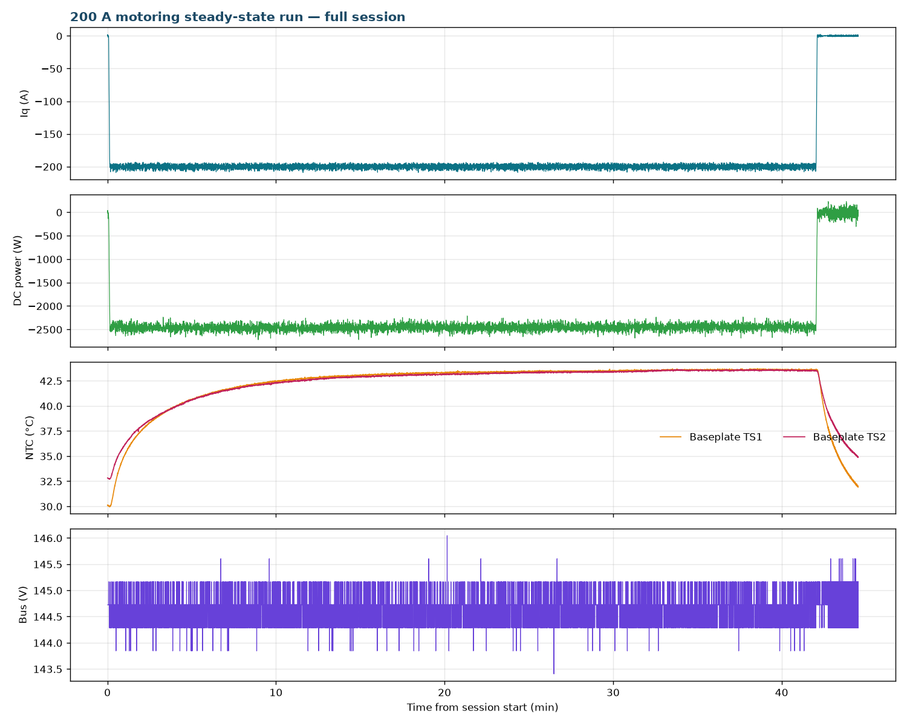

# 200 A Motoring Steady-State Thermal Test — Gen7 Size 2

This report is the motoring-direction counterpart to [OV-TEST-HW-REGEN-200A-STEADY-STATE-GEN7-SIZE2](../Low-Power-Regen-200A-Steady-State-Gen7-Size2/Index.md), run the same evening on the same thermally-pasted assembly: instead of absorbing regen power, the inverter **applied 200 A of positive-torque current** to the dynamometer-coupled PMSM for **42 minutes**, drawing **2.46 kW average from the ~145 V DC link** while the dynamometer held the shaft near −470 RPM.

The steady-state plateau came in at **43.6 °C (TS1) / 43.5 °C (TS2)** — about 0.9 K below the regen run's 44.4 / 44.0 °C. Ambient was not logged, but the operator noted the night-cooled building ran roughly that much cooler, and the TI250's coldest pixels dropped from ~22.6 °C-class readings accordingly. Accounted for ambient, both directions land on the same temperature rise: at 200 A, inverter dissipation is conduction-dominated and does not care which way power flows.

## Test setup

- **DUT:** OpenVVVF Gen7 size 2 (C2) power stage, thermally-pasted interface (same assembly as the regen steady-state run); firmware `foc_demo` graph (hash `855dbcee90d611cb`, same build as the preceding run — OpenVVVF/RTE commit `5b529e2`).
- **Machine:** PMSM/IPM (10 poles) coupled to the Sierra CP Engineering dynamometer at approximately −470 RPM mechanical during the hold.
- **DC supply:** Sorensen bench supply at ~145 V, sourcing ~17 A — no load bank in the loop.
- **Instrumentation:** RTE Studio telemetry, Tektronix 5 Series MSO, Klein Tools TI250 thermal imager.

## Test conditions

| Parameter | Value |
|-----------|-------|
| Hardware | Gen7 size 2 (C2), pasted interface; firmware `foc_demo` hash `855dbcee90d611cb` (RTE commit `5b529e2`) |
| Machine | PMSM/IPM, 10 poles, ~−470 RPM mech during hold |
| Bus | ~144.6 V average (143.4–146.0 V) |
| Current command | `IqVar = −200` (motoring / positive torque), 42.0 min |
| Average Iq over hold | −199.9 A |
| DC-link power | −2.46 kW average (supply sourcing; −2.72 kW max draw) |
| Energy drawn from DC link | ≈1.72 kWh |
| Ambient | not logged; ~0.9 K cooler than the regen run per operator (night-cooled building) |
| Baseplate NTC at steady state | TS1 43.6 °C, TS2 43.5 °C |

## Procedure

1. Powered up and started control — clean boot this session, in contrast to the regen run's startup gate-driver transients; `RUNNING` from t ≈ 0.1 s with no faults at any point.
2. Commanded `IqVar = −200` at t = 4.2 s (slew-limited ramp to full current) and held it for 42.0 minutes.
3. Took oscilloscope, telemetry-screen, and TI250 thermal photos once the baseplate had plateaued, then commanded `IqVar = 0` at t = 2522.5 s and logged the cooldown.

## Electrical results

- **Current:** −199.9 A average Iq, tight regulation throughout.
- **DC link:** −17.0 A average / **−2.46 kW average drawn from the bus** — the supply sources motoring power where the regen run's link returned it. (Sign convention as logged: negative DC-link power = power leaving the link.)
- **Bus:** 144.6 V average, rock steady with no clamp hardware involved.
- **Protection:** `gate_fault` = 0 for the entire session, `cg_vlimit_scale` = 1.000 throughout, no overcurrent events.
- The motoring current waveforms on the oscilloscope are clean sine waves — a useful contrast against the 400 A run's clamp-saturation artifacts, with appropriately rated measurement in the loop this time.

## Thermal results

- **Baseplate TS1** (`temp_inv1_c`): 30.0 °C at the start of the hold → plateau **43.6 °C** (last-10-minute average 43.58 °C). Equilibrium by ~25 minutes.
- **Baseplate TS2** (`temp_inv2_c`): 32.8 °C → plateau **43.5 °C**.
- **Versus the regen run:** the regen-direction plateau was 44.4 / 44.0 °C in an ambient the operator logged at 22.5 °C; this run plateaued 0.8–0.9 K lower in an ambient roughly 0.9 K cooler. The rise over ambient is the same within measurement uncertainty — direction-independent thermal behavior at 200 A, as expected for conduction-dominated losses.
- TI250 spot readings during the photo pass: crosshair 29.2–34.2 °C across views, with coldest pixels at 20.4–24.6 °C depending on framing — consistent with the cooler night room:

## Telemetry overview

> **Open full session:** [View the run in the Telemetry Viewer](../../../../Tools/OpenVVVF-Telemetry-Viewer/telemetry-viewer.html?file=../../Safety-and-Compliance/Testing/Hardware/Low-Power-Motoring-200A-Steady-State-Gen7-Size2/c2-200v-200a-positive-torque-steady-state-decimated.jsonl#s=cg_iq_a:left)

## Observations

- Boot was clean — no gate-driver or phase-overcurrent transients, unlike the regen steady-state session earlier that evening. Both sessions share the same firmware build; the difference appears to be power-up state rather than software.
- The DC link here sources ~2.5× the power the regen run returned (~2.46 kW drawn vs 0.95 kW returned) at the same 200 A and similar shaft speed — motoring supplies both machine copper loss and shaft power, while regen only returns the shaft-derived EMV component.
- Shaft speed held near −470 RPM throughout, with a brief dip/spin transient around the stop at t = 2522 s.
- TS3 (`temp_inv3_c`) remained disabled (wiring defect, unrelated to the test); `temp_motor_c` is unpopulated.

## Conclusion

**Pass.** The thermally-pasted Gen7 size 2 assembly holds a continuous 200 A motoring command (2.46 kW drawn, ~145 V bus) at true steady state with baseplate temperatures of 43.6 / 43.5 °C — matching the regen-direction plateau once the cooler night ambient is accounted for. Bidirectional 200 A continuous-duty operation is validated on the pasted assembly.

## Artifacts

- [Decimated telemetry log (JSONL, 1 sample/s)](c2-200v-200a-positive-torque-steady-state-decimated.jsonl) — [open in Telemetry Viewer](../../../../Tools/OpenVVVF-Telemetry-Viewer/telemetry-viewer.html?file=../../Safety-and-Compliance/Testing/Hardware/Low-Power-Motoring-200A-Steady-State-Gen7-Size2/c2-200v-200a-positive-torque-steady-state-decimated.jsonl#s=cg_iq_a:left)
- [Telemetry overview plot](Telemetry-Overview.png)
- [Full source telemetry log](c2-200v-200a-positive-torque-steady-state.jsonl), retained for traceability
- Photos: [motoring currents on scope](Oscilloscope-Motoring-Currents.jpg), [RTE telemetry screen](RTE-Telemetry-Screen.jpg), [bench setup](Bench-Setup.jpg), [power stage detail](Power-Stage-Detail.jpg)
- Thermal images: [view 1](Thermal-01.jpg), [view 2](Thermal-02.jpg), [view 3](Thermal-03.jpg), [view 4](Thermal-04.jpg), [view 5](Thermal-05.jpg)
- Full-resolution originals of the photos are retained alongside as `*-Original.jpg`.
