# Low-Power Regen 100 A Phase-Current Endurance (No Cooling)

This report records a regenerative-braking endurance run on the OpenVVVF C2-class power stage. A Sierra CP Engineering dynamometer spun the coupled machine at ~280 RPM while the inverter applied negative q-axis current in 10 A steps up to −100 A, then held −100 A for 22 minutes. The point of the test is in the name: the DC bus was only ~52 V, so 100 A of phase current amounts to roughly 300 W of electrical power — full phase-current stress at very low power — and the bare board stack ran with **no heatsink and no forced-air cooling** the entire time.

## Test setup

- **DUT:** OpenVVVF control module on a C2-class power stage with the dynamometer termination/connection board (silkscreen Rev 2). The stack is bare on an aluminum plate: no heatsink, no fan, natural convection only.
- **Machine:** 10-pole (5 pole-pair) 3-phase induction machine, shaft driven by the dynamometer through a torque flange (ATO-101-005) at ~280 RPM.
- **DC supply:** BK Precision bench supplies holding a ~52 VDC bus; regenerated energy returned to the bus/supply.
- **Instrumentation:** RTE Studio telemetry logged at ~14 Hz (19,463 samples), Klein Tools TI250 thermal imager, Tektronix 5 Series MSO, Sierra Trakkor dyno software.

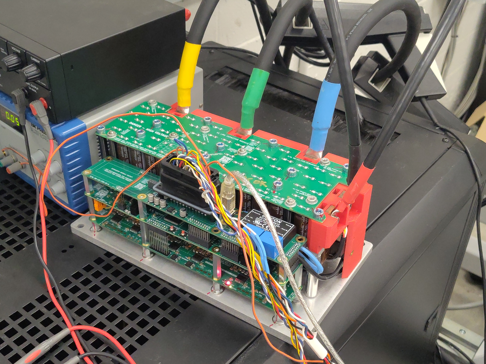

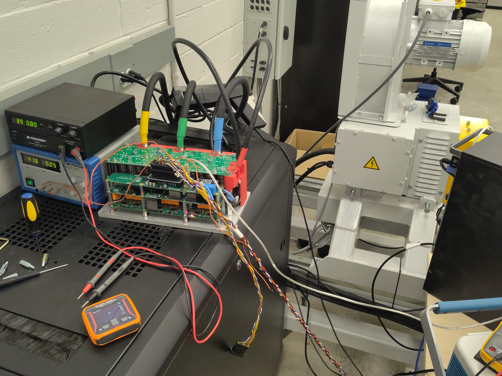

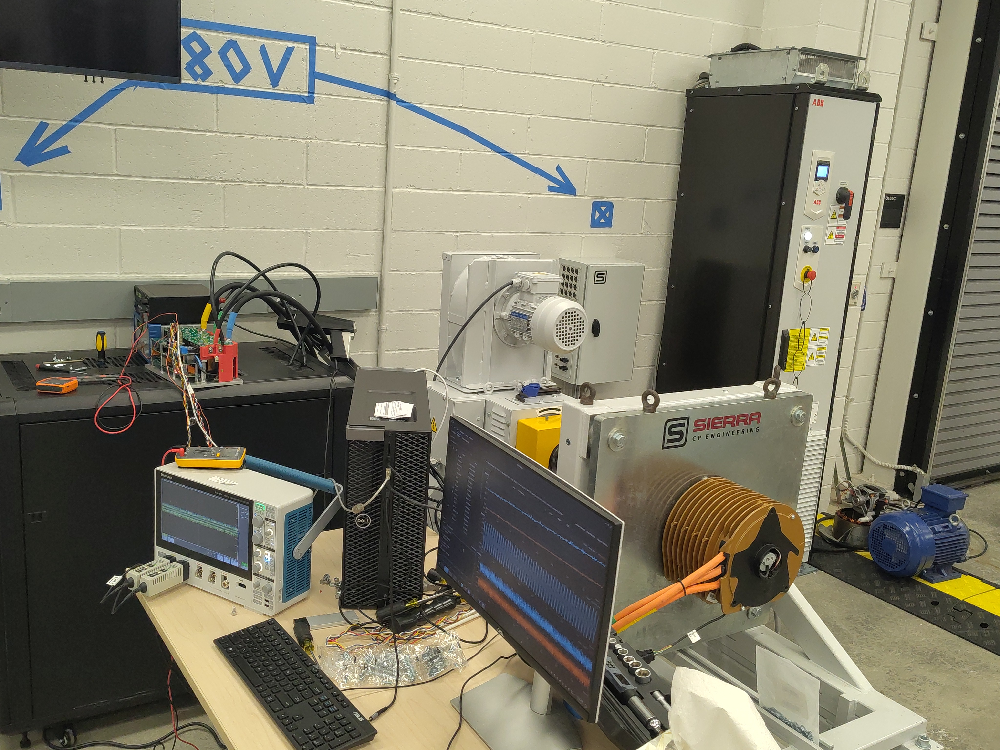

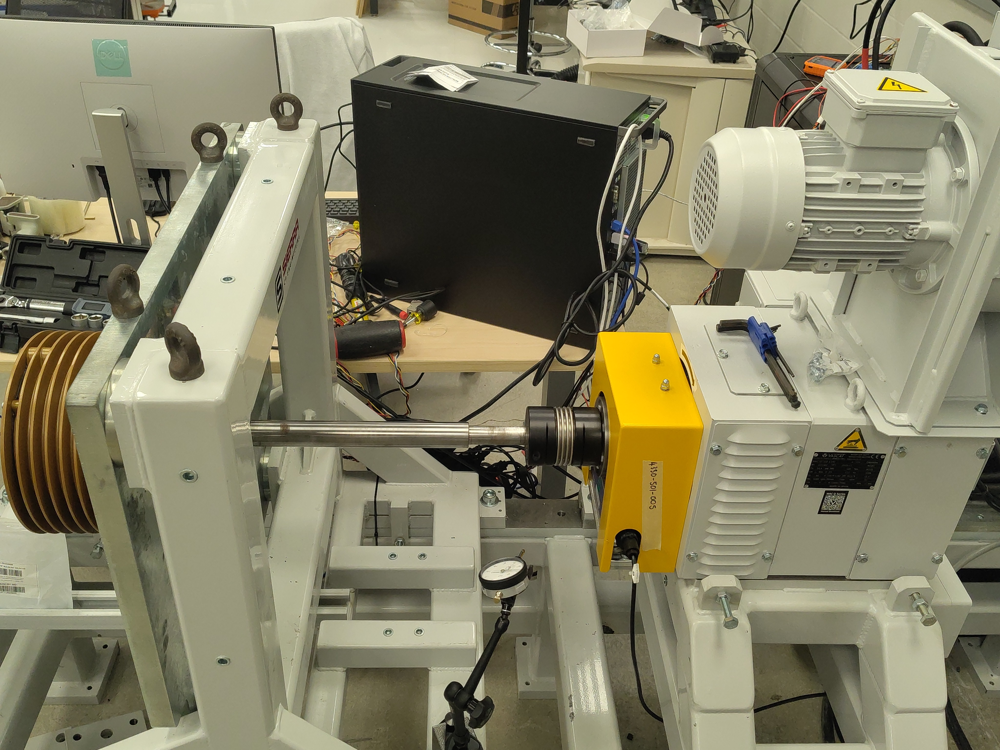

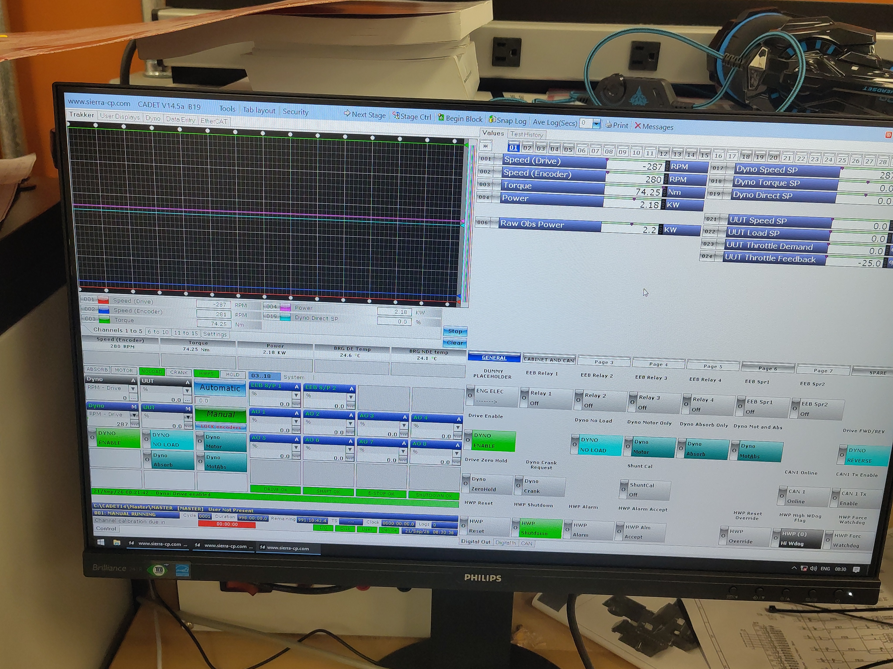

## Test conditions

| Parameter | Value |
|-----------|-------|
| DC bus voltage | ~52 VDC (50.6–52.6 V observed) |
| Shaft speed | ~280 RPM (dynamometer-held; sagged to ~263 RPM at full regen torque) |
| Current command | Direct `IqVar` override, 0 → −10 → … → −100 A in 10 A steps, then hold |
| Hold at −100 A | 22.0 min (t = 35 s to 1355 s of the log) |
| Electrical power at 100 A | ~296 W average into the DC bus (~5.8 A DC-link) |
| Ambient temperature | ~23–27 °C |
| Cooling | None (open-air natural convection, bare stack) |
| Throttle inputs | 0 throughout (pure current override) |

## Procedure

1. Dynamometer spins the machine at ~286 RPM with the DUT enabled and `IqVar = 0` (baseline, ~9 s).
2. `IqVar` stepped −10 A per command to −100 A over ~25 s.
3. Held at −100 A for 22 minutes while telemetry and thermal images were captured.
4. Released to `IqVar = 0`; logging continued ~20 s into cooldown.

## Electrical results

Per-step statistics from the full-rate telemetry log (Pdc = DC-link power, Idc = DC-link current):

| Iq command | Step duration | Avg Iq | Peak \|phase\| | Avg Pdc | Avg Idc |
|------------|---------------|--------|----------------|---------|---------|
| 0 (baseline) | 9.3 s | +0.1 A | 4 A | −30 W (supply feed) | −0.6 A |
| −10 A | 4.2 s | −9.9 A | 13 A | 23 W | 0.4 A |
| −20 A | 2.0 s | −19.0 A | 21 A | 69 W | 1.3 A |
| −30 A | 3.7 s | −32.8 A | 50 A | 108 W | 2.1 A |
| −40 A | 2.0 s | −35.3 A | 48 A | 149 W | 2.9 A |
| −50 A | 3.3 s | −50.0 A | 64 A | 171 W | 3.3 A |
| −60 A | 2.1 s | −55.3 A | 74 A | 200 W | 3.9 A |
| −70 A | 2.4 s | −68.7 A | 86 A | 238 W | 4.6 A |
| −80 A | 2.4 s | −81.6 A | 104 A | 264 W | 5.1 A |
| −90 A | 3.4 s | −90.3 A | 118 A | 279 W | 5.4 A |
| **−100 A (hold)** | **22.0 min** | **−100.0 A** | **145 A** | **299 W** | **5.8 A** |

During the 22-minute hold:

- Average q-axis current was −100.0 A with every one of the 16,628 settled samples below zero — continuous, uninterrupted regen.
- Instantaneous phase-current peaks reached ±145 A (100 A fundamental plus switching ripple and brief `id` excursions).
- DC-link power averaged 299 W (max 381 W) at ~5.8 A; total regen energy over the hold was ≈390 kJ (≈108 Wh), ≈109 Wh for the whole run. This is the "low power" in the title: full phase current, but only ~0.3 kW because the bus is 52 V.
- Bus voltage stayed in a tight 50.6–52.6 V band with no sign of regeneration-induced overvoltage.

## Thermal results

Board NTCs (inside the stack) climbed steadily and plateaued, with no runaway:

- **Inverter temp 1:** 33.4 °C → 79.1 °C (peak 79.4 °C) — about **+46 K**
- **Inverter temp 2:** 35.6 °C → 80.3 °C (peak 80.4 °C, reached seconds after release) — about **+45 K**
- After release, both sensors began cooling immediately (77.7 / 79.1 °C by the end of the log).

Thermal imager spot readings on the exterior (all taken during the −100 A hold):

### Board, early in the hold (~7 min)

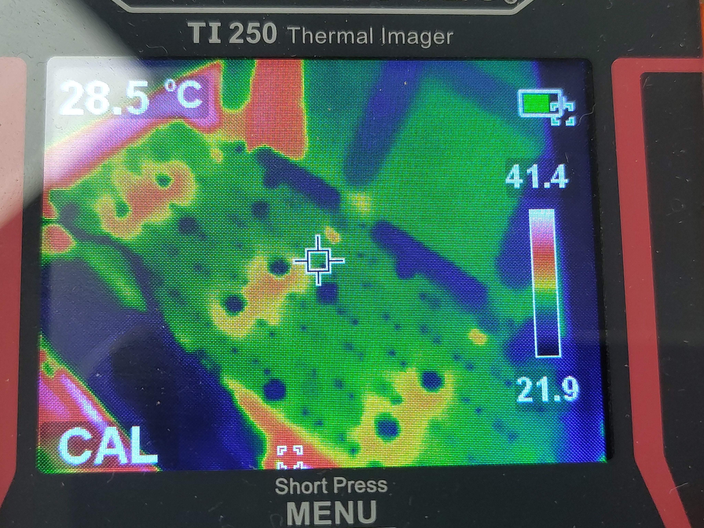

- **Crosshair:** 28.5 °C; imager span 21.9–41.4 °C.

### DC-link capacitors, early (~7 min)

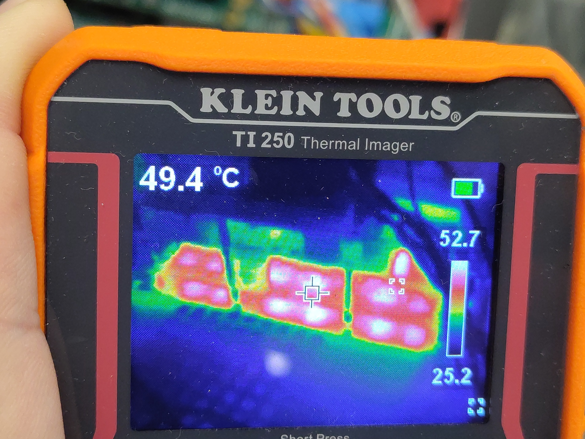

- **Crosshair:** 49.4 °C; max 52.7 °C.

### DC-link capacitors (~8 min)

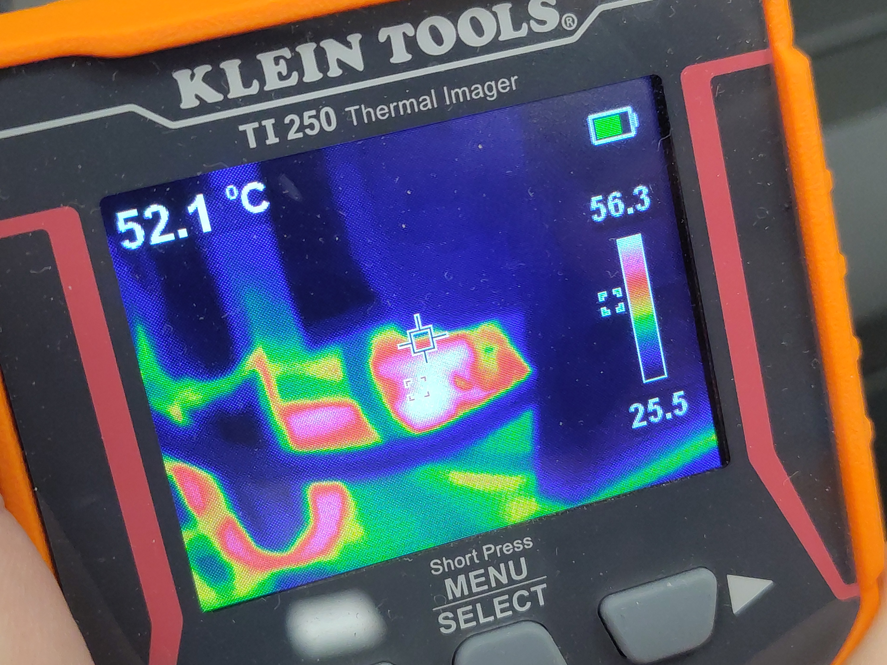

- **Crosshair:** 52.1 °C; max 56.3 °C.

### Board, late in the hold (~18 min)

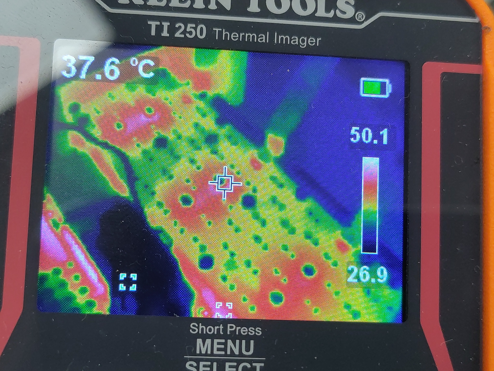

- **Crosshair:** 37.6 °C; max 50.1 °C.

### Phase cabling / lugs, late (~18 min)

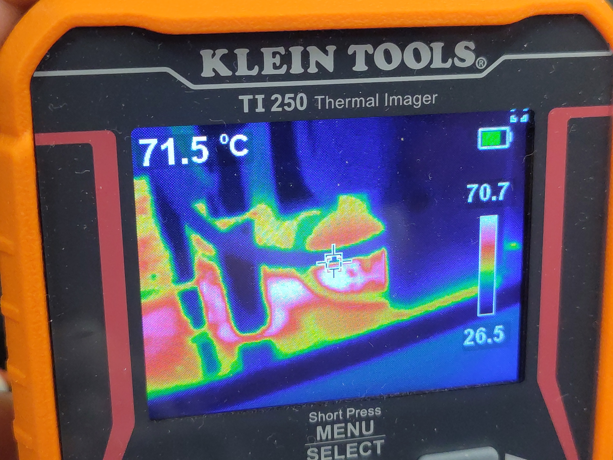

- **Crosshair:** 71.5 °C; max 70.7 °C scale top — the hottest exterior surface observed.

### DC-link capacitors, late (~18 min)

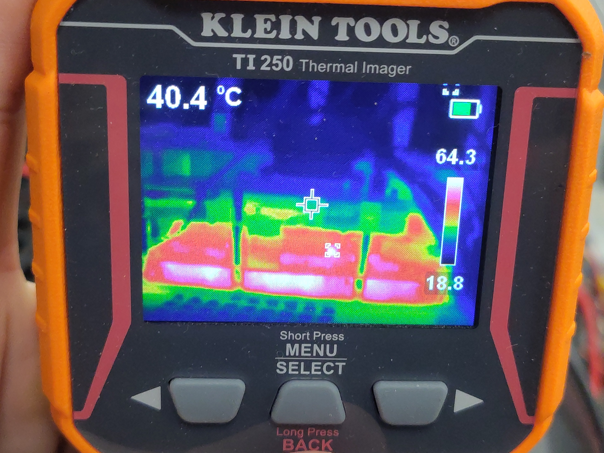

- **Crosshair:** 40.4 °C; max 64.3 °C along the capacitor bodies.

### End state on the RTE Studio screen (~19 min)

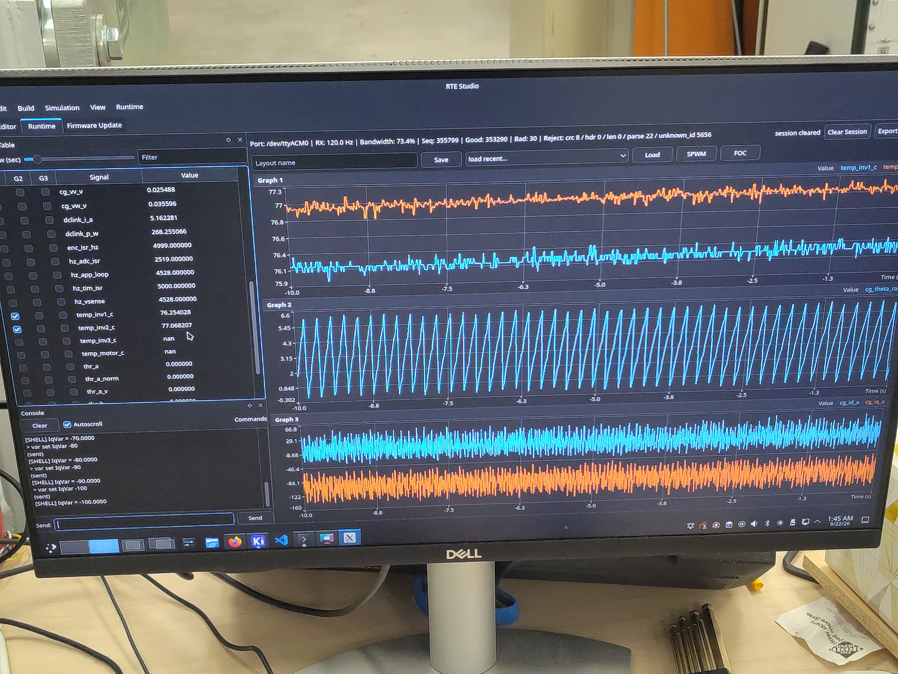

- Console history shows the final steps down to `IqVar = -100`; live values read 76.3 / 77.1 °C board temps with 5.16 A / 268 W on the DC link — consistent with the logged data.

## Telemetry overview

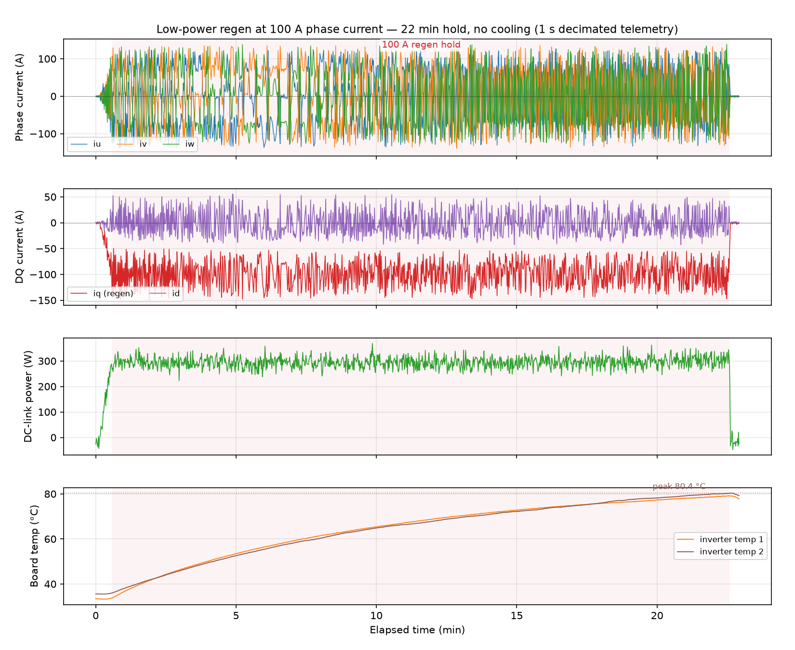

> **Open telemetry log:** [View the run in the Telemetry Viewer](../../../../Tools/OpenVVVF-Telemetry-Viewer/telemetry-viewer.html?file=../../Safety-and-Compliance/Testing/Hardware/Low-Power-Regen-100A-No-Cooling/regen-100a-decimated.jsonl#s=cg_iq_a:left)

## Observations

- No faults, trips, or resets at any point; the current loop held −100 A for the full 22 minutes without intervention.
- This is deliberately a *current* stress, not a *power* stress: at 52 VDC the bus sees only ~6 A even at 100 A phase current. It verifies conduction paths, current sensing, and gate drive at rated phase current with essentially no cooling infrastructure.
- Shaft speed sagged from ~280 to ~263 RPM as regen torque loaded the dynamometer's speed control.
- The `temp_inv3_c` and `temp_motor_c` channels were unpopulated (null) for this build.
- Interior NTCs read ~10–15 °C above the hottest exterior imager spots — expected, as the sensors sit inside the stack next to the dissipating devices.
- Thermal imager readings are crosshair/spot values from an auto-scaled palette; treat them as ±2–3 °C.

## Conclusion

**Pass.** The bare C2-class power stage sustained a 100 A regenerative phase current for 22 minutes with no cooling and no faults. Peak board temperature was 80.4 °C (≈+46 K over ambient start) with a clear plateau, and the hottest exterior point (phase lugs) reached ~71.5 °C. The power stage demonstrably tolerates rated phase current at low DC-bus voltage on natural convection alone, with comfortable thermal margin. This run complements the no-load and 180 V induction-motor bring-up tests by covering the high-current/low-voltage regen corner.

## Artifacts

- [Decimated telemetry log (JSONL, 1 s)](regen-100a-decimated.jsonl) - [open in Telemetry Viewer](../../../../Tools/OpenVVVF-Telemetry-Viewer/telemetry-viewer.html?file=../../Safety-and-Compliance/Testing/Hardware/Low-Power-Regen-100A-No-Cooling/regen-100a-decimated.jsonl#s=cg_iq_a:left)
- [Telemetry overview plot (PNG)](Telemetry-Overview.png)
- Photos: [DUT bare stack](DUT-Bare-Stack.jpg), [bench](Bench-Supplies.jpg), [test cell](Test-Cell.jpg), [dyno coupling](Dyno-Coupling.jpg), [dyno screen](Dyno-Screen.jpg), [RTE Studio end state](RTE-Studio-End.jpg)
- Thermal images: [board ~7 min](Thermal-Board-007min.jpg), [caps ~7 min](Thermal-Caps-007min.jpg), [caps ~8 min](Thermal-Caps-008min.jpg), [board ~18 min](Thermal-Board-018min.jpg), [cables ~18 min](Thermal-Cables-018min.jpg), [caps ~18 min](Thermal-Caps-018min.jpg)

## Notes

- The full-rate log (19,463 samples, 16 MB) is retained alongside this report as `100a-regen-test.jsonl` (not committed); the linked artifact is decimated to one sample per second for the repository.
- Photo elapsed times assume the camera clock (UTC-7) matches the session wall clock; the telemetry session ran 08:26–08:49 UTC on 2026-09-22.
- The dyno screen photo shows the cell's Trakkor display (shaft speed ~280 RPM) for context; electrical values in this report are from the DUT's own telemetry unless stated.
