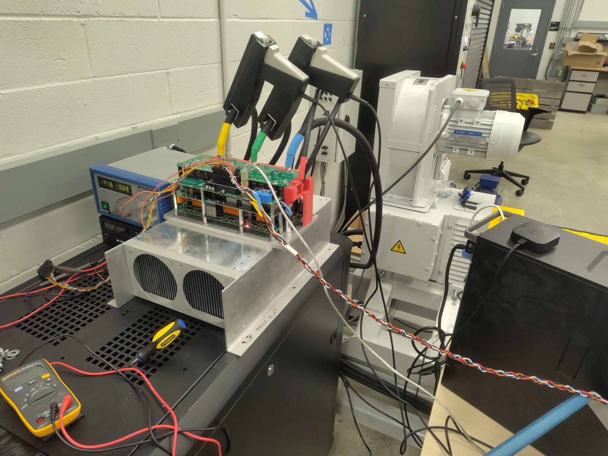
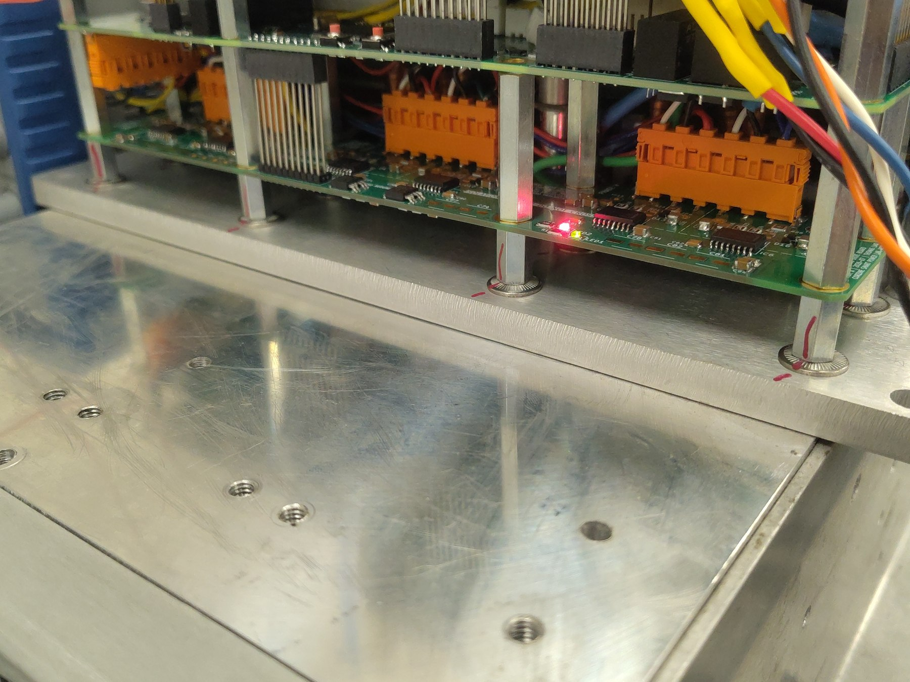
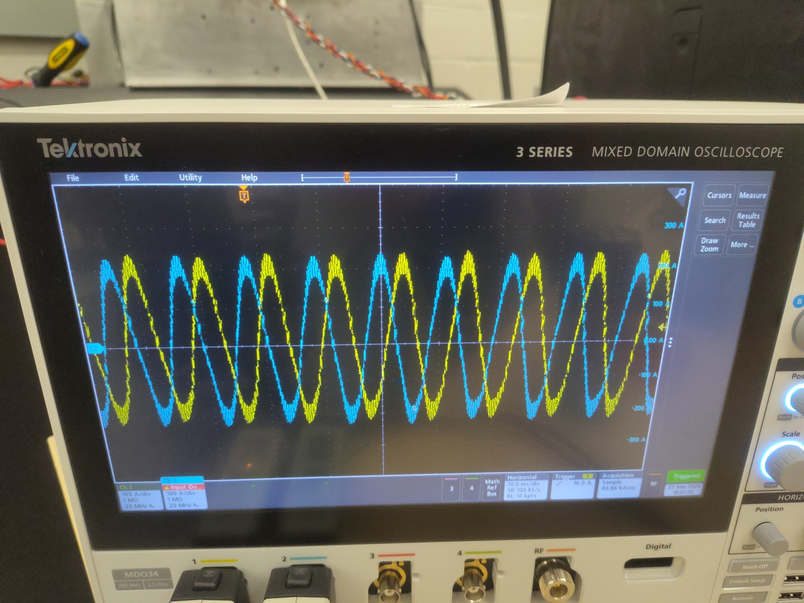
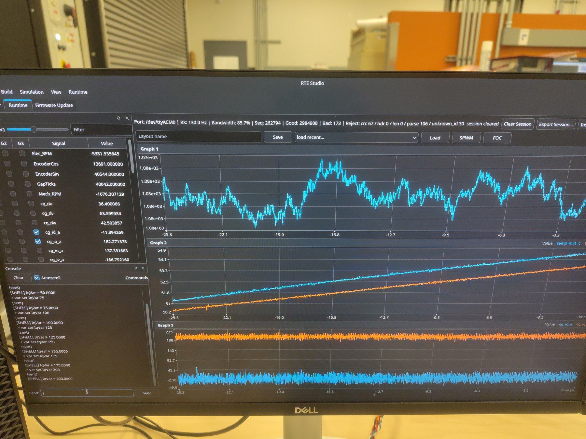
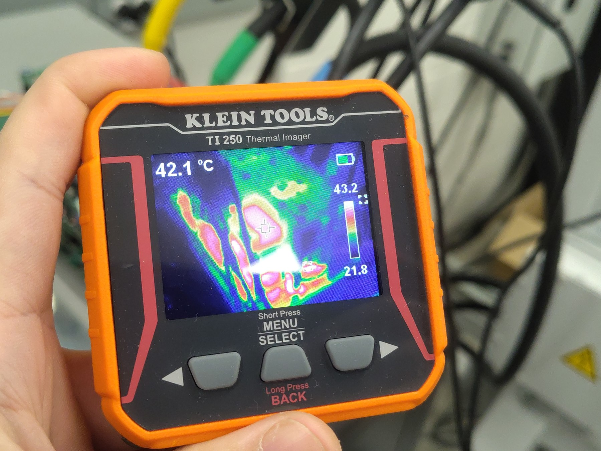
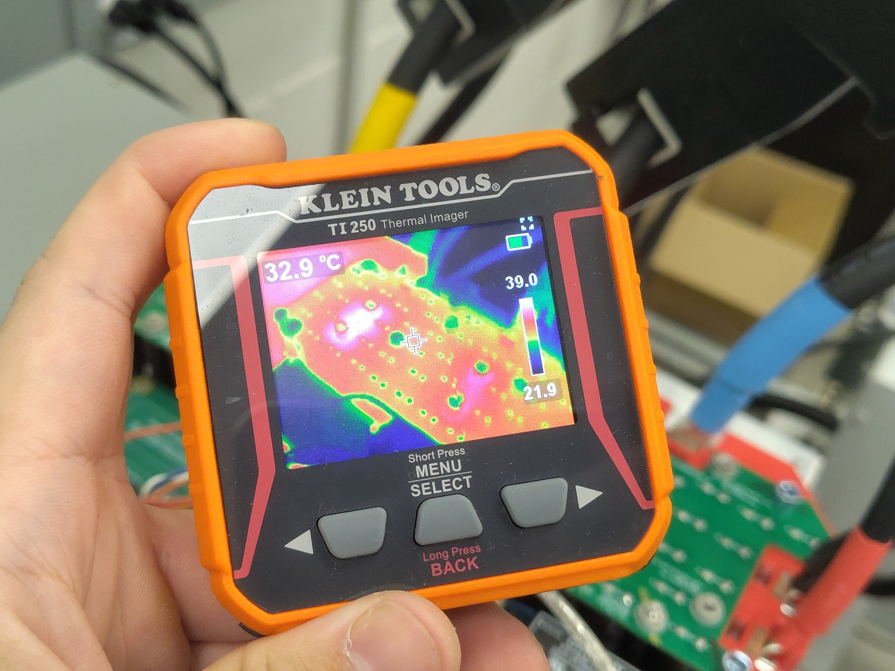
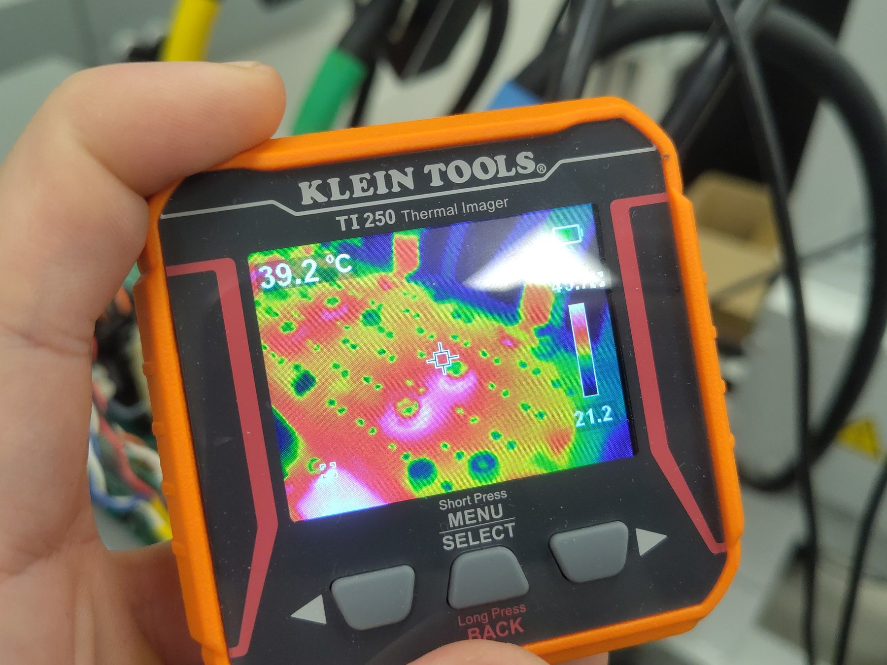
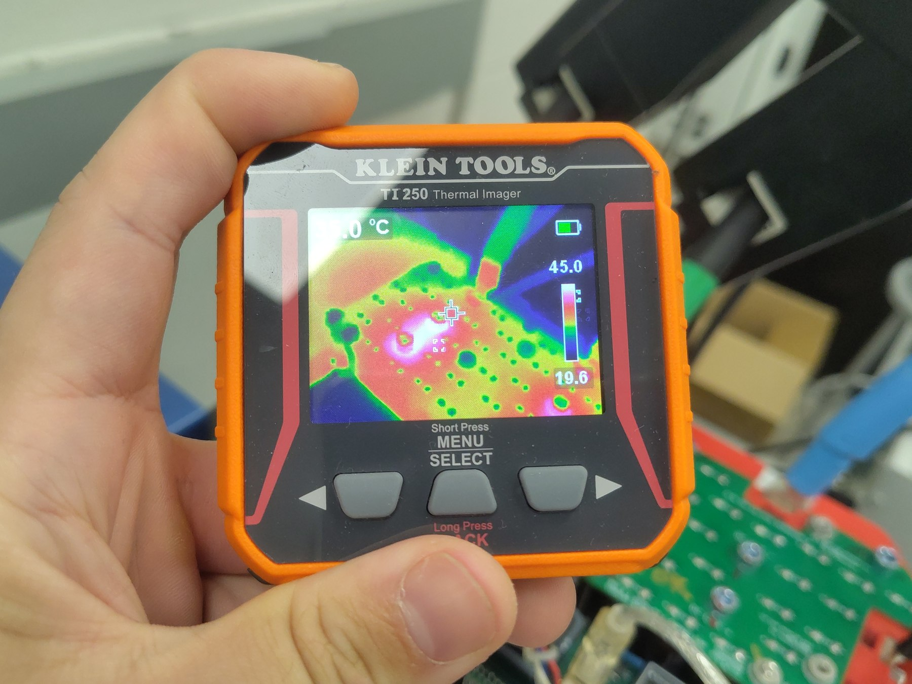
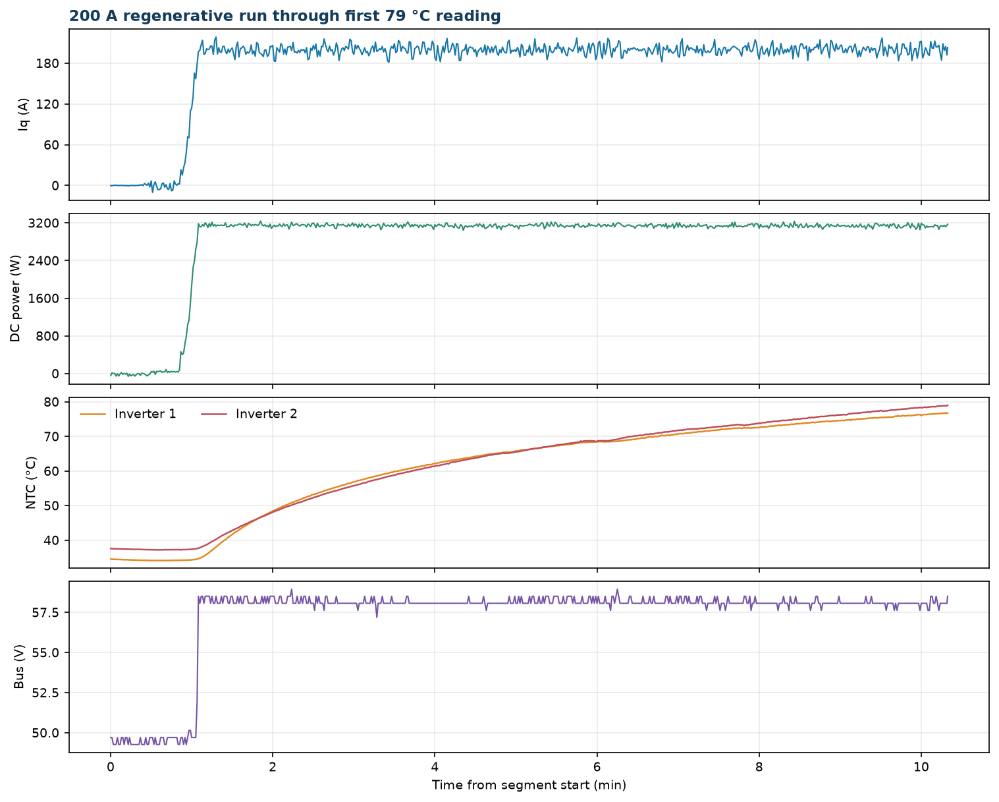

# 200 A Regen to 79 °C — Gen7 Size 2

This report covers the first portion of a regenerative dynamometer run on Gen7 size 2 hardware. The inverter was commanded in 25 A steps to 200 A q-axis current, then held there until inverter temperature sensor 2 first reached 79 °C. The selected analysis interval ends at **t = 619.492 s**, 9 min 15 s after the 200 A command. Over the 200 A hold to that point, the logged DC link received about 3.14 kW on average, or approximately 0.485 kWh total.

A heatsink was fitted for this run, unlike the 100 A test, but no thermal interface material was used. The phase leads tilted the heatsink backward and left a gap at the thermal interface. The temperatures here describe that as-tested assembly and do not establish heatsink performance with correct contact.

> **Telemetry boundary:** The 79 °C sample is the report split point. The source log does not show the 200 A command being removed at that instant; it continues into the thermal OTP event documented in [OV-TEST-HW-THERMAL-OTP-200A-GEN7-SIZE2](../Thermal-OTP-200A-Gen7-Size2/Index.md). The two reports are separate analyses of that continuous recording.

## Test setup

- **DUT:** OpenVVVF Gen7 size 2 inverter hardware.
- **Cooling assembly:** Heatsink installed without thermal interface material. Phase-lead interference tilted it backward and left a gap at the contact surface.
- **Machine:** Motor coupled to a Sierra CP Engineering dynamometer; telemetry during the 200 A hold indicates approximately −1,100 RPM.
- **DC supply:** Nominal 50 V setting. The measured bus rose under regeneration.
- **Instrumentation:** RTE Studio telemetry, Tektronix 5 Series MSO, and Klein Tools TI250 thermal imager.

## Test conditions

| Parameter | Value |
|-----------|-------|
| Hardware | Gen7 size 2 |
| Nominal bus setting | 50 V |
| Bus during 200 A hold | 58.1 V average; 51.5–58.9 V range through the 79 °C split |
| Current command | `IqVar`: 25, 50, 75, 100, 125, 150, 175, then 200 A |
| Time at 200 A to 79 °C split | 9 min 15 s |
| Average DC-link power at 200 A | 3.14 kW into the DC link |
| Regen energy through split | Approximately 0.485 kWh, integrated from logged DC-link power |
| Heatsink interface | No thermal interface material; visible gap caused by phase-lead interference |

## Procedure

1. Enabled the inverter and allowed the dynamometer to bring the coupled machine to operating speed.
2. Increased `IqVar` in the recorded 25 A steps through 200 A.
3. Held the 200 A command while logging telemetry and observing the inverter temperatures.
4. Split this report at the first `temp_inv2_c` sample at or above 79 °C, at t = 619.492 s. The remainder of the same source recording is analyzed in the OTP report.

## Electrical results

Per-command statistics from the full-rate telemetry log through the 79 °C analysis boundary (Pdc = DC-link power, Idc = DC-link current):

| Iq command | Step duration | Avg Iq | Peak phase current | Avg Pdc | Avg Idc |
|------------|---------------|--------|-------------------|---------|---------|
| 25 A | 3.8 s | 22.4 A | 33 A | 390 W | 8 A |
| 50 A | 1.9 s | 44.5 A | 53 A | 713 W | 14 A |
| 75 A | 1.5 s | 69.5 A | 83 A | 1.06 kW | 21 A |
| 100 A | 1.5 s | 93.9 A | 110 A | 1.42 kW | 28 A |
| 125 A | 1.2 s | 118.6 A | 135 A | 1.89 kW | 38 A |
| 150 A | 1.9 s | 146.0 A | 162 A | 2.37 kW | 48 A |
| 175 A | 1.6 s | 168.8 A | 187 A | 2.73 kW | 53 A |
| **200 A hold to split** | **9 min 15 s** | **200.0 A** | **224 A** | **3.14 kW** | **54.0 A** |

During the 200 A interval to the split, measured bus voltage averaged 58.1 V and peaked at 58.9 V. Instantaneous phase-current samples reached approximately +224 A and −208 A. The data show sustained regenerative power flow throughout the analyzed interval.

## Thermal results

At the selected split point, `temp_inv2_c` first crossed 79 °C. Temperatures rose from the initial NTC readings as follows:

- **Inverter temp 1:** 34.5 °C → 76.7 °C at the split.
- **Inverter temp 2:** 37.6 °C → 79.0 °C at the split.

The TI250 photos show exterior spot readings of 42.1 °C, 32.9 °C, and 39.2 °C. These are individual crosshair measurements on auto-scaled thermal images and are not a full surface-temperature survey.

## Telemetry overview

> **Open split telemetry:** [View the run through 79 °C in the Telemetry Viewer](../../../../Tools/OpenVVVF-Telemetry-Viewer/telemetry-viewer.html?file=../../Safety-and-Compliance/Testing/Hardware/Low-Power-Regen-200A-Gen7-Size2/regen-200a-to-79c.jsonl#s=cg_iq_a:left)

## Observations

- The inverter reached the 79 °C reporting boundary after 9 min 15 s at the 200 A command, with approximately 3.14 kW average returned to the DC link.
- No fault state is recorded before the split point.
- The telemetry is continuous across the split. It does not show `IqVar` being set to zero at 79 °C; the current remains at the 200 A command until the OTP trip described in the companion report.
- The logged bus averaged 58.1 V under regeneration, although the bench supply was set for nominal 50 V.
- The heatsink gap and absent thermal interface material prevent this run from establishing the thermal performance of a correctly mounted heatsink.
- `temp_inv3_c` and `temp_motor_c` are unpopulated in this recording.

## Conclusion

**Pass for the 200 A regenerative heating segment through 79 °C.** Gen7 size 2 hardware sustained the 200 A q-axis command while returning approximately 3.14 kW to the DC link, reaching the selected 79 °C sensor threshold without a fault before the report boundary. The source recording continues into a thermal OTP event; that response is documented separately. Temperature conclusions apply only to this assembly, where the heatsink had a gap and no thermal interface material.

## Artifacts

- [Split telemetry log (JSONL, approximately 1 sample/s)](regen-200a-to-79c.jsonl) — [open in Telemetry Viewer](../../../../Tools/OpenVVVF-Telemetry-Viewer/telemetry-viewer.html?file=../../Safety-and-Compliance/Testing/Hardware/Low-Power-Regen-200A-Gen7-Size2/regen-200a-to-79c.jsonl#s=cg_iq_a:left)
- [Telemetry overview plot](Telemetry-Overview.png)
- [Full source telemetry log](200a-regen-test.jsonl), retained for traceability
- Photos: [dynamometer setup](Dyno-Setup.jpg), [second setup view](Dyno-Setup-Detail.jpg), [scope](Oscilloscope-Phase-Waveforms.jpg), [RTE Studio](RTE-Telemetry-Screen.jpg)
- Thermal images: [view 1](Thermal-01.jpg), [view 2](Thermal-02.jpg), [view 3](Thermal-03.jpg), [view 4](Thermal-04.jpg)
- [Dynamometer setup video](Dyno-Setup-Video.mp4)
