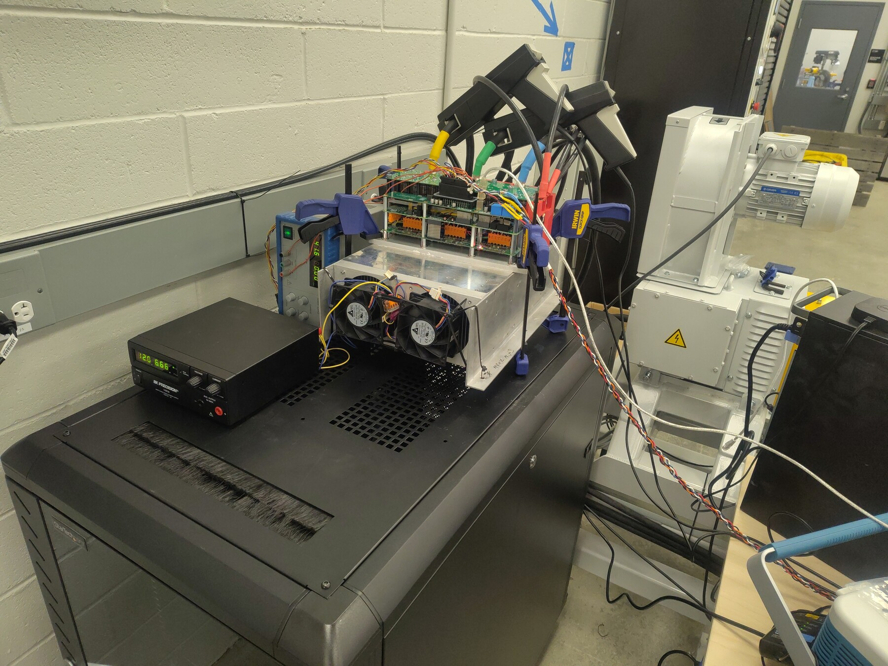
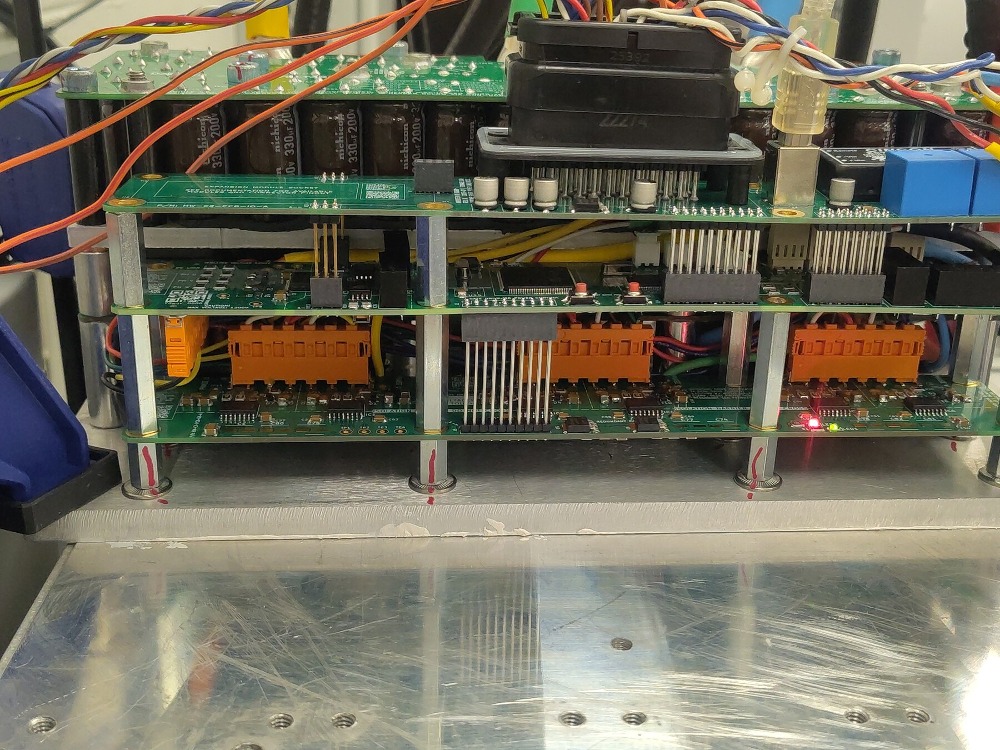
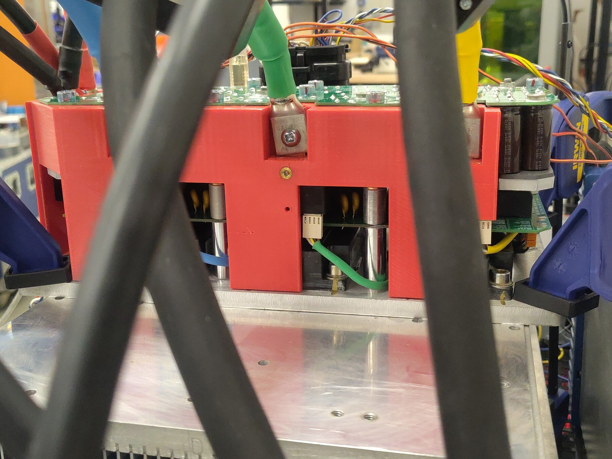
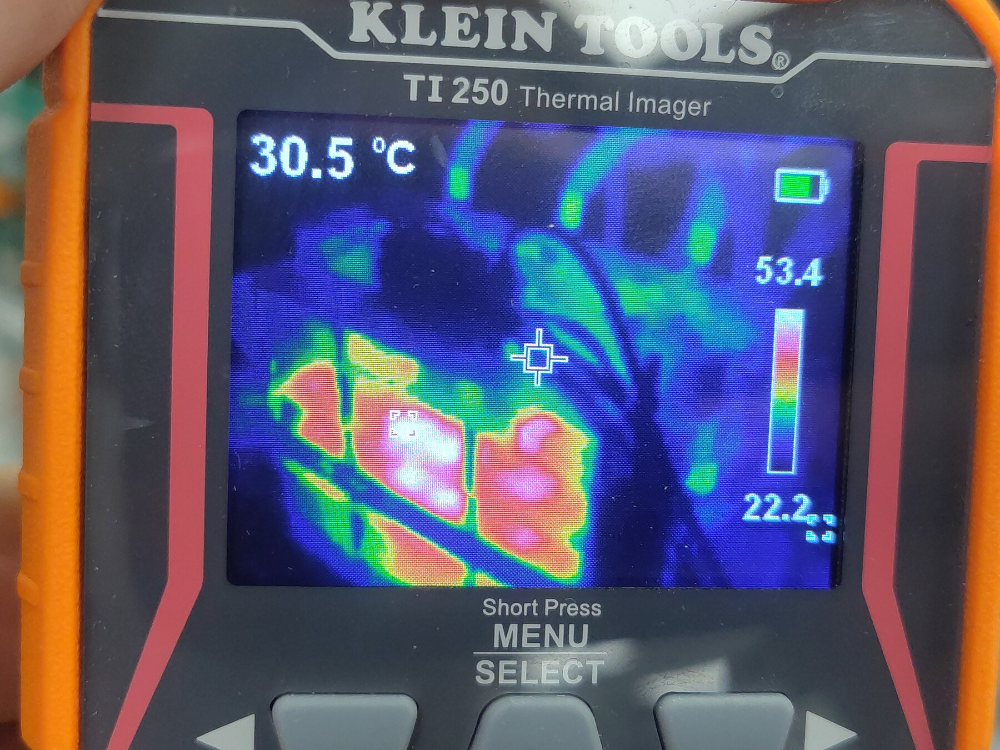
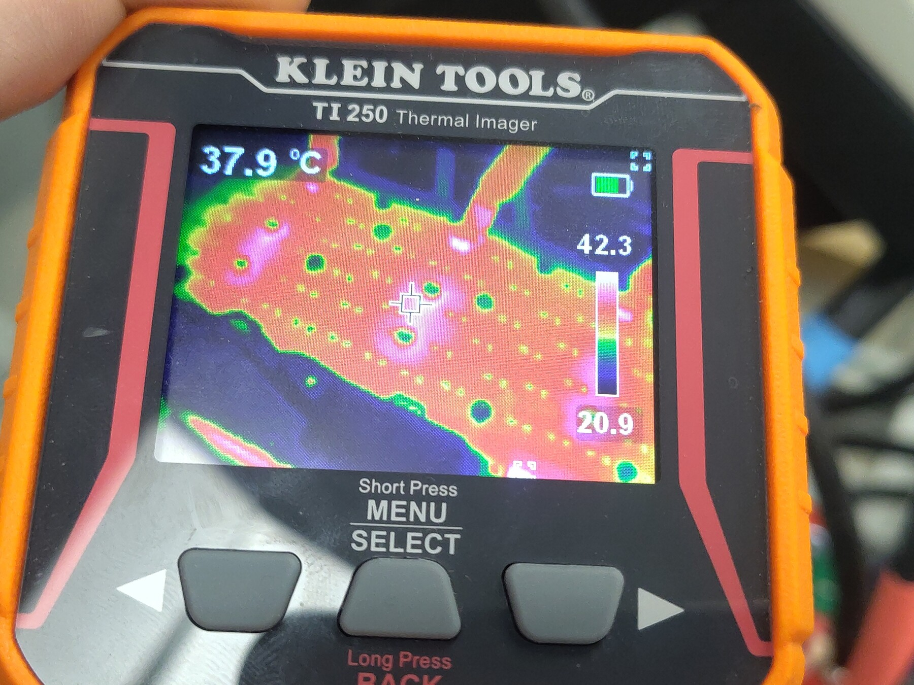
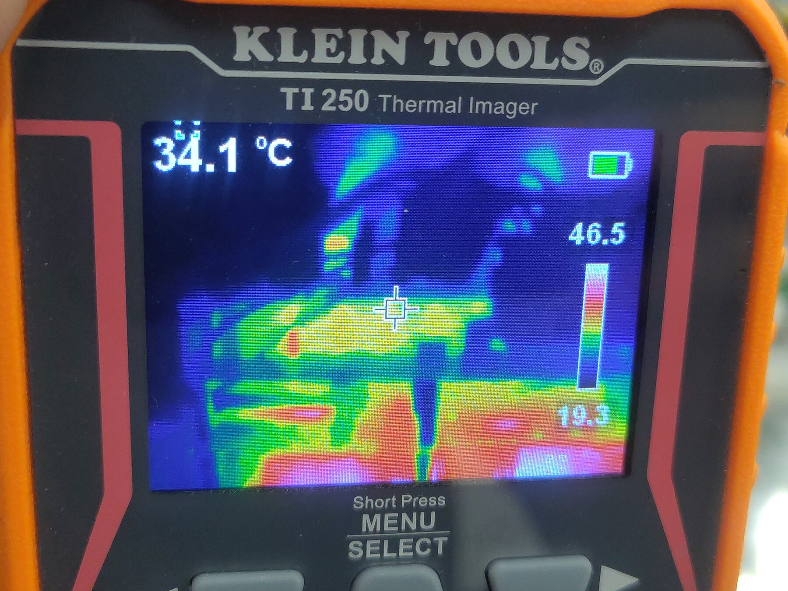
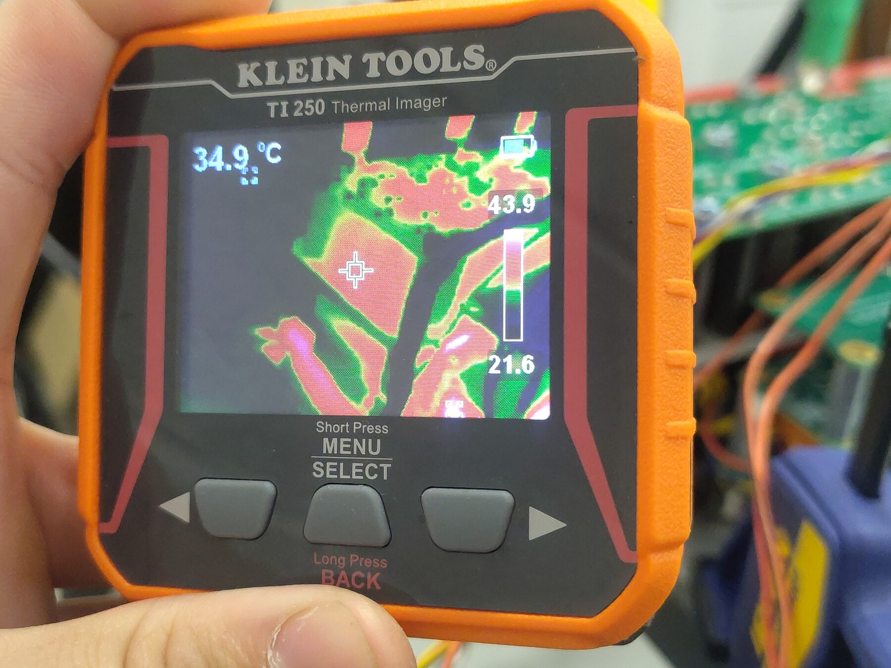
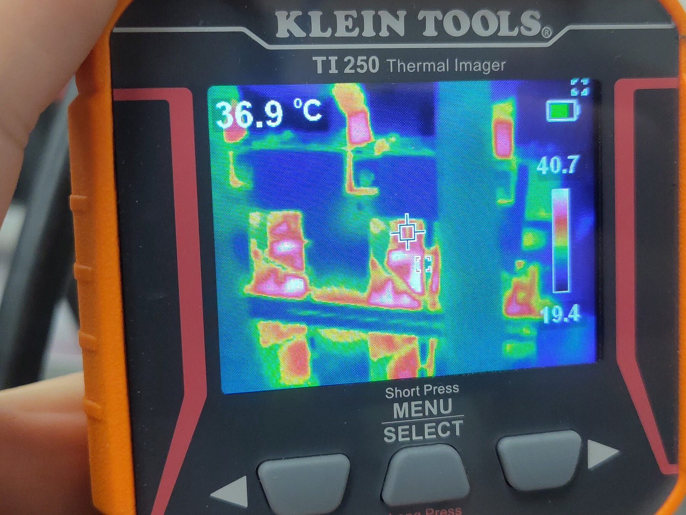
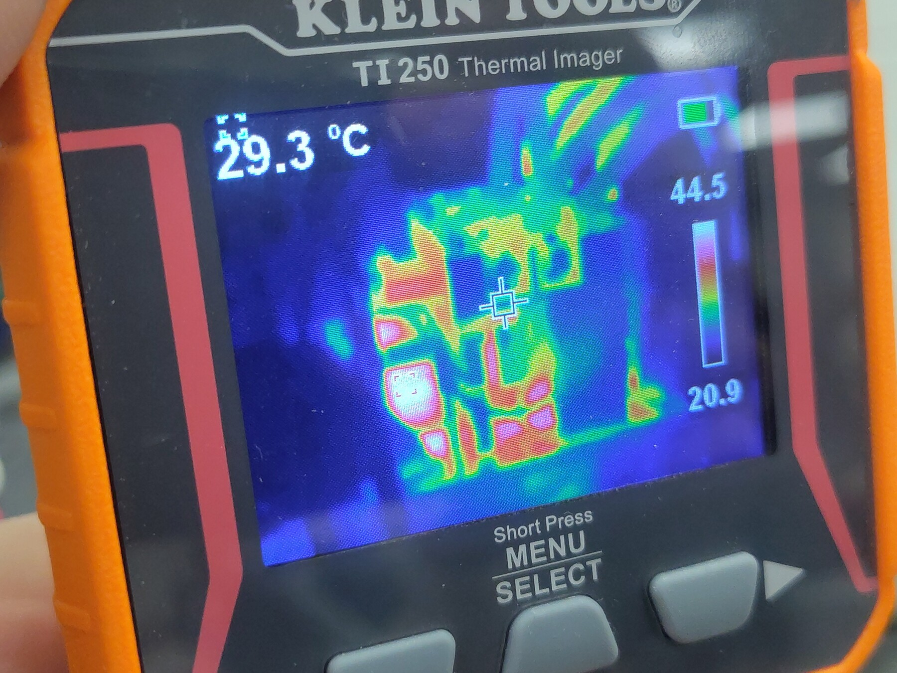
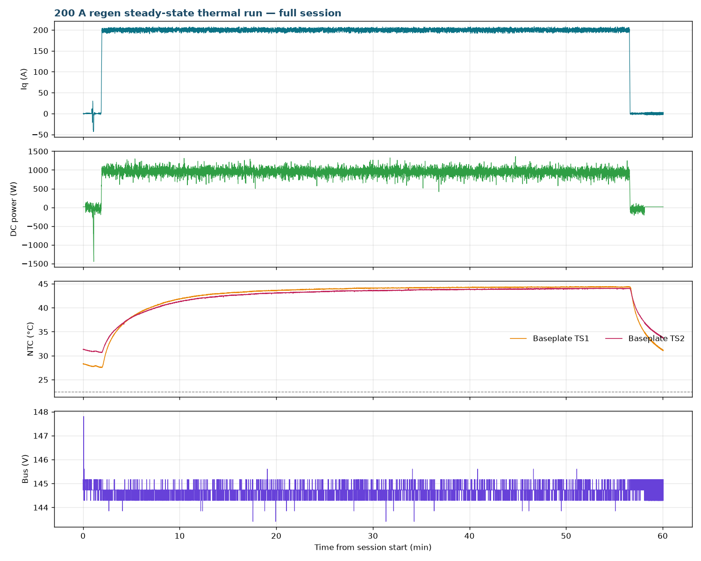

# 200 A Regen Steady-State Thermal Test — Gen7 Size 2

After the [450 A run](../Low-Power-Regen-450A-Gen7-Size2/Index.md) tripped the inverter overtemperature protection in 78 s with the dry-mounted interface, the power stage was remounted with thermal paste. This run validates that rework: a **54.7-minute continuous hold at a 200 A q-axis command** — long enough for the baseplate to reach true steady state — while a dynamometer-spun PMSM provided the mechanical drive. Because the machine ran at only ~470 RPM, the regen produced about 1 kW at a ~145 V bus: full 200 A of phase-current stress at very low power, in the spirit of the [100 A endurance test](../Low-Power-Regen-100A-No-Cooling/Index.md) but now with a proper thermal interface.

Result: baseplate TS1 plateaued at **44.4 °C** and TS2 at **44.0 °C** against a **22.5 °C ambient** (ΔT ≈ 22 K), with no faults during the hold. For comparison, the 200 A run on the previous dry, gapped interface was still climbing through 79 °C after 9 minutes at the same phase current.

## Test setup

- **DUT:** OpenVVVF Gen7 size 2 (C2) power stage, remounted to its heatsink/plate with thermal paste; firmware `foc_demo` graph (hash `855dbcee90d611cb`), OpenVVVF/RTE commit `5b529e2` ("fix gen7 current feedback and voltage control with bounded capture diagnostics").
- **Machine:** PMSM/IPM (FRAM config: 10 poles, R = 0.0121 Ω) coupled to the Sierra CP Engineering dynamometer at approximately −470 RPM mechanical (~−2,340 RPM electrical) during the hold.
- **DC supply:** Sorensen bench supply holding ~145 V on the bus. DC-link current stayed ~7 A, far below the supply's ~50 A regen sink limit, so no external load bank was needed.
- **Instrumentation:** RTE Studio telemetry, Klein Tools TI250 thermal imager (photos below, taken once the baseplate had reached steady state), and a ~2-minute bench video of the run including the thermal-imager passes ([Steady-State-Run-Video.mp4](Steady-State-Run-Video.mp4), 1080p, transcoded from the phone original).

## Test conditions

| Parameter | Value |
|-----------|-------|
| Hardware | Gen7 size 2 (C2), pasted interface; firmware `foc_demo` hash `855dbcee90d611cb`, RTE commit `5b529e2` |
| Machine | PMSM/IPM, 10 poles, ~−470 RPM mech during hold |
| Bus | ~144.7 V average (143.4–145.6 V) |
| Current command | `IqVar` jogs at ±10–40 A, then 200 A for 54.7 min |
| Average Iq over hold | 199.9 A (max 208 A) |
| DC-link power | 949 W average, 1.36 kW peak |
| Regen energy into DC link | ≈0.865 kWh |
| Ambient (operator-recorded) | 22.5 °C |
| Baseplate NTC at steady state | TS1 44.4 °C, TS2 44.0 °C (ΔT ≈ 22 K) |

## Procedure

1. Powered up; the gate driver latched a startup fault (with a software phase-overcurrent on the first start attempt) — both cleared by ~t = 27 s and control started at t = 43.3 s. See Observations.
2. Confirmed current orientation with small bidirectional jogs (`IqVar` 10/−20/30/−40 A).
3. Commanded `IqVar = 200` at t = 112.75 s and held it for 54.7 minutes while logging telemetry.
4. Once the baseplate NTCs had plateaued (final ~20 minutes within ±0.1 °C), took TI250 thermal images and commanded `IqVar = 0`; logging continued through the cooldown.

## Electrical results

The hold was electrically uneventful, which is the point of a steady-state thermal run:

- **Current:** 199.9 A average Iq, 208 A maximum, tight regulation throughout.
- **Bus:** 144.7 V average, 143.4–145.6 V — the supply held the bus with no clamp hardware in the loop.
- **DC link:** 6.6 A average, 949 W average (1.36 kW peak) — the low shaft speed limits back-EMF, so most of the phase-current work dissipates in the windings and switchgear rather than returning as bus power.
- **Protection:** `gate_fault` = 0 for the entire hold, `cg_vlimit_scale` = 1.000 throughout, no desaturation or overcurrent events after startup.

## Thermal results

The baseplate curve (telemetry overview below) is a clean single-pole rise to equilibrium:

- **Baseplate TS1** (`temp_inv1_c`): 27.7 °C at the start of the hold → 43.3 °C at 17 min → plateau **44.4 °C** (last 10 minutes average 44.32 °C, final sample 44.4 °C). Total rise ≈ 16.7 K above its starting point.
- **Baseplate TS2** (`temp_inv2_c`): 30.8 °C → plateau **44.0 °C**.
- Against the 22.5 °C operator-recorded ambient, steady-state ΔT is ≈ 21.9 K (TS1) at ~1 kW of returned power — and, more meaningfully, at 200 A of phase current, since inverter dissipation here is conduction-dominated and scales with current, not DC power.
- **Comparison to the dry interface:** the September 22 run at the same 200 A phase current (induction machine, ~1,100 RPM, gapped heatsink, no interface material) climbed from 34.5 °C past 79 °C in about 10 minutes and continued into the thermal OTP trip documented in [OV-TEST-HW-THERMAL-OTP-200A-GEN7-SIZE2](../Thermal-OTP-200A-Gen7-Size2/Index.md). The pasted assembly, by contrast, equilibrated ~22 K over ambient and could have held indefinitely. Machine and speed differ between the two runs, so this is a qualitative comparison, but the interface quality is the dominant difference.
- TI250 spot readings during the steady-state photo pass sat in the 34–42 °C range on the exterior surfaces (auto-scaled crosshair values, individual points rather than a surface survey):

## Telemetry overview

> **Open full session:** [View the run in the Telemetry Viewer](../../../../Tools/OpenVVVF-Telemetry-Viewer/telemetry-viewer.html?file=../../Safety-and-Compliance/Testing/Hardware/Low-Power-Regen-200A-Steady-State-Gen7-Size2/c2-200v-200a-steady-state-decimated.jsonl#s=cg_iq_a:left)

## Observations

- **Startup faults (pre-test):** on power-up the gate driver latched a fault (MAX22530 interrupt/filter reset complaints) and the first control start attempt also raised a software `PhaseOvercurrent`. Both cleared by ~t = 27 s and did not recur during the 55-minute hold. They are recorded here as boot-time transients on a fresh power-up, unrelated to the steady-state segment.
- **Telemetry framing:** this session's export splits telemetry into interleaved frames (a 49-key FOC bundle, a 2-key DC-link frame, and a 2-key encoder frame) rather than the single merged frame of earlier logs. The decimated log and plots in this report merge them by timestamp.
- Machine speed drooped slightly late in the hold (−489 → −447 RPM) without electrical consequence; DC-link power and current stayed nominal.
- TS3 (`temp_inv3_c`) remained disabled (wiring defect, unrelated to the test); `temp_motor_c` is unpopulated.

## Conclusion

**Pass.** With the thermal-pasted interface, the Gen7 size 2 assembly holds a continuous 200 A regen command (~1 kW at ~470 RPM, ~145 V bus) at true steady state with baseplate temperatures of 44.4 / 44.0 °C — only ~22 K over the 22.5 °C ambient — versus an unbounded climb to the 80 °C protection threshold with the previous dry, gapped interface. The thermal rework is validated for continuous-duty operation at this current.

## Artifacts

- [Decimated telemetry log (JSONL, 1 sample/s, frames merged)](c2-200v-200a-steady-state-decimated.jsonl) — [open in Telemetry Viewer](../../../../Tools/OpenVVVF-Telemetry-Viewer/telemetry-viewer.html?file=../../Safety-and-Compliance/Testing/Hardware/Low-Power-Regen-200A-Steady-State-Gen7-Size2/c2-200v-200a-steady-state-decimated.jsonl#s=cg_iq_a:left)
- [Telemetry overview plot](Telemetry-Overview.png)
- [Session video (MP4, ~2 min, 1080p)](Steady-State-Run-Video.mp4) — bench view of the run including the thermal-imager passes
- [Full source telemetry log](c2-200v-200a-steady-state.jsonl), retained for traceability
- Photos: [bench setup](Bench-Setup.jpg), [power stage detail](Power-Stage-Detail.jpg), [power stage on heatsink](Power-Stage-Heatsink.jpg), [control board detail](Control-Board-Detail.jpg), [inverter side view](Inverter-Side-View.jpg), [clamp hardware detail](Clamp-Hardware-Detail.jpg), [chassis view](Chassis-View.jpg)
- Thermal images: [view 1](Thermal-01.jpg), [view 2](Thermal-02.jpg), [view 3](Thermal-03.jpg), [view 4](Thermal-04.jpg), [view 5](Thermal-05.jpg), [view 6](Thermal-06.jpg)
- Full-resolution originals of the photos are retained alongside as `*-Original.jpg`.
