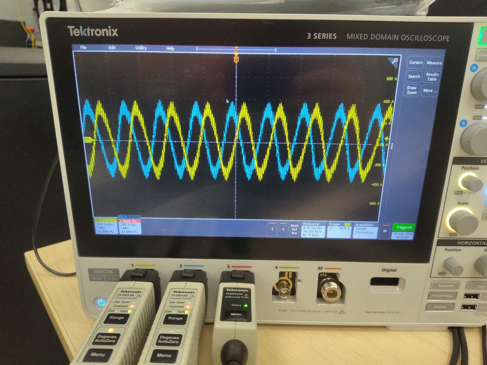
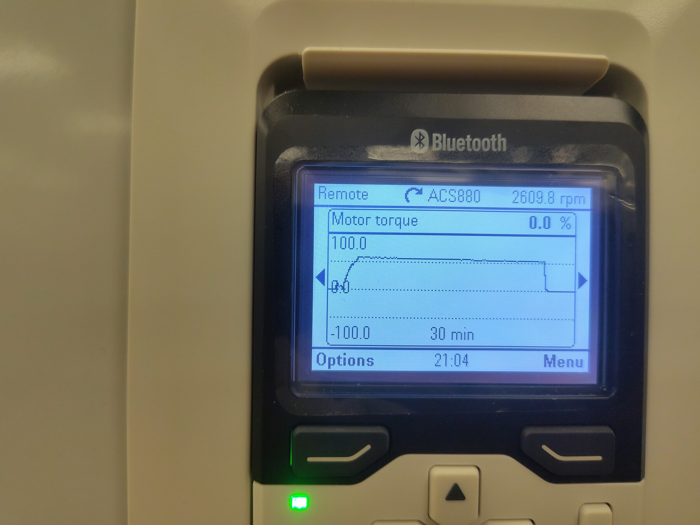
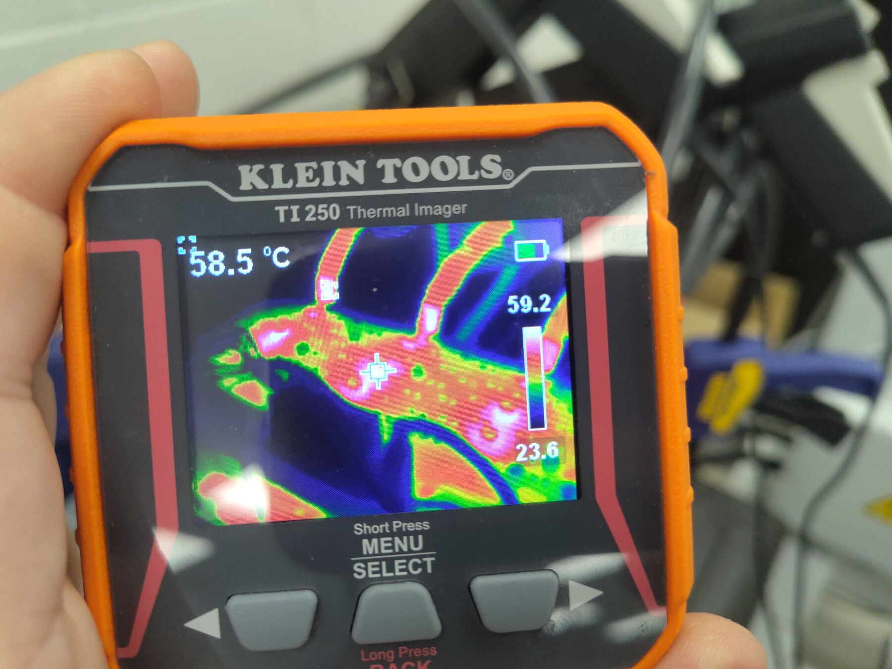
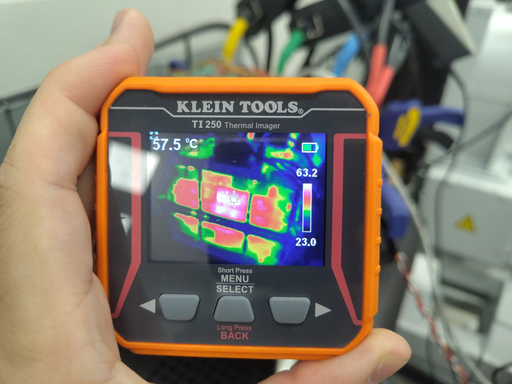
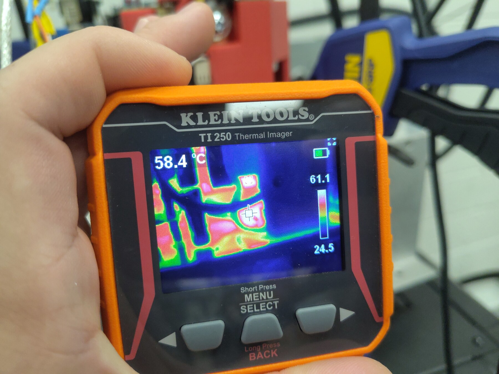
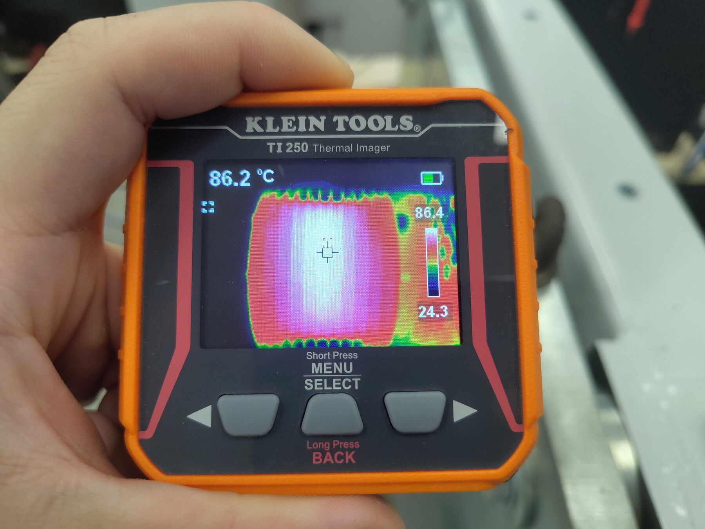
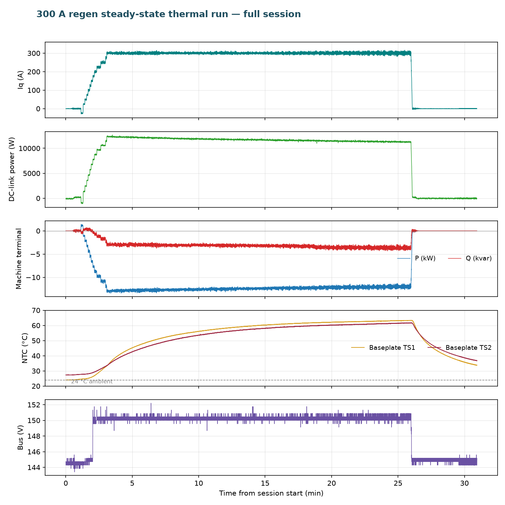

# 300 A Regen Steady-State Thermal Test — Gen7 Size 2

This run extends the steady-state series from [200 A](../Low-Power-Regen-200A-Steady-State-Gen7-Size2/Index.md) to **300 A of continuous regenerative q-axis current** on the same thermally-pasted Gen7 size 2 assembly. The bench spun a **Zero ZF75-10 PMSM** at ~2,600 RPM on the dynamometer — about 5.5× the shaft speed of the 200 A run — so each amp returned far more power: the hold averaged **11.7 kW at a 150 V-clamped bus** versus the 200 A run's ~1 kW. The inverter held the command for **22.9 minutes** and the baseplate reached **63.2 / 61.7 °C**, still creeping at only ~0.2 K/min — for all practical purposes steady state, with roughly 17 K of margin to the 80 °C overtemperature protection.

**The test was stopped because the machine got too hot, not the inverter.** The ZF75-10 has no telemetry thermistor populated (`temp_motor_c`), so the operator monitored it with the TI250; the motor case read **86.2 °C** near the end of the hold, and the run was ended by commanding `IqVar = 0`. The inverter itself was thermally stable and fault-free throughout.

Result: baseplate TS1 reached **63.2 °C** and TS2 **61.7 °C** against a ~24 °C ambient (ΔT ≈ 39 K) at 300 A and 11.7 kW — no faults, no voltage-limit activity, clean sinusoidal phase currents on the scope. Continuous-duty operation at 300 A is validated on the pasted assembly; the binding constraint on this bench is the test machine's thermal limit, not the inverter's.

## Test setup

- **DUT:** OpenVVVF Gen7 size 2 (C2) power stage, same thermally-pasted assembly as the 200 A steady-state runs; firmware `foc_demo` graph (hash `855dbcee90d611cb`, same build as the preceding runs — OpenVVVF/RTE commit `5b529e2`).
- **Machine:** Zero ZF75-10 PMSM (10 poles, per the 5:1 electrical-to-mechanical RPM ratio in telemetry) coupled to the Sierra CP Engineering dynamometer, spun at ~2,600 RPM mechanical (~13,000 RPM electrical) during the hold.
- **DC supply:** Sorensen bench supply (~145 V setpoint, regenerative sink limited to ~50 A) in parallel with the Chroma DC electronic load bank in constant-voltage mode at 150 V across the DC link. Regen current (~78 A average) exceeded the supply's sink capability from the 300 A step onward, and the Chroma clamp held the bus in a tight band around 150 V.
- **Instrumentation:** RTE Studio telemetry, Tektronix 3 Series MDO with TCP0150 current probes, Klein Tools TI250 thermal imager, and a ~100-second bench video of the run including the thermal-imager passes ([Steady-State-Run-Video.mp4](Steady-State-Run-Video.mp4), 1080p, transcoded from the phone original).

## Test conditions

| Parameter | Value |
|-----------|-------|
| Hardware | Gen7 size 2 (C2), pasted interface; firmware `foc_demo` hash `855dbcee90d611cb` (RTE commit `5b529e2`) |
| Machine | Zero ZF75-10 PMSM, 10 poles, ~−2,600 RPM mech during hold |
| Bus | 150.3 V average during hold (148.7–152.2 V, Chroma CV clamp); ~144.5 V supply setpoint before the staircase |
| Current command | `IqVar` −25 A orientation jog, then 25 → 300 A in 25 A steps, then 300 A for 22.9 min |
| Average Iq over hold | 300.0 A (min 277 A, max 317 A) |
| DC-link power | 11.72 kW average, 12.68 kW peak (10.98 kW minimum) |
| DC-link current | 78.0 A average (84 A max) — Chroma sinking; beyond the supply's ~50 A sink |
| Regen energy into DC link | ≈4.47 kWh |
| Machine terminal real power P | −12.41 kW mean (generating; calculated from logged `cg_vd_v`/`cg_vq_v`/`cg_id_a`/`cg_iq_a`) |
| Machine terminal reactive power Q | ≈3.3 kvar mean (machine magnetizing demand; quoted as magnitude — sign follows the logged dq frame) |
| Machine apparent power \|S\| | 12.84 kVA mean |
| Power factor (calculated) | 0.966 (\|P\|/√(P²+Q²); 0.94–0.98 across the hold) |
| Inverter efficiency (calculated) | ≈94% (11.72 kW DC-link received ÷ 12.41 kW machine-terminal) |
| Ambient | not operator-logged; ≈24 °C per baseplate NTC at power-up (24.0 °C) and TI250 cold pixels (23.0–24.5 °C) |
| Baseplate NTC at end of hold | TS1 63.2 °C (max 63.4 °C), TS2 61.7 °C (max 61.8 °C) — ΔT ≈ 39 K, ~0.2 K/min residual rise |
| Machine case (TI250) | 86.2 °C crosshair, 86.4 °C spot max — stop criterion |

## Procedure

1. Powered up and started control — clean boot this session: `RUNNING` from t ≈ 0.6 s, no startup faults (contrast with the 200 A regen session's gate-driver transients).
2. Dynamometer spun the machine to ~2,600 RPM; confirmed current orientation with an `IqVar = −25` A jog at t = 68.3 s.
3. Staircased `IqVar` 25 → 300 A in 25 A steps (t = 77.8–184.7 s), 6–18 s dwell per step.
4. Commanded `IqVar = 300` at t = 184.7 s and held it for **22.9 minutes** while logging telemetry; took oscilloscope and TI250 thermal photos once the baseplate neared plateau.
5. The TI250 read 86.2 °C on the machine case near the end of the hold — the operator-monitored stop criterion — and `IqVar = 0` was commanded at t = 1558.4 s. Logging continued through the ~5-minute cooldown.

## Electrical results

- **Current:** 300.0 A average Iq over the hold (277–317 A band, σ ≈ 4.8 A) — tight regulation at 1.5× the previous steady-state current.
- **Bus:** rode the ~144.5 V supply setpoint through the staircase, then the Chroma CV clamp took over from the 300 A step and held **150.3 V average in a 148.7–152.2 V band** — the tightest bus regulation of the series, with ~78 A of regen current flowing into the load bank.
- **DC link:** 11.72 kW average returned (12.68 kW peak) — 12× the 200 A run's ~1 kW, thanks to the ~5.5× shaft speed raising back-EMF. ≈4.47 kWh returned over the hold.
- **Protection:** `gate_fault` = 0 for the entire session, `cg_vlimit_scale` = 1.000 throughout, and the state stream reported no active fault at any point.
- **Scope:** the two probed phase currents are clean sinusoids peaking near ±300 A at 200 A/div — no saturation artifacts (the 400 A run's spikes were the 150 A-rated clamps; the TCP0150s here are appropriately rated).
- **Machine-terminal power (calculated):** from the logged FOC quantities with the peak-amplitude convention, P = (3/2)(vd·id + vq·iq) and Q = (3/2)(vq·id − vd·iq). Over the hold the machine delivered **12.41 kW mean** while drawing **≈3.3 kvar** of magnetizing reactive power (quoted as magnitude; the logged dq frame of this run carries the opposite sign) — apparent power 12.84 kVA, **power factor ≈ 0.966** (0.94–0.98 across the hold). The ~0.69 kW between the machine's 12.41 kW output and the 11.72 kW reaching the DC link is the inverter's own conduction and switching dissipation at 300 A — **calculated inverter efficiency ≈ 94%**, consistent with the ~39 K baseplate rise.

## Thermal results

The baseplate curve (telemetry overview below) is a clean single-pole rise that has flattened by the end of the hold:

- **Baseplate TS1** (`temp_inv1_c`): 33.2 °C at the start of the hold → 53.3 °C at 5 min → 59.0 °C at 10 min → 61.6 °C at 15 min → **63.2 °C** at the end (last-10-minute average 62.2 °C, residual rise ~0.2 K/min).
- **Baseplate TS2** (`temp_inv2_c`): 33.4 °C → 50.4 °C at 5 min → **61.7 °C** at the end (last-10-minute average 60.4 °C).
- Against the ≈24 °C ambient, the end-of-hold rise is **≈39 K at 300 A / 11.7 kW**. For context: the 200 A run plateaued at ~22 K over ambient at 0.95 kW and ~470 RPM. Conduction loss scales with I² (2.25× here), and switching loss scales steeply with the 5.5× higher electrical frequency — both are captured in the 39 K figure, which still leaves ~17 K of margin to the 80 °C protection threshold.
- **Versus the 450 A run:** the same bench returned 12.8 kW at 2,000 RPM on the *dry* interface and tripped the inverter OTP at ~80 °C after 78 s. Here, 11.7 kW at ~2,600 RPM on the *pasted* interface ran 22.9 minutes and never exceeded 63.4 °C — the interface rework remains the difference between a trip and a plateau at comparable power.
- **TI250 inverter readings** during the photo pass sat at 57.5–58.5 °C on the crosshair (spot max 63.2 °C) — consistent with the baseplate NTC plateau:

- **Machine temperature is what ended the test.** The ZF75-10 case read **86.2 °C** (spot max 86.4 °C) on the TI250 near the end of the hold. With no motor thermistor wired to telemetry, the imager was the only channel on it — well past comfortable touch temperatures and into winding-insulation caution territory, so the operator stopped the run there. The inverter was still thermally stable and could have continued:

## Telemetry overview

> **Open full session:** [View the run in the Telemetry Viewer](../../../../Tools/OpenVVVF-Telemetry-Viewer/telemetry-viewer.html?file=../../Safety-and-Compliance/Testing/Hardware/Low-Power-Regen-300A-Steady-State-Gen7-Size2/c2-200v-300a-regen-steady-state-test-decimated.jsonl#s=cg_iq_a:left)

## Observations

- **Stop reason:** the run ended on the machine's thermal limit (TI250 86.2 °C on the case), not any inverter limit or fault. The stop was a single `var set IqVar 0` command at t = 1558.4 s; the inverter baseplate was still slowly rising and the protection chain never engaged. For continuous-duty assessment of the inverter, the hold reached steady state for all practical purposes.
- **Ambient** was not operator-recorded this session; ≈24 °C is inferred from the baseplate NTC at power-up (24.0 °C) and the TI250's coldest pixels (23.0–24.5 °C across the photo pass).
- Boot was clean — no gate-driver or phase-overcurrent transients, unlike the 200 A regen steady-state session. Both sessions share the same firmware build; the difference appears to be power-up state rather than software.
- The dynamometer held the shaft within about ±50 RPM all hold (−2,572 RPM average in the first 5 minutes, −2,598 in the last 5); the ACS880 keypad photo confirms 2,609.8 RPM with torque returned to 0 % after the stop.
- TS3 (`temp_inv3_c`) remained disabled (wiring defect, same as previous runs); `temp_motor_c` is unpopulated, which is why the machine temperature was monitored by thermal imager.
- This session's export uses a single merged 53-key telemetry frame, so the decimated log below is a straight 1 Hz resample — no frame merging needed.

## Conclusion

**Pass.** The thermally-pasted Gen7 size 2 assembly holds a continuous 300 A regen command for 22.9 minutes — 11.7 kW average returned to a 150 V-clamped bus, clean phase currents, no faults — and reaches effective steady state at 63.2 / 61.7 °C baseplate, about 39 K over ambient with ~17 K of margin to the overtemperature trip. The run was stopped because the test machine (Zero ZF75-10) reached 86 °C on the case, a bench-machine thermal limit with no telemetry channel; the inverter showed no distress and no sign of an impending trip. Continuous-duty operation at 300 A on the pasted assembly is validated. A longer-duration 300 A run requires a machine with a populated thermistor and adequate cooling.

## Artifacts

- [Decimated telemetry log (JSONL, 1 sample/s)](c2-200v-300a-regen-steady-state-test-decimated.jsonl) — [open in Telemetry Viewer](../../../../Tools/OpenVVVF-Telemetry-Viewer/telemetry-viewer.html?file=../../Safety-and-Compliance/Testing/Hardware/Low-Power-Regen-300A-Steady-State-Gen7-Size2/c2-200v-300a-regen-steady-state-test-decimated.jsonl#s=cg_iq_a:left)
- [Telemetry overview plot](Telemetry-Overview.png)
- [Session video (MP4, ~100 s, 1080p)](Steady-State-Run-Video.mp4) — bench view of the run including the thermal-imager passes
- [Full source telemetry log](c2-200v-300a-regen-steady-state-test.jsonl), retained for traceability
- Photos: [phase currents on scope](Oscilloscope-Phase-Currents.jpg), [dynamometer drive display](Dyno-Display.jpg)
- Thermal images: [view 1](Thermal-01.jpg), [view 2](Thermal-02.jpg), [view 3](Thermal-03.jpg), [machine at 86.2 °C](Thermal-Motor.jpg)
- Full-resolution originals of the photos are retained alongside as `*-Original.jpg`.
