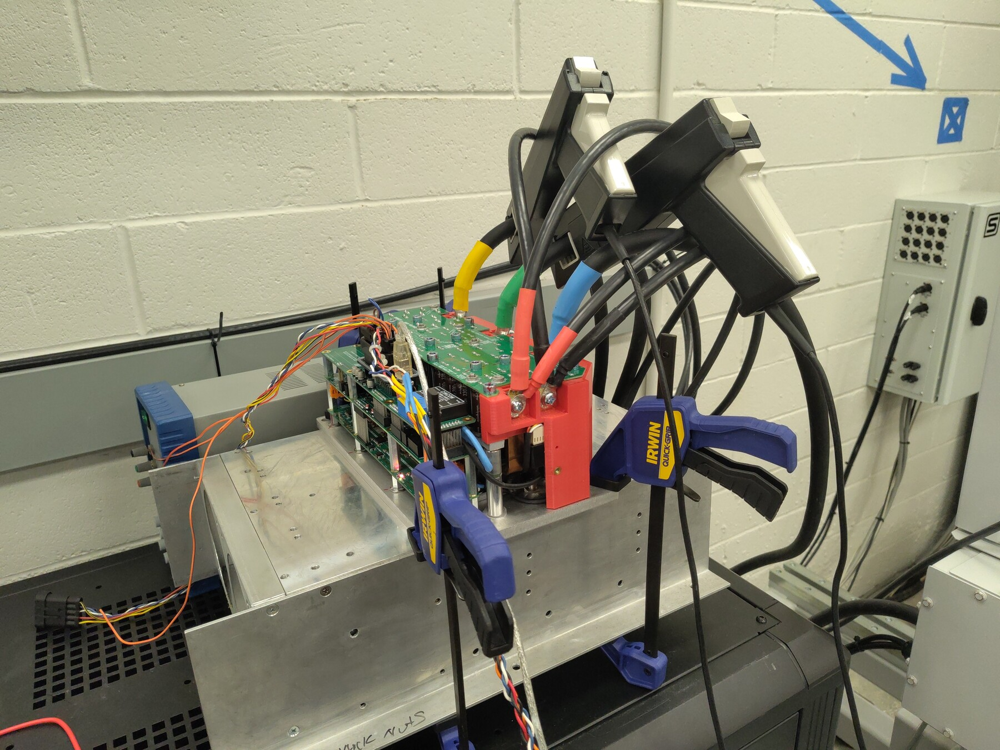
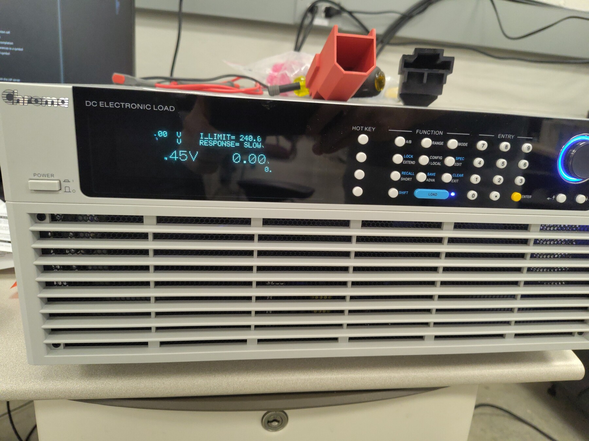
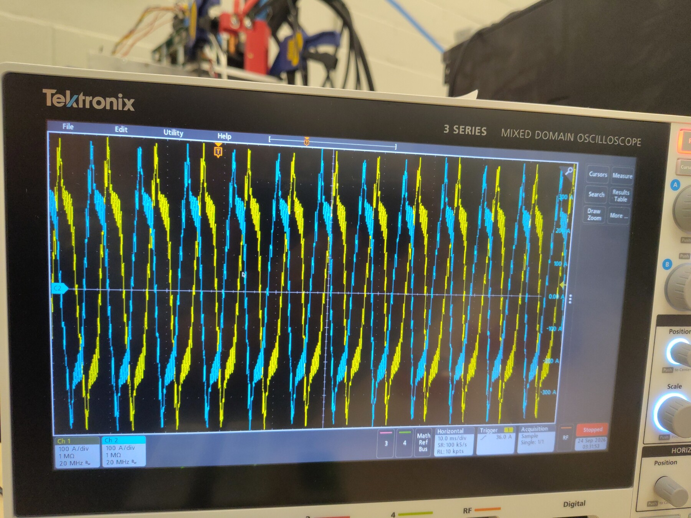
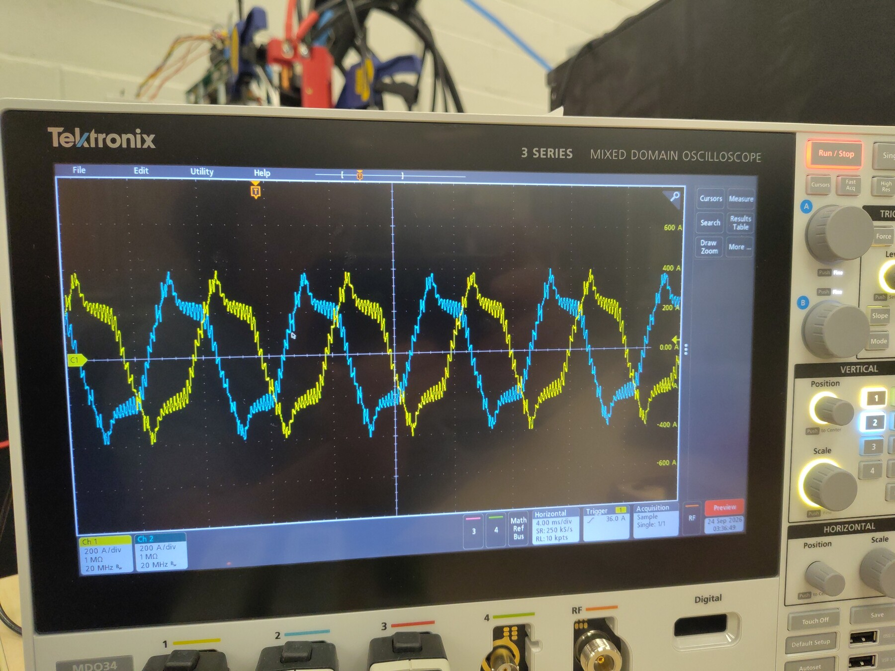
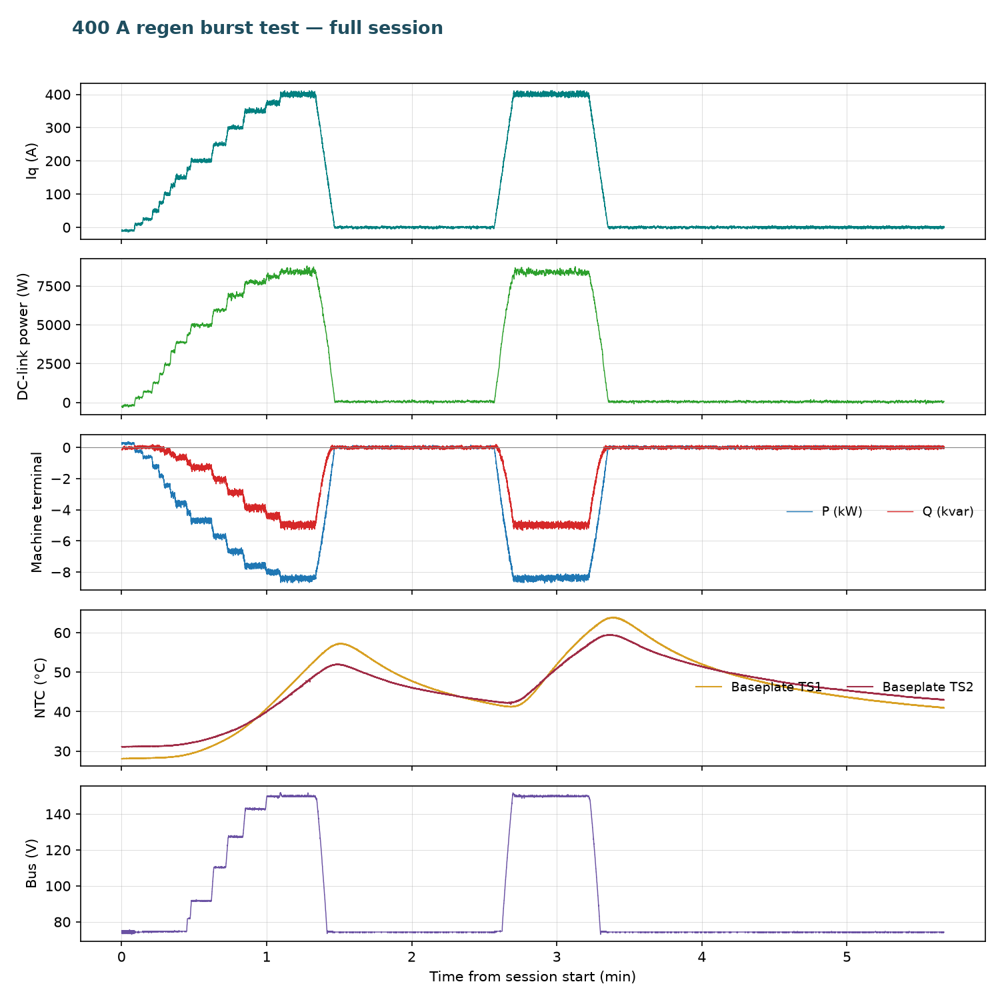

# Initial 400 A Regen Test — Gen7 Size 2

This report extends the Gen7 size 2 regenerative staircase of [OV-TEST-HW-REGEN-200A-GEN7-SIZE2](../Low-Power-Regen-200A-Gen7-Size2/Index.md) from 200 A to a 400 A q-axis command. The limiting facility for high-current regen is the DC bus: the Sorensen bench supply can sink only about 50 A back into the grid, so above roughly 150 A of regen the bus voltage runs away. For this run a Chroma DC electronic load bank was connected across the DC link in constant-voltage mode at 150 V to absorb everything the supply cannot sink. The inverter was commanded in steps from 25 A to 400 A and held at 400 A twice, returning up to 8.8 kW to the DC link.

During the 400 A holds, narrow repetitive spikes were observed on the oscilloscope phase-current traces that were not present at lower currents. Telemetry shows clean control, no faults, and a solid 150 V clamp, so the anomaly is visible only in the analog captures and its cause is undetermined. The test was stopped for this reason. **Hardware passed every target; the spike observation is resolved below — it was the oscilloscope current clamps saturating, not the inverter.**

## Test setup

- **DUT:** OpenVVVF Gen7 size 2 inverter hardware, firmware `foc_demo` graph (hash `855dbcee90d611cb`, includes slew-limited `IqVar`, burst current sampling, and a modulator voltage-limit node).
- **Machine:** Induction machine coupled to a Sierra CP Engineering dynamometer; approximately −1,470 RPM mechanical (−7,360 RPM electrical) during the holds.
- **DC supply:** Sorensen bench supply (regenerative sink limited to ~50 A) in parallel with a **Chroma DC electronic load bank** in constant-voltage mode at 150 V across the DC link, clamping the bus.
- **Instrumentation:** RTE Studio telemetry, Tektronix 5 Series MSO, Chroma load front panel.
- **Temperature channels:** baseplate NTCs TS1 (`temp_inv1_c`) and TS2 (`temp_inv2_c`); TS3 (`temp_inv3_c`) was not enabled for this session due to a wiring defect unrelated to the test.

## Test conditions

| Parameter | Value |
|-----------|-------|
| Hardware | Gen7 size 2, firmware `foc_demo` hash `855dbcee90d611cb` |
| Machine speed | ~−1,470 RPM mech (−7,360 RPM elec) |
| Bus baseline | ~74 V |
| Bus clamp | Chroma CV at 150 V; held 149.6–151.8 V during both 400 A holds |
| Current command | `IqVar` staircase 25–200 A in 25 A steps, then 250/300/350/375/400 A |
| Time at 400 A | 14.8 s first hold; ~31 s at full current second hold (39.0 s including ~8 s slew-limited ramp) |
| Peak phase current | 415 A |
| Peak DC-link power | 8.78 kW |
| Regen energy into DC link | ≈0.117 kWh total (0.034 kWh + 0.083 kWh across the two holds) |
| Machine terminal real power P | −8.39 kW (hold 1) / −7.52 kW (hold 2, Iq mean 356 A) — calculated from logged `cg_vd_v`/`cg_vq_v`/`cg_id_a`/`cg_iq_a` |
| Machine reactive power Q | ≈5.0 / 4.3 kvar (hold 1 / 2; machine magnetizing demand, quoted as magnitude) |
| Power factor (calculated) | 0.86 / 0.88 (hold 1 / 2) |
| Inverter efficiency (calculated) | ≈100% in both holds (telemetry-resolution limited at this power) |
| Peak baseplate NTC | 63.9 °C (TS1), 59.5 °C (TS2) |
| DC-link current | ~54–58 A during the holds (supply at sink limit; Chroma absorbs the rest) |

## Procedure

1. Enabled the inverter and allowed the dynamometer to bring the coupled machine to operating speed.
2. Jogged `IqVar` at 10 A and 26 A to confirm orientation, then stepped 25 → 200 A in 25 A steps, then 250/300/350/375/400 A.
3. Observed the bus climb from ~74 V as regen power exceeded the supply's sink capability, with the Chroma load bank absorbing the excess and clamping the bus at 150 V from the 375–400 A region onward.
4. Held 400 A for 14.8 s (first hold). Narrow spikes were observed on the oscilloscope phase-current traces that had not been present at lower currents. Stopped the run (`IqVar 0`) to investigate; because `IqVar` is slew-limited, current decayed to under 20 A in ~7.7 s.
5. Resumed with a second 400 A hold (39.0 s total including the ~8 s slew-limited ramp). The spikes were still present. Stopped again and let the inverter cool while logging continued to t = 340 s.

## Electrical results

Per-command statistics from the full-rate telemetry log (Pdc = DC-link power, Idc = DC-link current):

| Iq command | Step duration | Avg Iq | Peak phase current | Avg Pdc | Avg Idc |
|------------|---------------|--------|-------------------|---------|---------|
| 25 A | 2.2 s | 24.8 A | 31 A | 707 W | 9.5 A |
| 50 A | 2.4 s | 48.9 A | 57 A | 1.24 kW | 17 A |
| 75 A | 2.0 s | 70.6 A | 81 A | 1.73 kW | 23 A |
| 100 A | 2.8 s | 97.6 A | 110 A | 2.36 kW | 32 A |
| 125 A | 1.9 s | 121.8 A | 137 A | 3.14 kW | 42 A |
| 150 A | 4.8 s | 148.1 A | 161 A | 3.83 kW | 51 A |
| 175 A | 1.6 s | 170.5 A | 187 A | 4.27 kW | 53 A |
| 200 A | 8.8 s | 199.0 A | 212 A | 4.96 kW | 54 A |
| 250 A | 6.0 s | 245.3 A | 260 A | 5.84 kW | 54 A |
| 300 A | 7.0 s | 296.0 A | 305 A | 6.82 kW | 54 A |
| 350 A | 9.3 s | 347.1 A | 359 A | 7.67 kW | 54 A |
| 375 A | 5.9 s | 373.5 A | 384 A | 8.08 kW | 54 A |
| **400 A hold 1** | **14.8 s** | **399.4 A** | **415 A** | **8.41 kW** | **56 A** |
| 400 A hold 2 (incl. slew ramp) | 39.0 s | 357.5 A | 415 A | 7.58 kW | 53 A |

The bus voltage told the clamp story directly: it stayed at 74.3–74.8 V through the 150 A step, began climbing at 175 A (74.3–82.3 V), and rose stepwise to the Chroma clamp (142.5–150.4 V at the 375 A step), then held 149.6–151.8 V through both 400 A holds. Above ~150 A of regen the logged DC-link current pinned at ~54–58 A — the Sorensen at its sink limit — while the power increase showed up entirely as bus voltage until the Chroma clamp took over. The modulator voltage limiter never engaged (`cg_vlimit_scale` = 1.000 for the entire session); all clamping was external. Current control tracked cleanly: raw and filtered Iq agree, and hold 2 averaged 357.5 A only because its window includes the ~8 s, ~50 A/s slew-limited ramp from the `IqVar 400` re-application to full current.

- **Machine-terminal power (calculated):** from the logged dq quantities (peak-amplitude convention, P = (3/2)(vd·id + vq·iq), Q = (3/2)(vq·id − vd·iq)). Hold 1: the machine delivered **8.39 kW** while drawing **≈5.0 kvar** (9.74 kVA, **PF ≈ 0.86**); hold 2: **7.52 kW** and **≈4.3 kvar** (8.67 kVA, **PF ≈ 0.88**). Machine-terminal and DC-link power agree within ~0.3% in both holds — **calculated inverter efficiency ≈ 100%**, telemetry-resolution limited at this power (the same calculation shows ≈95% at 13 kW in the 450 A run, where the loss is larger than the measurement offsets).

## Thermal results

Temperatures were benign for the full session:

- **Baseplate TS1** (`temp_inv1_c`): 28.1 °C start, 53.0 °C at the end of the first hold, **63.9 °C peak** at t ≈ 203 s (just after the second stop — the thermal peak lags the power).
- **Baseplate TS2** (`temp_inv2_c`): 31.2 °C start, 59.5 °C peak at t ≈ 202 s.
- Both channels cooled to ~41–43 °C by the end of logging. TS3 was not enabled for this session (wiring defect, unrelated to the test) and `temp_motor_c` is unpopulated in this recording.

## Current-spike observation

**Resolved — measurement artifact, not an inverter anomaly.** During the first 400 A hold, the oscilloscope showed narrow, repetitive spikes superimposed on the phase-current waveforms, concentrated near the current peaks (photos above); they were not observed at lower currents. The cause, established during the follow-up 450 A run, is the **measurement channel**: the Tektronix current clamps are rated at 150 A and clipped/saturated at the 400 A phase currents, producing exactly this kind of spiked, distorted trace. See [OV-TEST-HW-REGEN-450A-GEN7-SIZE2](../Low-Power-Regen-450A-Gen7-Size2/Index.md) for the follow-up run and resolution note.

The telemetry evidence from this session is consistent with that conclusion:

- The ~56 Hz telemetry publish rate cannot resolve waveform-scale spikes: the electrical frequency is ~123 Hz, so per-sample phase-current values are aliased by design.
- Everything is clean: all 19,012 current samples valid (`cg_sample_valid`), `gate_fault` = 0 for the entire session, no desaturation events, `cg_vlimit_scale` = 1.000 throughout, the bus sat solidly on the 150 V clamp, and Iq tracking was tight in both holds — none of which would be expected if the spikes were a power-stage or control phenomenon.

No further investigation of the inverter is required on this observation; future sessions should use current transducers rated for the measured current.

## Telemetry overview

> **Open full session:** [View the run in the Telemetry Viewer](../../../../Tools/OpenVVVF-Telemetry-Viewer/telemetry-viewer.html?file=../../Safety-and-Compliance/Testing/Hardware/Low-Power-Regen-400A-Gen7-Size2/400a-regen-decimated.jsonl#s=cg_iq_a:left)

## Observations

- The Chroma load bank solved the facility limit: with the Sorensen sinking ~50 A, the 150 V CV clamp absorbed the remainder and made the 300–400 A steps possible at all.
- Above ~150 A of regen, DC-link current pinned at the supply's sink limit and further power increase appeared as rising bus voltage until the clamp.
- The stop command does not cut current quickly: `IqVar 0` slews down at the configured rate, reaching under 20 A in ~7.7 s. Emergency expectations should account for this.
- After each stop the bus collapsed from 150 V back to ~74 V in about 5 s as the Chroma stopped drawing.
- A `UartError` fault flag (0x200) was active from before the first command and throughout the session. Telemetry quality was unaffected (45 bad frames of ~767 k); it is treated as a latched host-link flag, not a run-affecting fault.

## Conclusion

**Pass.** Gen7 size 2 hardware sustained a 400 A q-axis regenerative command — 415 A peak phase current, 8.78 kW peak DC-link power, ≈0.117 kWh returned — with the bus clamped at 150 V by the added Chroma load bank, no gate or control faults, and baseplate temperatures below 64 °C. The repetitive phase-current spikes observed on the oscilloscope at 400 A were subsequently determined to be the 150 A-rated Tektronix current clamps saturating at the measured current — a measurement artifact, not an inverter anomaly (see the [450 A follow-up report](../Low-Power-Regen-450A-Gen7-Size2/Index.md)).

## Artifacts

- [Decimated telemetry log (JSONL, 1 sample/s)](400a-regen-decimated.jsonl) — [open in Telemetry Viewer](../../../../Tools/OpenVVVF-Telemetry-Viewer/telemetry-viewer.html?file=../../Safety-and-Compliance/Testing/Hardware/Low-Power-Regen-400A-Gen7-Size2/400a-regen-decimated.jsonl#s=cg_iq_a:left)
- [Telemetry overview plot](Telemetry-Overview.png)
- [Full source telemetry log](400a-regen-burst-test.jsonl), retained for traceability
- Photos: [phase currents on scope](Oscilloscope-Phase-Currents.jpg), [zoomed spike detail](Oscilloscope-Phase-Current-Zoom.jpg), [bench with Chroma wiring](Dyno-Setup-Chroma.jpg), [Chroma load bank front panel](Chroma-Load-Bank.jpg)
- Full-resolution originals of the photos are retained alongside as `*-Original.jpg`.
