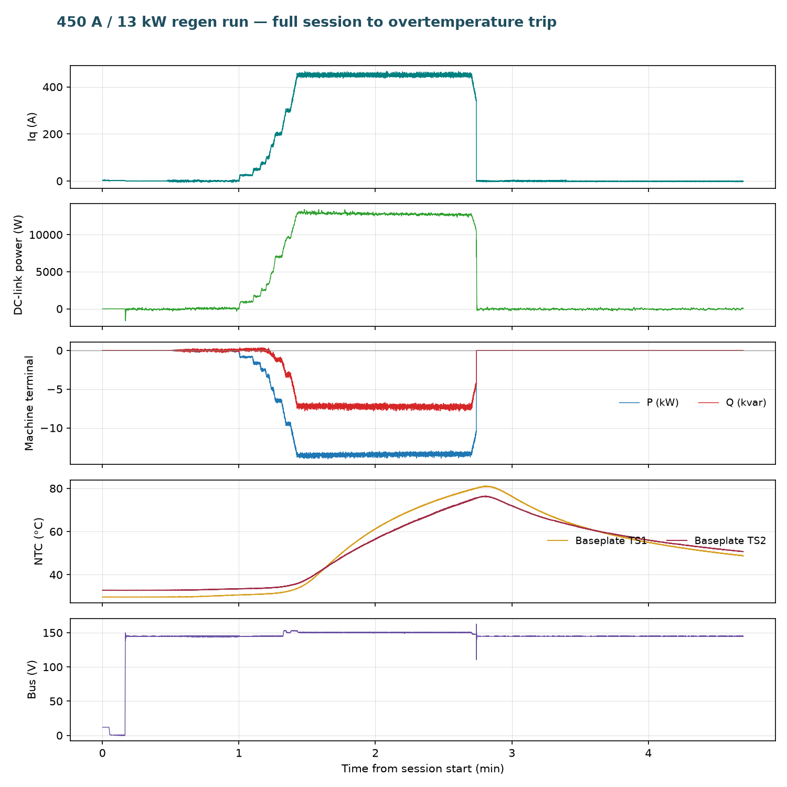

# 450 A / 13 kW Regen — Gen7 Size 2

This report continues the Gen7 size 2 high-current regen series that started with [OV-TEST-HW-REGEN-400A-GEN7-SIZE2](../Low-Power-Regen-400A-Gen7-Size2/Index.md), using the same bench: Sorensen supply (regenerative sink limited to ~50 A) with a Chroma DC electronic load bank in constant-voltage mode at 150 V across the DC link. The machine was spun faster this time — approximately 2,000 RPM shaft speed versus ~1,470 RPM in the 400 A run — so each amp of q-axis current returned more power. After a rapid staircase the inverter held a **450 A q-axis command for 77.7 s, returning 12.8 kW on average (13.4 kW peak) to the DC link**, until the inverter overtemperature protection tripped at ~80 °C baseplate partway through the commanded stop. The trip matches the intended protection behavior documented in [OV-TEST-HW-THERMAL-OTP-200A-GEN7-SIZE2](../Thermal-OTP-200A-Gen7-Size2/Index.md).

This run also closes the open item from the 400 A report: the phase-current "spikes" seen on the oscilloscope there were the **Tektronix current clamps saturating** — they are rated at 150 A, not the 400–450 A being measured — a measurement artifact, not an inverter anomaly.

## Test setup

- **DUT:** OpenVVVF Gen7 size 2 inverter hardware, firmware `foc_demo` graph (hash `855dbcee90d611cb`, same build as the 400 A run).
- **Machine:** Induction machine coupled to a Sierra CP Engineering dynamometer at approximately −2,000 RPM mechanical during the staircase and hold.
- **DC supply:** Sorensen bench supply (regenerative sink limited to ~50 A) in parallel with a Chroma DC electronic load bank in constant-voltage mode at 150 V across the DC link. The supply held ~145 V on the bus at low regen current, so the Chroma clamp engaged from roughly the 300 A step onward.
- **Instrumentation:** RTE Studio telemetry (all quoted currents and powers are inverter telemetry, not the clamp channel). No bench photographs were taken this session; bench and instrument photos from the identical setup are in the [400 A report](../Low-Power-Regen-400A-Gen7-Size2/Index.md).
- **Temperature channels:** baseplate NTCs TS1 (`temp_inv1_c`) and TS2 (`temp_inv2_c`); TS3 (`temp_inv3_c`) was not enabled (wiring defect, unrelated to the test).

## Test conditions

| Parameter | Value |
|-----------|-------|
| Hardware | Gen7 size 2, firmware `foc_demo` hash `855dbcee90d611cb` |
| Machine speed | ~−2,000 RPM mech (vs ~−1,470 RPM in the 400 A run) |
| Bus at low current | ~145 V (supply setpoint; vs ~74 V in the 400 A run) |
| Bus clamp | Chroma CV at 150 V; 148.7–153.5 V from the 300 A step onward |
| Current command | `IqVar` staircase 25 → 200 A, then 300/400/450 A |
| Time at 450 A | 77.7 s commanded hold; OT trip 79.8 s after the 450 A command |
| Peak phase current | 470 A |
| Peak / average DC-link power | 13.4 kW / 12.8 kW during the 450 A hold |
| Regen energy into DC link | ≈0.283 kWh to the trip |
| Machine terminal real power P | −13.41 kW mean during the 450 A hold (generating; calculated from logged `cg_vd_v`/`cg_vq_v`/`cg_id_a`/`cg_iq_a`) |
| Machine reactive power Q | ≈7.2 kvar mean (machine magnetizing demand; quoted as magnitude — sign follows the logged dq frame) |
| Machine apparent power \|S\| | 15.23 kVA mean |
| Power factor (calculated) | 0.881 during the hold |
| Inverter efficiency (calculated) | ≈95% (12.80 kW DC-link ÷ 13.41 kW machine-terminal) |
| Baseplate NTC at trip | TS1 80.1 °C, TS2 75.5 °C (peak logged 81.2 / 76.5 °C, post-trip lag) |
| OT trip | `FAULT` at t = 164.3 s, flags `0x04000000` (`OvertemperatureInverter`), during the slew-limited stop |

## Procedure

1. Pre-charged and enabled the inverter; the dynamometer held the coupled machine at ~2,000 RPM.
2. Stepped `IqVar` 25 → 200 A, then 300/400/450 A with short dwells. The bus rode the ~145 V supply until regen exceeded its sink capability, then the Chroma clamp held 150 V from ~300 A onward.
3. Held the 450 A command while logging telemetry and watching the baseplate NTCs. TS1 rose at ~0.6 °C/s through the hold.
4. With TS1 at ~79.5 °C, commanded `IqVar 0`. Temperature continued rising through the slew-limited decay, and the overtemperature protection tripped ~2.3 s into the stop at TS1 = 80.1 °C, cutting the current immediately. Telemetry continued through the ~2-minute cooldown.

## Electrical results

Per-command statistics from the full-rate telemetry log (Pdc = DC-link power, Idc = DC-link current). Short segments average below their command because the slew-limited ramp occupies most of the window:

| Iq command | Step duration | Avg Iq | Peak phase current | Avg Pdc | Avg Idc |
|------------|---------------|--------|-------------------|---------|---------|
| 25 A | 6.3 s | 23.9 A | 42 A | 872 W | 6 A |
| 50 A | 2.9 s | 49.7 A | 59 A | 1.68 kW | 12 A |
| 75 A | 2.4 s | 71.7 A | 83 A | 2.39 kW | 17 A |
| 100 A | 1.6 s | 95.3 A | 109 A | 3.12 kW | 22 A |
| 150 A | 1.8 s | 134.7 A | 163 A | 4.37 kW | 30 A |
| 200 A | 3.7 s | 192.3 A | 211 A | 6.70 kW | 46 A |
| 300 A | 3.9 s | 272.4 A | 311 A | 8.81 kW | 59 A |
| 400 A | 1.9 s | 344.5 A | 391 A | 10.54 kW | 69 A |
| **450 A hold** | **77.7 s** | **449.6 A** | **470 A** | **12.80 kW** | **85 A** |

At 2,000 RPM the back-EMF is higher than in the 400 A run, so the same 150 V clamp accepted ~85 A of DC-link current instead of ~56 A — that is where the 13 kW came from. Current control remained clean throughout: `cg_vlimit_scale` = 1.000 for the entire session (all clamping external), raw and filtered Iq tracked, and no gate faults occurred. The only fault was the overtemperature trip itself.

- **Machine-terminal power (calculated):** from the logged dq quantities (peak-amplitude convention, P = (3/2)(vd·id + vq·iq), Q = (3/2)(vq·id − vd·iq)), the machine delivered **13.41 kW mean** during the hold while drawing **≈7.2 kvar** of magnetizing reactive power (quoted as magnitude) — 15.23 kVA, **power factor ≈ 0.881**. The 0.61 kW between machine output and the 12.80 kW reaching the DC link is the inverter's own dissipation — **calculated inverter efficiency ≈ 95%** — which is exactly what drove the dry-mounted baseplate to the 80 °C trip in 78 s.

## Thermal results and OT trip

Baseplate temperatures rose steeply under 13 kW with no thermal interface work (the assembly was still the dry-mounted setup of the previous sessions):

- **Baseplate TS1** (`temp_inv1_c`): 30.6 °C at the start of the staircase, 33.2 °C when the 450 A command was issued, **80.1 °C at the fault transition** — a ~0.58 °C/s rise through the hold. Post-trip peak 81.2 °C at t ≈ 168 s (thermal lag).
- **Baseplate TS2** (`temp_inv2_c`): 33.4 °C at start, 75.5 °C at the trip; post-trip peak 76.5 °C.
- The controller entered `FAULT` with flags `0x04000000` (`OvertemperatureInverter`) at t = 164.33 s, 79.8 s after the 450 A command and ~2.3 s after the stop command. This is the same flag and threshold region as the 200 A OTP demonstration (trip at 80.0 °C logged), i.e. intended protective behavior rather than a malfunction.
- After the trip the gates disabled immediately (no slew — the fault path cuts current at once) and both channels cooled to ~49–51 °C by the end of logging.

## Resolution of the 400 A current-spike observation

The 400 A report closed with an unexplained oscilloscope observation: narrow repetitive spikes on the phase-current traces during the 400 A holds. The cause is now identified as **measurement artifact — the Tektronix current clamps are rated at 150 A and clipped/saturated at the 400 A phase currents**, distorting the traces. The inverter's own telemetry in that run showed no anomaly, which is consistent with this conclusion. The spikes should not be treated as a hardware finding; no further investigation of the inverter is required on that count.

## Telemetry overview

> **Open full session:** [View the run in the Telemetry Viewer](../../../../Tools/OpenVVVF-Telemetry-Viewer/telemetry-viewer.html?file=../../Safety-and-Compliance/Testing/Hardware/Low-Power-Regen-450A-Gen7-Size2/450a-regen-decimated.jsonl#s=cg_iq_a:left)

## Observations

- Raising shaft speed to 2,000 RPM lifted regen power at the same 150 V clamp from 8.8 kW (400 A run) to 13 kW — DC-link current scales with available mechanical power, not with the clamp voltage alone.
- The Chroma clamp plus ~145 V supply setpoint meant the clamp engaged from ~300 A onward, earlier in the staircase than in the 400 A run.
- The overtemperature protection tripped *during* a commanded stop because the slew-limited decay (~50 A/s) leaves hundreds of amps flowing for seconds while the baseplate is still heating. Stopping earlier is the lever — the protection itself worked as designed.
- This session predates the thermal-paste rework of the power stage. The pasted assembly was subsequently validated at 200 A steady state — baseplate plateau 44.4 / 44.0 °C against 22.5 °C ambient — in [OV-TEST-HW-REGEN-200A-STEADY-STATE-GEN7-SIZE2](../Low-Power-Regen-200A-Steady-State-Gen7-Size2/Index.md).

## Conclusion

**Pass.** Gen7 size 2 hardware sustained a 450 A q-axis regen command at 2,000 RPM — 470 A peak phase current, 12.8 kW average / 13.4 kW peak returned to the DC link, ≈0.283 kWh over 78 s — with no control or gate faults, until the inverter overtemperature protection tripped at 80.1 °C baseplate, duplicating the intended protection behavior of the 200 A OTP report. The open phase-spike observation from the 400 A report is resolved as current-clamp saturation (150 A-rated probes at 400 A), a measurement artifact. Further high-current regen sessions should use appropriately rated current measurement and the thermally-pasted assembly.

## Artifacts

- [Decimated telemetry log (JSONL, 1 sample/s)](450a-regen-decimated.jsonl) — [open in Telemetry Viewer](../../../../Tools/OpenVVVF-Telemetry-Viewer/telemetry-viewer.html?file=../../Safety-and-Compliance/Testing/Hardware/Low-Power-Regen-450A-Gen7-Size2/450a-regen-decimated.jsonl#s=cg_iq_a:left)
- [Telemetry overview plot](Telemetry-Overview.png)
- [Full source telemetry log](450a-13kw-regen.jsonl), retained for traceability
