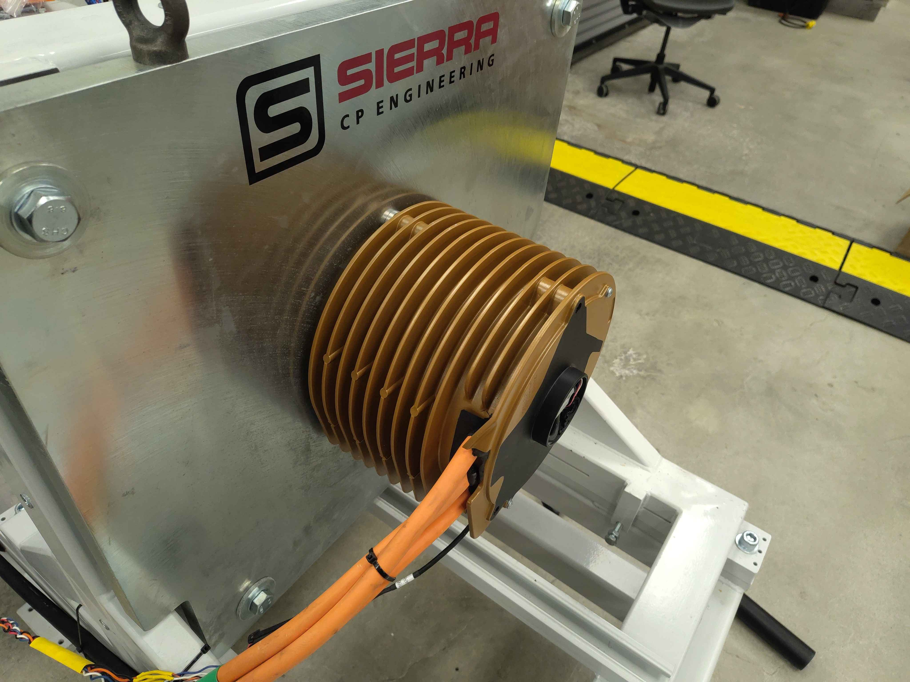

# PMSM Resistance Calibration Validation

This report validates the inverter's `cal Motor.Resistance` routine by comparing its estimate against a direct bench LCR measurement of the test motor. The test was run on the C2 chassis test fixture, but the routine itself is shared across all OpenVVVF chassis; motor-specific validation is only needed when a different motor or harness is used.

Inductance reference measurements are kept in the [PMSM Inductance Calibration Validation](Inductance.html) report.

A separate high-resistance load sanity check is documented in [Power Resistor Sanity Check](Resistor-Sanity-Check.html). A separate induction-machine test report is in [Induction Motor Testbed](../Induction-Motor-Calibration/Testbed.html).

## Test setup

The motor is mounted on the Sierra CP Engineering test fixture with phase leads accessible for direct LCR measurement.

## Instrument

- **Instrument:** BK Precision 894 20 Hz - 500 kHz LCR Meter
- **Function:** DCR
- **Range:** AUTO

## Measurements

### Phase resistance (DCR)

| Parameter | Value | Instrument settings |
|-----------|-------|---------------------|
| Rd | 15.293 mΩ | FUNC: DCR, RANGE: AUTO, SPEED: MED |

## Inverter-calibrated resistance

The inverter's `cal Motor.Resistance` routine was run to estimate the motor resistance and compare it against the LCR reference. Two runs were made at different DC-link voltages to check consistency.

### Summary

| Run | Vdc | UV Rll | UW Rll | VW Rll | Average Rll | Per-phase (avg) |
|-----|-----|--------|--------|--------|-------------|-----------------|
| 1 | ~50 V | 15.2301 mΩ | 15.5424 mΩ | 15.6386 mΩ | **15.4704 mΩ** | 7.7352 mΩ |
| 2 | ~120 V | 13.5548 mΩ | 13.7229 mΩ | 15.6423 mΩ | **14.3067 mΩ** | 7.1534 mΩ |
| LCR reference | - | - | - | - | **15.293 mΩ** | 7.6465 mΩ |

- Run 1 at ~50 V is within **+1.2 %** of the LCR reference (15.4704 mΩ vs 15.293 mΩ).
- Run 2 at ~120 V reads lower on UV and UW, pulling the average **-6.5 %** below the LCR reference. The VW pair is consistent with run 1 and the reference.
- The raw command log is available: [Resistance-Command-Log.txt](Resistance-Command-Log.txt).

### Calibration graph

The plot below shows phase currents, DC bus voltage, and the per-phase resistance estimate for both bus voltages.

> **Open telemetry log:** [View this calibration in the Telemetry Viewer](../../../../Tools/OpenVVVF-Telemetry-Viewer/telemetry-viewer.html?file=../../Safety-and-Compliance/Testing/Hardware/PMSM-Motor-Calibration/ResistanceCalResult.jsonl#s=cg_iu_a:left,r_phase_avg:left)

From the plotted telemetry:

- **50 V run:** R_phase_avg = **7.74 mΩ**
- **120 V run:** R_phase_avg = **7.15 mΩ**
- **ΔR between runs:** 0.58 mΩ

### Observations

- The 50 V result (7.74 mΩ average phase) is within **+1.2 %** of the LCR reference (7.6465 mΩ per phase).
- The 120 V result reads lower by **-6.5 %**. The per-phase traces in the plot are stable and consistent with each other, so the shift appears to be a systematic offset between the two runs rather than a noisy measurement.
- Possible causes for the 120 V offset:
  - current-sensor offset or scaling drift at the higher DC-link voltage,
  - connection/cable resistance differences between setups,
  - temperature or settling differences between runs.
- The raw telemetry log is available for further analysis: [ResistanceCalResult.jsonl](ResistanceCalResult.jsonl) - [open in Telemetry Viewer](../../../../Tools/OpenVVVF-Telemetry-Viewer/telemetry-viewer.html?file=../../Safety-and-Compliance/Testing/Hardware/PMSM-Motor-Calibration/ResistanceCalResult.jsonl#s=cg_iu_a:left,r_phase_avg:left).

## Notes

- The DCR reading is the DC resistance measured directly by the meter.
- The line-to-line resistance is twice the per-phase value reported by the calibration routine.
