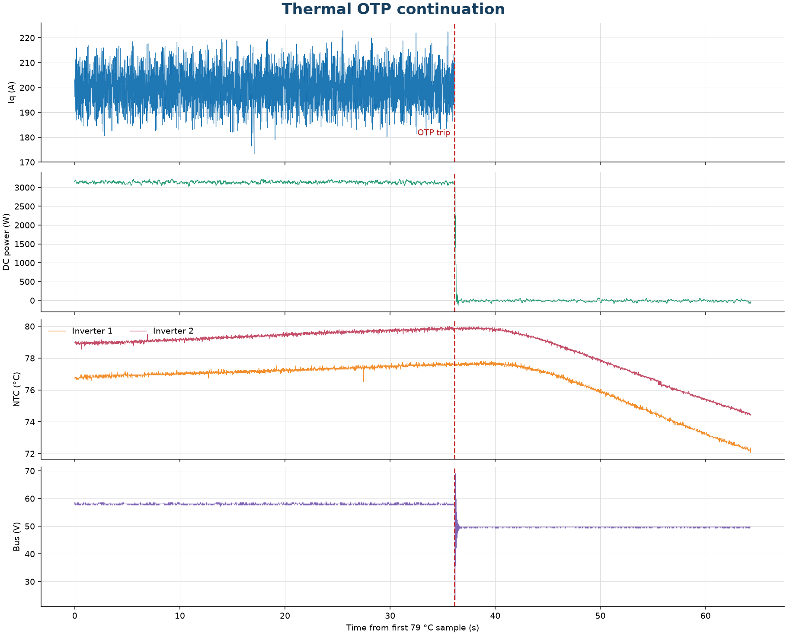

# Thermal OTP Trip — 200 A Regen, Gen7 Size 2

This report documents the intended thermal over-temperature protection (OTP) response in the Gen7 size 2 regenerative test. It covers the remaining telemetry after baseplate temperature sensor TS2 first reached 79 °C. The 200 A q-axis command remained active for another 36.1 seconds, then the controller entered `FAULT` with flags `0x04000000`. Telemetry continues for approximately 28 seconds after the trip as the assembly cools.

This is the continuation of the same test recording analyzed in [OV-TEST-HW-REGEN-200A-GEN7-SIZE2](../Low-Power-Regen-200A-Gen7-Size2/Index.md), not a new power cycle. The heatsink mounting had no thermal interface material and a contact gap because phase leads tilted it backward. The OTP response is the purpose of this segment; thermal conclusions remain specific to this assembly.

## Test setup

- **DUT:** OpenVVVF Gen7 size 2 inverter hardware.
- **Operating point at start of segment:** `IqVar = 200 A`; baseplate TS2 first reached 79.0 °C at source-log t = 619.492 s.
- **Cooling assembly:** Heatsink installed without thermal interface material; phase-lead interference left a gap at the thermal interface.
- **DC bus:** Nominal 50 V supply setting; measured bus was approximately 58 V during the loaded segment.
- **Instrumentation:** RTE Studio telemetry and Klein Tools TI250 thermal imager. Setup photographs and the source recording are included with the companion regen report.

## Segment conditions

| Parameter | Value |
|-----------|-------|
| Segment start | First `temp_inv2_c` (baseplate TS2) sample ≥79 °C, source t = 619.492 s |
| OTP trip | `control_state = FAULT` at t = 655.614 s |
| Time from 79 °C split to trip | 36.1 s |
| 200 A command duration before trip | 9 min 51 s total from command at t = 64.175 s |
| Average Iq from split to trip | 200.0 A |
| Average DC-link power from split to trip | 3.14 kW into the DC link |
| Logged OTP flag | `0x04000000` |
| Post-trip telemetry | Approximately 28.2 s |

## Procedure and OTP response

1. Continued from the 200 A regenerative run at the first logged 79 °C reading; no command change is recorded at the report split.
2. Maintained the 200 A q-axis command while monitoring both baseplate NTC channels and DC-link telemetry.
3. At t = 655.614 s, the controller transitioned from `RUNNING` to `FAULT`, which the operator identified as the intended thermal OTP response. The next logged fault flags were `0x04000000`.
4. Retained the remainder of the session log to observe the post-trip state and temperature cooldown.

Across the 36.1 s from the 79 °C boundary to the fault, the telemetry averaged 200.0 A q-axis current, 3.14 kW DC-link power, and 54.1 A DC-link current. The measured bus averaged 58.0 V and remained between 57.2 V and 58.9 V during this loaded segment.

## Thermal results

At the 79 °C analysis boundary, baseplate TS1 (`temp_inv1_c`) was 76.7 °C and baseplate TS2 (`temp_inv2_c`) was 79.0 °C. The highest logged `temp_inv2_c` before the controller fault was 80.0 °C at t = 655.152 s, about 0.46 s before the fault-state transition. The last sample before the transition read 77.7 °C and 79.9 °C on baseplate temperature channels TS1 and TS2 respectively. TS1 peaked at 77.7 °C before the transition.

Following the OTP transition, the reported temperatures fell. By the end of the session at t = 683.785 s, readings were 72.2 °C and 74.5 °C. The logged DC bus dropped sharply during the fault transition (minimum 23.3 V in the post-trip interval) and was 49.7 V at the end of the recording; the bus transient is recorded here as observed, not characterized as a separate acceptance criterion.

## Telemetry overview

> **Open continuation telemetry:** [View the OTP segment in the Telemetry Viewer](../../../../Tools/OpenVVVF-Telemetry-Viewer/telemetry-viewer.html?file=../../Safety-and-Compliance/Testing/Hardware/Thermal-OTP-200A-Gen7-Size2/otp-200a-79c-to-trip.jsonl#s=cg_iq_a:left)

## Observations

- The intended thermal OTP response occurred: the controller entered `FAULT` while the 200 A regenerative command was active, with the operator-identified OTP flag `0x04000000`.
- The trip occurred 36.1 s after the first `temp_inv2_c` sample at or above 79 °C and 9 min 51 s after the 200 A command was issued.
- Baseplate TS2 (`temp_inv2_c`) reached 80.0 °C shortly before the state transition; TS1 peaked at 77.7 °C.
- The telemetry confirms the test reached its planned protective endpoint. It does not establish heatsink cooling performance because the heatsink lacked interface material and was separated by a gap.
- After the fault, the exported `cg_iq_a` channel holds a fixed value; the telemetry plot stops that trace at the fault marker and uses the continuing power, voltage, and temperature channels for cooldown.
- The recorded DC-link voltage transient at the fault transition is retained for follow-up review.

## Conclusion

**Pass for thermal OTP response.** After the 200 A regenerative run reached 79 °C, the controller entered its intended thermal OTP fault state 36.1 seconds later with flag `0x04000000`. The log shows the temperatures decreasing during the post-trip interval. Because the heatsink had a gap and no thermal interface material, the trip temperature and heating rate apply only to this test assembly and should not be treated as a validated heatsink result.

## Artifacts

- [Full-rate OTP continuation telemetry (JSONL)](otp-200a-79c-to-trip.jsonl) — [open in Telemetry Viewer](../../../../Tools/OpenVVVF-Telemetry-Viewer/telemetry-viewer.html?file=../../Safety-and-Compliance/Testing/Hardware/Thermal-OTP-200A-Gen7-Size2/otp-200a-79c-to-trip.jsonl#s=cg_iq_a:left)
- [OTP telemetry overview plot](OTP-Telemetry-Overview.png)
- Full source log: [200 A telemetry](../Low-Power-Regen-200A-Gen7-Size2/200a-regen-test.jsonl)
- Setup and thermal photographs: [dynamometer view](../Low-Power-Regen-200A-Gen7-Size2/Dyno-Setup.jpg), [TI250 view 1](../Low-Power-Regen-200A-Gen7-Size2/Thermal-01.jpg), [TI250 view 2](../Low-Power-Regen-200A-Gen7-Size2/Thermal-02.jpg), [TI250 view 3](../Low-Power-Regen-200A-Gen7-Size2/Thermal-03.jpg), [TI250 view 4](../Low-Power-Regen-200A-Gen7-Size2/Thermal-04.jpg)
- [Dynamometer setup video](../Low-Power-Regen-200A-Gen7-Size2/Dyno-Setup-Video.mp4)
