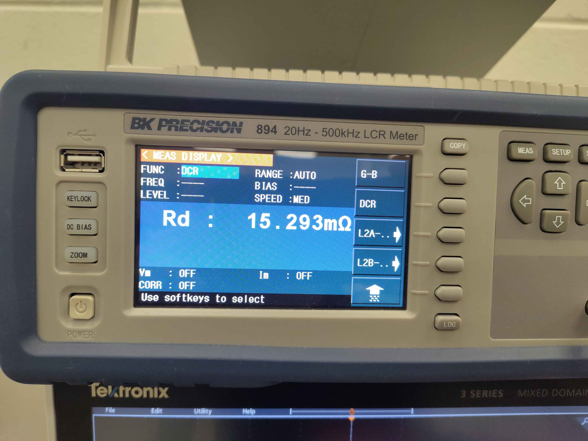
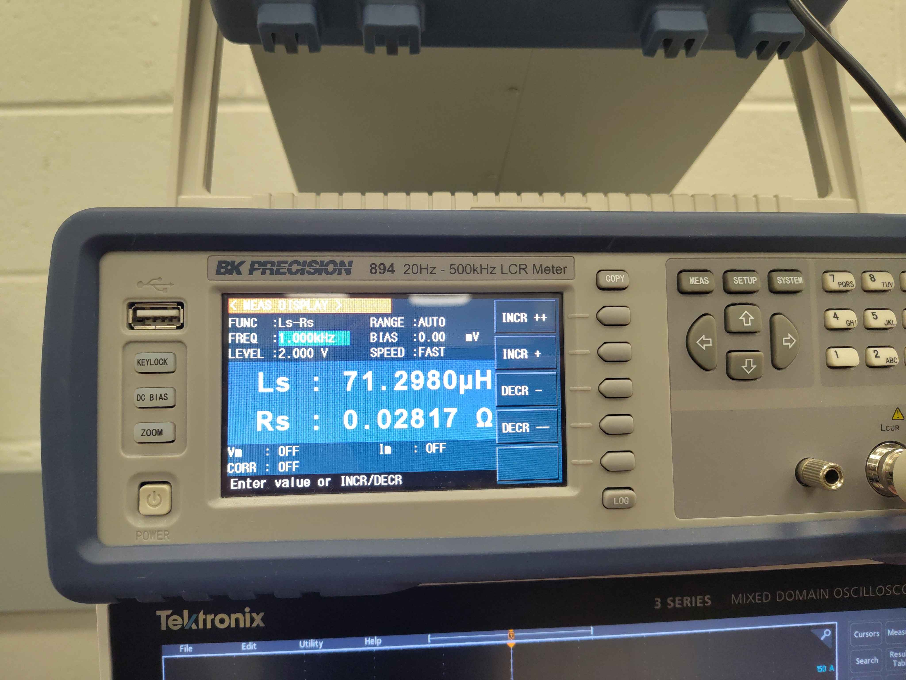
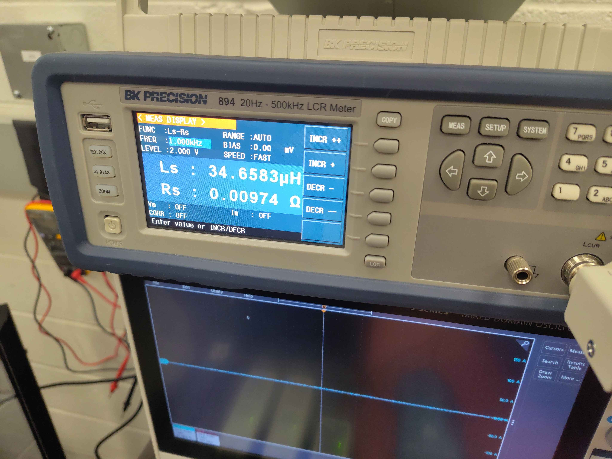

# Motor LCR Reference Calibration

These are reference measurements of the motor taken with a BK Precision 894 LCR meter before running the inverter's self-commissioning / calibration routine. The same motor parameters will be estimated by the calibration routine and compared against these instrument readings.

## Test setup

The motor is mounted on the Sierra CP Engineering test fixture with phase leads accessible for direct LCR measurement.

## Instrument

- **Instrument:** BK Precision 894 20 Hz - 500 kHz LCR Meter
- **Test frequency:** 1.000 kHz (for Ls-Rs measurements)
- **Test level:** 2.000 V
- **Bias:** 0.00 mV
- **Range:** AUTO

## Measurements

### Phase resistance (DCR)

| Parameter | Value | Instrument settings |
|-----------|-------|---------------------|
| Rd | 15.293 mΩ | FUNC: DCR, RANGE: AUTO, SPEED: MED |

### Phase inductance and series resistance (Ls-Rs)

Two Ls-Rs readings were captured at 1.000 kHz.

| Reading | Ls | Rs | Instrument settings |
|---------|----|----|---------------------|
| 1 | 71.2980 µH | 0.02817 Ω | FUNC: Ls-Rs, FREQ: 1.000 kHz, LEVEL: 2.000 V, RANGE: AUTO, SPEED: FAST |
| 2 | 34.6583 µH | 0.00974 Ω | FUNC: Ls-Rs, FREQ: 1.000 kHz, LEVEL: 2.000 V, RANGE: AUTO, SPEED: FAST |

## Notes

- The DCR reading is the DC resistance measured directly by the meter.
- The Ls-Rs readings are series inductance and resistance at 1 kHz.
- Which phase pair or winding configuration each Ls-Rs reading corresponds to should be recorded when the calibration routine results are compared against these reference values.
