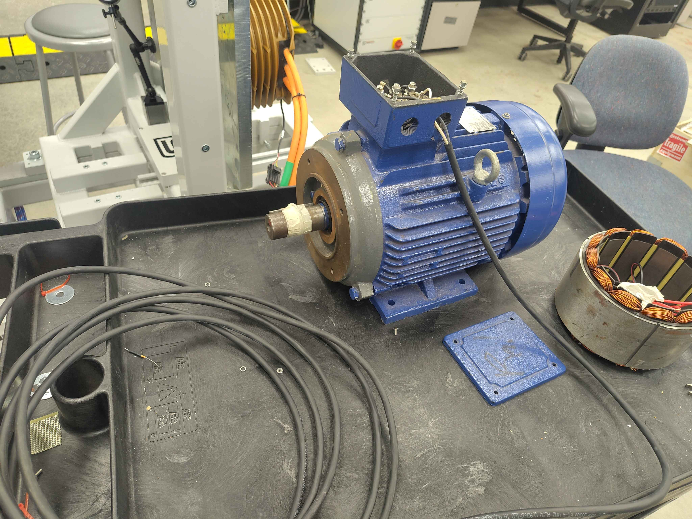
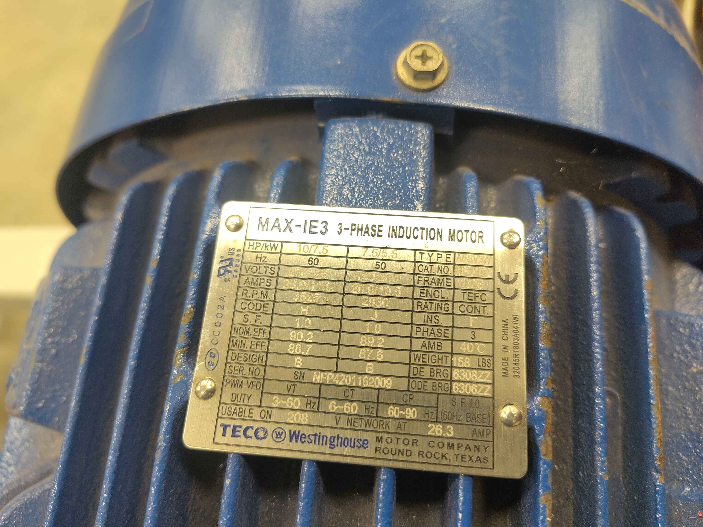
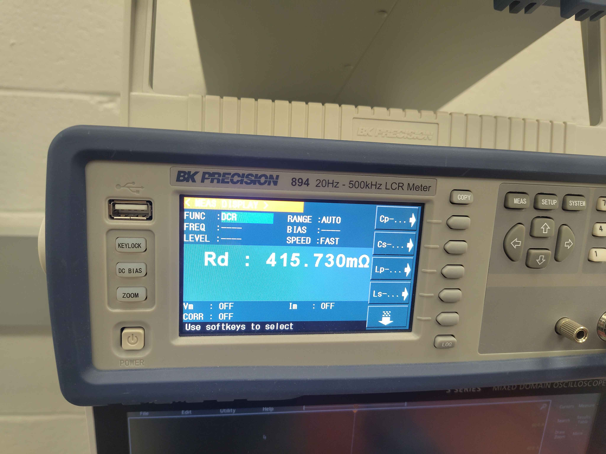
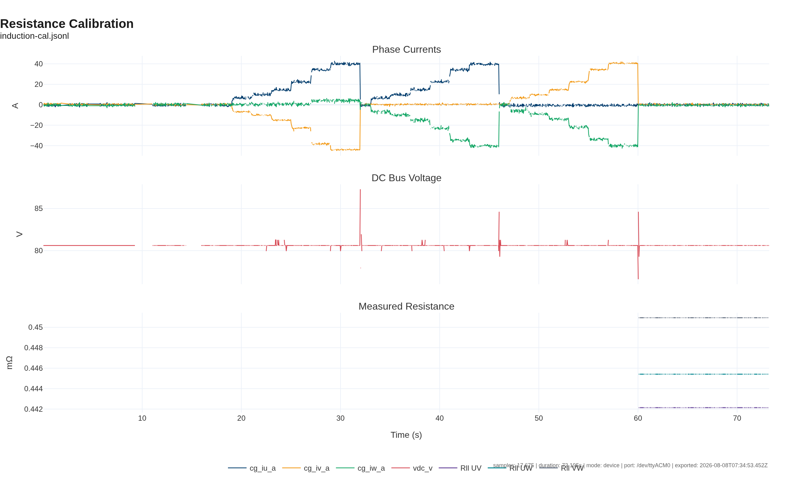

# Induction Motor Resistance Calibration Validation

This report validates the inverter's `cal Motor.Resistance` routine on a TECO MAX-IE3 7.5 kW induction motor. The test is run on the C2 chassis test fixture; the routine itself is shared across all OpenVVVF chassis.

## Test setup

The motor is a TECO Westinghouse MAX-IE3 3-phase induction motor. Phase leads are accessed at the conduit box for direct LCR measurement.

## Nameplate data

| Parameter | Value |
|-----------|-------|
| Manufacturer | TECO Westinghouse |
| Model | MAX-IE3 3-phase induction motor |
| Power | 10 HP / 7.5 kW |
| Frequency | 60 Hz base |
| Voltage | 208 V network |
| Current | 26.3 A |
| Enclosure | TEFC |

## Reference measurement

| Parameter | Value | Instrument settings |
|-----------|-------|---------------------|
| Rd (line-to-line) | 415.730 mΩ | FUNC: DCR, RANGE: AUTO, SPEED: FAST |
| Rd (per-phase, estimated) | ~207.9 mΩ | - |

## Inverter calibration result

Command: `cal Motor.Resistance`

Test conditions:

| Parameter | Value |
|-----------|-------|
| DC bus voltage | ~80.6 V |
| Maximum current reached | ~40 A per phase pair |
| Duty limit | 25 % (voltage-limited by low bus) |
| Calibration points | 7 per phase pair (UV, UW, VW) |

Reported line-to-line resistances:

| Phase pair | Rll (mΩ) | R_phase (mΩ) | V_offset (V) |
|------------|----------|--------------|--------------|
| UV | 442.14 | 221.07 | 2.65 |
| UW | 445.41 | 222.71 | 2.54 |
| VW | 450.94 | 225.47 | 2.02 |
| Average | 446.16 | 223.08 | 2.40 |

[Interactive version of the plot](induction-resistance.html)

## Comparison and conclusion

| Quantity | LCR reference | Inverter estimate | Difference |
|----------|---------------|-------------------|------------|
| Line-to-line | 415.73 mΩ | 446.16 mΩ | +7.3 % |
| Per-phase | 207.9 mΩ | 223.1 mΩ | +7.3 % |

The inverter estimate is about 7 % higher than the LCR reference. This is consistent with the operating conditions: the low DC bus voltage limited the calibration current to roughly 40 A, so the IGBT knee voltage and switching dead time contribute a non-negligible offset to the V/I fit. At the currents used, the voltage across the motor winding is small compared with the combined semiconductor drop in the measurement path, which biases the slope estimate upward.

For the intended application (motor resistance in the hundreds of milliohms, running currents of tens of amperes), this is an acceptable first-pass estimate. A higher-current rerun at a higher bus voltage would move the estimate closer to the Kelvin reference.

## Artifacts

- [Command log](induction-cal-cmds.txt)
- [Telemetry log (JSONL)](induction-cal.jsonl)
- [Static resistance plot (PNG)](induction-resistance.png)
- [Interactive resistance plot (HTML)](induction-resistance.html)

## Notes

- The DCR reading is the DC resistance measured directly by the meter.
- The line-to-line resistance is twice the per-phase value reported by the calibration routine.
- This motor is an induction machine, not a PMSM, so it is tracked separately from the PMSM calibration report.
