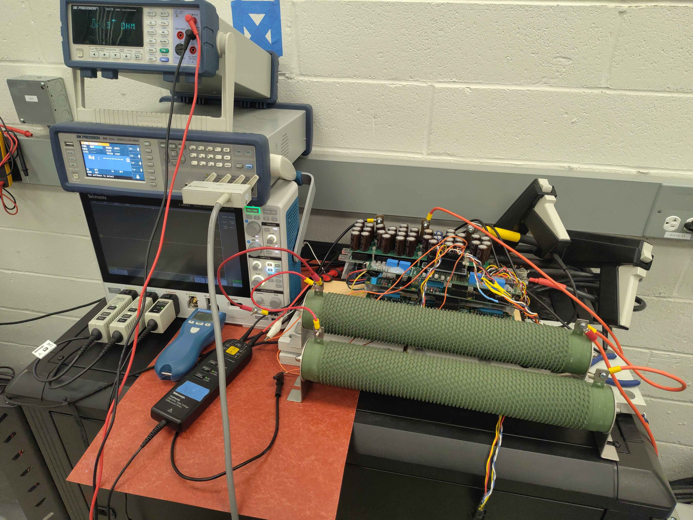
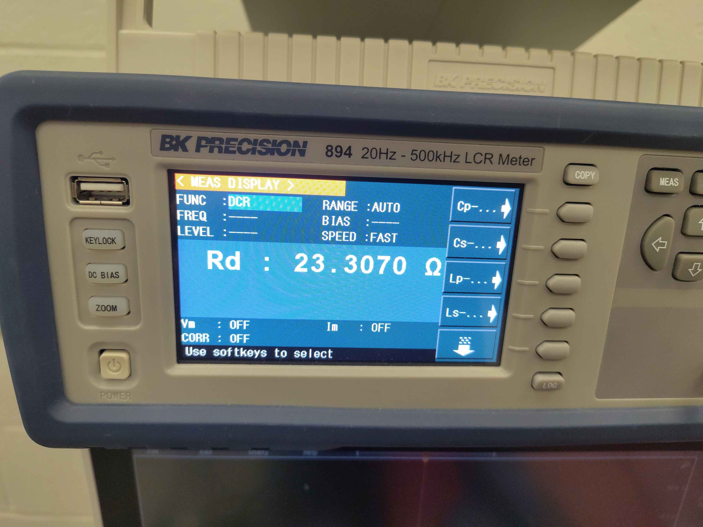

# Power Resistor Sanity Check

This report checks that the `cal Motor.Resistance` routine returns a sensible value for a purely resistive, high-impedance load. A known power resistor was connected across two inverter phases; the routine's estimate is compared against a direct LCR measurement.

## Test setup

- Load: 23 Ω power resistor tied across phases U and V.
- DC bus: ~121 V.
- Chassis: C2 test fixture.
- Command: `cal Motor.Resistance 8.0 --force`.



## Instrument reference

- **Instrument:** BK Precision 894 20 Hz - 500 kHz LCR Meter
- **Function:** DCR
- **Range:** AUTO
- **Speed:** FAST

| Parameter | Value |
|-----------|-------|
| Rd | 23.3070 Ω |



## Inverter-calibrated resistance

| Parameter | Value |
|-----------|-------|
| Calibrated UV line-to-line | 20.94 Ω |
| Calibrated UV per-phase | 10.47 Ω |
| Max current reached (UV) | 0.345 A |
| Fit offset (V_off) | 23.6 V |
| UW measurement | Failed (non-positive resistance) |

> **Open telemetry log:** [View this calibration in the Telemetry Viewer](../../../Tools/Telemetry-Viewer/telemetry-viewer.html?file=../../Testing/Hardware/Motor-Calibration/PowerResistor-Telemetry.jsonl#s=cg_iu_a:left)

- Command log: [PowerResistor-Command-Log.txt](PowerResistor-Command-Log.txt)
- Raw telemetry: [PowerResistor-Telemetry.jsonl](PowerResistor-Telemetry.jsonl)

## Analysis

The reading is about 9 % low (20.94 Ω vs 23.31 Ω reference). That is expected for this test point because the current was pushed down by the high resistance load.

At ~0.3 A the IGBTs are operating in the knee region, where

```
Vce ≈ Vf(knee) + Ic · Rce(on)
```

The knee voltage across the two conducting IGBTs is large compared with the ~6-7 V across the resistor, so the linear fit absorbs most of the knee as an offset. Because the knee is slightly curved, the slope is biased low. The 23.6 V fit offset is consistent with this explanation.

The UW phase failed because the resistor was not connected across U-W; the measured current had the wrong sign and the fit produced a negative resistance. This is normal for a single-pair measurement.

This result is not motor-grade accuracy, but it confirms the calibration is in the right decade and is not producing the milliohm-scale nonsense that appears when the routine is run without a real load.

## Notes

- For a real motor with line-to-line resistance of a few ohms or less, the routine can push tens of amps, the IGBT knee becomes a small fixed offset, and the fit accuracy improves significantly.
- A repeat test with a lower-value resistor or higher bus voltage would move the operating point above the IGBT knee and give a closer match to the reference.
