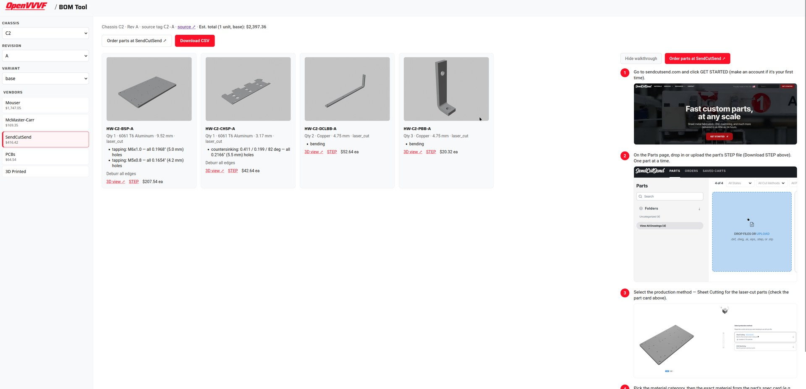

# BOM Tool

The BOM Tool serves the per-chassis vendor order BOMs exported from the hardware repository's release tags. Select a chassis, revision, and build variant, then preview or download the vendor BOM you need.

## Using the tool

1. Open the [BOM Tool](bom-tool.html).
2. Choose the **chassis**, **revision**, and **variant** (`base` is the standard build; named variants such as `generous` come from the hardware repo's BOM variants).
3. Click a vendor button (**Mouser**, **McMaster-Carr**, **SendCutSend**, **PCBs** (JLCPCB fab), **3D Printed** (printed parts); a **DigiKey** button appears only when DigiKey data exists for that release) to preview the BOM inline. Vendor buttons show their share of the cost estimate. The consolidated and assembly (in-house harnesses) BOMs have no buttons; download their CSVs from the release's `BOMs/` directory.
4. To price one part of the inverter on its own (e.g. just the control board or the wiring harnesses), pick it in the **Subassembly** selector between the variant selector and the vendor buttons. The preview then shows that subassembly's lines with per-vendor subtotals instead of a vendor table. These totals assume you order *only* that subassembly — pack sizes are rounded up separately per subassembly, so the subassemblies can add up to more than the whole-BOM estimate. Clicking a vendor returns to the whole-BOM view. Releases exported before this feature have no per-subassembly data yet; the selector shows a disabled "All (no per-subassembly data yet)" entry until the next `hwrelease update`.
5. Use **Download CSV** to save it for ordering (e.g. pasting into the vendor's BOM import). For boards, **View boards in PCB Tool** takes you to the per-board gerbers/specs, and **Order PCBs at JLCPCB** opens the fab.

### Ordering walkthrough screenshots

When a vendor is selected, the tool shows a step-by-step walkthrough of that vendor's upload/ordering flow below the buttons (for McMaster-Carr there's also a button that copies the order paste to the clipboard). The walkthrough is hand-maintained: drop files next to this document named `ordering-<vendor>-<n>.png` (screenshot) and `ordering-<vendor>-<n>.txt` (one-line caption), numbered in order (`n` = 1, 2, …; vendors: `mouser`, `digikey`, `mcmaster`, `sendcutsend`, `jlc`). Either file may exist alone: steps without a screenshot show as text only. No regeneration is needed; they are picked up on the next site build.

The estimate in the header reflects the selected variant (`base`, `standard`, `generous`).

## Where the data comes from

The CSVs are regenerated from the tag's KiCad sources on every export: HWRelease (`make hw-update`) runs BOMManager's `generate` (with pricing) against the exported tag tree, so they can never go stale. They live in `Data/Releases/<chassis>/<rev>/BOMs/` and are indexed in `Data/Releases/manifest.json` under `CHASSIS-<chassis>-<rev>` entries. The page itself is regenerated with `hwrelease build-viewer` (runs automatically after `update`).
