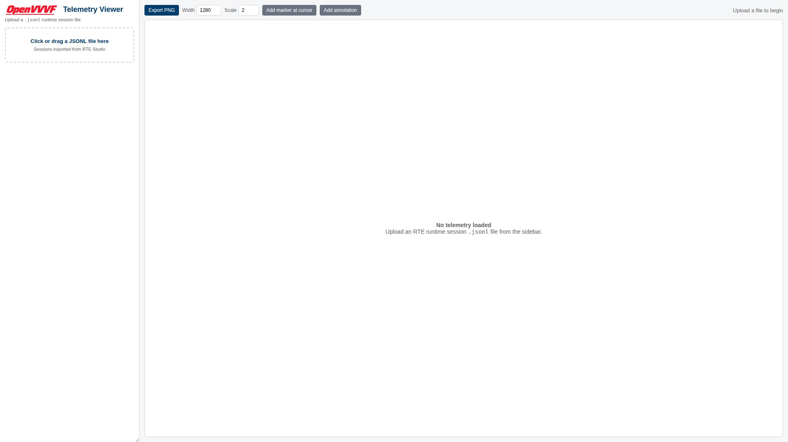
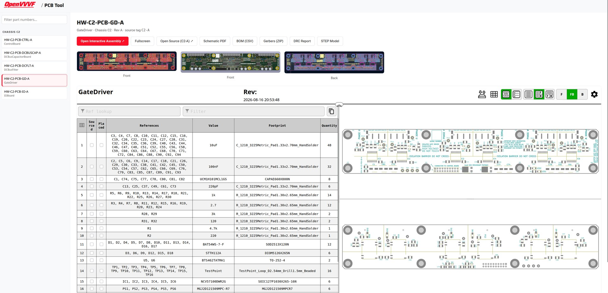

# Tools

This section documents the support tools and widgets that go with OpenVVVF hardware and software. Each card links to the tool's documentation; tools with a browser UI can also be opened directly.

<h3><a href="OpenVVVF-Telemetry-Viewer/Index.md">Telemetry Viewer</a></h3>

Browser-based interactive viewer for RTE JSONL telemetry logs.

<a class="tool-button" href="OpenVVVF-Telemetry-Viewer/telemetry-viewer.html" target="_blank" rel="noopener">Open Telemetry Viewer</a>

<h3><a href="PCB-Tool/Index.md">PCB Tool</a></h3>

Released PCBs by part number: renders, interactive assembly, schematics, and fabrication files.

<a class="tool-button" href="PCB-Tool/pcb-tool.html" target="_blank" rel="noopener">Open PCB Tool</a>

<h3><a href="BOM-Tool/Index.md">BOM Tool</a></h3>

Vendor order BOMs (Mouser, McMaster-Carr, SendCutSend, DigiKey) per chassis, revision, and build variant.

<a class="tool-button" href="BOM-Tool/bom-tool.html" target="_blank" rel="noopener">Open BOM Tool</a>

<h3><a href="HWRelease-System/Index.md">HWRelease System</a></h3>

How hardware releases flow from InverterGen5 tags into the tools: architecture and conventions.

