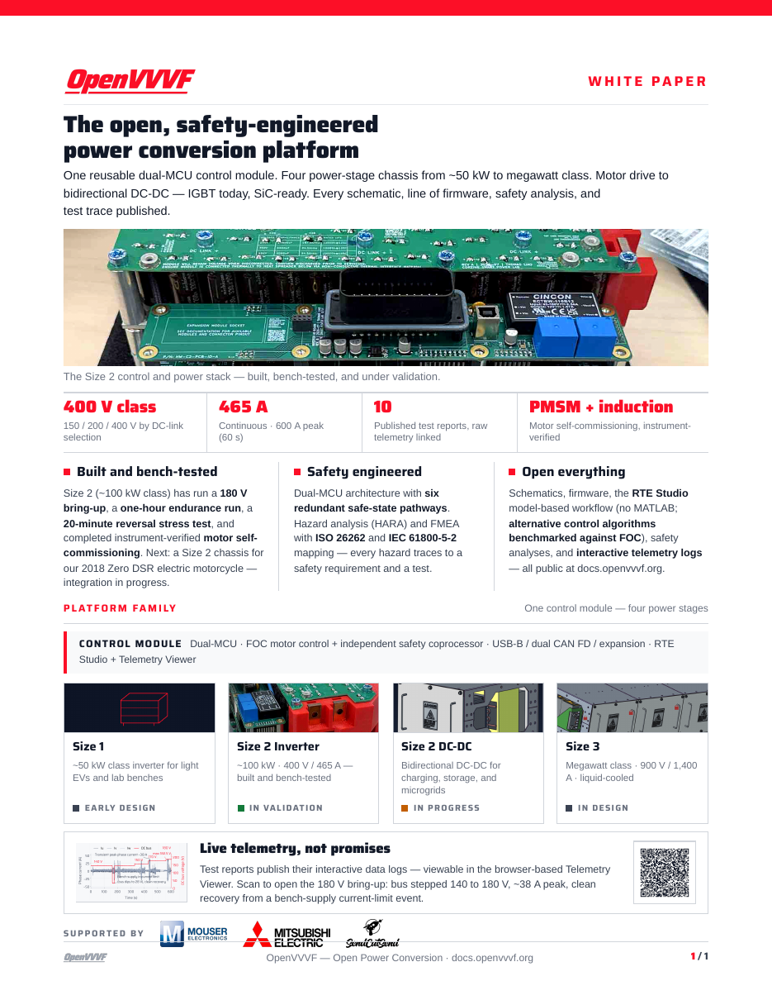

# OpenVVVF Platform One-Pager

A single-page executive overview of the OpenVVVF open power-conversion platform: the Size 2 bench-tested chassis, the dual-MCU safety architecture, the four-member platform family from ~50 kW to megawatt class, and links into the interactive telemetry evidence behind the test claims.

- [Download the PDF (US Letter, 1 page)](OpenVVVF-OnePager.pdf)
- Design source: [onepager.html](onepager.html)
