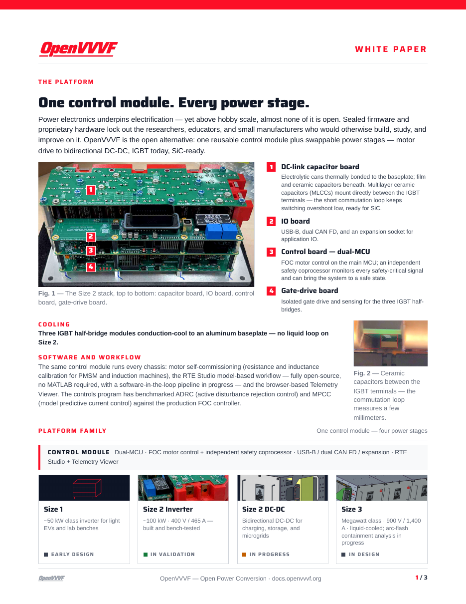

# OpenVVVF Platform White Paper

A three-page executive brief for sponsors and partners. Page 1 introduces the platform architecture and chassis family; page 2 presents the bench-test evidence and the safety-engineering chain from hazard analysis to test plans; page 3 covers the team, sponsors, and the roadmap to Size 1, the DC-DC variant, and the megawatt-class Size 3.

- [Download the PDF (US Letter, 3 pages)](OpenVVVF-ThreePager.pdf)
- Design source: [threepager.html](threepager.html)
